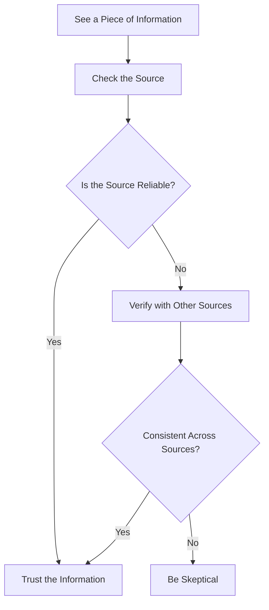

## 8.4.3 Recognizing Misinformation

In today's digital age, information is at our fingertips. However, not all the information we encounter online is accurate or true. Learning to recognize misinformation is an essential skill that helps us make informed decisions and stay safe online. Let's explore how we can develop critical thinking skills to identify false or misleading information.

### Understanding Misinformation

**Misinformation** is false or inaccurate information that is spread, regardless of intent to deceive. It can be shared intentionally or unintentionally, and it often spreads quickly, especially on social media. Understanding misinformation is the first step in learning how to spot it.

### Types of Misinformation

1. **Fake News:** These are fabricated news stories that are presented as real. They often have sensational headlines to grab attention and are designed to mislead readers.

2. **Hoaxes:** Deliberate attempts to deceive people. Hoaxes can be elaborate and are often created to trick people into believing something false.

3. **Rumors:** Unverified information that spreads quickly. Rumors can start from a small piece of truth but become distorted as they are shared.

### How to Spot Misinformation

To protect yourself from misinformation, it's important to develop a critical eye. Here are some steps you can take:

1. **Check the Source:** Always verify if the information comes from a reputable and reliable source. Trusted news organizations and official websites are more likely to provide accurate information.

2. **Look for Evidence:** Ensure there are facts, data, or sources supporting the information. Reliable articles often include references to studies, expert opinions, or official statements.

3. **Cross-Check Information:** Compare the information with other reputable sources to confirm its validity. If multiple trustworthy sources report the same information, it's more likely to be true.

4. **Be Skeptical of Sensational Headlines:** Recognize that extreme or sensational headlines may be misleading. They are often designed to provoke strong emotions and may not accurately represent the content of the article.

### Verifying the Authenticity of Information

To help visualize the process of verifying information, let's look at a flowchart:

This flowchart guides you through the steps of verifying the authenticity of information. By following these steps, you can become more confident in distinguishing between true and false information.

### Real-World Example

Let's walk through a real-world example of a fake news story:

Imagine you come across a news article claiming that a famous celebrity has been spotted on Mars. The headline is sensational and grabs your attention. Here's how you can verify its authenticity:

1. **Check the Source:** Is the article from a well-known and reputable news outlet, or is it from an unknown website?

2. **Look for Evidence:** Does the article provide any photos, videos, or statements from credible sources to support the claim?

3. **Cross-Check Information:** Search for the same story on other reputable news websites. Are they reporting the same event?

4. **Be Skeptical of Sensational Headlines:** Consider whether the headline seems too outrageous to be true. If it does, it might be a sign that the story is fabricated.

### Interactive Exercise

Now it's your turn! Here's a mock news article for you to evaluate:

**Headline:** "Scientists Discover a New Planet Made Entirely of Chocolate!"

**Article Excerpt:** "In a groundbreaking discovery, scientists have found a planet composed entirely of chocolate. This sweet planet is located in a distant galaxy and is said to be the size of Earth."

**Steps to Evaluate:**

1. **Check the Source:** Is the article from a credible scientific journal or a reputable news site?

2. **Look for Evidence:** Does the article cite any scientific studies or expert opinions?

3. **Cross-Check Information:** Are other reputable sources reporting the same discovery?

4. **Be Skeptical of Sensational Headlines:** Does the headline seem too good to be true?

### Visual Aids

To help you better understand the difference between reliable and unreliable sources, here are some illustrations:

- **Reliable Sources:** Established news organizations, official government websites, academic journals.
- **Unreliable Sources:** Websites with no clear authorship, sensational blogs, sites with frequent spelling and grammar errors.

### Conclusion

Recognizing misinformation is a crucial skill in today's digital world. By developing critical thinking skills and following the steps outlined above, you can become more adept at identifying false information and making informed decisions.

## Quiz Time!



### What is misinformation?

- [x] False or inaccurate information spread intentionally or unintentionally
- [ ] Information that is always true
- [ ] Only rumors
- [ ] Only fake news

> **Explanation:** Misinformation is false or inaccurate information that can be spread intentionally or unintentionally.

### Which of the following is an example of fake news?

- [x] A fabricated news story presented as real
- [ ] A verified news article
- [ ] A scientific journal
- [ ] A government report

> **Explanation:** Fake news refers to fabricated news stories that are presented as if they are real.

### What should you do first when you see a piece of information online?

- [x] Check the source
- [ ] Share it immediately
- [ ] Ignore it
- [ ] Believe it without question

> **Explanation:** The first step is to check the source to ensure the information is from a reputable and reliable source.

### Why is it important to cross-check information?

- [x] To confirm its validity by comparing it with other reputable sources
- [ ] To make it more sensational
- [ ] To ignore it
- [ ] To share it faster

> **Explanation:** Cross-checking information helps confirm its validity by comparing it with other reputable sources.

### What is a sign of a potentially misleading headline?

- [x] It is sensational or extreme
- [ ] It is boring
- [ ] It is from a trusted source
- [ ] It is well-researched

> **Explanation:** Sensational or extreme headlines may be misleading and are designed to provoke strong emotions.

### What is a hoax?

- [x] A deliberate attempt to deceive people
- [ ] A verified fact
- [ ] A scientific discovery
- [ ] A government policy

> **Explanation:** A hoax is a deliberate attempt to deceive people.

### How can you verify the authenticity of information?

- [x] Check the source, look for evidence, cross-check information
- [ ] Believe it immediately
- [ ] Ignore it
- [ ] Share it without checking

> **Explanation:** Verifying authenticity involves checking the source, looking for evidence, and cross-checking information.

### What should you be skeptical of when reading online articles?

- [x] Sensational headlines
- [ ] Boring content
- [ ] Well-researched articles
- [ ] Government reports

> **Explanation:** Sensational headlines are often designed to mislead and should be approached with skepticism.

### Which of the following is NOT a type of misinformation?

- [x] Verified news
- [ ] Fake news
- [ ] Hoaxes
- [ ] Rumors

> **Explanation:** Verified news is not misinformation; it is accurate and confirmed information.

### True or False: Misinformation can only be spread intentionally.

- [ ] True
- [x] False

> **Explanation:** Misinformation can be spread both intentionally and unintentionally.


