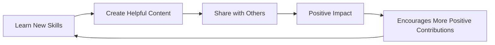

## 8.4.4 Contributing Positively

In today's digital age, the internet is a vast space where we can learn, share, and create. As young coders, you have the power to make a positive impact online. This section will guide you on how to use your coding skills and online presence to contribute positively to the digital world.

### Positive Online Contributions

The internet is a place where your actions can reach many people. By sharing helpful information, supporting others, and creating useful apps, you can make the internet a better place. Here are some ways you can contribute positively:

- **Sharing Helpful Information:** Use your knowledge to help others. This could be through writing articles, creating tutorials, or sharing resources that others might find useful.
- **Supporting Others:** Encourage and support your peers. Whether it's through positive comments, constructive feedback, or helping someone solve a problem, your support can make a big difference.
- **Creating Useful Apps:** Use your coding skills to develop apps that solve problems or provide value to others. This could be an educational app, a tool to help with daily tasks, or a game that brings joy.

### Responsible Sharing

When sharing information online, it's important to be responsible. Here are some tips to ensure your contributions are positive and beneficial:

- **Share Accurate Information:** Always verify the information before sharing it. Sharing accurate information helps build trust and credibility.
- **Uplifting Messages:** Spread positivity by sharing messages that inspire and motivate others.
- **Creative Content:** Share your creative projects, whether it's art, music, or code. Creative content can inspire others and bring joy.

### Collaborative Projects

Working together on projects can amplify your impact. Collaborative projects allow you to combine skills and ideas to create something greater than what you could achieve alone. Here are some ways to collaborate:

- **Open-Source Software:** Contribute to open-source projects. These are projects where the source code is available for anyone to use, modify, and distribute.
- **Educational Tools:** Work with others to create tools that help people learn new skills or understand complex topics.
- **Community Websites:** Build websites that serve a community, providing valuable information or services.

### Cycle of Contributing Positively Online

Let's visualize the cycle of contributing positively online with a flowchart:

This cycle shows how learning new skills can lead to creating helpful content, which, when shared, makes a positive impact. This impact encourages more positive contributions, creating a continuous cycle of positivity.

### Real-World Example

Consider the story of a group of young coders who created an educational app to help their classmates learn math. They worked together to design fun and interactive quizzes that made learning enjoyable. Their app not only helped their classmates but also reached students in other schools, making a significant educational impact.

### Interactive Exercise

Now it's your turn! Think of a small project that could help others. It could be an app, a website, or a simple tool. Outline the steps you would take to create it:

1. **Identify a Problem:** What issue do you want to address?
2. **Brainstorm Solutions:** What are some ways you could solve this problem?
3. **Plan Your Project:** What steps will you take to bring your idea to life?
4. **Collaborate:** Who can you work with to make your project even better?
5. **Share Your Creation:** How will you share your project with others?

### Visual Aids

Imagine a group of kids working together on a project. They're brainstorming ideas, coding, and testing their app. This illustration shows the power of collaboration and the joy of creating something meaningful together.

By contributing positively online, you can make a difference in the digital world. Use your skills, creativity, and kindness to inspire others and create a better internet for everyone.

## Quiz Time!



### What is one way you can contribute positively online?

- [x] Sharing helpful information
- [ ] Keeping information to yourself
- [ ] Ignoring others' questions
- [ ] Posting negative comments

> **Explanation:** Sharing helpful information is a positive way to contribute online, as it can assist others and spread knowledge.

### Why is it important to share accurate information online?

- [x] To build trust and credibility
- [ ] To confuse others
- [ ] To spread rumors
- [ ] To make jokes

> **Explanation:** Sharing accurate information helps build trust and credibility, ensuring that others can rely on what you share.

### What is an example of a collaborative project?

- [x] Contributing to open-source software
- [ ] Working alone on a secret project
- [ ] Deleting others' work
- [ ] Ignoring team feedback

> **Explanation:** Contributing to open-source software is a collaborative project where multiple people work together to improve a project.

### What does the cycle of contributing positively online start with?

- [x] Learning new skills
- [ ] Sharing negative comments
- [ ] Ignoring others
- [ ] Deleting content

> **Explanation:** The cycle starts with learning new skills, which enables you to create helpful content and share it with others.

### How can you support others online?

- [x] Encouraging and providing constructive feedback
- [ ] Criticizing without reason
- [ ] Ignoring their questions
- [ ] Posting negative comments

> **Explanation:** Encouraging and providing constructive feedback helps support others and fosters a positive online environment.

### What should you do before sharing information online?

- [x] Verify its accuracy
- [ ] Share without checking
- [ ] Assume it's correct
- [ ] Ignore its source

> **Explanation:** Verifying the accuracy of information before sharing ensures that you are spreading reliable and truthful content.

### What is a benefit of working on collaborative projects?

- [x] Combining skills and ideas
- [ ] Working in isolation
- [ ] Keeping ideas secret
- [ ] Ignoring others' input

> **Explanation:** Collaborative projects allow you to combine skills and ideas, leading to more innovative and impactful results.

### What is an example of a positive online message?

- [x] An uplifting and inspiring quote
- [ ] A negative comment
- [ ] A rumor
- [ ] A complaint

> **Explanation:** An uplifting and inspiring quote is a positive message that can motivate and encourage others.

### What is the purpose of creating educational tools?

- [x] To help people learn new skills
- [ ] To confuse learners
- [ ] To hide information
- [ ] To limit access to knowledge

> **Explanation:** Educational tools are designed to help people learn new skills and understand complex topics, making education more accessible.

### True or False: You should always work alone on projects to ensure they are done correctly.

- [ ] True
- [x] False

> **Explanation:** Working collaboratively can lead to better results, as it allows for the sharing of ideas and skills, leading to more innovative solutions.


