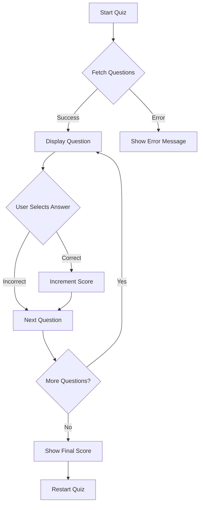

## 8.5 Mini Project: Interactive Quiz Game

Welcome to an exciting project where you'll create an interactive quiz game using Flutter! This project will not only reinforce your coding skills but also introduce you to the world of web APIs, emphasizing responsible internet use. Let's dive into the world of quizzes and learn how to fetch dynamic content from the web.

### Project Overview

In this mini-project, you'll build a quiz game that fetches questions from an online API. This will help you understand how to integrate web data into your apps while practicing safe and ethical internet usage. By the end of this project, you'll have a functional quiz game that you can customize and share with friends!

### Step-by-Step Instructions

#### 1. Setting Up the Project

First, let's set up a new Flutter project and prepare it for web integration.

- **Create a New Flutter Project:**

  Open your terminal or command prompt and run the following command to create a new Flutter project:

  ```bash
  flutter create quiz_game
  ```

  Navigate into the project directory:

  ```bash
  cd quiz_game
  ```

- **Add the `http` Package:**

  To fetch data from the web, we'll use the `http` package. Open the `pubspec.yaml` file and add the following dependency:

  ```yaml
  dependencies:
    flutter:
      sdk: flutter
    http: ^0.13.3
  ```

  Save the file and run `flutter pub get` to install the package.

#### 2. Choosing a Quiz API

Next, we'll choose an API to fetch quiz questions. For this project, we'll use the Open Trivia Database, a free API that provides trivia questions.

- **Accessing the API:**

  Visit the [Open Trivia Database](https://opentdb.com/) to explore the available endpoints. You don't need an API key for this service, making it easy to get started.

#### 3. Creating Data Models

To handle the data from the API, we'll define Dart classes that represent quiz questions.

- **Define a Question Model:**

  Create a new file `question.dart` in the `lib` directory and define the following class:

  ```dart
  class Question {
    final String question;
    final List<String> options;
    final String correctAnswer;

    Question({required this.question, required this.options, required this.correctAnswer});

    factory Question.fromJson(Map<String, dynamic> json) {
      List<String> options = List<String>.from(json['incorrect_answers']);
      options.add(json['correct_answer']);
      options.shuffle(); // Shuffle options for randomness

      return Question(
        question: json['question'],
        options: options,
        correctAnswer: json['correct_answer'],
      );
    }
  }
  ```

#### 4. Fetching Quiz Data

Now, let's write functions to fetch quiz questions from the API.

- **Fetch Questions:**

  In your `main.dart` or a separate service file, add the following function:

  ```dart
  import 'dart:convert';
  import 'package:http/http.dart' as http;
  import 'question.dart';

  Future<List<Question>> fetchQuestions() async {
    final response = await http.get(Uri.parse('https://opentdb.com/api.php?amount=10&type=multiple'));

    if (response.statusCode == 200) {
      final List<dynamic> data = json.decode(response.body)['results'];
      return data.map((json) => Question.fromJson(json)).toList();
    } else {
      throw Exception('Failed to load questions');
    }
  }
  ```

  This function sends a GET request to the API and parses the JSON response into a list of `Question` objects.

#### 5. Building the Quiz Interface

Design a user-friendly interface to display questions and options.

- **Create the UI:**

  In `main.dart`, set up the basic structure for your app:

  ```dart
  import 'package:flutter/material.dart';
  import 'question.dart';
  import 'fetch_questions.dart'; // Assume this file contains the fetchQuestions function

  void main() {
    runApp(QuizApp());
  }

  class QuizApp extends StatelessWidget {
    @override
    Widget build(BuildContext context) {
      return MaterialApp(
        title: 'Quiz Game',
        theme: ThemeData(primarySwatch: Colors.blue),
        home: QuizPage(),
      );
    }
  }

  class QuizPage extends StatefulWidget {
    @override
    _QuizPageState createState() => _QuizPageState();
  }

  class _QuizPageState extends State<QuizPage> {
    late Future<List<Question>> futureQuestions;

    @override
    void initState() {
      super.initState();
      futureQuestions = fetchQuestions();
    }

    @override
    Widget build(BuildContext context) {
      return Scaffold(
        appBar: AppBar(title: Text('Quiz Game')),
        body: FutureBuilder<List<Question>>(
          future: futureQuestions,
          builder: (context, snapshot) {
            if (snapshot.connectionState == ConnectionState.waiting) {
              return Center(child: CircularProgressIndicator());
            } else if (snapshot.hasError) {
              return Center(child: Text('Error: ${snapshot.error}'));
            } else if (!snapshot.hasData || snapshot.data!.isEmpty) {
              return Center(child: Text('No questions available'));
            } else {
              return QuizWidget(questions: snapshot.data!);
            }
          },
        ),
      );
    }
  }
  ```

#### 6. Handling User Input

Implement logic to evaluate answers and keep score.

- **Evaluate Answers:**

  Create a widget to display each question and handle user input:

  ```dart
  class QuizWidget extends StatefulWidget {
    final List<Question> questions;

    QuizWidget({required this.questions});

    @override
    _QuizWidgetState createState() => _QuizWidgetState();
  }

  class _QuizWidgetState extends State<QuizWidget> {
    int currentQuestionIndex = 0;
    int score = 0;

    void checkAnswer(String selectedAnswer) {
      if (selectedAnswer == widget.questions[currentQuestionIndex].correctAnswer) {
        score++;
      }
      setState(() {
        currentQuestionIndex++;
      });
    }

    @override
    Widget build(BuildContext context) {
      if (currentQuestionIndex >= widget.questions.length) {
        return Center(
          child: Column(
            mainAxisAlignment: MainAxisAlignment.center,
            children: [
              Text('Quiz Completed! Your score: $score', style: TextStyle(fontSize: 24)),
              ElevatedButton(
                onPressed: () {
                  setState(() {
                    currentQuestionIndex = 0;
                    score = 0;
                  });
                },
                child: Text('Restart Quiz'),
              ),
            ],
          ),
        );
      }

      final question = widget.questions[currentQuestionIndex];
      return Column(
        mainAxisAlignment: MainAxisAlignment.center,
        children: [
          Text(question.question, style: TextStyle(fontSize: 18)),
          ...question.options.map((option) => RadioListTile<String>(
                title: Text(option),
                value: option,
                groupValue: null,
                onChanged: (value) {
                  checkAnswer(value!);
                },
              )),
        ],
      );
    }
  }
  ```

#### 7. Displaying Results

Show the final score and provide feedback to the player.

- **Display Feedback:**

  The `QuizWidget` already includes a simple feedback mechanism. You can enhance it by adding more detailed feedback or animations.

#### 8. Responsible Content Integration

Ensure that the quiz questions are appropriate and respectful.

- **Ethical Use:**

  Always review the content fetched from the API to ensure it aligns with your values and is suitable for all audiences. Avoid displaying sensitive or inappropriate information.

### Complete Code Example

Here's the complete code for your interactive quiz game:

```dart
// main.dart
import 'package:flutter/material.dart';
import 'question.dart';
import 'fetch_questions.dart';

void main() {
  runApp(QuizApp());
}

class QuizApp extends StatelessWidget {
  @override
  Widget build(BuildContext context) {
    return MaterialApp(
      title: 'Quiz Game',
      theme: ThemeData(primarySwatch: Colors.blue),
      home: QuizPage(),
    );
  }
}

class QuizPage extends StatefulWidget {
  @override
  _QuizPageState createState() => _QuizPageState();
}

class _QuizPageState extends State<QuizPage> {
  late Future<List<Question>> futureQuestions;

  @override
  void initState() {
    super.initState();
    futureQuestions = fetchQuestions();
  }

  @override
  Widget build(BuildContext context) {
    return Scaffold(
      appBar: AppBar(title: Text('Quiz Game')),
      body: FutureBuilder<List<Question>>(
        future: futureQuestions,
        builder: (context, snapshot) {
          if (snapshot.connectionState == ConnectionState.waiting) {
            return Center(child: CircularProgressIndicator());
          } else if (snapshot.hasError) {
            return Center(child: Text('Error: ${snapshot.error}'));
          } else if (!snapshot.hasData || snapshot.data!.isEmpty) {
            return Center(child: Text('No questions available'));
          } else {
            return QuizWidget(questions: snapshot.data!);
          }
        },
      ),
    );
  }
}

class QuizWidget extends StatefulWidget {
  final List<Question> questions;

  QuizWidget({required this.questions});

  @override
  _QuizWidgetState createState() => _QuizWidgetState();
}

class _QuizWidgetState extends State<QuizWidget> {
  int currentQuestionIndex = 0;
  int score = 0;

  void checkAnswer(String selectedAnswer) {
    if (selectedAnswer == widget.questions[currentQuestionIndex].correctAnswer) {
      score++;
    }
    setState(() {
      currentQuestionIndex++;
    });
  }

  @override
  Widget build(BuildContext context) {
    if (currentQuestionIndex >= widget.questions.length) {
      return Center(
        child: Column(
          mainAxisAlignment: MainAxisAlignment.center,
          children: [
            Text('Quiz Completed! Your score: $score', style: TextStyle(fontSize: 24)),
            ElevatedButton(
              onPressed: () {
                setState(() {
                  currentQuestionIndex = 0;
                  score = 0;
                });
              },
              child: Text('Restart Quiz'),
            ),
          ],
        ),
      );
    }

    final question = widget.questions[currentQuestionIndex];
    return Column(
      mainAxisAlignment: MainAxisAlignment.center,
      children: [
        Text(question.question, style: TextStyle(fontSize: 18)),
        ...question.options.map((option) => RadioListTile<String>(
              title: Text(option),
              value: option,
              groupValue: null,
              onChanged: (value) {
                checkAnswer(value!);
              },
            )),
      ],
    );
  }
}

// question.dart
class Question {
  final String question;
  final List<String> options;
  final String correctAnswer;

  Question({required this.question, required this.options, required this.correctAnswer});

  factory Question.fromJson(Map<String, dynamic> json) {
    List<String> options = List<String>.from(json['incorrect_answers']);
    options.add(json['correct_answer']);
    options.shuffle(); // Shuffle options for randomness

    return Question(
      question: json['question'],
      options: options,
      correctAnswer: json['correct_answer'],
    );
  }
}

// fetch_questions.dart
import 'dart:convert';
import 'package:http/http.dart' as http;
import 'question.dart';

Future<List<Question>> fetchQuestions() async {
  final response = await http.get(Uri.parse('https://opentdb.com/api.php?amount=10&type=multiple'));

  if (response.statusCode == 200) {
    final List<dynamic> data = json.decode(response.body)['results'];
    return data.map((json) => Question.fromJson(json)).toList();
  } else {
    throw Exception('Failed to load questions');
  }
}
```

### Interactive Exercise

Now that you've built the basic quiz game, try customizing it:

- **Change Categories:** Modify the API request to fetch questions from different categories.
- **Adjust Difficulty:** Experiment with different difficulty levels.
- **Create Your Own Questions:** Add a feature to let users input their own questions.

### Visual Aids

Here's a visual representation of how your quiz app might look:



### Responsible Internet Use

Remember, with great power comes great responsibility. Always ensure the content you fetch and display is appropriate and respectful. Encourage ethical use of APIs and respect privacy and data protection guidelines.

## Quiz Time!



### What is the primary purpose of using the `http` package in this project?

- [x] To fetch data from an online API
- [ ] To create a user interface
- [ ] To handle user input
- [ ] To store data locally

> **Explanation:** The `http` package is used to send requests to web APIs and retrieve data, which is essential for fetching quiz questions in this project.

### Which API is used in this project to fetch quiz questions?

- [ ] Google Maps API
- [x] Open Trivia Database
- [ ] Twitter API
- [ ] Weather API

> **Explanation:** The Open Trivia Database is used to fetch trivia questions for the quiz game.

### What is the role of the `Question` class in this project?

- [x] To represent quiz questions and their options
- [ ] To handle user input
- [ ] To display the user interface
- [ ] To manage network requests

> **Explanation:** The `Question` class is used to model the quiz questions, including the question text, options, and correct answer.

### How are quiz questions fetched from the API?

- [x] By sending a GET request to the API endpoint
- [ ] By manually entering them in the app
- [ ] By using a local database
- [ ] By generating random questions

> **Explanation:** Quiz questions are fetched by sending a GET request to the API endpoint and parsing the JSON response.

### What widget is used to display multiple-choice options?

- [ ] TextField
- [ ] Checkbox
- [x] RadioListTile
- [ ] DropdownButton

> **Explanation:** The `RadioListTile` widget is used to display multiple-choice options, allowing users to select one answer.

### How is the user's score calculated in the quiz game?

- [x] By incrementing the score for each correct answer
- [ ] By decrementing the score for each incorrect answer
- [ ] By multiplying the number of correct answers
- [ ] By dividing the total number of questions

> **Explanation:** The score is incremented by one for each correct answer selected by the user.

### What should you do if the API request fails?

- [x] Display an error message to the user
- [ ] Ignore the error and continue
- [ ] Restart the app
- [ ] Fetch data from a different API

> **Explanation:** If the API request fails, it's important to handle the error gracefully and inform the user with an appropriate message.

### How can you customize the quiz game?

- [x] By changing categories and difficulty levels
- [ ] By adding more buttons
- [ ] By using a different programming language
- [ ] By removing the score feature

> **Explanation:** You can customize the quiz game by modifying the API request to fetch questions from different categories and difficulty levels.

### Why is it important to ensure quiz content is appropriate?

- [x] To maintain a respectful and safe environment for all users
- [ ] To increase app performance
- [ ] To reduce code complexity
- [ ] To improve network speed

> **Explanation:** Ensuring quiz content is appropriate is crucial for maintaining a respectful and safe environment for users, especially in educational apps.

### True or False: The Open Trivia Database requires an API key for access.

- [ ] True
- [x] False

> **Explanation:** The Open Trivia Database does not require an API key, making it easy to access and use for fetching trivia questions.


