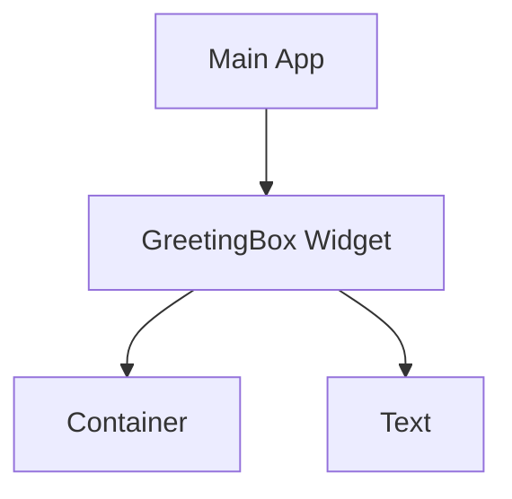

## 9.1.1 Building Your Own Widgets

Welcome to the exciting world of custom widgets in Flutter! In this section, we'll explore how you can create your own widgets to make your apps more organized, efficient, and fun. Widgets are the building blocks of Flutter apps, and by learning to create your own, you'll unlock endless possibilities for creativity and innovation.

### What is a Widget?

In Flutter, everything you see on the screen is a widget. Widgets are the fundamental elements used to build the user interface of your app. They can be anything from a simple button or text to complex layouts and animations. Understanding widgets is key to mastering Flutter development.

### Why Create Custom Widgets?

Creating custom widgets allows you to:

- **Reuse Code:** By encapsulating functionality into a widget, you can reuse it across different parts of your app, saving time and effort.
- **Organize Your Code:** Custom widgets help keep your codebase clean and manageable by breaking down complex interfaces into smaller, more manageable pieces.
- **Enhance Flexibility:** Custom widgets can be tailored to meet specific design and functionality requirements, giving you greater control over your app's appearance and behavior.

### Simple Example: Personalized Greeting Box

Let's start with a simple example of a custom widget: a personalized greeting box. This widget will display a message in a styled container.

```dart
import 'package:flutter/material.dart';

class GreetingBox extends StatelessWidget {
  final String message;

  GreetingBox({required this.message});

  @override
  Widget build(BuildContext context) {
    return Container(
      padding: EdgeInsets.all(16.0),
      color: Colors.blueAccent,
      child: Text(
        message,
        style: TextStyle(fontSize: 20, color: Colors.white),
      ),
    );
  }
}
```

### Breaking Down the Code

#### StatelessWidget

The `GreetingBox` class extends `StatelessWidget`, which is used for widgets that do not change over time. This means the widget's appearance and behavior are fixed once created.

#### Properties

The `GreetingBox` widget has a property called `message`, which is passed through the constructor. This allows you to customize the text displayed by the widget.

#### Build Method

The `build` method is where you define the widget's appearance. In this example, we use a `Container` to provide padding and background color, and a `Text` widget to display the message.

### Visualizing the Custom Widget

To better understand how the `GreetingBox` fits into the app structure, let's look at a diagram:



This diagram shows that the `GreetingBox` is a component of the main app, and it contains a `Container` and a `Text` widget.

### Interactive Exercise

Now it's your turn! Try creating your own custom widget. Here are some ideas to get you started:

- **Colored Box with Your Name:** Create a widget that displays your name in a colored box.
- **Favorite Quote Widget:** Design a widget that shows your favorite quote with a unique style.

### Visual Aids

To inspire your creativity, here are some examples of apps using custom widgets:

- **Screenshot 1:** An app with a custom widget displaying a welcome message.
- **Screenshot 2:** A layout showcasing multiple custom widgets for different purposes.

### Conclusion

By creating custom widgets, you can make your Flutter apps more organized, efficient, and personalized. Experiment with different designs and functionalities to see what you can create. Remember, the possibilities are endless!

## Quiz Time!



### What is a widget in Flutter?

- [x] A building block of the user interface
- [ ] A type of database
- [ ] A network protocol
- [ ] A programming language

> **Explanation:** Widgets are the fundamental elements used to build the user interface in Flutter apps.

### Why should you create custom widgets?

- [x] To reuse code and keep projects tidy
- [ ] To make apps slower
- [ ] To increase file size
- [ ] To complicate the code

> **Explanation:** Custom widgets help in reusing code and keeping projects organized and efficient.

### What type of widget is `GreetingBox`?

- [x] StatelessWidget
- [ ] StatefulWidget
- [ ] InheritedWidget
- [ ] Provider

> **Explanation:** `GreetingBox` is a `StatelessWidget`, meaning its appearance does not change over time.

### What is the purpose of the `build` method?

- [x] To define the widget's appearance
- [ ] To connect to a database
- [ ] To handle user input
- [ ] To manage app state

> **Explanation:** The `build` method defines how the widget should look by returning a widget tree.

### How do you pass data to a custom widget?

- [x] Using constructors
- [ ] Through global variables
- [ ] Via HTTP requests
- [ ] By modifying the main function

> **Explanation:** Data is passed to custom widgets using constructors, allowing customization.

### What does the `Container` widget do in the `GreetingBox` example?

- [x] Provides padding and background color
- [ ] Handles user input
- [ ] Connects to the internet
- [ ] Manages app state

> **Explanation:** The `Container` widget is used to provide padding and a background color for the `GreetingBox`.

### What is the benefit of using `StatelessWidget`?

- [x] Simplicity for widgets that don't change
- [ ] Dynamic state management
- [ ] Real-time data updates
- [ ] Complex animations

> **Explanation:** `StatelessWidget` is ideal for simple widgets that do not change over time.

### What is the role of the `Text` widget in the `GreetingBox`?

- [x] To display the message
- [ ] To handle user input
- [ ] To manage app state
- [ ] To connect to a database

> **Explanation:** The `Text` widget is used to display the message passed to the `GreetingBox`.

### Can custom widgets be reused in different parts of an app?

- [x] True
- [ ] False

> **Explanation:** Custom widgets can be reused across different parts of an app, promoting code reuse and organization.

### What is the main advantage of breaking down complex interfaces into custom widgets?

- [x] Improved code organization and manageability
- [ ] Increased app size
- [ ] Slower performance
- [ ] More complex code

> **Explanation:** Breaking down complex interfaces into custom widgets improves code organization and manageability.


