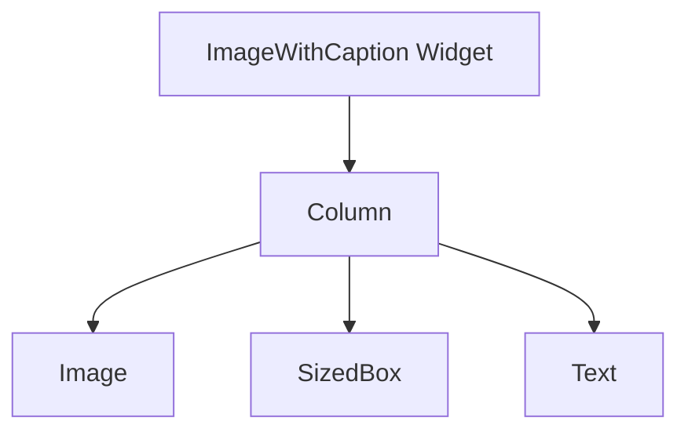

## 9.1.2 Composing Widgets

Welcome to the exciting world of composing widgets in Flutter! In this section, we'll learn how to combine smaller widgets to create more complex and functional custom widgets. This is a powerful skill that allows you to build unique and interactive user interfaces for your apps. Let's dive in!

### What is Composing?

Composing in Flutter is like building with LEGO blocks. Just as you can create a castle by stacking and connecting individual bricks, you can build complex widgets by combining simpler ones. This approach allows you to create reusable components that can be used throughout your app, making your code more organized and efficient.

### Example Scenario: Creating a Custom Widget

Let's start with a practical example. We'll create a custom widget called `ImageWithCaption` that combines an image with a caption. This widget will display an image and a text label underneath it, making it perfect for showcasing photos with descriptions.

Here's the code for our `ImageWithCaption` widget:

```dart
import 'package:flutter/material.dart';

class ImageWithCaption extends StatelessWidget {
  final String imagePath;
  final String caption;

  ImageWithCaption({required this.imagePath, required this.caption});

  @override
  Widget build(BuildContext context) {
    return Column(
      children: [
        Image.asset(imagePath),
        SizedBox(height: 8.0),
        Text(
          caption,
          style: TextStyle(fontSize: 16, fontWeight: FontWeight.bold),
        ),
      ],
    );
  }
}
```

### Breaking Down the Code

Let's explore the components of our `ImageWithCaption` widget:

- **Column Widget:** The `Column` widget is used to stack its children vertically. In this case, it stacks an `Image`, a `SizedBox`, and a `Text` widget. This allows us to display the image on top and the caption below.

- **Image and Text:** The `Image.asset` widget displays an image from your app's assets, while the `Text` widget shows the caption. Both are essential for creating a visually appealing and informative widget.

- **Spacing with SizedBox:** The `SizedBox` widget is used to add space between the image and the caption. By specifying a height of 8.0, we ensure there's a small gap between the two elements, improving readability.

### Visualizing the Composition

To better understand how the `ImageWithCaption` widget is composed, let's look at a diagram that illustrates its structure:



This diagram shows how the `ImageWithCaption` widget is built from smaller components, with the `Column` widget serving as the backbone that holds everything together.

### Interactive Exercise: Create Your Own Composed Widget

Now it's your turn! Let's create another composed widget, such as a profile card. This widget will include a profile picture, a name, and a short bio. Here's a starting point:

```dart
import 'package:flutter/material.dart';

class ProfileCard extends StatelessWidget {
  final String profileImagePath;
  final String name;
  final String bio;

  ProfileCard({required this.profileImagePath, required this.name, required this.bio});

  @override
  Widget build(BuildContext context) {
    return Column(
      children: [
        CircleAvatar(
          backgroundImage: AssetImage(profileImagePath),
          radius: 50.0,
        ),
        SizedBox(height: 8.0),
        Text(
          name,
          style: TextStyle(fontSize: 20, fontWeight: FontWeight.bold),
        ),
        SizedBox(height: 4.0),
        Text(
          bio,
          style: TextStyle(fontSize: 16),
          textAlign: TextAlign.center,
        ),
      ],
    );
  }
}
```

### Visual Aids: Screenshots and Diagrams

To help you visualize the composed widgets, here are some screenshots and diagrams:

- **Screenshot of `ImageWithCaption`:** 

- **Diagram of `ProfileCard` Composition:**

```mermaid
graph TD
    A[ProfileCard Widget] --> B[Column]
    B --> C[CircleAvatar]
    B --> D[SizedBox]
    B --> E[Text (Name)]
    B --> F[SizedBox]
    B --> G[Text (Bio)]
```

### Best Practices and Tips

- **Reusability:** Design your custom widgets to be reusable across different parts of your app. This reduces code duplication and makes maintenance easier.

- **Consistency:** Use consistent styling and spacing to ensure your widgets look cohesive and professional.

- **Experimentation:** Don't be afraid to experiment with different widget combinations to achieve the desired look and functionality.

### Conclusion

Composing widgets is a fundamental skill in Flutter development. By combining smaller widgets, you can create complex and functional custom components that enhance your app's user interface. Keep practicing and experimenting with different compositions to unlock the full potential of Flutter!

## Quiz Time!



### What is the main purpose of composing widgets in Flutter?

- [x] To build complex widgets from simpler ones
- [ ] To reduce the number of widgets in an app
- [ ] To make widgets look more colorful
- [ ] To increase the app's performance

> **Explanation:** Composing widgets allows developers to build complex widgets by combining simpler ones, enhancing functionality and reusability.

### Which widget is used to stack children vertically in Flutter?

- [ ] Row
- [x] Column
- [ ] Stack
- [ ] Container

> **Explanation:** The `Column` widget is used to stack its children vertically, making it ideal for layouts that require vertical alignment.

### What does the `SizedBox` widget do in a composition?

- [x] Adds space between widgets
- [ ] Changes the color of widgets
- [ ] Rotates widgets
- [ ] Animates widgets

> **Explanation:** The `SizedBox` widget is used to add space between widgets, helping to improve layout and readability.

### In the `ImageWithCaption` widget, what is the role of the `Text` widget?

- [ ] To display an image
- [x] To show the caption
- [ ] To add a border
- [ ] To change the background color

> **Explanation:** The `Text` widget in the `ImageWithCaption` widget is used to display the caption below the image.

### What is the purpose of the `CircleAvatar` widget in the `ProfileCard` example?

- [x] To display a circular profile image
- [ ] To add a border around the card
- [ ] To create a button
- [ ] To animate the profile picture

> **Explanation:** The `CircleAvatar` widget is used to display a circular profile image, commonly used for profile pictures.

### How can you make a custom widget reusable?

- [x] By designing it to be flexible and parameterized
- [ ] By using only one widget inside it
- [ ] By making it colorful
- [ ] By adding animations

> **Explanation:** Designing a custom widget to be flexible and parameterized allows it to be reused in different parts of an app.

### What is a benefit of using composed widgets?

- [x] They make the code more organized
- [ ] They make the app run faster
- [ ] They reduce the number of lines of code
- [ ] They automatically update the app

> **Explanation:** Composed widgets help organize code by creating reusable components, making the codebase cleaner and easier to maintain.

### Which widget is used to display an image from assets in Flutter?

- [ ] NetworkImage
- [x] Image.asset
- [ ] Image.network
- [ ] AssetImage

> **Explanation:** The `Image.asset` widget is used to display images from the app's assets, making it suitable for local images.

### What is the advantage of using a `Column` widget in a custom widget?

- [x] It allows for vertical stacking of child widgets
- [ ] It changes the color of child widgets
- [ ] It animates child widgets
- [ ] It makes child widgets clickable

> **Explanation:** The `Column` widget allows for vertical stacking of child widgets, making it ideal for layouts that require vertical alignment.

### True or False: Composing widgets can help create more interactive user interfaces.

- [x] True
- [ ] False

> **Explanation:** True. Composing widgets allows developers to create more interactive and functional user interfaces by combining different widgets.


