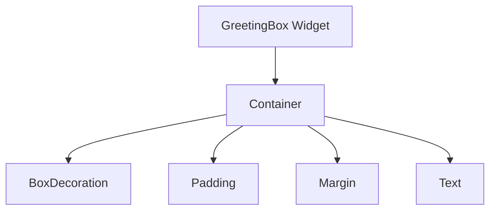

## 9.1.3 Styling Widgets

Welcome to the exciting world of styling in Flutter! In this section, we'll explore how to make your app's widgets not only functional but also visually appealing and user-friendly. Styling is an essential part of app development, as it enhances the user experience and makes your app stand out. Let's dive into the world of colors, borders, fonts, and more!

### The Importance of Styling

Styling is like adding the finishing touches to a masterpiece. It transforms a basic app into something beautiful and engaging. By using different styling properties, you can:

- **Improve Readability:** Make text easier to read with the right font size and color.
- **Create Visual Hierarchy:** Use styling to guide users' attention to important elements.
- **Enhance User Experience:** Make your app more intuitive and enjoyable to use.
- **Express Creativity:** Show off your unique style and creativity through design.

### Common Styling Properties

Flutter provides a rich set of styling properties that you can use to customize your widgets. Here are some of the most common ones:

#### Colors

Colors can set the mood and theme of your app. You can change the background color of containers, the text color, and even the color of borders.

```dart
color: Colors.blue, // Sets the background color to blue
```

#### Borders and Corners

Borders can add definition to your widgets, while rounded corners can make them look softer and more modern.

```dart
border: Border.all(color: Colors.black, width: 2.0), // Adds a black border
borderRadius: BorderRadius.circular(15.0), // Rounds the corners
```

#### Fonts

Fonts are crucial for readability and style. You can adjust the font size, weight, and style to match your app's theme.

```dart
style: TextStyle(
  fontSize: 22,
  color: Colors.white,
  fontWeight: FontWeight.bold,
  fontStyle: FontStyle.italic,
),
```

#### Padding and Margins

Padding and margins control the space inside and around your widgets, helping to create a clean and organized layout.

```dart
padding: EdgeInsets.all(20.0), // Adds space inside the widget
margin: EdgeInsets.symmetric(vertical: 10.0, horizontal: 20.0), // Adds space outside the widget
```

### Example Enhancement: Styling the `GreetingBox` Widget

Let's take a simple widget called `GreetingBox` and enhance it with some styling properties.

```dart
class GreetingBox extends StatelessWidget {
  final String message;

  GreetingBox({required this.message});

  @override
  Widget build(BuildContext context) {
    return Container(
      padding: EdgeInsets.all(20.0),
      margin: EdgeInsets.symmetric(vertical: 10.0, horizontal: 20.0),
      decoration: BoxDecoration(
        color: Colors.green,
        borderRadius: BorderRadius.circular(15.0),
        border: Border.all(color: Colors.black, width: 2.0),
      ),
      child: Text(
        message,
        style: TextStyle(
          fontSize: 22,
          color: Colors.white,
          fontWeight: FontWeight.bold,
          fontStyle: FontStyle.italic,
        ),
      ),
    );
  }
}
```

### Breaking Down the Enhancements

#### Padding and Margin

- **Padding:** Adds space inside the container, making the text look less cramped.
- **Margin:** Adds space outside the container, separating it from other widgets.

#### BoxDecoration

- **Background Color:** Sets the background color of the container.
- **Border:** Adds a border around the container, making it stand out.
- **Border Radius:** Rounds the corners of the container for a softer look.

#### TextStyle

- **Font Size:** Makes the text larger and more readable.
- **Color:** Changes the text color to white for contrast against the green background.
- **Font Weight and Style:** Makes the text bold and italic for emphasis.

### Visualizing the Styled `GreetingBox` Widget

Here's a diagram to help you visualize the components of the styled `GreetingBox` widget:



### Interactive Exercise

Now it's your turn! Take another widget you've created and experiment with different styling properties. Try changing the colors, adding borders, and customizing the text style. See how these changes affect the look and feel of your widget.

### Visual Aids

To help you see the difference styling can make, here are some before-and-after screenshots of styled widgets:

- **Before Styling:** A plain widget with default settings.
- **After Styling:** A vibrant, eye-catching widget with custom colors, borders, and fonts.

### Conclusion

Styling is a powerful tool in Flutter that allows you to express your creativity and make your apps more engaging. By mastering these styling properties, you can create beautiful, user-friendly interfaces that delight your users. Keep experimenting and have fun with your designs!

## Quiz Time!



### What is the main purpose of styling widgets in Flutter?

- [x] To make apps more visually appealing and user-friendly
- [ ] To increase the app's performance
- [ ] To reduce the app's file size
- [ ] To make the app run faster

> **Explanation:** Styling enhances the visual appeal and user-friendliness of an app, making it more engaging for users.

### Which property would you use to change the background color of a widget?

- [ ] TextStyle
- [x] BoxDecoration
- [ ] Padding
- [ ] Margin

> **Explanation:** BoxDecoration is used to set the background color and other visual properties of a widget.

### How can you add space inside a widget?

- [ ] Margin
- [x] Padding
- [ ] Border
- [ ] FontStyle

> **Explanation:** Padding adds space inside a widget, creating a buffer between the content and the widget's edges.

### What does the `borderRadius` property do?

- [x] Rounds the corners of a widget
- [ ] Changes the widget's color
- [ ] Adjusts the widget's size
- [ ] Sets the widget's font

> **Explanation:** The `borderRadius` property is used to round the corners of a widget, giving it a softer appearance.

### Which property is used to make text bold?

- [ ] FontStyle
- [x] FontWeight
- [ ] FontSize
- [ ] Color

> **Explanation:** FontWeight is used to make text bold by setting it to `FontWeight.bold`.

### What is the effect of setting a margin on a widget?

- [x] Adds space outside the widget
- [ ] Adds space inside the widget
- [ ] Changes the widget's background color
- [ ] Rounds the widget's corners

> **Explanation:** Margin adds space outside the widget, separating it from other elements.

### Which property would you use to change the text color?

- [ ] BoxDecoration
- [ ] Padding
- [x] TextStyle
- [ ] Margin

> **Explanation:** TextStyle is used to customize text properties, including color, size, and style.

### What does the `border` property in BoxDecoration do?

- [x] Adds a border around the widget
- [ ] Changes the widget's text
- [ ] Adjusts the widget's padding
- [ ] Sets the widget's margin

> **Explanation:** The `border` property in BoxDecoration adds a border around the widget, enhancing its visual definition.

### How can you make text italic in Flutter?

- [ ] FontWeight
- [x] FontStyle
- [ ] FontSize
- [ ] Color

> **Explanation:** FontStyle is used to make text italic by setting it to `FontStyle.italic`.

### True or False: Styling widgets can improve the performance of an app.

- [ ] True
- [x] False

> **Explanation:** Styling primarily affects the visual appearance and user experience, not the performance of an app.


