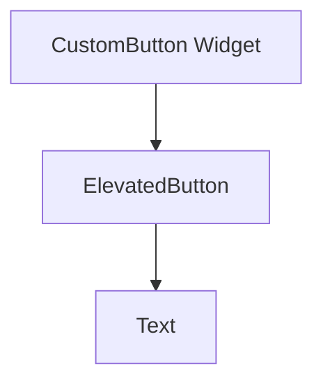

## 9.1.4 Mini Project: Custom Button Set

Creating custom widgets in Flutter is a fantastic way to make your apps unique and reusable. In this mini-project, we'll guide you through designing a set of custom-styled buttons that you can use throughout your apps. These buttons will not only look great but also enhance your app's functionality by providing consistent and reusable components.

### Project Overview

In this project, you'll learn how to create a collection of buttons with different styles. These buttons can be used for various actions in your app, such as playing a game, opening settings, or quitting the app. By the end of this project, you'll have a set of buttons that you can easily customize and reuse in any Flutter app you create.

### Step-by-Step Instructions

#### 1. Designing Button Variations

Before we start coding, let's think about the different types of buttons we want to create. Here are some ideas:

- **Colors:** Create buttons with different colors to represent different actions. For example, a green button for "Play," a blue button for "Settings," and a red button for "Quit."
- **Shapes:** Experiment with different shapes, such as rounded or rectangular buttons.
- **Sizes:** Design buttons of various sizes to fit different parts of your app.

#### 2. Creating a Custom Button Widget

Let's start by creating a custom button widget in Flutter. This widget will allow us to easily create buttons with different styles.

```dart
import 'package:flutter/material.dart';

class CustomButton extends StatelessWidget {
  final String label;
  final Color color;
  final VoidCallback onPressed;

  CustomButton({
    required this.label,
    required this.color,
    required this.onPressed,
  });

  @override
  Widget build(BuildContext context) {
    return ElevatedButton(
      style: ElevatedButton.styleFrom(
        primary: color,
        padding: EdgeInsets.symmetric(horizontal: 20.0, vertical: 15.0),
        shape: RoundedRectangleBorder(
          borderRadius: BorderRadius.circular(10.0),
        ),
      ),
      onPressed: onPressed,
      child: Text(
        label,
        style: TextStyle(fontSize: 16, fontWeight: FontWeight.bold),
      ),
    );
  }
}
```

**Explanation:**
- **`CustomButton` Class:** This class extends `StatelessWidget`, meaning it doesn't hold any state. It's perfect for our button since the button's appearance doesn't change.
- **Parameters:** The button takes three parameters: `label` for the text, `color` for the button's background, and `onPressed` for the action when the button is tapped.
- **`ElevatedButton`:** We use Flutter's `ElevatedButton` and customize it with `styleFrom` to set the color, padding, and shape.

#### 3. Using the Custom Button in the App

Now, let's use our custom button in a simple app. We'll create a page with a set of buttons.

```dart
class ButtonSetPage extends StatelessWidget {
  @override
  Widget build(BuildContext context) {
    return Scaffold(
      appBar: AppBar(title: Text('Custom Button Set')),
      body: Center(
        child: Column(
          mainAxisAlignment: MainAxisAlignment.center,
          children: [
            CustomButton(
              label: 'Play',
              color: Colors.green,
              onPressed: () {
                // Action for Play
              },
            ),
            SizedBox(height: 20),
            CustomButton(
              label: 'Settings',
              color: Colors.blue,
              onPressed: () {
                // Action for Settings
              },
            ),
            SizedBox(height: 20),
            CustomButton(
              label: 'Quit',
              color: Colors.red,
              onPressed: () {
                // Action for Quit
              },
            ),
          ],
        ),
      ),
    );
  }
}
```

**Explanation:**
- **`ButtonSetPage` Class:** This class creates a simple page with a column of buttons.
- **`CustomButton` Instances:** We create three buttons with different labels and colors. Each button has a placeholder for an action when pressed.

#### 4. Testing the Buttons

Run your app to see the custom buttons in action. Tap each button to ensure they respond correctly. You can add print statements in the `onPressed` callbacks to verify that each button works.

#### 5. Enhancing the Button Set

Let's make our buttons even more exciting:

- **Add Icons:** You can add icons to your buttons by using the `Icon` widget alongside the `Text` widget.
- **Button Effects:** Create buttons that change color when tapped by using the `onHighlightChanged` property.
- **Responsive Design:** Ensure your buttons look great on different screen sizes by using `MediaQuery` to adjust their size and padding.

### Mermaid.js Component Diagram

Here's a visual representation of the `CustomButton` widget structure:



### Interactive Exercise

Now it's your turn! Try adding more buttons with unique styles or modify the existing ones to suit different needs in your apps. Experiment with different colors, shapes, and sizes. You can also try adding animations or sound effects to your buttons.

### Visual Aids

Below are some screenshots of what your custom buttons might look like in the app:

- **Play Button:** A green button with a play icon.
- **Settings Button:** A blue button with a gear icon.
- **Quit Button:** A red button with an exit icon.

### Conclusion

Congratulations! You've successfully created a set of custom-styled buttons in Flutter. These buttons are not only visually appealing but also reusable, making your app development process more efficient. Keep experimenting with different styles and functionalities to make your apps even more engaging.

## Quiz Time!



### What is the primary purpose of creating a custom button widget in Flutter?

- [x] To create reusable and consistent button styles across the app.
- [ ] To make the app run faster.
- [ ] To add more colors to the app.
- [ ] To reduce the app's size.

> **Explanation:** Creating a custom button widget allows for consistent styling and reusability, making it easier to maintain and update the app's design.

### Which Flutter widget is used to create a button in the custom button example?

- [x] ElevatedButton
- [ ] FlatButton
- [ ] TextButton
- [ ] IconButton

> **Explanation:** The `ElevatedButton` widget is used in the example to create a button with elevation and customizable styles.

### What parameter is used to define the action when a button is pressed?

- [x] onPressed
- [ ] onTap
- [ ] onClick
- [ ] onAction

> **Explanation:** The `onPressed` parameter is a callback function that defines the action to be taken when the button is pressed.

### How can you add an icon to a custom button?

- [x] By using the Icon widget alongside the Text widget.
- [ ] By changing the button's color.
- [ ] By using the Image widget.
- [ ] By modifying the button's shape.

> **Explanation:** You can add an icon to a button by including the `Icon` widget in the button's child, alongside the `Text` widget.

### What is the purpose of the `SizedBox` widget in the `ButtonSetPage` example?

- [x] To add space between the buttons.
- [ ] To change the button's color.
- [ ] To make the button larger.
- [ ] To add a border to the button.

> **Explanation:** The `SizedBox` widget is used to add space between the buttons, improving the layout's appearance.

### Which property of the `ElevatedButton` is used to set its background color?

- [x] primary
- [ ] backgroundColor
- [ ] color
- [ ] fillColor

> **Explanation:** The `primary` property in `ElevatedButton.styleFrom` is used to set the button's background color.

### What does the `VoidCallback` type represent in the custom button widget?

- [x] A function that takes no arguments and returns no value.
- [ ] A function that returns a boolean.
- [ ] A function that takes a string argument.
- [ ] A function that returns a string.

> **Explanation:** `VoidCallback` is a type for functions that take no arguments and return no value, used for the `onPressed` callback.

### How can you make a button change color when tapped?

- [x] By using the onHighlightChanged property.
- [ ] By changing the button's label.
- [ ] By using a different widget.
- [ ] By modifying the button's shape.

> **Explanation:** The `onHighlightChanged` property can be used to change the button's appearance when it is tapped or highlighted.

### What is the advantage of using a custom button widget?

- [x] It allows for consistent styling and easy updates.
- [ ] It makes the app slower.
- [ ] It increases the app's size.
- [ ] It limits the app's functionality.

> **Explanation:** A custom button widget provides consistent styling and makes it easier to update the app's design across different parts of the app.

### True or False: The `CustomButton` widget can only be used in one part of the app.

- [ ] True
- [x] False

> **Explanation:** The `CustomButton` widget is reusable and can be used in multiple parts of the app, providing consistent styling and functionality.


