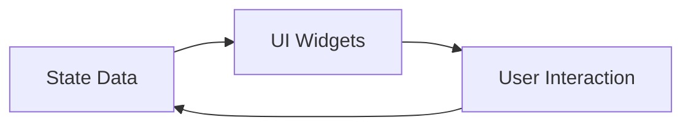

## 9.2.1 Understanding State

Welcome to the exciting world of state management in Flutter! In this section, we'll explore what state is, why it's crucial for creating interactive apps, and how you can use it to make your Flutter apps come alive. Let's dive in!

### What is State?

In the simplest terms, **state** is the data that determines how parts of an app look and behave at any given time. Think of it as the app's memory of what's happening right now. State can include anything from the current score in a game to whether a button has been pressed.

#### Simple Analogy: State in Video Games

Imagine you're playing a video game. Your character has health points, a position on the map, and maybe even a score. These are all examples of state. As you play, your character's state changes—perhaps you gain points, lose health, or move to a new location. Just like in a game, state in an app changes based on user interactions and other events.

### Why State Matters

State is what makes apps dynamic and interactive. Without state, apps would be static and unresponsive. Here's why state is so important:

- **Dynamic Updates:** State allows the app to update its user interface (UI) in response to user actions or other changes. For example, when you type in a text field, the state changes, and the app updates to show what you've typed.
- **Interactivity:** State enables features like buttons that change appearance when pressed, scores that update in real-time, and forms that validate user input.
- **User Experience:** By managing state effectively, you can create smooth and engaging user experiences that keep users coming back to your app.

### Examples of State

Let's look at some common examples of state in apps:

- **Game Score:** The current score in a game is a classic example of state. As you play, the score changes, and the app updates to reflect your progress.
- **Button Pressed:** Whether a button is pressed or not is another example of state. The app can change the button's appearance or trigger an action based on its state.
- **Text Field Content:** The text entered into a text field is part of the app's state. As you type, the state updates, and the app displays the new text.

### Visualizing State with a Diagram

To better understand how state interacts with the UI, let's look at a simple diagram:

In this diagram, you can see that:

- **State Data** influences the appearance and behavior of **UI Widgets**.
- **UI Widgets** respond to **User Interaction**, such as clicks or typing.
- **User Interaction** can change the **State Data**, creating a continuous loop of interaction and update.

### Interactive Exercise: Identifying State in Everyday Apps

Now it's your turn! Think about the apps you use every day. Can you identify examples of state in these apps? Here are a few ideas to get you started:

- **Basketball App:** What state changes when you score a basket?
- **Search Bar:** How does the state change when you type a query?
- **Weather App:** What state changes when you update the location?

Take a moment to jot down your thoughts or discuss them with a friend. Identifying state in real-world apps will help you understand how to use it in your own projects.

### Visual Aids: How State Affects the UI

To further illustrate how state affects the UI, let's consider a simple app with a button. When you press the button, its state changes from "not pressed" to "pressed," and the app updates the button's appearance. Here's a visual representation:

- **Before Pressing the Button:**
  - Button State: Not Pressed
  - Button Appearance: Default

- **After Pressing the Button:**
  - Button State: Pressed
  - Button Appearance: Highlighted

By managing state, you can create apps that respond to user actions in real-time, providing a seamless and engaging experience.

### Conclusion

Understanding state is a fundamental part of building interactive Flutter apps. By mastering state management, you'll be able to create dynamic apps that respond to user interactions and changes in data. Remember, state is like the memory of your app, keeping track of what's happening and ensuring everything runs smoothly.

As you continue your coding journey, keep experimenting with state in your projects. The more you practice, the more intuitive it will become.

## Quiz Time!



### What is state in the context of Flutter apps?

- [x] The data that determines how parts of an app look and behave at any given time.
- [ ] The visual design of the app.
- [ ] The programming language used to build the app.
- [ ] The hardware on which the app runs.

> **Explanation:** State refers to the data that determines how parts of an app look and behave at any given time.

### Why is state important in app development?

- [x] It allows apps to be dynamic and interactive.
- [ ] It makes the app look more colorful.
- [ ] It reduces the size of the app.
- [ ] It speeds up the app's loading time.

> **Explanation:** State is important because it allows apps to be dynamic and interactive, updating the UI based on user actions or other events.

### Which of the following is an example of state?

- [x] The current score in a game.
- [ ] The color of the app's background.
- [ ] The app's icon.
- [ ] The name of the app.

> **Explanation:** The current score in a game is an example of state, as it changes based on user interactions.

### In the provided Mermaid.js diagram, what does the arrow from "User Interaction" to "State Data" represent?

- [x] User interactions can change the state data.
- [ ] State data can change user interactions.
- [ ] UI widgets can change user interactions.
- [ ] User interactions can change UI widgets.

> **Explanation:** The arrow from "User Interaction" to "State Data" represents that user interactions can change the state data.

### What happens to the state when you type in a text field?

- [x] The state updates to reflect the new text.
- [ ] The state remains unchanged.
- [ ] The state resets to default.
- [ ] The state becomes inactive.

> **Explanation:** When you type in a text field, the state updates to reflect the new text.

### How does state affect the UI in a Flutter app?

- [x] It determines how the UI looks and behaves.
- [ ] It changes the programming language.
- [ ] It modifies the app's icon.
- [ ] It alters the app's loading time.

> **Explanation:** State affects the UI by determining how it looks and behaves, allowing for dynamic updates.

### Which of the following is NOT an example of state?

- [x] The app's loading screen.
- [ ] Whether a button is pressed.
- [ ] The contents of a text field.
- [ ] The current level in a game.

> **Explanation:** The app's loading screen is not an example of state, as it does not change based on user interactions.

### What is the role of state in user interactions?

- [x] It allows the app to respond to user actions.
- [ ] It changes the app's programming language.
- [ ] It modifies the app's icon.
- [ ] It alters the app's loading time.

> **Explanation:** State allows the app to respond to user actions, making it interactive and dynamic.

### In a game app, what might be considered part of the state?

- [x] The player's health points.
- [ ] The game's logo.
- [ ] The app's loading screen.
- [ ] The game's soundtrack.

> **Explanation:** The player's health points are part of the state, as they change based on gameplay.

### True or False: State is only important for games and not for other types of apps.

- [ ] True
- [x] False

> **Explanation:** False. State is important for all types of apps, not just games, as it allows for dynamic and interactive user interfaces.


