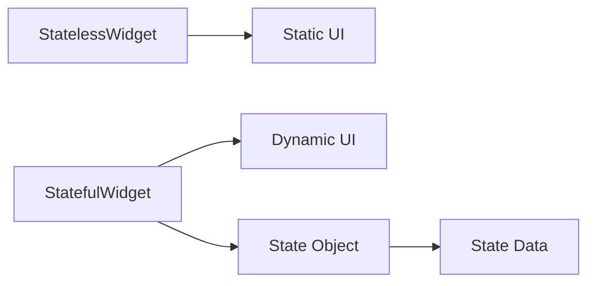

## 9.2.2 Stateful vs Stateless Widgets

In the world of Flutter, understanding the difference between `StatefulWidget` and `StatelessWidget` is crucial for building dynamic and interactive applications. These two types of widgets form the backbone of Flutter's UI framework, allowing developers to create both static and dynamic user interfaces. Let's dive into what makes each of these widgets unique and when to use them.

### StatelessWidget Recap

A `StatelessWidget` is a widget that does not change once it is built. It is ideal for static content that does not require any interaction or updates. Once a `StatelessWidget` is rendered, it remains the same throughout its lifecycle.

Here's a simple example of a `StatelessWidget`:

```dart
class HelloWorld extends StatelessWidget {
  @override
  Widget build(BuildContext context) {
    return Text('Hello, World!');
  }
}
```

In this example, the text "Hello, World!" is displayed on the screen, and it will not change unless the entire widget is rebuilt.

### StatefulWidget Introduction

In contrast, a `StatefulWidget` is a widget that can change its appearance in response to events triggered by user interactions or other factors. This is achieved through a `State` object, which holds the state data and can trigger a rebuild of the widget when the state changes.

Here's a basic example of a `StatefulWidget`:

```dart
class Counter extends StatefulWidget {
  @override
  _CounterState createState() => _CounterState();
}

class _CounterState extends State<Counter> {
  int count = 0;

  void increment() {
    setState(() {
      count++;
    });
  }

  @override
  Widget build(BuildContext context) {
    return Column(
      children: [
        Text('Count: $count'),
        ElevatedButton(
          onPressed: increment,
          child: Text('Increment'),
        ),
      ],
    );
  }
}
```

In this example, the `Counter` widget displays a count that can be incremented by pressing a button. The `setState` method is used to update the count and trigger a rebuild of the widget.

### Key Differences

#### State Management

- **StatelessWidget:** Does not manage any state. It is used for static content that does not change.
- **StatefulWidget:** Manages state through a `State` object. It can change its appearance based on the state data.

#### Dynamic UI

- **StatelessWidget:** Renders a static UI that remains unchanged.
- **StatefulWidget:** Can redraw parts of the UI when the state changes, allowing for dynamic and interactive content.

### Simple Example Comparison

Let's compare the two with simple examples:

#### StatelessWidget Example

```dart
class HelloWorld extends StatelessWidget {
  @override
  Widget build(BuildContext context) {
    return Text('Hello, World!');
  }
}
```

#### StatefulWidget Example

```dart
class Counter extends StatefulWidget {
  @override
  _CounterState createState() => _CounterState();
}

class _CounterState extends State<Counter> {
  int count = 0;

  void increment() {
    setState(() {
      count++;
    });
  }

  @override
  Widget build(BuildContext context) {
    return Column(
      children: [
        Text('Count: $count'),
        ElevatedButton(
          onPressed: increment,
          child: Text('Increment'),
        ),
      ],
    );
  }
}
```

### Mermaid.js Comparison Diagram

To visually represent the differences, here's a diagram:



### Interactive Exercise

Now, let's put this knowledge into practice. Try converting a `StatelessWidget` into a `StatefulWidget` by adding a button that changes the text when pressed. Here's a starting point:

```dart
class ChangeText extends StatelessWidget {
  @override
  Widget build(BuildContext context) {
    return Text('Press the button to change me!');
  }
}
```

**Challenge:** Transform the `ChangeText` widget into a `StatefulWidget` that changes the text to "Text Changed!" when a button is pressed.

### Visual Aids

Below are side-by-side screenshots showing a stateless widget versus a stateful widget in action:

- **StatelessWidget:** Displays static text.
- **StatefulWidget:** Displays a count that updates when a button is pressed.

### Best Practices and Common Pitfalls

- **Use `StatelessWidget`** when your widget does not need to change after it is built. This can improve performance since the widget does not need to be rebuilt.
- **Use `StatefulWidget`** when your widget needs to change in response to user interactions or other events.
- **Avoid unnecessary state updates** in `StatefulWidget` to prevent performance issues.

### Conclusion

Understanding when to use `StatefulWidget` versus `StatelessWidget` is key to building efficient and responsive Flutter applications. By mastering these concepts, you can create apps that are both dynamic and performant.

## Quiz Time!



### What is a key characteristic of a StatelessWidget?

- [x] It does not change once built.
- [ ] It can change its appearance based on user interaction.
- [ ] It manages state through a State object.
- [ ] It requires a setState method to update.

> **Explanation:** A StatelessWidget is static and does not change once it is built.

### What does a StatefulWidget use to manage changes?

- [ ] A StatelessWidget
- [x] A State object
- [ ] A static method
- [ ] A build method

> **Explanation:** A StatefulWidget uses a State object to manage changes and update the UI.

### Which method is used to update the state in a StatefulWidget?

- [ ] build()
- [ ] initState()
- [x] setState()
- [ ] dispose()

> **Explanation:** The setState() method is used to update the state and trigger a UI rebuild in a StatefulWidget.

### What happens when setState() is called in a StatefulWidget?

- [ ] The widget is destroyed.
- [ ] The widget becomes stateless.
- [x] The widget rebuilds with the new state.
- [ ] The widget's state is reset.

> **Explanation:** When setState() is called, the widget rebuilds with the updated state.

### Which widget type is more suitable for static content?

- [x] StatelessWidget
- [ ] StatefulWidget
- [ ] DynamicWidget
- [ ] InteractiveWidget

> **Explanation:** StatelessWidget is more suitable for static content that does not change.

### What is the purpose of the State object in a StatefulWidget?

- [ ] To store static data
- [x] To hold state data and manage changes
- [ ] To render static UI
- [ ] To initialize the widget

> **Explanation:** The State object holds state data and manages changes in a StatefulWidget.

### Can a StatelessWidget have a build method?

- [x] Yes
- [ ] No

> **Explanation:** Yes, a StatelessWidget has a build method to render its UI.

### What is the result of not using setState() in a StatefulWidget?

- [ ] The widget will update automatically.
- [x] The widget will not update its UI.
- [ ] The widget will become stateless.
- [ ] The widget will crash.

> **Explanation:** Without setState(), the widget will not update its UI when the state changes.

### Which widget type is used for dynamic and interactive content?

- [ ] StatelessWidget
- [x] StatefulWidget
- [ ] StaticWidget
- [ ] FixedWidget

> **Explanation:** StatefulWidget is used for dynamic and interactive content that changes.

### True or False: A StatefulWidget can change its appearance based on user interaction.

- [x] True
- [ ] False

> **Explanation:** True, a StatefulWidget can change its appearance based on user interaction by updating its state.


