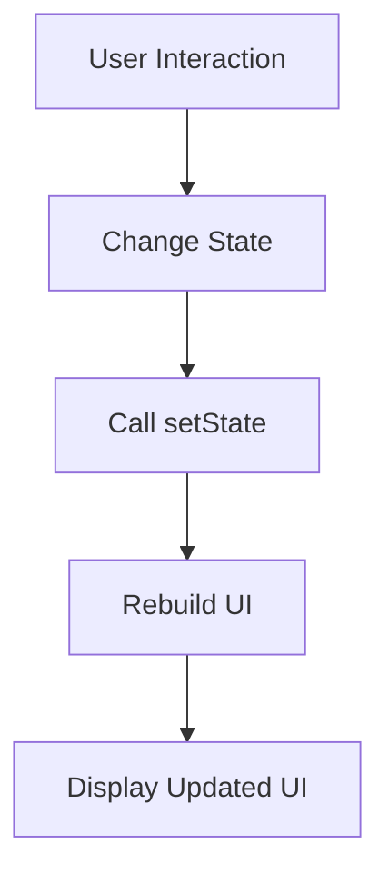

## 9.2.3 Managing State

Welcome to the exciting world of state management in Flutter! In this section, we'll explore how to manage state within a `StatefulWidget` using the `setState` method. This is a crucial skill for making your apps interactive and responsive to user actions. Let's dive in and learn how to bring your apps to life!

### Why Manage State?

In the world of app development, "state" refers to the data that can change over time. Managing state is essential because it allows your app to respond to user interactions and update the user interface (UI) accordingly. Imagine a light switch app where the switch can be turned on or off. The state of the switch (on or off) needs to be tracked so that the app can display the correct status to the user.

### Using `setState`

In Flutter, the `setState` method is used to notify the framework that the state of a widget has changed. When you call `setState`, Flutter knows that it needs to rebuild the widget tree and update the UI to reflect the new state. This is how you make your app interactive and dynamic.

Let's look at an example to see how this works in practice.

### Example Implementation

Here's a simple Flutter app that uses a toggle switch to change its state:

```dart
import 'package:flutter/material.dart';

void main() => runApp(MyApp());

class MyApp extends StatelessWidget {
  @override
  Widget build(BuildContext context) {
    return MaterialApp(
      home: Scaffold(
        appBar: AppBar(title: Text('Toggle Switch Example')),
        body: ToggleSwitch(),
      ),
    );
  }
}

class ToggleSwitch extends StatefulWidget {
  @override
  _ToggleSwitchState createState() => _ToggleSwitchState();
}

class _ToggleSwitchState extends State<ToggleSwitch> {
  bool isOn = false;

  void toggle() {
    setState(() {
      isOn = !isOn;
    });
  }

  @override
  Widget build(BuildContext context) {
    return Row(
      mainAxisAlignment: MainAxisAlignment.center,
      children: [
        Text(isOn ? 'On' : 'Off'),
        Switch(
          value: isOn,
          onChanged: (value) {
            toggle();
          },
        ),
      ],
    );
  }
}
```

### Breaking Down the Code

Let's break down the code to understand how it works:

- **State Variable:** The `isOn` variable holds the current state of the switch. It's a boolean that can be either `true` (on) or `false` (off).

- **Toggle Method:** The `toggle` method changes the state of `isOn` and calls `setState`. This tells Flutter to rebuild the widget tree and update the UI.

- **UI Update:** The `Text` widget displays "On" or "Off" based on the current state of `isOn`. When the switch is toggled, the UI updates to reflect the change.

### Visualizing State Management with Mermaid.js

To better understand how `setState` works, let's visualize the process with a flowchart:



- **User Interaction:** The user interacts with the app, such as toggling the switch.
- **Change State:** The state changes in response to the interaction.
- **Call setState:** The `setState` method is called to notify Flutter of the change.
- **Rebuild UI:** Flutter rebuilds the widget tree to reflect the new state.
- **Display Updated UI:** The updated UI is displayed to the user.

### Interactive Exercise

Now it's your turn! Try adding a toggle switch to your app that changes the background color when switched on or off. Here's a hint to get you started:

1. **Create a StatefulWidget:** Use the example above as a guide.
2. **Add a Color State Variable:** Use a variable to track the background color.
3. **Update the Color in setState:** Change the color when the switch is toggled.
4. **Rebuild the UI:** Use `setState` to update the UI with the new color.

### Visual Aids

To help you visualize the changes, here are some screenshots showing the app before and after the state changes:

- **Before Toggle:** The switch is off, and the background is white.
- **After Toggle:** The switch is on, and the background changes to a different color.

By following these steps, you'll gain hands-on experience with state management in Flutter, making your apps more interactive and engaging!

## Quiz Time!



### What is the purpose of managing state in a Flutter app?

- [x] To make the app interactive and responsive to user actions
- [ ] To increase the app's file size
- [ ] To make the app run slower
- [ ] To reduce the number of widgets

> **Explanation:** Managing state is essential for making apps interactive and responsive to user actions, allowing the UI to update based on changes in data.

### What does the `setState` method do in Flutter?

- [x] Notifies Flutter that the widget's state has changed
- [ ] Deletes the widget
- [ ] Creates a new widget
- [ ] Saves the widget's state to a file

> **Explanation:** The `setState` method notifies Flutter that the widget's state has changed, prompting a UI update.

### In the example code, what does the `toggle` method do?

- [x] Changes the state and calls `setState` to update the UI
- [ ] Deletes the widget
- [ ] Creates a new widget
- [ ] Saves the widget's state to a file

> **Explanation:** The `toggle` method changes the state of `isOn` and calls `setState` to update the UI.

### What is the role of the `isOn` variable in the example code?

- [x] It holds the current state of the switch
- [ ] It stores the app's title
- [ ] It tracks the number of users
- [ ] It saves the widget's position

> **Explanation:** The `isOn` variable holds the current state of the switch, determining whether it is on or off.

### What happens when `setState` is called in a Flutter app?

- [x] The widget tree is rebuilt, and the UI is updated
- [ ] The app crashes
- [ ] The app closes
- [ ] The app's file size increases

> **Explanation:** When `setState` is called, the widget tree is rebuilt, and the UI is updated to reflect the new state.

### Which widget is used to display the current state in the example code?

- [x] Text
- [ ] Button
- [ ] Image
- [ ] Container

> **Explanation:** The `Text` widget is used to display the current state, showing "On" or "Off" based on the `isOn` variable.

### What is the purpose of the `Switch` widget in the example code?

- [x] To allow the user to toggle the state
- [ ] To display an image
- [ ] To play a sound
- [ ] To navigate to a new screen

> **Explanation:** The `Switch` widget allows the user to toggle the state, changing the `isOn` variable.

### How does the app respond to user interactions in the example code?

- [x] By changing the state and updating the UI
- [ ] By closing the app
- [ ] By playing a sound
- [ ] By displaying an error message

> **Explanation:** The app responds to user interactions by changing the state and updating the UI using `setState`.

### What is the first step in the flowchart for managing state?

- [x] User Interaction
- [ ] Rebuild UI
- [ ] Display Updated UI
- [ ] Change State

> **Explanation:** The first step in the flowchart is User Interaction, which triggers the process of managing state.

### True or False: The `setState` method can be used to delete a widget.

- [ ] True
- [x] False

> **Explanation:** False. The `setState` method is used to notify Flutter of a state change, not to delete a widget.



By mastering state management, you're taking a big step toward creating dynamic and engaging apps. Keep experimenting and exploring, and you'll soon be building amazing interactive experiences!
