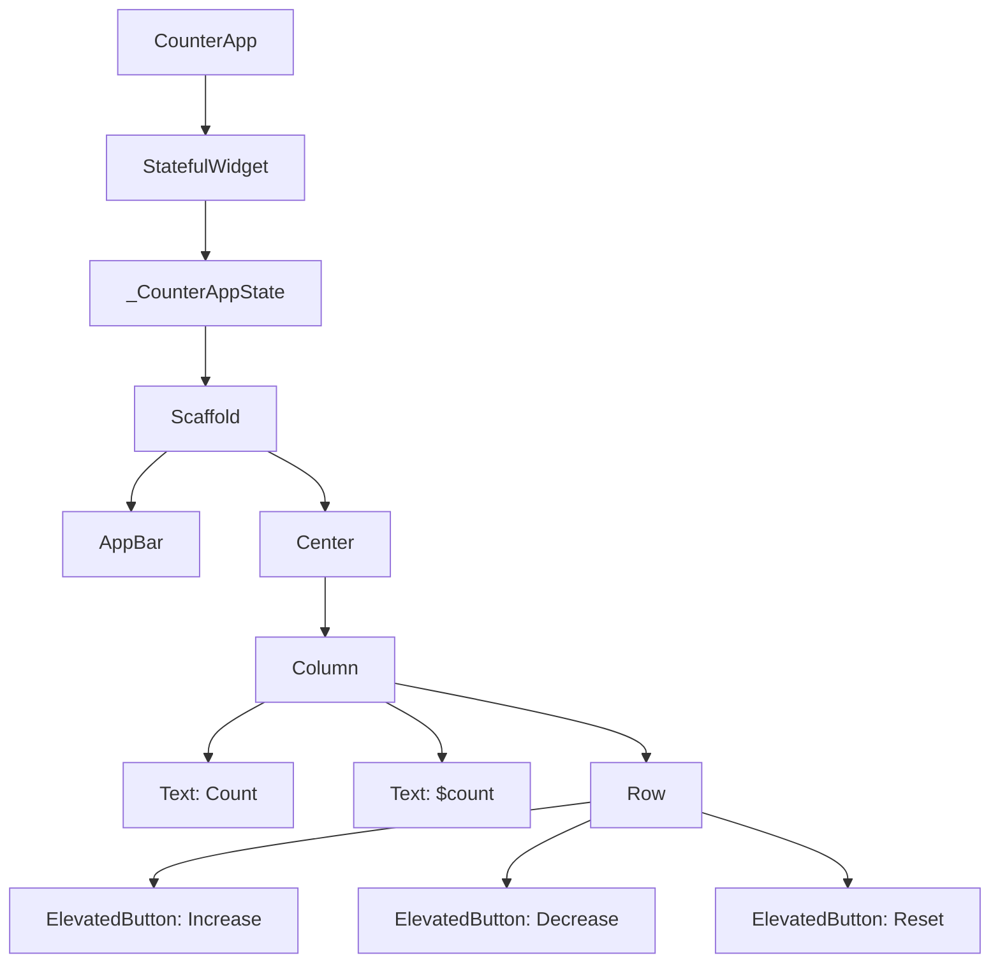

## 9.2.4 Mini Project: Counter App

Welcome to the exciting world of Flutter state management! In this mini-project, we'll guide you through creating a simple yet powerful counter app. This app will help you understand how to manage state in Flutter using `StatefulWidget` and `setState`. By the end of this project, you'll have a fun app that displays a number on the screen and allows you to increase or decrease it with the click of a button.

### Project Overview

Our counter app will have a number displayed prominently on the screen. You'll be able to increase or decrease this number using buttons. We'll also add a reset button to set the count back to zero. This project will teach you how to update the user interface dynamically as the app's state changes.

### Step-by-Step Instructions

#### 1. Setting Up the Project

First, let's create a new Flutter project. Open your terminal or command prompt and run the following command:

```bash
flutter create counter_app
```

Navigate into the project directory:

```bash
cd counter_app
```

Open the project in your preferred code editor.

#### 2. Creating the Counter Widget

Now, let's create the main widget for our app. Replace the contents of `lib/main.dart` with the following code:

```dart
import 'package:flutter/material.dart';

class CounterApp extends StatefulWidget {
  @override
  _CounterAppState createState() => _CounterAppState();
}

class _CounterAppState extends State<CounterApp> {
  int count = 0;

  void increment() {
    setState(() {
      count++;
    });
  }

  void decrement() {
    setState(() {
      count--;
    });
  }

  void reset() {
    setState(() {
      count = 0;
    });
  }

  @override
  Widget build(BuildContext context) {
    return Scaffold(
      appBar: AppBar(
        title: Text('Counter App'),
      ),
      body: Center(
        child: Column(
          mainAxisAlignment: MainAxisAlignment.center,
          children: [
            Text(
              'Count:',
              style: TextStyle(fontSize: 24),
            ),
            Text(
              '$count',
              style: TextStyle(fontSize: 48, fontWeight: FontWeight.bold),
            ),
            SizedBox(height: 20),
            Row(
              mainAxisAlignment: MainAxisAlignment.center,
              children: [
                ElevatedButton(
                  onPressed: increment,
                  child: Text('Increase'),
                ),
                SizedBox(width: 20),
                ElevatedButton(
                  onPressed: decrement,
                  child: Text('Decrease'),
                ),
                SizedBox(width: 20),
                ElevatedButton(
                  onPressed: reset,
                  child: Text('Reset'),
                ),
              ],
            ),
          ],
        ),
      ),
    );
  }
}

void main() => runApp(MaterialApp(
      home: CounterApp(),
    ));
```

#### 3. Running the App

To see your app in action, run the following command in your terminal:

```bash
flutter run
```

This will launch the app on an emulator or connected device. Try pressing the "Increase" and "Decrease" buttons to see the count change. The "Reset" button will set the count back to zero.

#### 4. Enhancing the App

Let's make our app even more exciting with a few enhancements:

- **Styling Buttons:** You can customize the buttons by changing their colors or shapes. For example, you can make the "Increase" button green and the "Decrease" button red to visually distinguish their functions.

- **Add Animations:** Introduce simple animations to make the count change more visually appealing. You can use Flutter's built-in animation widgets to achieve this.

Here's how you can style the buttons:

```dart
ElevatedButton(
  style: ElevatedButton.styleFrom(
    primary: Colors.green, // Background color
  ),
  onPressed: increment,
  child: Text('Increase'),
),
```

#### 5. Testing and Debugging

It's important to test your app thoroughly. Make sure all buttons work as expected and the UI updates correctly. If you encounter any issues, use Flutter's debugging tools to identify and fix them.

### Complete Code Example

Here's the complete code for your counter app, including enhancements:

```dart
import 'package:flutter/material.dart';

class CounterApp extends StatefulWidget {
  @override
  _CounterAppState createState() => _CounterAppState();
}

class _CounterAppState extends State<CounterApp> {
  int count = 0;

  void increment() {
    setState(() {
      count++;
    });
  }

  void decrement() {
    setState(() {
      count--;
    });
  }

  void reset() {
    setState(() {
      count = 0;
    });
  }

  @override
  Widget build(BuildContext context) {
    return Scaffold(
      appBar: AppBar(
        title: Text('Counter App'),
      ),
      body: Center(
        child: Column(
          mainAxisAlignment: MainAxisAlignment.center,
          children: [
            Text(
              'Count:',
              style: TextStyle(fontSize: 24),
            ),
            Text(
              '$count',
              style: TextStyle(fontSize: 48, fontWeight: FontWeight.bold),
            ),
            SizedBox(height: 20),
            Row(
              mainAxisAlignment: MainAxisAlignment.center,
              children: [
                ElevatedButton(
                  style: ElevatedButton.styleFrom(
                    primary: Colors.green,
                  ),
                  onPressed: increment,
                  child: Text('Increase'),
                ),
                SizedBox(width: 20),
                ElevatedButton(
                  style: ElevatedButton.styleFrom(
                    primary: Colors.red,
                  ),
                  onPressed: decrement,
                  child: Text('Decrease'),
                ),
                SizedBox(width: 20),
                ElevatedButton(
                  onPressed: reset,
                  child: Text('Reset'),
                ),
              ],
            ),
          ],
        ),
      ),
    );
  }
}

void main() => runApp(MaterialApp(
      home: CounterApp(),
    ));
```

### Interactive Exercise

Now it's your turn to get creative! Here are some ideas to customize your counter app:

- **History Log:** Keep a log of all the counts and display them in a list.
- **Persistent State:** Save the count so it remains the same even after closing and reopening the app.
- **Sound Effects:** Add sounds when buttons are pressed to make the app more interactive.

### Visual Aids

Below is a simple diagram showing the structure of your counter app:



This diagram illustrates how the different components of your app are connected.

## Quiz Time!



### What is the main purpose of the `setState` method in Flutter?

- [x] To update the UI when the state changes
- [ ] To initialize the app
- [ ] To close the app
- [ ] To create a new widget

> **Explanation:** The `setState` method is used to notify the framework that the internal state of the widget has changed, prompting a rebuild of the UI.

### Which widget is used to manage state in the counter app?

- [ ] StatelessWidget
- [x] StatefulWidget
- [ ] InheritedWidget
- [ ] Provider

> **Explanation:** The `StatefulWidget` is used to manage state because it allows the UI to change dynamically in response to user interactions.

### What does the `increment` function do in the counter app?

- [x] Increases the count by 1
- [ ] Decreases the count by 1
- [ ] Resets the count to 0
- [ ] Displays a message

> **Explanation:** The `increment` function increases the count by 1 each time it is called.

### How can you customize the appearance of buttons in Flutter?

- [x] Using the `style` property of `ElevatedButton`
- [ ] By changing the `Text` widget
- [ ] By modifying the `Scaffold`
- [ ] By using `setState`

> **Explanation:** The `style` property of `ElevatedButton` allows you to customize the button's appearance, such as its color and shape.

### What is the role of the `main` function in a Flutter app?

- [x] It serves as the entry point of the app
- [ ] It updates the UI
- [ ] It manages state
- [ ] It handles user input

> **Explanation:** The `main` function is the entry point of a Flutter app, where the app starts executing.

### Which method is used to reset the count to zero in the counter app?

- [x] `reset`
- [ ] `increment`
- [ ] `decrement`
- [ ] `initialize`

> **Explanation:** The `reset` method is specifically designed to set the count back to zero.

### What is the purpose of the `Scaffold` widget in Flutter?

- [x] To provide a basic structure for the app's visual interface
- [ ] To manage state
- [ ] To handle animations
- [ ] To fetch data from the internet

> **Explanation:** The `Scaffold` widget provides a basic structure for the app's visual interface, including an app bar, body, and other elements.

### How can you run a Flutter app on an emulator or device?

- [x] By using the `flutter run` command
- [ ] By clicking a button in the code editor
- [ ] By opening the app manually
- [ ] By using the `flutter build` command

> **Explanation:** The `flutter run` command is used to launch the app on an emulator or connected device.

### What is the function of the `Column` widget in the counter app?

- [x] To arrange widgets vertically
- [ ] To arrange widgets horizontally
- [ ] To manage state
- [ ] To handle user input

> **Explanation:** The `Column` widget arranges its children vertically, one below the other.

### True or False: The `setState` method can be used in a `StatelessWidget`.

- [ ] True
- [x] False

> **Explanation:** The `setState` method is not available in a `StatelessWidget` because it does not manage state. It is used in `StatefulWidget` to update the UI when the state changes.


