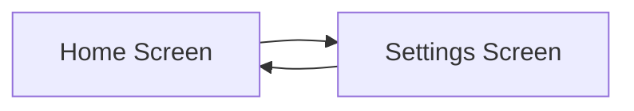

---

linkTitle: "9.3.1 Multiple Screens"
title: "Mastering Multiple Screens in Flutter Apps"
description: "Learn how to create and navigate between multiple screens in Flutter apps, enhancing user experience and app organization."
categories:
- Flutter Development
- Mobile App Design
- Educational Technology
tags:
- Flutter
- Mobile Development
- Navigation
- User Interface
- App Design
date: 2024-10-25
type: docs
nav_weight: 9310

canonical: "https://fluttermasterylibrary.com/5/9/3/1"
license: "© 2023 Tokenizer Inc. CC BY-NC-SA 4.0"
---

## 9.3.1 Multiple Screens

In the world of mobile app development, creating a seamless user experience is key. One of the most effective ways to achieve this is by organizing your app into multiple screens. This not only helps in structuring the app's content but also enhances its functionality and usability. In this section, we'll explore how to implement multiple screens in a Flutter app, using tools like the `Navigator` and `MaterialPageRoute` widgets.

### Why Multiple Screens?

Imagine using an app where everything is crammed onto a single screen. It would be overwhelming and confusing, right? Multiple screens allow us to break down the app into manageable sections, each serving a specific purpose. This organization makes it easier for users to find what they need and interact with the app more effectively.

#### Example Scenario: A Simple App with Home and Settings Screens

Let's consider a simple app with two screens: a Home Screen and a Settings Screen. The Home Screen is where users start, and from there, they can navigate to the Settings Screen to adjust their preferences.

### Introducing the Navigator and MaterialPageRoute Widgets

In Flutter, navigation between screens is handled by the `Navigator` widget, which works like a stack of pages. You can push a new page onto the stack to navigate to it, or pop the current page off the stack to go back to the previous one. The `MaterialPageRoute` widget is used to define the transition between screens.

Here's a basic example of how you can set up navigation between two screens:

```dart
import 'package:flutter/material.dart';

void main() => runApp(MyApp());

class MyApp extends StatelessWidget {
  @override
  Widget build(BuildContext context) {
    return MaterialApp(
      title: 'Flutter Demo',
      home: HomeScreen(),
    );
  }
}

class HomeScreen extends StatelessWidget {
  @override
  Widget build(BuildContext context) {
    return Scaffold(
      appBar: AppBar(
        title: Text('Home Screen'),
      ),
      body: Center(
        child: ElevatedButton(
          onPressed: () {
            Navigator.push(
              context,
              MaterialPageRoute(builder: (context) => SettingsScreen()),
            );
          },
          child: Text('Go to Settings'),
        ),
      ),
    );
  }
}

class SettingsScreen extends StatelessWidget {
  @override
  Widget build(BuildContext context) {
    return Scaffold(
      appBar: AppBar(
        title: Text('Settings Screen'),
      ),
      body: Center(
        child: ElevatedButton(
          onPressed: () {
            Navigator.pop(context);
          },
          child: Text('Back to Home'),
        ),
      ),
    );
  }
}
```

### Understanding the Code

- **HomeScreen:** This is the initial screen of the app. It contains a button that, when pressed, navigates to the Settings Screen.
- **SettingsScreen:** This screen is accessed from the Home Screen. It also contains a button to navigate back to the Home Screen.
- **Navigator.push:** This method is used to navigate to a new screen. It takes the current context and a `MaterialPageRoute` that defines the new screen.
- **Navigator.pop:** This method is used to return to the previous screen.

### Visualizing Screen Transitions

To better understand how navigation works, let's visualize the transition between the Home Screen and the Settings Screen using a flowchart:



This flowchart illustrates the bidirectional navigation between the two screens, highlighting how users can move back and forth seamlessly.

### Interactive Exercise

Think of an app you use regularly. Can you identify the different screens it has? Consider how these screens are organized and how you navigate between them. This exercise will help you appreciate the importance of screen organization in app design.

### Visual Aids

Below is an illustration showing two different screens with arrows indicating the navigation paths:

- **Home Screen:** A welcoming interface with a button labeled "Go to Settings."
- **Settings Screen:** A configuration interface with a button labeled "Back to Home."

These visual aids help reinforce the concept of navigation paths and screen transitions.

### Best Practices for Multiple Screens

- **Consistent Navigation:** Ensure that navigation paths are intuitive and consistent throughout the app.
- **Clear Labels:** Use clear and descriptive labels for buttons and navigation elements to guide users effectively.
- **Smooth Transitions:** Implement smooth transitions between screens to enhance the user experience.

### Common Pitfalls and Challenges

- **Complex Navigation:** Avoid overly complex navigation structures that can confuse users.
- **State Management:** Ensure that the app's state is managed correctly when navigating between screens to prevent data loss or inconsistency.

### Encouraging Hands-On Practice

Try modifying the example code to add a third screen, such as a Profile Screen. Implement navigation paths from the Home Screen to the Profile Screen and back. This exercise will deepen your understanding of multiple screens and navigation in Flutter.

## Quiz Time!



### Why are multiple screens important in an app?

- [x] They help organize content and enhance usability.
- [ ] They make the app look more complex.
- [ ] They are required by all app stores.
- [ ] They increase the app's loading time.

> **Explanation:** Multiple screens help organize an app's content, making it easier for users to navigate and use the app effectively.

### What widget is used to navigate between screens in Flutter?

- [x] Navigator
- [ ] Container
- [ ] ListView
- [ ] Column

> **Explanation:** The `Navigator` widget is used to manage navigation between screens in a Flutter app.

### What method is used to navigate to a new screen?

- [x] Navigator.push
- [ ] Navigator.pop
- [ ] Navigator.add
- [ ] Navigator.remove

> **Explanation:** `Navigator.push` is used to navigate to a new screen by adding it to the navigation stack.

### What method is used to return to the previous screen?

- [x] Navigator.pop
- [ ] Navigator.push
- [ ] Navigator.add
- [ ] Navigator.remove

> **Explanation:** `Navigator.pop` is used to return to the previous screen by removing the current screen from the navigation stack.

### Which widget is used to define the transition between screens?

- [x] MaterialPageRoute
- [ ] Scaffold
- [ ] AppBar
- [ ] Text

> **Explanation:** `MaterialPageRoute` is used to define the transition between screens in a Flutter app.

### What is the purpose of the `MaterialPageRoute` widget?

- [x] To define the transition between screens
- [ ] To style text
- [ ] To create a list
- [ ] To handle user input

> **Explanation:** `MaterialPageRoute` is used to define how one screen transitions to another in a Flutter app.

### What should you consider when designing navigation paths?

- [x] Consistency and intuitiveness
- [ ] Complexity and confusion
- [ ] Randomness and unpredictability
- [ ] Length and difficulty

> **Explanation:** Navigation paths should be consistent and intuitive to ensure a smooth user experience.

### What is a common pitfall when implementing multiple screens?

- [x] Complex navigation structures
- [ ] Simple navigation paths
- [ ] Clear button labels
- [ ] Smooth transitions

> **Explanation:** Complex navigation structures can confuse users, so it's important to keep navigation paths simple and clear.

### How can you enhance the user experience when navigating between screens?

- [x] Implement smooth transitions
- [ ] Use abrupt changes
- [ ] Add unnecessary animations
- [ ] Increase loading times

> **Explanation:** Smooth transitions between screens enhance the user experience by providing a seamless flow.

### True or False: The `Navigator` widget works like a stack of pages.

- [x] True
- [ ] False

> **Explanation:** True. The `Navigator` widget manages a stack of pages, allowing for navigation between different screens in an app.


