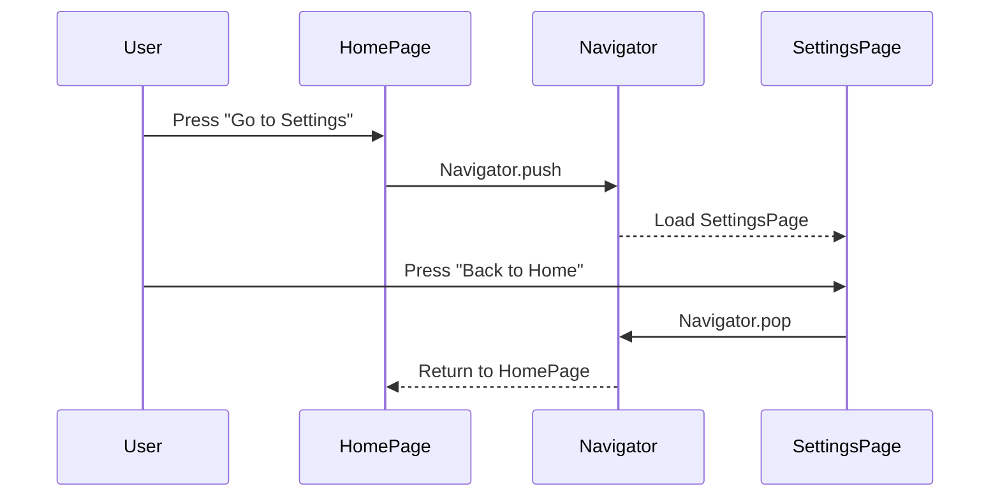

## 9.3.2 Navigation Basics

Welcome to the exciting world of app navigation! In this section, we'll explore how to move between different screens in a Flutter app using the `Navigator` widget. Understanding navigation is a crucial skill for building interactive and user-friendly apps. Let's dive in!

### Understanding the Navigator

In Flutter, the `Navigator` widget is like a guide that helps you move from one screen to another. Imagine it as a stack of screens, where you can push new screens on top or pop them off to go back. This stack-based approach allows you to manage the flow of your app efficiently.

### Using the Navigator: A Simple Example

Let's start with a basic example to see how navigation works in Flutter. We'll create two screens: a Home Page and a Settings Page. We'll use buttons to navigate between these screens.

```dart
import 'package:flutter/material.dart';

class HomePage extends StatelessWidget {
  @override
  Widget build(BuildContext context) {
    return Scaffold(
      appBar: AppBar(title: Text('Home Page')),
      body: Center(
        child: ElevatedButton(
          onPressed: () {
            Navigator.push(
              context,
              MaterialPageRoute(builder: (context) => SettingsPage()),
            );
          },
          child: Text('Go to Settings'),
        ),
      ),
    );
  }
}

class SettingsPage extends StatelessWidget {
  @override
  Widget build(BuildContext context) {
    return Scaffold(
      appBar: AppBar(title: Text('Settings Page')),
      body: Center(
        child: ElevatedButton(
          onPressed: () {
            Navigator.pop(context);
          },
          child: Text('Back to Home'),
        ),
      ),
    );
  }
}

void main() => runApp(MaterialApp(
      home: HomePage(),
    ));
```

### Breaking Down the Code

Let's take a closer look at what's happening in the code:

- **HomePage:** This is our starting screen. It has a button labeled "Go to Settings." When the button is pressed, it uses `Navigator.push` to move to the `SettingsPage`.

- **SettingsPage:** This screen has a button labeled "Back to Home." Pressing this button calls `Navigator.pop`, which removes the current screen from the stack and returns to the `HomePage`.

- **`MaterialPageRoute`:** This widget is used to define the transition animation and the target screen. It wraps the screen you want to navigate to.

### Visualizing the Navigation Flow

To better understand the navigation process, let's look at a sequence diagram that illustrates the flow of actions:



### Interactive Exercise: Adding a Third Screen

Now it's your turn to get creative! Let's add a third screen, called the Profile Page, and create navigation buttons between all three screens. Here's a challenge for you:

1. **Create a new `ProfilePage` class** similar to the `HomePage` and `SettingsPage`.
2. **Add a button on the `HomePage`** to navigate to the `ProfilePage`.
3. **Add navigation buttons on the `ProfilePage`** to go back to the `HomePage` and to the `SettingsPage`.

### Visual Aids

To help you visualize the transitions, here are some screenshots showing the navigation flow:

1. **Home Page:** The starting screen with buttons to navigate to the Settings and Profile pages.
2. **Settings Page:** A screen with a button to return to the Home Page.
3. **Profile Page:** A new screen with buttons to navigate back to the Home Page or to the Settings Page.

### Best Practices and Tips

- **Keep Navigation Simple:** Avoid creating too many nested routes, as this can confuse users.
- **Consistent Navigation:** Ensure that navigation buttons are clearly labeled and placed consistently across screens.
- **Use Back Navigation:** Always provide a way for users to return to the previous screen.

### Common Pitfalls

- **Forgetting to Pop:** Always remember to use `Navigator.pop` to return to the previous screen, or your app might get stuck on a screen.
- **Context Errors:** Ensure you use the correct `BuildContext` when calling `Navigator.push` or `Navigator.pop`.

### Conclusion

Congratulations! You've learned how to navigate between screens in Flutter using the `Navigator` widget. This skill is essential for creating dynamic and interactive apps. Keep practicing by adding more screens and experimenting with different navigation flows.

## Quiz Time!



### What does the `Navigator` widget manage in a Flutter app?

- [x] A stack of routes (screens)
- [ ] A list of widgets
- [ ] A database of user data
- [ ] A collection of images

> **Explanation:** The `Navigator` widget manages a stack of routes (screens) in a Flutter app, allowing you to push new screens onto the stack or pop them off to return to previous screens.

### Which method is used to navigate to a new screen in Flutter?

- [x] Navigator.push
- [ ] Navigator.add
- [ ] Navigator.forward
- [ ] Navigator.next

> **Explanation:** `Navigator.push` is used to navigate to a new screen in Flutter by adding a new route to the stack.

### What does the `Navigator.pop` method do?

- [x] Removes the current screen from the stack
- [ ] Adds a new screen to the stack
- [ ] Refreshes the current screen
- [ ] Closes the app

> **Explanation:** `Navigator.pop` removes the current screen from the stack, returning to the previous screen.

### What is the purpose of `MaterialPageRoute` in navigation?

- [x] It defines the transition animation and the target screen
- [ ] It stores user preferences
- [ ] It manages app settings
- [ ] It handles network requests

> **Explanation:** `MaterialPageRoute` is used to define the transition animation and the target screen when navigating between screens.

### In the provided code example, what happens when the "Go to Settings" button is pressed?

- [x] The app navigates to the SettingsPage
- [ ] The app closes
- [ ] The app refreshes the HomePage
- [ ] The app displays an error message

> **Explanation:** When the "Go to Settings" button is pressed, the app navigates to the `SettingsPage` using `Navigator.push`.

### What should you do to return to the HomePage from the SettingsPage?

- [x] Use Navigator.pop(context)
- [ ] Use Navigator.push(context, HomePage())
- [ ] Use Navigator.replace(context, HomePage())
- [ ] Use Navigator.clear(context)

> **Explanation:** To return to the HomePage from the SettingsPage, you should use `Navigator.pop(context)` to remove the current screen from the stack.

### What is a common mistake when using navigation in Flutter?

- [x] Forgetting to use Navigator.pop to return to the previous screen
- [ ] Using too many widgets
- [ ] Not using enough colors
- [ ] Overloading the app with images

> **Explanation:** A common mistake is forgetting to use `Navigator.pop` to return to the previous screen, which can cause the app to get stuck on a screen.

### How can you visualize the navigation flow in an app?

- [x] Using a sequence diagram
- [ ] Using a pie chart
- [ ] Using a bar graph
- [ ] Using a scatter plot

> **Explanation:** A sequence diagram is a great way to visualize the navigation flow in an app, showing the interactions between screens and the user.

### What is the benefit of using consistent navigation buttons across screens?

- [x] It improves user experience by making navigation intuitive
- [ ] It increases app loading time
- [ ] It reduces app functionality
- [ ] It complicates the app design

> **Explanation:** Consistent navigation buttons across screens improve user experience by making navigation intuitive and easy to follow.

### True or False: The `Navigator` widget can only manage two screens at a time.

- [ ] True
- [x] False

> **Explanation:** False. The `Navigator` widget can manage multiple screens in a stack, allowing for complex navigation flows in an app.


