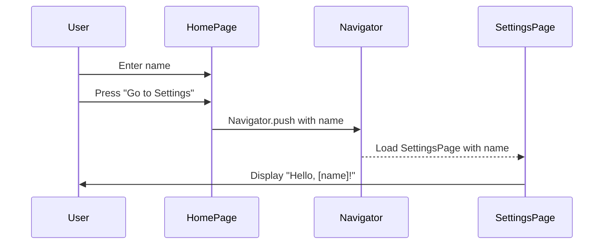

## 9.3.3 Passing Data Between Screens

In this section, we will explore how to pass data between screens in a Flutter app. This is a crucial skill that allows your apps to be dynamic and interactive, enabling different parts of your app to communicate with each other. Let's dive in!

### Why Pass Data?

Passing data between screens is essential for creating apps that respond to user inputs and preferences. Imagine an app where you enter your name on one screen, and it greets you personally on another. This interaction is possible by passing data between screens.

### Example Scenario

Let's create a simple app with two screens: a Home Page and a Settings Page. On the Home Page, users can enter their name. When they navigate to the Settings Page, the app will display a personalized greeting using the entered name.

### Code Example

Here's a step-by-step guide to building this app:

```dart
import 'package:flutter/material.dart';

class HomePage extends StatefulWidget {
  @override
  _HomePageState createState() => _HomePageState();
}

class _HomePageState extends State<HomePage> {
  final TextEditingController _controller = TextEditingController();

  @override
  Widget build(BuildContext context) {
    return Scaffold(
      appBar: AppBar(title: Text('Home Page')),
      body: Padding(
        padding: EdgeInsets.all(16.0),
        child: Column(
          children: [
            TextField(
              controller: _controller,
              decoration: InputDecoration(labelText: 'Enter your name'),
            ),
            SizedBox(height: 20),
            ElevatedButton(
              onPressed: () {
                Navigator.push(
                  context,
                  MaterialPageRoute(
                    builder: (context) => SettingsPage(name: _controller.text),
                  ),
                );
              },
              child: Text('Go to Settings'),
            ),
          ],
        ),
      ),
    );
  }
}

class SettingsPage extends StatelessWidget {
  final String name;

  SettingsPage({required this.name});

  @override
  Widget build(BuildContext context) {
    return Scaffold(
      appBar: AppBar(title: Text('Settings Page')),
      body: Center(
        child: Text(
          'Hello, $name!',
          style: TextStyle(fontSize: 24),
        ),
      ),
    );
  }
}

void main() => runApp(MaterialApp(
      home: HomePage(),
    ));
```

### Breaking Down the Code

#### HomePage

- **TextField**: Captures user input. The `TextEditingController` is used to retrieve the text entered by the user.
- **ElevatedButton**: When pressed, it uses `Navigator.push` to transition to the `SettingsPage`, passing the entered name as an argument.

#### SettingsPage

- **Constructor**: Receives the `name` as a parameter and displays it in a `Text` widget, creating a personalized greeting.

### Visualizing Data Flow

To better understand how data flows between screens, let's look at a sequence diagram:



### Interactive Exercise

Now it's your turn! Try modifying the app to pass and display additional data, such as age or favorite color. This exercise will help reinforce your understanding of passing data between screens.

### Visual Aids

Below are annotated screenshots to help you visualize the process:

- **Home Screen**: Shows a text field where users enter their name.
- **Settings Screen**: Displays a personalized greeting using the entered name.

### Best Practices

- **Keep It Simple**: Start with small pieces of data and gradually increase complexity as you become more comfortable.
- **Use Clear Names**: Name your variables and functions clearly to make your code easy to understand.
- **Test Thoroughly**: Ensure that data is passed correctly and that the app behaves as expected.

### Common Pitfalls

- **Forgetting to Pass Data**: Ensure that you pass the necessary data when navigating between screens.
- **Incorrect Data Types**: Make sure the data types match between the sending and receiving screens.

### Conclusion

Passing data between screens is a fundamental skill in Flutter development. It allows you to create interactive and personalized experiences for users. By practicing this skill, you'll be able to build more complex and engaging apps.

## Quiz Time!



### Why is passing data between screens important?

- [x] It allows screens to share information, making apps dynamic.
- [ ] It makes the app look more colorful.
- [ ] It reduces the app's file size.
- [ ] It speeds up the app's loading time.

> **Explanation:** Passing data between screens allows different parts of an app to communicate, making the app more interactive and responsive to user inputs.

### What does the `TextEditingController` do in the HomePage?

- [x] It captures and retrieves text input from the user.
- [ ] It styles the text field.
- [ ] It navigates to the next screen.
- [ ] It displays a greeting message.

> **Explanation:** The `TextEditingController` is used to capture and retrieve the text entered by the user in the text field.

### How is data passed to the SettingsPage?

- [x] Through the constructor of the SettingsPage.
- [ ] By using a global variable.
- [ ] By saving it to a file.
- [ ] By sending it over the internet.

> **Explanation:** Data is passed to the SettingsPage through its constructor, which receives the data as a parameter.

### What does the `Navigator.push` function do?

- [x] It navigates to a new screen.
- [ ] It closes the current screen.
- [ ] It saves data to the database.
- [ ] It refreshes the current screen.

> **Explanation:** `Navigator.push` is used to navigate to a new screen, optionally passing data to it.

### In the sequence diagram, what happens after the user presses "Go to Settings"?

- [x] The HomePage uses Navigator to push the SettingsPage with the name.
- [ ] The app closes.
- [ ] The HomePage displays an error.
- [ ] The SettingsPage is deleted.

> **Explanation:** After the user presses "Go to Settings," the HomePage uses `Navigator.push` to transition to the SettingsPage, passing the entered name.

### What is a common pitfall when passing data between screens?

- [x] Forgetting to pass the necessary data.
- [ ] Using too many colors.
- [ ] Not having enough buttons.
- [ ] Making the app too fast.

> **Explanation:** A common pitfall is forgetting to pass the necessary data, which can lead to errors or unexpected behavior.

### What is the role of the `SettingsPage` in this example?

- [x] To display a personalized greeting using the passed name.
- [ ] To capture user input.
- [ ] To navigate to another screen.
- [ ] To store data in a database.

> **Explanation:** The `SettingsPage` receives the name passed from the HomePage and displays it in a personalized greeting.

### What should you do if the data types don't match between screens?

- [x] Ensure that the data types match and are compatible.
- [ ] Ignore the mismatch.
- [ ] Delete the data.
- [ ] Restart the app.

> **Explanation:** It's important to ensure that the data types match between screens to avoid errors and ensure smooth data transfer.

### What is the benefit of using clear variable names?

- [x] It makes the code easier to understand and maintain.
- [ ] It makes the app run faster.
- [ ] It reduces the app's size.
- [ ] It increases the app's security.

> **Explanation:** Using clear variable names helps make the code more readable and maintainable, which is important for collaboration and debugging.

### True or False: Passing data between screens is only useful for large apps.

- [ ] True
- [x] False

> **Explanation:** Passing data between screens is useful for apps of all sizes, as it allows for dynamic and interactive user experiences.


