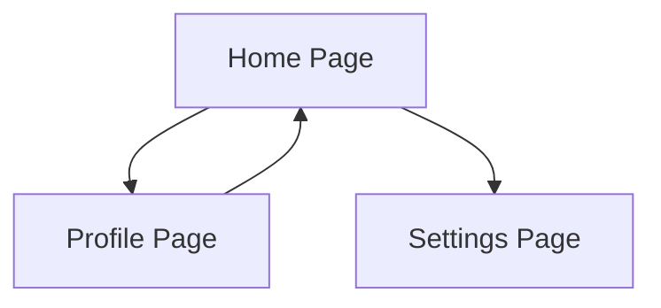

## 9.3.4 Mini Project: Multi-Page App

Welcome to an exciting project where we'll build a multi-page app using Flutter! This project will help you understand how to navigate between different screens and pass data in a Flutter application. Let's dive into creating a simple app with three screens: Home, Profile, and Settings.

### Project Overview

In this project, you'll learn how to:

- Create multiple screens in a Flutter app.
- Navigate between these screens using Flutter's navigation system.
- Pass data from one screen to another.
- Enhance your app with additional features and styling.

By the end of this project, you'll have a fully functional multi-page app that you can showcase to your friends and family!

### Step-by-Step Instructions

#### 1. Setting Up the Project

First, let's create a new Flutter project. Open your terminal or command prompt and run the following command:

```bash
flutter create multi_page_app
```

Navigate into your project directory:

```bash
cd multi_page_app
```

Open the project in your favorite code editor.

#### 2. Creating the Home Screen

Let's start by creating the Home screen. This screen will have a text field for the user to enter their name and buttons to navigate to the Profile and Settings screens.

```dart
import 'package:flutter/material.dart';

class HomePage extends StatefulWidget {
  @override
  _HomePageState createState() => _HomePageState();
}

class _HomePageState extends State<HomePage> {
  final TextEditingController _nameController = TextEditingController();

  @override
  Widget build(BuildContext context) {
    return Scaffold(
      appBar: AppBar(title: Text('Home Page')),
      body: Padding(
        padding: EdgeInsets.all(16.0),
        child: Column(
          children: [
            TextField(
              controller: _nameController,
              decoration: InputDecoration(labelText: 'Enter your name'),
            ),
            SizedBox(height: 20),
            ElevatedButton(
              onPressed: () {
                Navigator.push(
                  context,
                  MaterialPageRoute(
                    builder: (context) => ProfilePage(name: _nameController.text),
                  ),
                );
              },
              child: Text('Go to Profile'),
            ),
            ElevatedButton(
              onPressed: () {
                Navigator.push(
                  context,
                  MaterialPageRoute(
                    builder: (context) => SettingsPage(),
                  ),
                );
              },
              child: Text('Go to Settings'),
            ),
          ],
        ),
      ),
    );
  }
}
```

#### 3. Creating the Profile Screen

Next, let's create the Profile screen. This screen will display a welcome message using the name entered on the Home screen.

```dart
class ProfilePage extends StatelessWidget {
  final String name;

  ProfilePage({required this.name});

  @override
  Widget build(BuildContext context) {
    return Scaffold(
      appBar: AppBar(title: Text('Profile Page')),
      body: Center(
        child: Text(
          'Welcome, $name!',
          style: TextStyle(fontSize: 24),
        ),
      ),
    );
  }
}
```

#### 4. Creating the Settings Screen

Now, let's create the Settings screen. This screen will display a simple message indicating that settings will be available soon.

```dart
class SettingsPage extends StatelessWidget {
  @override
  Widget build(BuildContext context) {
    return Scaffold(
      appBar: AppBar(title: Text('Settings Page')),
      body: Center(
        child: Text(
          'Settings will be available soon!',
          style: TextStyle(fontSize: 24),
        ),
      ),
    );
  }
}
```

#### 5. Running and Testing the App

To see your app in action, run it using the following command:

```bash
flutter run
```

Navigate between the Home, Profile, and Settings screens. Ensure that the name entered on the Home screen is correctly displayed on the Profile screen.

#### 6. Enhancing the App

Let's make our app even better!

- **Add a Logout Button:** On the Profile screen, add a button that takes the user back to the Home screen.

```dart
ElevatedButton(
  onPressed: () {
    Navigator.pop(context);
  },
  child: Text('Logout'),
)
```

- **Passing More Data:** Add additional fields like age or favorite hobby on the Home screen and pass them to the Profile screen.

- **Styling the Screens:** Apply consistent styling across all screens for a cohesive look. Use Flutter's `ThemeData` to define a theme for your app.

#### 7. Debugging

Test all navigation paths thoroughly to ensure all buttons work as intended. Check that data is passed correctly between screens.

### Complete Code Example

Here's the complete code for your multi-page app:

```dart
import 'package:flutter/material.dart';

void main() {
  runApp(MyApp());
}

class MyApp extends StatelessWidget {
  @override
  Widget build(BuildContext context) {
    return MaterialApp(
      title: 'Multi-Page App',
      theme: ThemeData(
        primarySwatch: Colors.blue,
      ),
      home: HomePage(),
    );
  }
}

class HomePage extends StatefulWidget {
  @override
  _HomePageState createState() => _HomePageState();
}

class _HomePageState extends State<HomePage> {
  final TextEditingController _nameController = TextEditingController();

  @override
  Widget build(BuildContext context) {
    return Scaffold(
      appBar: AppBar(title: Text('Home Page')),
      body: Padding(
        padding: EdgeInsets.all(16.0),
        child: Column(
          children: [
            TextField(
              controller: _nameController,
              decoration: InputDecoration(labelText: 'Enter your name'),
            ),
            SizedBox(height: 20),
            ElevatedButton(
              onPressed: () {
                Navigator.push(
                  context,
                  MaterialPageRoute(
                    builder: (context) => ProfilePage(name: _nameController.text),
                  ),
                );
              },
              child: Text('Go to Profile'),
            ),
            ElevatedButton(
              onPressed: () {
                Navigator.push(
                  context,
                  MaterialPageRoute(
                    builder: (context) => SettingsPage(),
                  ),
                );
              },
              child: Text('Go to Settings'),
            ),
          ],
        ),
      ),
    );
  }
}

class ProfilePage extends StatelessWidget {
  final String name;

  ProfilePage({required this.name});

  @override
  Widget build(BuildContext context) {
    return Scaffold(
      appBar: AppBar(title: Text('Profile Page')),
      body: Center(
        child: Column(
          mainAxisAlignment: MainAxisAlignment.center,
          children: [
            Text(
              'Welcome, $name!',
              style: TextStyle(fontSize: 24),
            ),
            ElevatedButton(
              onPressed: () {
                Navigator.pop(context);
              },
              child: Text('Logout'),
            ),
          ],
        ),
      ),
    );
  }
}

class SettingsPage extends StatelessWidget {
  @override
  Widget build(BuildContext context) {
    return Scaffold(
      appBar: AppBar(title: Text('Settings Page')),
      body: Center(
        child: Text(
          'Settings will be available soon!',
          style: TextStyle(fontSize: 24),
        ),
      ),
    );
  }
}
```

### Interactive Exercise

Challenge yourself by adding another screen, such as an About Page. Create navigation pathways to and from this new screen. Think about what information you might want to display on an About Page.

### Visual Aids

Here's a diagram showing the navigation flow between screens:



This diagram illustrates how users can navigate from the Home Page to the Profile and Settings Pages and back to the Home Page from the Profile Page.

### Quiz Time!



### What is the main purpose of the multi-page app project?

- [x] To learn how to navigate between different screens in a Flutter app
- [ ] To create a game
- [ ] To learn about databases
- [ ] To build a website

> **Explanation:** The main purpose of the project is to teach navigation between screens in a Flutter app.

### What widget is used to navigate to a new screen in Flutter?

- [x] Navigator
- [ ] Container
- [ ] Column
- [ ] Row

> **Explanation:** The Navigator widget is used to manage a stack of routes and navigate between them.

### What method is used to pass data to the ProfilePage in the example?

- [x] Constructor
- [ ] Global variable
- [ ] setState
- [ ] initState

> **Explanation:** Data is passed to the ProfilePage using its constructor.

### What is the purpose of the TextEditingController in the HomePage?

- [x] To capture and manage the text input from the user
- [ ] To style the text
- [ ] To navigate between screens
- [ ] To handle button clicks

> **Explanation:** The TextEditingController is used to capture and manage user input in a text field.

### How can you navigate back to the previous screen in Flutter?

- [x] Using Navigator.pop(context)
- [ ] Using Navigator.push(context)
- [ ] Using setState
- [ ] Using a global variable

> **Explanation:** Navigator.pop(context) is used to return to the previous screen.

### What is the purpose of the ElevatedButton widget?

- [x] To create a clickable button
- [ ] To display text
- [ ] To manage state
- [ ] To create a text field

> **Explanation:** ElevatedButton is used to create a button that users can click.

### What does the Scaffold widget provide in a Flutter app?

- [x] A basic structure for the visual interface
- [ ] A way to manage state
- [ ] A method to pass data
- [ ] A tool for debugging

> **Explanation:** Scaffold provides a basic structure for the visual interface, including app bars and body content.

### What is the role of the AppBar widget in the app?

- [x] To display a title and actions at the top of the screen
- [ ] To manage navigation
- [ ] To handle user input
- [ ] To style text

> **Explanation:** AppBar is used to display a title and actions at the top of the screen.

### Which method is used to build the UI in a Flutter widget?

- [x] build
- [ ] initState
- [ ] dispose
- [ ] setState

> **Explanation:** The build method is used to construct the UI in a Flutter widget.

### True or False: The HomePage widget is a StatelessWidget.

- [ ] True
- [x] False

> **Explanation:** The HomePage widget is a StatefulWidget because it manages user input with a TextEditingController.



Congratulations on completing the Multi-Page App project! You've learned how to navigate between screens and pass data in a Flutter app. Keep experimenting and adding new features to your app. Happy coding!
