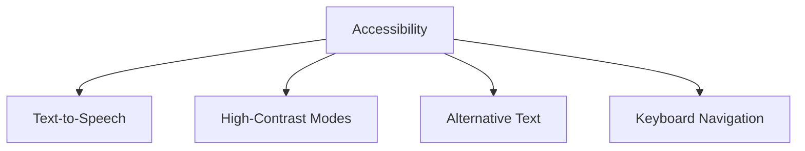

## 9.4.1 What is Accessibility?

In today's digital age, technology plays a crucial role in our daily lives. From smartphones to computers, apps help us communicate, learn, and entertain ourselves. But have you ever thought about how someone with a disability might use these apps? This is where **accessibility** comes into play. Let's explore what accessibility means and why it's essential for creating apps that everyone can use.

### What is Accessibility?

Accessibility refers to designing and developing apps so that they are usable by everyone, including people with disabilities. This means considering the diverse needs of users and ensuring that your app can be accessed and enjoyed by all, regardless of their physical or cognitive abilities.

### Why Accessibility Matters

Accessibility is not just a nice-to-have feature; it's a necessity. Here are some reasons why accessibility is crucial:

- **Inclusivity:** By making apps accessible, we ensure that everyone, including people with disabilities, can participate in the digital world. This promotes equal access and opportunities for all users.
- **Legal Requirements:** In many countries, there are laws and regulations that require digital content to be accessible. Ensuring your app meets these standards can help you avoid legal issues.
- **Better User Experience:** Accessible apps often provide a better user experience for everyone, not just those with disabilities. Features like voice commands and larger text can benefit all users.
- **Wider Audience:** By making your app accessible, you can reach a broader audience, including those who might otherwise be unable to use your app.

### Examples of Accessibility Features

Let's look at some common accessibility features that can make apps more inclusive:

#### Text-to-Speech

Text-to-speech technology reads text aloud, making it easier for visually impaired users to understand the content. This feature can be integrated into apps to provide audio descriptions of text, buttons, and other elements.

#### High-Contrast Modes

High-contrast modes enhance the visibility of text and interface elements by increasing the contrast between the background and the text. This is particularly helpful for users with vision challenges, making it easier to read and navigate the app.

#### Alternative Text

Alternative text, or alt text, provides descriptions for images. Screen readers use this text to describe images to users who cannot see them. Including alt text ensures that visually impaired users can understand the visual content in your app.

#### Keyboard Navigation

Keyboard navigation allows users to navigate through an app using a keyboard instead of a mouse. This feature is essential for users with motor disabilities who may find it challenging to use a mouse or touchscreen.

### Visualizing Accessibility Features

To better understand the components of accessible design, let's look at a diagram that illustrates some key features:

### Interactive Exercise

Think about a specific disability, such as visual impairment or mobility challenges. What features would help someone with this disability use an app? List at least three features and consider how they would improve the user's experience.

### Visual Aids

Imagine a user navigating an app with a screen reader or using high-contrast settings. Visual aids can help illustrate these scenarios, showing how accessibility features work in real life. For example, you might depict a person using a screen reader to listen to text or adjusting the contrast settings on their device.

### Conclusion

Accessibility is a vital aspect of app development that ensures everyone can enjoy and benefit from technology. By incorporating accessibility features into your apps, you not only comply with legal standards but also create a more inclusive and user-friendly experience for all. As you continue your coding journey, remember to think about how your apps can be accessible to everyone, regardless of their abilities.

## Quiz Time!



### What is accessibility in the context of app development?

- [x] Designing apps so that everyone, including people with disabilities, can use them easily.
- [ ] Making apps faster and more efficient.
- [ ] Adding more features to an app.
- [ ] Ensuring apps are visually appealing.

> **Explanation:** Accessibility in app development means creating apps that are usable by everyone, including people with disabilities, ensuring inclusivity and equal access.

### Why is accessibility important?

- [x] It ensures all users can interact with apps, promoting inclusivity and equal access.
- [ ] It makes apps more colorful.
- [ ] It reduces the cost of app development.
- [ ] It increases the number of features in an app.

> **Explanation:** Accessibility is important because it ensures that all users, regardless of their abilities, can use and benefit from apps, promoting inclusivity and equal access.

### Which feature helps visually impaired users by reading text aloud?

- [x] Text-to-Speech
- [ ] High-Contrast Modes
- [ ] Alternative Text
- [ ] Keyboard Navigation

> **Explanation:** Text-to-Speech technology reads text aloud, making it easier for visually impaired users to understand the content.

### What does high-contrast mode do?

- [x] Increases the contrast between the background and text to enhance visibility.
- [ ] Changes the app's color scheme to black and white.
- [ ] Makes the text larger.
- [ ] Speaks the text aloud.

> **Explanation:** High-contrast mode increases the contrast between the background and text, making it easier for users with vision challenges to read and navigate the app.

### What is the purpose of alternative text?

- [x] To provide descriptions for images for screen readers.
- [ ] To make text larger.
- [ ] To change the app's color scheme.
- [ ] To allow keyboard navigation.

> **Explanation:** Alternative text provides descriptions for images, allowing screen readers to convey visual content to visually impaired users.

### Which feature allows users to navigate an app using a keyboard?

- [x] Keyboard Navigation
- [ ] Text-to-Speech
- [ ] High-Contrast Modes
- [ ] Alternative Text

> **Explanation:** Keyboard navigation allows users to navigate through an app using a keyboard, which is essential for users with motor disabilities.

### How does accessibility benefit all users, not just those with disabilities?

- [x] It often provides a better user experience for everyone.
- [ ] It makes apps more expensive.
- [ ] It limits the app's features.
- [ ] It reduces the app's speed.

> **Explanation:** Accessibility features like voice commands and larger text can benefit all users, providing a better overall user experience.

### What is a legal reason to make apps accessible?

- [x] Many countries have laws requiring digital content to be accessible.
- [ ] It makes apps more colorful.
- [ ] It reduces the cost of app development.
- [ ] It increases the number of features in an app.

> **Explanation:** Many countries have laws and regulations that require digital content to be accessible, ensuring compliance and avoiding legal issues.

### Which of the following is NOT an accessibility feature?

- [ ] Text-to-Speech
- [ ] High-Contrast Modes
- [ ] Alternative Text
- [x] Faster Processing Speed

> **Explanation:** Faster processing speed is not an accessibility feature. Accessibility features focus on making apps usable for everyone, including people with disabilities.

### True or False: Accessibility only benefits people with disabilities.

- [ ] True
- [x] False

> **Explanation:** False. Accessibility benefits all users by providing a better user experience and ensuring inclusivity and equal access for everyone.


