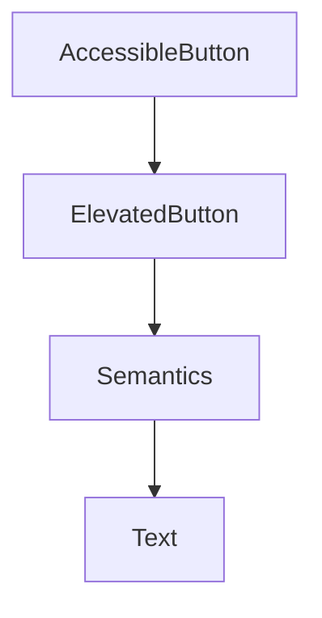

## 9.4.2 Making Apps User-Friendly

Creating apps that are easy to use for everyone is an important part of being a thoughtful and effective developer. In this section, we'll explore how to make your Flutter apps user-friendly by considering accessibility principles. This means designing apps that can be used by people with different abilities and needs. Let's dive into some key concepts and practical steps to ensure your app is accessible to all users.

### Simple and Clear Design

A simple and clear design is the foundation of an accessible app. Here are some tips to achieve this:

- **Straightforward Layouts:** Use clean and organized layouts. Avoid clutter by only including essential elements on each screen. This helps users focus on the main tasks without getting overwhelmed.

- **Avoiding Clutter:** Keep the interface tidy by using whitespace effectively. This makes it easier for users to navigate and find what they need.

- **Logical Flow:** Arrange elements in a logical order that guides the user naturally through the app. This helps users understand how to interact with your app intuitively.

### Readable Fonts

Readable fonts are crucial for users with visual impairments. Consider the following:

- **Large, Clear Fonts:** Use fonts that are easy to read. A font size of at least 16 pixels is recommended for body text. Ensure that headings and important information are even larger.

- **Sufficient Spacing:** Provide enough space between lines of text and around clickable elements to prevent accidental taps and improve readability.

### Consistent Navigation

Consistency in navigation helps users feel comfortable and confident while using your app:

- **Predictable Navigation:** Keep navigation elements like menus and buttons in the same place across different screens. This consistency helps users know where to find things.

- **Clear Labels:** Use clear and descriptive labels for buttons and links. Avoid using jargon or abbreviations that might confuse users.

### Color Choices

Color plays a significant role in accessibility:

- **Color Contrast:** Ensure there is enough contrast between text and background colors. This helps users with low vision or color blindness distinguish elements easily.

- **Avoiding Reliance on Color Alone:** Don't rely solely on color to convey information. Use text labels or icons to provide additional context.

### Accessible Widgets

Flutter provides a range of widgets that support accessibility features by default. Here's how you can enhance your app's accessibility:

- **Use of Semantics Widget:** The `Semantics` widget in Flutter allows you to provide meaningful labels for screen readers. This is especially important for users who rely on assistive technologies.

#### Example Enhancement

Let's look at an example of how to create an accessible button using the `Semantics` widget:

```dart
class AccessibleButton extends StatelessWidget {
  final String label;
  final VoidCallback onPressed;

  AccessibleButton({required this.label, required this.onPressed});

  @override
  Widget build(BuildContext context) {
    return ElevatedButton(
      onPressed: onPressed,
      child: Semantics(
        label: label,
        child: Text(
          label,
          style: TextStyle(fontSize: 18),
        ),
      ),
      style: ElevatedButton.styleFrom(
        padding: EdgeInsets.symmetric(horizontal: 24.0, vertical: 12.0),
        primary: Colors.teal,
      ),
    );
  }
}
```

**Explanation:** In this example, the `Semantics` widget is used to provide a label for the button, which can be read by screen readers. This makes the button more accessible to users with visual impairments.

### Mermaid.js Component Diagram

To better understand the structure of an accessible widget, let's visualize it using a Mermaid.js diagram:



This diagram shows how the `AccessibleButton` is composed of an `ElevatedButton`, which contains a `Semantics` widget that wraps the `Text` widget. This structure ensures that the button is both functional and accessible.

### Interactive Exercise

Now it's your turn! Take an existing button in your app and refactor it to make it more accessible. Add `Semantics` labels and adjust the styling for better readability. Here's a step-by-step guide:

1. **Identify a Button:** Choose a button in your app that could benefit from enhanced accessibility.
2. **Add Semantics:** Wrap the button's text with a `Semantics` widget and provide a meaningful label.
3. **Adjust Styling:** Ensure the font size is large enough and the color contrast is sufficient.
4. **Test with a Screen Reader:** Use a screen reader to test your app and ensure the button is announced correctly.

### Visual Aids

Let's look at some before-and-after screenshots of UI elements enhanced for accessibility:

**Before:**


**After:**


Notice how the enhanced version uses larger fonts, better color contrast, and clear labels to improve accessibility.

By following these principles and using the tools provided by Flutter, you can create apps that are not only functional but also inclusive and accessible to everyone.

## Quiz Time!



### What is a key benefit of using simple and clear design in apps?

- [x] It makes navigation easier for users.
- [ ] It allows for more features on each screen.
- [ ] It reduces the need for user testing.
- [ ] It increases the app's loading time.

> **Explanation:** Simple and clear design helps users navigate the app more easily by reducing clutter and focusing on essential elements.

### Why is it important to use readable fonts in your app?

- [x] To ensure users with visual impairments can read the text.
- [ ] To make the app look more professional.
- [ ] To reduce the app's file size.
- [ ] To increase the number of fonts used.

> **Explanation:** Readable fonts are crucial for accessibility, ensuring that users with visual impairments can read the text comfortably.

### What is the purpose of consistent navigation in an app?

- [x] To help users know where to find things across different screens.
- [ ] To add more features to the app.
- [ ] To make the app look more colorful.
- [ ] To reduce the number of screens in the app.

> **Explanation:** Consistent navigation helps users feel comfortable and confident by keeping navigation elements in the same place across different screens.

### How can you ensure color choices are accessible?

- [x] By ensuring there is enough contrast between text and background colors.
- [ ] By using as many colors as possible.
- [ ] By using only bright colors.
- [ ] By avoiding the use of color altogether.

> **Explanation:** Ensuring enough contrast between text and background colors helps users with low vision or color blindness distinguish elements easily.

### What does the `Semantics` widget do in Flutter?

- [x] It provides meaningful labels for screen readers.
- [ ] It changes the color of widgets.
- [ ] It increases the app's speed.
- [ ] It adds animations to widgets.

> **Explanation:** The `Semantics` widget provides meaningful labels for screen readers, making the app more accessible to users with visual impairments.

### Which of the following is NOT a benefit of using accessible widgets?

- [ ] They support accessibility features by default.
- [ ] They make the app more inclusive.
- [x] They reduce the app's functionality.
- [ ] They improve user experience for everyone.

> **Explanation:** Accessible widgets enhance the app's inclusivity and user experience without reducing functionality.

### What is a good practice when designing for color blindness?

- [x] Use text labels or icons in addition to color.
- [ ] Use only red and green colors.
- [ ] Avoid using any colors.
- [ ] Use as many colors as possible.

> **Explanation:** Using text labels or icons in addition to color ensures that information is conveyed even if the user cannot distinguish colors.

### How can you test the accessibility of your app?

- [x] By using a screen reader to test how elements are announced.
- [ ] By adding more colors to the app.
- [ ] By reducing the number of screens.
- [ ] By increasing the font size to the maximum.

> **Explanation:** Using a screen reader helps test how elements are announced, ensuring they are accessible to users with visual impairments.

### What should you do if a button's label is not clear?

- [x] Provide a more descriptive label using the `Semantics` widget.
- [ ] Remove the button from the app.
- [ ] Change the button's color.
- [ ] Increase the button's size.

> **Explanation:** Providing a more descriptive label using the `Semantics` widget ensures that the button is accessible and understandable.

### True or False: Accessibility only benefits users with disabilities.

- [ ] True
- [x] False

> **Explanation:** Accessibility benefits all users by improving the overall user experience and making the app easier to use for everyone.


