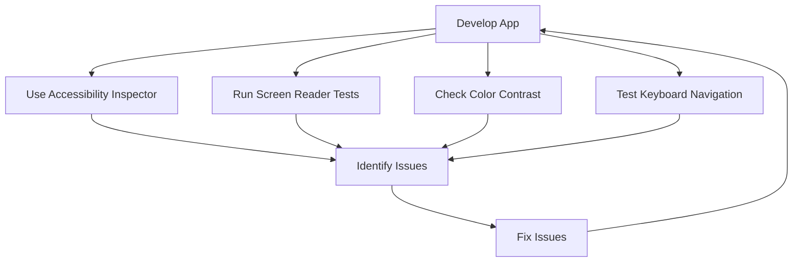

## 9.4.3 Testing for Accessibility

Creating apps that everyone can use is not just a nice-to-have feature; it's essential. Accessibility ensures that people with disabilities can interact with your app without barriers. In this section, we'll explore how to test your Flutter apps for accessibility, using tools and techniques that make your apps more inclusive.

### The Importance of Testing for Accessibility

Imagine trying to use an app but not being able to see the screen clearly, or not being able to hear the audio cues. For many people, this is a daily reality. Testing for accessibility ensures that your app is usable by everyone, regardless of their abilities. It’s about making sure everyone can enjoy and benefit from the technology you create.

### Tools for Testing Accessibility

#### Flutter’s Accessibility Inspector

Flutter provides a built-in tool called the Accessibility Inspector. This tool helps you identify accessibility issues in your app, such as missing labels or poor contrast ratios. It’s a great starting point for making your app more accessible.

#### Screen Readers

Screen readers are software programs that read the text displayed on the screen aloud. They are crucial for users who are blind or have low vision. Popular screen readers include TalkBack for Android and VoiceOver for iOS. Testing your app with these tools ensures that all elements are properly labeled and navigable.

### Basic Testing Steps

Let's walk through some basic steps to test your app's accessibility:

1. **Navigate with Screen Readers:**
   - Use a screen reader to navigate your app. Ensure that all interactive elements, like buttons and links, have descriptive labels. This helps users understand what each element does.

2. **Check Contrast Ratios:**
   - Ensure that text and background colors have sufficient contrast. This can be done using online tools or manual observation. Good contrast makes text readable for users with visual impairments.

3. **Keyboard Navigation:**
   - Test navigating your app using a keyboard or other assistive input devices. Ensure that users can move through your app without needing a mouse or touch input.

4. **Responsive Design:**
   - Check that your app looks good and functions well on different screen sizes and orientations. This ensures that users with different devices have a consistent experience.

### Visualizing the Accessibility Testing Process

Here's a flowchart to help you visualize the process of testing for accessibility:

### Example Testing Scenario

Let's walk through a simple example of testing an `AccessibleButton` in your app:

1. **Use a Screen Reader:**
   - Activate a screen reader on your device.
   - Navigate to the `AccessibleButton` in your app.
   - Listen to how the screen reader describes the button. Is it clear and descriptive?

2. **Adjust Labels:**
   - If the screen reader doesn’t provide enough information, adjust the button’s label in your code.
   - For example, instead of labeling a button as "Submit," you might use "Submit Form" to provide more context.

3. **Re-test:**
   - Run the screen reader again to ensure the changes improve the user experience.

### Interactive Exercise

Now it's your turn! Pick a widget in your app and test it using the accessibility tools we've discussed. Make improvements based on your findings. This hands-on practice will help you understand the importance of accessibility and how to implement it effectively.

### Visual Aids

Here are some screenshots of accessibility inspector tools and examples of common issues and their fixes:

- **Accessibility Inspector Screenshot:** Shows how to identify missing labels.
- **Contrast Checker Tool:** Demonstrates checking color contrast ratios.
- **Screen Reader in Action:** Illustrates how a screen reader navigates an app.

By following these steps and using these tools, you can ensure that your app is accessible to all users, providing a better experience for everyone.

## Quiz Time!



### Why is testing for accessibility important?

- [x] It ensures everyone can use the app without barriers.
- [ ] It makes the app look more colorful.
- [ ] It increases the app's download size.
- [ ] It makes the app run faster.

> **Explanation:** Testing for accessibility ensures that people with disabilities can use the app effectively, removing barriers to access.

### Which tool is built into Flutter for accessibility testing?

- [x] Accessibility Inspector
- [ ] Color Picker
- [ ] Code Formatter
- [ ] Debug Console

> **Explanation:** Flutter's Accessibility Inspector helps identify accessibility issues in your app.

### What do screen readers do?

- [x] Read text on the screen aloud
- [ ] Change the app's colors
- [ ] Speed up the app
- [ ] Translate the app into different languages

> **Explanation:** Screen readers read the text displayed on the screen aloud, helping users who are blind or have low vision.

### What should you check for when testing color contrast?

- [x] Sufficient contrast between text and background
- [ ] Matching colors with the app's logo
- [ ] Brightness of the screen
- [ ] Number of colors used

> **Explanation:** Ensuring sufficient contrast between text and background helps users with visual impairments read the text more easily.

### How can you test keyboard navigation in your app?

- [x] Use a keyboard to navigate through the app
- [ ] Use a mouse to click on elements
- [ ] Change the app's font size
- [ ] Adjust the app's volume

> **Explanation:** Testing keyboard navigation ensures that users can move through the app without needing a mouse or touch input.

### What is the purpose of responsive design in accessibility?

- [x] Ensures the app looks good on different screen sizes
- [ ] Makes the app load faster
- [ ] Reduces the app's file size
- [ ] Changes the app's language

> **Explanation:** Responsive design ensures that the app looks good and functions well on different screen sizes and orientations.

### What should you do if a screen reader doesn't provide enough information about a button?

- [x] Adjust the button's label in your code
- [ ] Change the button's color
- [ ] Remove the button
- [ ] Increase the button's size

> **Explanation:** Adjusting the button's label can provide more context and improve the user experience for screen reader users.

### What is the first step in the accessibility testing process?

- [x] Use Accessibility Inspector
- [ ] Check Color Contrast
- [ ] Test Keyboard Navigation
- [ ] Develop App

> **Explanation:** Using the Accessibility Inspector is often the first step to identify potential accessibility issues.

### Which of the following is NOT a tool for testing accessibility?

- [x] Code Formatter
- [ ] Accessibility Inspector
- [ ] Screen Reader
- [ ] Contrast Checker

> **Explanation:** A Code Formatter is not used for testing accessibility; it is used for formatting code.

### True or False: Accessibility testing is only necessary for apps used by people with disabilities.

- [ ] True
- [x] False

> **Explanation:** Accessibility testing benefits all users by ensuring a more inclusive and user-friendly experience.


