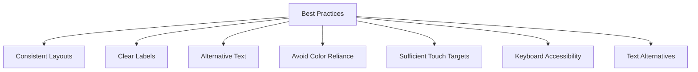

---

linkTitle: "9.4.4 Best Practices"
title: "Accessibility Best Practices for Flutter Apps"
description: "Learn essential best practices for designing and developing accessible Flutter apps, ensuring inclusivity and usability for all users."
categories:
- Flutter Development
- Accessibility
- App Design
tags:
- Flutter
- Accessibility
- App Development
- Best Practices
- Inclusive Design
date: 2024-10-25
type: docs
nav_weight: 9440

---

## 9.4.4 Best Practices

Creating accessible apps is crucial for ensuring that everyone, regardless of their abilities, can use and enjoy your applications. In this section, we'll explore some best practices for designing and developing accessible apps using Flutter. These guidelines will help you build apps that are inclusive and user-friendly for all.

### Consistent Layouts

A consistent layout is key to providing a seamless user experience. When users navigate your app, they should be able to predict where elements are located and how to interact with them. Here are some tips for maintaining consistency:

- **Use a Grid System:** Align elements to a grid to create a balanced and organized layout.
- **Repeat Patterns:** Use similar patterns for similar tasks. For example, if a button is used to submit forms, keep its style and position consistent across the app.
- **Navigation Consistency:** Ensure that navigation elements are in the same place on every screen.

### Clear Labels

Clear and descriptive labels are essential for helping users understand the purpose of buttons and other interactive elements. Here’s how to create effective labels:

- **Be Descriptive:** Instead of using generic labels like "Click Here," use specific ones like "Submit Form" or "View Profile."
- **Use Tooltips:** Provide additional information through tooltips that appear when users hover over or focus on an element.
- **Avoid Abbreviations:** Unless they are widely recognized, avoid using abbreviations that might confuse users.

### Alternative Text for Images

Alternative text (alt text) is a textual description of an image that can be read by screen readers, making your app more accessible to visually impaired users. Here’s how to use alt text effectively:

- **Describe the Image:** Provide a concise description of what the image depicts.
- **Context Matters:** Tailor the description to the context in which the image is used.
- **Avoid Redundancy:** If the image is purely decorative, you can leave the alt text empty or use an empty string (`""`).

### Avoid Reliance on Color Alone

Color is a great way to convey information, but relying solely on color can be problematic for users with color vision deficiencies. Here’s how to ensure your app is accessible:

- **Use Text Labels:** Accompany color-coded information with text labels.
- **Patterns and Textures:** Use patterns or textures in addition to color to differentiate elements.
- **Contrast Ratios:** Ensure sufficient contrast between text and background colors.

### Provide Sufficient Touch Targets

Interactive elements like buttons should be large enough to be easily tapped, especially on touch devices. Here’s how to ensure your touch targets are accessible:

- **Minimum Size:** Aim for a minimum touch target size of 44x44 pixels.
- **Spacing:** Provide enough space between touch targets to prevent accidental taps.
- **Feedback:** Offer visual or auditory feedback when a touch target is activated.

### Keyboard Accessibility

Keyboard accessibility is crucial for users who rely on keyboards or assistive devices to navigate apps. Here’s how to make your app keyboard-friendly:

- **Tab Order:** Ensure a logical tab order for navigating through interactive elements.
- **Focus Indicators:** Provide visible focus indicators for elements that can be interacted with.
- **Shortcut Keys:** Offer keyboard shortcuts for common actions.

### Text Alternatives

Providing text alternatives for non-text content ensures that all users can access the information. Here’s how to implement text alternatives:

- **Icons:** Accompany icons with text labels or tooltips.
- **Animations:** Provide descriptions or transcripts for animations that convey important information.
- **Audio Content:** Offer captions or transcripts for audio content.

### Mermaid.js Checklist Diagram

To help visualize these best practices, here’s a checklist diagram:

### Real-World Example

Consider an app like "Accessible Notes," which follows these best practices. The app uses consistent layouts, clear labels for all buttons, and provides alt text for images. It avoids relying on color alone by using text labels and patterns. The app also ensures that all interactive elements are accessible via keyboard, making it inclusive for users with different needs. This approach not only improves user experience but also broadens the app's audience.

### Interactive Exercise

Now it's your turn! Review an app you've created and check off each best practice from the list above. Make adjustments where necessary to ensure your app is as accessible as possible. This exercise will help you internalize these principles and apply them to future projects.

### Visual Aids

To further illustrate these concepts, here are some examples of good vs. poor practices:

- **Clear Labels vs. Ambiguous Labels:** Show a button labeled "Submit Form" compared to one labeled "Click Here."
- **Sufficient Touch Targets vs. Small Touch Targets:** Display a large, easy-to-tap button next to a small, difficult-to-tap one.

By following these best practices, you can create apps that are not only functional but also inclusive and enjoyable for everyone. Remember, accessibility is an ongoing process, and there's always room for improvement. Keep learning and adapting to make your apps better for all users.

## Quiz Time!



### What is the importance of consistent layouts in app design?

- [x] They help users predict where elements are located.
- [ ] They make the app look more colorful.
- [ ] They ensure the app uses less memory.
- [ ] They make the app run faster.

> **Explanation:** Consistent layouts help users navigate the app more easily by allowing them to predict where elements are located, enhancing usability.

### Why should you provide alternative text for images?

- [x] To make images accessible to visually impaired users.
- [ ] To improve the app's loading speed.
- [ ] To make the app more colorful.
- [ ] To reduce the app's size.

> **Explanation:** Alternative text provides descriptions of images that can be read by screen readers, making the app accessible to visually impaired users.

### What should you avoid when using color in app design?

- [x] Relying on color alone to convey information.
- [ ] Using bright colors.
- [ ] Using dark colors.
- [ ] Using multiple colors.

> **Explanation:** Relying on color alone can be problematic for users with color vision deficiencies. It's important to use additional indicators like text labels.

### What is the recommended minimum size for touch targets?

- [x] 44x44 pixels
- [ ] 20x20 pixels
- [ ] 60x60 pixels
- [ ] 10x10 pixels

> **Explanation:** A minimum touch target size of 44x44 pixels is recommended to ensure that buttons and interactive elements are easily tappable.

### How can you make an app keyboard accessible?

- [x] Ensure a logical tab order.
- [x] Provide visible focus indicators.
- [ ] Use only touch gestures.
- [ ] Avoid using any keyboard shortcuts.

> **Explanation:** Ensuring a logical tab order and providing visible focus indicators are key to making an app accessible via keyboard.

### What should you provide for non-text content like icons?

- [x] Text alternatives or tooltips.
- [ ] More icons.
- [ ] Larger icons.
- [ ] Colorful backgrounds.

> **Explanation:** Providing text alternatives or tooltips for icons ensures that all users can understand their purpose.

### Why is it important to avoid using abbreviations in labels?

- [x] They might confuse users.
- [ ] They make the app slower.
- [x] They are not always widely recognized.
- [ ] They make the app look cluttered.

> **Explanation:** Abbreviations can confuse users, especially if they are not widely recognized, so it's better to use clear and descriptive labels.

### What is a benefit of providing text alternatives for animations?

- [x] They make the information accessible to all users.
- [ ] They make the animations run faster.
- [ ] They reduce the app's size.
- [ ] They make the app more colorful.

> **Explanation:** Text alternatives for animations ensure that the information conveyed by the animations is accessible to all users.

### How can you ensure sufficient contrast in your app?

- [x] Use contrasting colors for text and background.
- [ ] Use the same color for text and background.
- [ ] Use only dark colors.
- [ ] Use only light colors.

> **Explanation:** Using contrasting colors for text and background ensures that text is readable for all users.

### True or False: Accessibility is a one-time task that doesn't require ongoing attention.

- [ ] True
- [x] False

> **Explanation:** Accessibility is an ongoing process that requires continuous attention and improvement to ensure inclusivity for all users.


