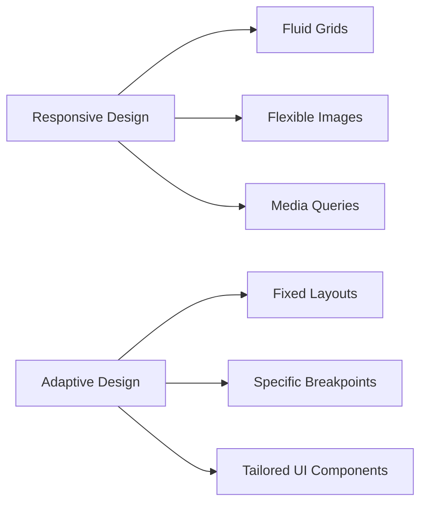

## 1.1.1 Definitions and Key Concepts

In the rapidly evolving world of mobile and cross-platform app development, creating applications that provide a seamless user experience across a multitude of devices is paramount. This section delves into the definitions and key concepts of responsive and adaptive design, two pivotal approaches that enable developers to craft flexible and user-friendly interfaces in Flutter.

### Definitions

#### Responsive Design

Responsive design is an approach that emphasizes the creation of fluid and flexible layouts that automatically adjust to fit various screen sizes and orientations. The primary goal of responsive design is to ensure that an application or website looks and functions optimally on any device, from small smartphones to large desktop monitors.

- **Fluid Layouts:** These layouts use relative units like percentages rather than fixed units like pixels, allowing elements to resize dynamically based on the screen size.
- **Flexible Images:** Images and media are scaled to fit within their containing elements, ensuring they do not overflow or become distorted on different devices.
- **Media Queries:** These are CSS techniques used to apply different styles based on the device's characteristics, such as width, height, and orientation.

#### Adaptive Design

Adaptive design, on the other hand, involves creating distinct layouts tailored to specific screen sizes or device types. Unlike responsive design, which adjusts fluidly, adaptive design uses fixed layouts that are pre-defined for certain breakpoints.

- **Fixed Layouts:** These layouts are designed for specific screen dimensions, ensuring a precise fit for each target device.
- **Specific Breakpoints:** Breakpoints are defined points where the layout changes to accommodate different screen sizes, typically using a set of predefined layouts.
- **Tailored UI Components:** UI elements are customized for each layout, providing an optimized experience for each device type.

### Key Concepts

#### Fluid Grids

Fluid grids are a cornerstone of responsive design. They use a flexible grid system that allows elements to resize and rearrange based on the screen size. This approach ensures that content is consistently displayed in a user-friendly manner, regardless of the device.

#### Flexible Images

In responsive design, images must be flexible to prevent them from breaking the layout. This is achieved by setting images to scale proportionally within their containers, often using CSS properties like `max-width: 100%`.

#### Media Queries

Media queries are essential for applying different styles based on the device's characteristics. In Flutter, similar behavior can be achieved using the `MediaQuery` widget, which provides information about the device's size, orientation, and more.

#### Breakpoints

Breakpoints are critical in adaptive design, marking the points at which the layout changes to suit different screen sizes. These are typically defined in terms of pixel widths, such as 480px for mobile, 768px for tablets, and 1024px for desktops.

### Real-World Examples

- **Responsive Design Example:** Websites like [Bootstrap](https://getbootstrap.com/) use responsive design principles to ensure their layout adjusts seamlessly across devices.
- **Adaptive Design Example:** Apple's website employs adaptive design, offering distinct layouts for different devices to provide an optimized experience.

### Diagrams

The following Mermaid.js diagram illustrates the differences between responsive and adaptive layouts:



### Code Examples

#### Responsive Layout with `LayoutBuilder`

In Flutter, the `LayoutBuilder` widget is a powerful tool for creating responsive layouts. It allows you to build different layouts based on the constraints provided by the parent widget.

```dart
import 'package:flutter/material.dart';

class ResponsiveLayout extends StatelessWidget {
  @override
  Widget build(BuildContext context) {
    return Scaffold(
      appBar: AppBar(title: Text('Responsive Layout')),
      body: LayoutBuilder(
        builder: (context, constraints) {
          if (constraints.maxWidth < 600) {
            return Column(
              children: [
                Text('This is a small screen'),
                // Add more widgets for small screens
              ],
            );
          } else {
            return Row(
              children: [
                Text('This is a large screen'),
                // Add more widgets for large screens
              ],
            );
          }
        },
      ),
    );
  }
}
```

#### Adaptive Layout with Breakpoints

Adaptive design can be implemented by defining specific layouts for different screen sizes. The following example demonstrates how to switch between layouts using breakpoints:

```dart
import 'package:flutter/material.dart';

class AdaptiveLayout extends StatelessWidget {
  @override
  Widget build(BuildContext context) {
    final screenWidth = MediaQuery.of(context).size.width;

    if (screenWidth < 600) {
      return SmallScreenLayout();
    } else if (screenWidth < 1200) {
      return MediumScreenLayout();
    } else {
      return LargeScreenLayout();
    }
  }
}

class SmallScreenLayout extends StatelessWidget {
  @override
  Widget build(BuildContext context) {
    return Scaffold(
      appBar: AppBar(title: Text('Small Screen')),
      body: Center(child: Text('This is a small screen layout')),
    );
  }
}

class MediumScreenLayout extends StatelessWidget {
  @override
  Widget build(BuildContext context) {
    return Scaffold(
      appBar: AppBar(title: Text('Medium Screen')),
      body: Center(child: Text('This is a medium screen layout')),
    );
  }
}

class LargeScreenLayout extends StatelessWidget {
  @override
  Widget build(BuildContext context) {
    return Scaffold(
      appBar: AppBar(title: Text('Large Screen')),
      body: Center(child: Text('This is a large screen layout')),
    );
  }
}
```

### Best Practices and Common Pitfalls

- **Best Practices:**
  - Use relative units like percentages for widths and heights to create fluid layouts.
  - Test your designs on multiple devices to ensure a consistent experience.
  - Leverage Flutter's `MediaQuery` and `LayoutBuilder` to adapt layouts dynamically.

- **Common Pitfalls:**
  - Avoid using fixed pixel values for layout dimensions, as they can lead to poor scaling on different devices.
  - Ensure images and media are responsive to prevent layout overflow or distortion.
  - Be mindful of performance when implementing complex adaptive layouts, as they can increase the app's computational load.

### Further Exploration

For those interested in delving deeper into responsive and adaptive design, consider exploring the following resources:

- **Books:**
  - "Responsive Web Design" by Ethan Marcotte
  - "Adaptive Web Design: Crafting Rich Experiences with Progressive Enhancement" by Aaron Gustafson

- **Online Courses:**
  - [Udacity's Responsive Web Design Fundamentals](https://www.udacity.com/course/responsive-web-design-fundamentals--ud893)
  - [Coursera's Responsive Website Development and Design](https://www.coursera.org/specializations/responsive-website-development)

- **Official Documentation:**
  - [Flutter's Layouts](https://flutter.dev/docs/development/ui/layout)
  - [Flutter's MediaQuery](https://api.flutter.dev/flutter/widgets/MediaQuery-class.html)

By understanding and applying these definitions and key concepts, you can create applications that provide a seamless and engaging user experience across all devices. As you continue your journey in Flutter development, remember to experiment with different layouts and techniques to find what works best for your projects.

## Quiz Time!



### What is the primary goal of responsive design?

- [x] To ensure an application looks and functions optimally on any device
- [ ] To create distinct layouts for specific devices
- [ ] To use fixed layouts for all screen sizes
- [ ] To prioritize desktop over mobile design

> **Explanation:** Responsive design aims to make applications look and function well on any device by using fluid layouts that adjust to screen size.

### Which of the following is a key component of adaptive design?

- [ ] Fluid grids
- [ ] Flexible images
- [x] Specific breakpoints
- [ ] Media queries

> **Explanation:** Adaptive design uses specific breakpoints to define layouts for different screen sizes, unlike responsive design, which uses fluid grids and flexible images.

### What tool in Flutter is used to build different layouts based on parent constraints?

- [ ] MediaQuery
- [x] LayoutBuilder
- [ ] Container
- [ ] Scaffold

> **Explanation:** `LayoutBuilder` is used in Flutter to create different layouts based on the constraints provided by the parent widget.

### Which of the following is NOT a characteristic of responsive design?

- [ ] Fluid layouts
- [ ] Flexible images
- [ ] Media queries
- [x] Fixed layouts

> **Explanation:** Fixed layouts are characteristic of adaptive design, not responsive design, which uses fluid layouts and flexible images.

### What is a common pitfall when implementing responsive design?

- [x] Using fixed pixel values for layout dimensions
- [ ] Testing designs on multiple devices
- [ ] Using relative units like percentages
- [ ] Leveraging MediaQuery

> **Explanation:** Using fixed pixel values can lead to poor scaling on different devices, which is a common pitfall in responsive design.

### How do media queries contribute to responsive design?

- [x] By applying different styles based on device characteristics
- [ ] By creating fixed layouts for specific devices
- [ ] By ensuring images are always the same size
- [ ] By ignoring device orientation

> **Explanation:** Media queries apply different styles based on device characteristics like width, height, and orientation, crucial for responsive design.

### Which Flutter widget provides information about the device's size and orientation?

- [x] MediaQuery
- [ ] LayoutBuilder
- [ ] Container
- [ ] Row

> **Explanation:** `MediaQuery` provides information about the device's size, orientation, and other characteristics in Flutter.

### What is the advantage of using relative units in responsive design?

- [x] They allow elements to resize dynamically based on screen size
- [ ] They ensure fixed layouts for all devices
- [ ] They prioritize desktop design
- [ ] They ignore device orientation

> **Explanation:** Relative units like percentages enable elements to resize dynamically, which is essential for responsive design.

### Which design approach uses tailored UI components for each device type?

- [ ] Responsive design
- [x] Adaptive design
- [ ] Fluid design
- [ ] Static design

> **Explanation:** Adaptive design uses tailored UI components for each device type, unlike responsive design, which adjusts layouts fluidly.

### True or False: Adaptive design uses fluid grids to adjust layouts.

- [ ] True
- [x] False

> **Explanation:** Adaptive design uses fixed layouts and specific breakpoints, not fluid grids, which are a feature of responsive design.


