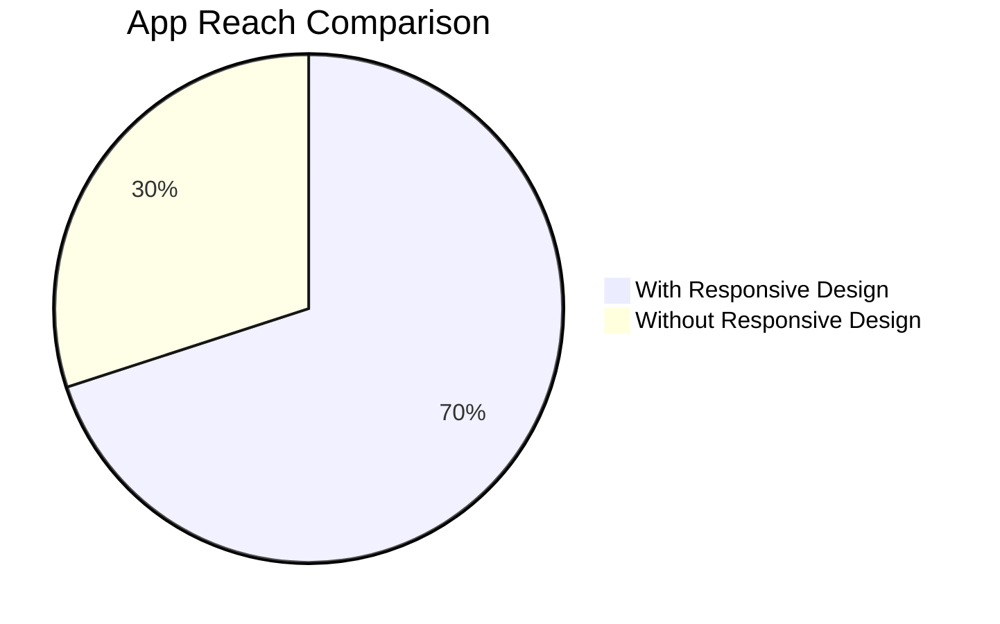

## 1.1.2 Importance in Modern App Development

In today's fast-paced digital landscape, the importance of responsive and adaptive design in app development cannot be overstated. As users interact with applications across a myriad of devices, from smartphones and tablets to desktops and wearables, ensuring a seamless and optimized user experience becomes paramount. This section delves into the multifaceted benefits of adopting responsive and adaptive design principles in modern app development, focusing on user experience, market reach, maintenance, scalability, and performance.

### User Experience

Responsive and adaptive designs are pivotal in crafting user experiences that are not only visually appealing but also functionally efficient across various devices. By leveraging these design principles, developers can ensure that their applications provide:

- **Consistent User Interfaces:** A responsive design adapts to different screen sizes and orientations, offering a uniform look and feel. This consistency is crucial for maintaining brand identity and user trust.
  
- **Improved Accessibility:** Adaptive designs can cater to users with diverse needs by adjusting layouts and elements to be more accessible, such as larger touch targets for mobile users or alternative navigation methods for those using assistive technologies.

- **Enhanced Interactivity:** By optimizing for different devices, apps can offer tailored interactions that leverage device-specific features, such as gesture controls on mobile or keyboard shortcuts on desktops.

Consider a scenario where a user starts interacting with an app on their smartphone during their commute and later continues on a desktop at work. A responsive design ensures that the transition between devices is smooth, with the interface adapting to each screen size without losing functionality or aesthetic appeal.

### Market Reach

In an era where consumers use an array of devices, supporting multiple screen sizes and types is essential for maximizing market reach. Responsive and adaptive designs enable developers to:

- **Reach a Broader Audience:** By ensuring compatibility across devices, apps can attract users regardless of their preferred platform, be it iOS, Android, or web.

- **Increase Engagement:** Users are more likely to engage with and recommend apps that provide a seamless experience across their devices.

- **Boost Conversion Rates:** E-commerce apps, for instance, can significantly benefit from responsive designs by offering a streamlined shopping experience, leading to higher conversion rates.

Here's a visual representation of how responsive design impacts app reach:

This diagram illustrates that apps with responsive designs have a significantly larger reach compared to those without, highlighting the competitive advantage of adopting these design principles.

### Maintenance and Scalability

Responsive and adaptive designs not only enhance user experience and market reach but also streamline the maintenance and scalability of applications:

- **Simplified Codebase:** By using a single codebase that adapts to various devices, developers can reduce redundancy and complexity, making the app easier to maintain and update.

- **Future-Proofing:** As new devices and screen sizes emerge, a well-designed responsive app can accommodate these changes with minimal adjustments, ensuring longevity and relevance.

- **Efficient Resource Allocation:** With a unified design approach, development teams can focus their efforts on enhancing core features rather than managing multiple versions of the app.

### Performance

The impact of responsive and adaptive designs on app performance is a critical consideration for developers:

- **Optimized Resource Management:** Responsive designs can dynamically load resources based on device capabilities, reducing unnecessary data usage and improving load times.

- **Enhanced Performance Metrics:** By tailoring the app experience to the device, developers can ensure that performance metrics such as frame rates and responsiveness are optimized, leading to a smoother user experience.

- **Battery Efficiency:** Adaptive designs can help manage power consumption by adjusting animations and background processes based on the device's power profile.

### Case Studies

To illustrate the success of responsive and adaptive designs, let's explore a few case studies:

- **Airbnb:** By implementing a responsive design, Airbnb was able to provide a consistent user experience across devices, leading to increased user engagement and bookings. Their approach to adaptive design also allowed them to cater to different user needs, such as accessibility features for visually impaired users.

- **Spotify:** Spotify's responsive design strategy enabled them to offer a seamless music streaming experience across smartphones, tablets, and desktops. This adaptability contributed to their rapid user growth and retention.

- **Amazon:** As a leading e-commerce platform, Amazon's responsive design ensures that users can shop effortlessly on any device, contributing to their high conversion rates and customer satisfaction.

These examples underscore the tangible benefits of adopting responsive and adaptive design principles in app development.

### Conclusion

The importance of responsive and adaptive design in modern app development is clear. By enhancing user experience, expanding market reach, simplifying maintenance, and optimizing performance, these design approaches offer a strategic advantage in a competitive digital landscape. As technology continues to evolve, embracing responsive and adaptive design will be crucial for developers seeking to deliver exceptional applications that meet the diverse needs of users worldwide.

## Quiz Time!



### How do responsive and adaptive designs enhance user experience?

- [x] By providing optimized interfaces across devices
- [ ] By reducing app functionality
- [ ] By increasing app complexity
- [ ] By limiting user interactions

> **Explanation:** Responsive and adaptive designs enhance user experience by ensuring that interfaces are optimized for various devices, providing a consistent and accessible experience.

### Why is supporting multiple device types important for market reach?

- [x] It allows apps to reach a broader audience
- [ ] It limits the app's potential user base
- [ ] It increases development costs significantly
- [ ] It complicates the user interface

> **Explanation:** Supporting multiple device types enables apps to reach a wider audience by ensuring compatibility across different platforms.

### What is a key benefit of responsive design in terms of maintenance?

- [x] Simplified codebase
- [ ] Increased code complexity
- [ ] More frequent updates required
- [ ] Higher maintenance costs

> **Explanation:** Responsive design simplifies the codebase by allowing a single codebase to adapt to various devices, reducing redundancy and complexity.

### How do responsive designs impact app performance?

- [x] By optimizing resource management
- [ ] By increasing data usage
- [ ] By reducing load times
- [ ] By complicating performance metrics

> **Explanation:** Responsive designs optimize resource management by dynamically loading resources based on device capabilities, improving performance.

### Which company benefited from a responsive design strategy to increase user engagement?

- [x] Airbnb
- [ ] Microsoft
- [ ] IBM
- [ ] Oracle

> **Explanation:** Airbnb implemented a responsive design to provide a consistent user experience across devices, leading to increased user engagement.

### What is a visual representation tool used to compare app reach with and without responsive design?

- [x] Mermaid.js diagrams
- [ ] Excel spreadsheets
- [ ] PowerPoint slides
- [ ] Hand-drawn sketches

> **Explanation:** Mermaid.js diagrams are used to visually represent data, such as comparing app reach with and without responsive design.

### How does adaptive design contribute to battery efficiency?

- [x] By adjusting animations and background processes
- [ ] By increasing screen brightness
- [ ] By reducing app functionality
- [ ] By limiting user interactions

> **Explanation:** Adaptive design contributes to battery efficiency by adjusting animations and background processes based on the device's power profile.

### What is a common challenge in responsive design?

- [x] Ensuring consistency across devices
- [ ] Increasing development costs
- [ ] Limiting user interactions
- [ ] Reducing app functionality

> **Explanation:** A common challenge in responsive design is ensuring consistency across devices while maintaining a seamless user experience.

### Which company used responsive design to offer a seamless music streaming experience?

- [x] Spotify
- [ ] Apple
- [ ] Google
- [ ] Facebook

> **Explanation:** Spotify used responsive design to provide a seamless music streaming experience across smartphones, tablets, and desktops.

### True or False: Responsive design can help future-proof applications.

- [x] True
- [ ] False

> **Explanation:** True. Responsive design helps future-proof applications by allowing them to adapt to new devices and screen sizes with minimal adjustments.


