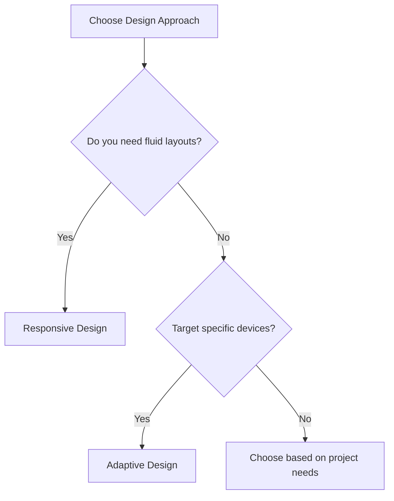

## 1.1.3 Differences Between Responsive and Adaptive UIs

In the realm of mobile and web development, creating user interfaces that provide a seamless experience across a multitude of devices is paramount. Flutter, with its robust framework, offers two primary strategies for achieving this: responsive and adaptive design. Understanding the differences between these approaches is crucial for developers aiming to build versatile and efficient applications.

### Comparative Analysis

To effectively differentiate between responsive and adaptive design, we can examine several key aspects: flexibility, implementation complexity, performance, and use cases. The table below provides a detailed comparison:

| Aspect                  | Responsive Design                                      | Adaptive Design                                        |
|-------------------------|--------------------------------------------------------|--------------------------------------------------------|
| **Flexibility**         | Highly flexible, adjusts to any screen size dynamically| Less flexible, targets specific screen sizes or devices|
| **Implementation Complexity** | Moderate, requires careful planning of fluid layouts | Higher, involves creating multiple fixed layouts       |
| **Performance**         | Generally efficient, but can be complex for very large layouts | Can be more performant as it uses fixed layouts        |
| **Use Cases**           | Ideal for web and apps with dynamic content            | Best for apps with platform-specific features          |

### When to Use Each Approach

Choosing between responsive and adaptive design depends on the specific needs of your project. Here are some guidelines to help you decide:

- **Responsive Design** is suitable when:
  - Your application needs to work seamlessly across a wide range of devices and screen sizes.
  - You are dealing with content that frequently changes or is dynamic in nature.
  - You want to maintain a single codebase that adjusts fluidly to different environments.

- **Adaptive Design** is preferable when:
  - You need to target specific devices or screen sizes with tailored experiences.
  - Your application requires platform-specific features or design elements.
  - You are optimizing for performance on particular devices, potentially at the cost of flexibility.

### Decision-Making Process

The following Mermaid.js flowchart illustrates the decision-making process when choosing between responsive and adaptive design:



### Code Examples

To further illustrate the differences between responsive and adaptive design, let's explore some practical Flutter implementations.

#### Responsive Design Example

In a responsive design, widgets adjust their size and layout based on the available screen space. Here's a simple example using a `Column` with `Flexible` widgets:

```dart
import 'package:flutter/material.dart';

class ResponsiveExample extends StatelessWidget {
  @override
  Widget build(BuildContext context) {
    return Scaffold(
      appBar: AppBar(title: Text('Responsive Design')),
      body: Column(
        children: [
          Flexible(
            flex: 1,
            child: Container(color: Colors.red),
          ),
          Flexible(
            flex: 2,
            child: Container(color: Colors.green),
          ),
          Flexible(
            flex: 1,
            child: Container(color: Colors.blue),
          ),
        ],
      ),
    );
  }
}
```

**Explanation:**
- The `Flexible` widget allows each child to take a proportional amount of space based on the `flex` property.
- This setup ensures that the layout adapts to different screen sizes dynamically.

#### Adaptive Design Example

In an adaptive design, you might create different layouts for different platforms or screen sizes. Here’s an example using `Platform.isIOS` to switch between Material and Cupertino widgets:

```dart
import 'dart:io';
import 'package:flutter/material.dart';
import 'package:flutter/cupertino.dart';

class AdaptiveExample extends StatelessWidget {
  @override
  Widget build(BuildContext context) {
    return Platform.isIOS
        ? CupertinoPageScaffold(
            navigationBar: CupertinoNavigationBar(
              middle: Text('Adaptive Design'),
            ),
            child: Center(child: Text('iOS Style')),
          )
        : Scaffold(
            appBar: AppBar(title: Text('Adaptive Design')),
            body: Center(child: Text('Android Style')),
          );
  }
}
```

**Explanation:**
- This example uses Dart's `Platform` class to determine the operating system and render the appropriate UI components.
- The `CupertinoPageScaffold` and `Scaffold` widgets are used to provide platform-specific navigation bars and styles.

### Practical Examples and Real-World Scenarios

Consider a news application that needs to display articles on both mobile and desktop platforms. A responsive design would ensure that the layout adjusts automatically, providing a single-column view on mobile and a multi-column view on larger screens. Conversely, an adaptive design might involve creating separate layouts for mobile and desktop, each optimized for the specific platform's interaction patterns.

Another scenario could be an e-commerce app where the checkout process is tailored for different devices. On mobile, the process might be streamlined with larger buttons and simplified forms, while on desktop, it could include additional options and detailed views.

### Best Practices and Common Pitfalls

- **Responsive Design Best Practices:**
  - Use `MediaQuery` to retrieve device dimensions and orientation.
  - Leverage `LayoutBuilder` to create layouts that adapt based on constraints.
  - Avoid hardcoding dimensions; instead, use relative sizing.

- **Adaptive Design Best Practices:**
  - Clearly define breakpoints and create layouts for each target device.
  - Utilize platform-specific widgets to enhance user experience.
  - Test thoroughly on all target devices to ensure consistency.

- **Common Pitfalls:**
  - Overcomplicating responsive layouts with excessive nesting.
  - Neglecting performance implications of complex adaptive designs.
  - Failing to consider accessibility and usability across different devices.

### References and Further Reading

- [Flutter Documentation on Responsive Design](https://flutter.dev/docs/development/ui/layout/responsive)
- [Material Design Guidelines](https://material.io/design)
- [Cupertino Design Guidelines](https://developer.apple.com/design/human-interface-guidelines/ios/overview/themes/)

By understanding the differences between responsive and adaptive design, you can make informed decisions that enhance the user experience across all devices. Whether you choose to implement a fluid, responsive layout or a tailored, adaptive design, Flutter provides the tools and flexibility to achieve your goals.

## Quiz Time!



### What is a key difference between responsive and adaptive design?

- [x] Responsive design adjusts fluidly to any screen size, while adaptive design targets specific screen sizes.
- [ ] Responsive design is only for mobile devices, while adaptive design is for desktops.
- [ ] Adaptive design is more flexible than responsive design.
- [ ] Responsive design requires more code than adaptive design.

> **Explanation:** Responsive design is characterized by its ability to adjust fluidly to any screen size, whereas adaptive design involves creating fixed layouts for specific screen sizes or devices.

### When should you use adaptive design?

- [x] When you need to target specific devices with tailored experiences.
- [ ] When your application has highly dynamic content.
- [ ] When you want to maintain a single codebase.
- [ ] When you need fluid layouts.

> **Explanation:** Adaptive design is best used when you need to target specific devices or screen sizes with tailored experiences, often involving platform-specific features.

### Which widget is commonly used in responsive design to adjust layout based on screen size?

- [x] Flexible
- [ ] Container
- [ ] Padding
- [ ] Align

> **Explanation:** The `Flexible` widget is commonly used in responsive design to allow child widgets to adjust their size based on the available screen space.

### What is a common pitfall of adaptive design?

- [x] Neglecting performance implications of complex designs.
- [ ] Overcomplicating layouts with excessive nesting.
- [ ] Failing to use MediaQuery.
- [ ] Using too many platform-specific widgets.

> **Explanation:** A common pitfall of adaptive design is neglecting the performance implications of creating complex, device-specific layouts.

### What tool can you use in Flutter to retrieve device dimensions and orientation?

- [x] MediaQuery
- [ ] LayoutBuilder
- [ ] Flexible
- [ ] Platform

> **Explanation:** `MediaQuery` is used in Flutter to retrieve information about the device's dimensions and orientation, which is crucial for responsive design.

### Which design approach is generally more performant?

- [x] Adaptive Design
- [ ] Responsive Design
- [ ] Both are equally performant
- [ ] Neither is performant

> **Explanation:** Adaptive design can be more performant because it uses fixed layouts tailored for specific devices, reducing the complexity of dynamic adjustments.

### What is a best practice for responsive design?

- [x] Use relative sizing instead of hardcoded dimensions.
- [ ] Use platform-specific widgets exclusively.
- [ ] Create separate layouts for each device.
- [ ] Avoid using MediaQuery.

> **Explanation:** A best practice for responsive design is to use relative sizing instead of hardcoded dimensions, allowing the layout to adjust fluidly to different screen sizes.

### Which Flutter widget helps create layouts that adapt based on constraints?

- [x] LayoutBuilder
- [ ] Container
- [ ] Align
- [ ] Scaffold

> **Explanation:** `LayoutBuilder` is used in Flutter to create layouts that adapt based on the constraints provided by the parent widget, making it a key tool in responsive design.

### In the decision-making flowchart, what is the next step if you do not need fluid layouts?

- [x] Determine if you need to target specific devices.
- [ ] Choose responsive design.
- [ ] Implement a single layout for all devices.
- [ ] Use MediaQuery to adjust layouts.

> **Explanation:** If you do not need fluid layouts, the next step in the decision-making process is to determine if you need to target specific devices, which would lead to choosing adaptive design.

### True or False: Responsive design is less flexible than adaptive design.

- [ ] True
- [x] False

> **Explanation:** False. Responsive design is more flexible than adaptive design because it adjusts fluidly to any screen size, whereas adaptive design targets specific screen sizes or devices.


