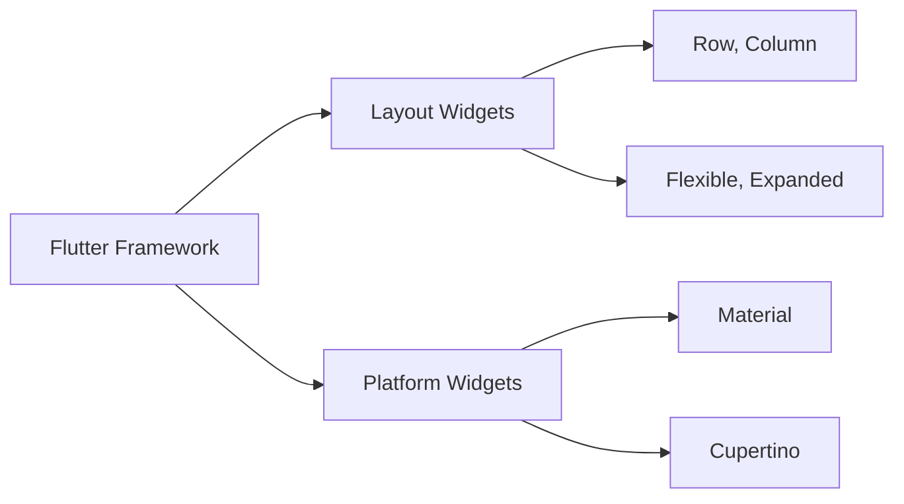

## 1.1.4 Overview of Flutter’s Capabilities

Flutter, Google's open-source UI toolkit, is renowned for its ability to create natively compiled applications for mobile, web, and desktop from a single codebase. One of Flutter's standout features is its robust support for responsive and adaptive design, which is crucial in today's multi-device world. This section delves into Flutter's capabilities that empower developers to build UIs that not only look great but also function seamlessly across different screen sizes and platforms.

### Flutter’s Responsive Tools

Flutter provides a suite of tools and widgets designed to facilitate responsive and adaptive design. These tools allow developers to create layouts that adjust dynamically to various screen sizes and orientations, ensuring a consistent user experience.

#### Key Widgets and Tools

- **LayoutBuilder**: This widget is a cornerstone for building responsive layouts in Flutter. It allows you to obtain the parent widget's constraints and adjust the child widget's layout accordingly. This is particularly useful for creating different layouts for different screen sizes.

  ```dart
  Widget build(BuildContext context) {
    return LayoutBuilder(
      builder: (context, constraints) {
        if (constraints.maxWidth > 600) {
          return _buildWideContainers();
        } else {
          return _buildNormalContainer();
        }
      },
    );
  }
  ```

- **MediaQuery**: MediaQuery provides information about the size and orientation of the current screen. It is essential for making decisions about layout and design, such as adjusting font sizes or padding based on screen dimensions.

  ```dart
  double screenWidth = MediaQuery.of(context).size.width;
  if (screenWidth > 600) {
    // Use a larger font size
  } else {
    // Use a smaller font size
  }
  ```

- **Flexible and Expanded**: These widgets are part of Flutter's flexible layout model, allowing children of a Row or Column to expand and fill available space. They are instrumental in creating flexible layouts that adapt to different screen sizes.

  ```dart
  Row(
    children: <Widget>[
      Flexible(
        child: Container(color: Colors.red),
      ),
      Expanded(
        child: Container(color: Colors.blue),
      ),
    ],
  )
  ```

### Flexibility with Widgets

Flutter's widget-based architecture is designed for flexibility and customization. Every element of a Flutter app is a widget, from the simplest button to complex layouts. This architecture allows developers to compose UIs from a rich set of pre-built widgets or create custom widgets tailored to specific needs.

- **Custom Widgets**: Developers can create custom widgets by composing existing widgets, enabling highly specialized and reusable UI components. This composability is a key strength of Flutter, allowing for rapid prototyping and iteration.

- **Stateful and Stateless Widgets**: Flutter distinguishes between stateful and stateless widgets, which helps manage UI state efficiently. Stateless widgets are immutable and ideal for static content, while stateful widgets can change dynamically, responding to user interactions or other events.

### Platform-Specific Adaptations

Flutter excels at creating cross-platform applications, but it also allows for platform-specific adaptations to ensure the app feels native on each platform.

- **Material and Cupertino Widgets**: Flutter includes two sets of design widgets: Material for Android and Cupertino for iOS. These widgets enable developers to create apps that adhere to the design guidelines of each platform, providing a native look and feel.

  ```dart
  Widget build(BuildContext context) {
    return Platform.isIOS
        ? CupertinoButton(
            child: Text('Press'),
            onPressed: () {},
          )
        : ElevatedButton(
            child: Text('Press'),
            onPressed: () {},
          );
  }
  ```

- **Platform-Specific Code**: Flutter allows developers to write platform-specific code using the `Platform` class or conditional imports, enabling fine-grained control over platform-specific features.

### Visualizing Flutter's Widget Hierarchy

To better understand how Flutter supports responsive and adaptive layouts, consider the following diagram illustrating the hierarchy and relationship between key widgets:



This diagram highlights how Flutter's core framework integrates layout widgets, such as Row and Column, with platform-specific widgets to create versatile and adaptive UIs.

### Code Examples

To illustrate Flutter's responsive capabilities, let's explore a simple example using `MediaQuery` and `LayoutBuilder` to create a responsive layout:

```dart
import 'package:flutter/material.dart';

class ResponsiveLayout extends StatelessWidget {
  @override
  Widget build(BuildContext context) {
    return Scaffold(
      appBar: AppBar(title: Text('Responsive Layout')),
      body: LayoutBuilder(
        builder: (context, constraints) {
          if (constraints.maxWidth > 600) {
            return _buildWideContainers();
          } else {
            return _buildNormalContainer();
          }
        },
      ),
    );
  }

  Widget _buildWideContainers() {
    return Row(
      children: [
        Expanded(child: Container(color: Colors.red, height: 200)),
        Expanded(child: Container(color: Colors.blue, height: 200)),
      ],
    );
  }

  Widget _buildNormalContainer() {
    return Container(color: Colors.green, height: 200);
  }
}

void main() => runApp(MaterialApp(home: ResponsiveLayout()));
```

In this example, the `LayoutBuilder` widget is used to determine the screen width and adjust the layout accordingly. If the screen width exceeds 600 pixels, a row of two containers is displayed. Otherwise, a single container is shown.

### Best Practices and Common Pitfalls

- **Testing Across Devices**: Always test your app on multiple devices and orientations to ensure a consistent user experience. Use emulators and physical devices to cover a wide range of scenarios.

- **Avoiding Hardcoded Values**: Use relative measurements and constraints rather than fixed sizes to ensure your UI adapts to different screen sizes.

- **Performance Considerations**: Be mindful of performance when building complex layouts. Use tools like the Flutter DevTools to profile and optimize your app.

### Further Exploration

For those interested in diving deeper into Flutter's responsive design capabilities, consider exploring the following resources:

- [Flutter Documentation](https://flutter.dev/docs): The official Flutter documentation is a comprehensive resource for learning about Flutter's features and best practices.
- [Flutter Layout Cheat Sheet](https://medium.com/flutter-community/flutter-layout-cheat-sheet-5363348d037e): A handy guide to understanding Flutter's layout model.
- [Flutter by Example](https://flutterbyexample.com/): A collection of practical Flutter examples to help you learn by doing.

By leveraging Flutter's powerful tools and widgets, developers can create responsive and adaptive UIs that deliver a seamless user experience across a wide range of devices and platforms.

## Quiz Time!



### What is the primary purpose of the `LayoutBuilder` widget in Flutter?

- [x] To build responsive layouts by accessing parent constraints
- [ ] To manage state changes in a widget
- [ ] To handle user input events
- [ ] To animate widget transitions

> **Explanation:** `LayoutBuilder` is used to build responsive layouts by providing the constraints of the parent widget, allowing developers to adjust the layout based on available space.

### Which widget provides information about the current screen size and orientation?

- [ ] LayoutBuilder
- [ ] Flexible
- [x] MediaQuery
- [ ] Expanded

> **Explanation:** `MediaQuery` provides information about the current screen size, orientation, and other properties, enabling responsive design decisions.

### What is the role of the `Flexible` widget in a Flutter layout?

- [ ] To create animations
- [x] To allow a widget to occupy available space in a Row or Column
- [ ] To handle gestures
- [ ] To display platform-specific UI components

> **Explanation:** `Flexible` allows a widget to occupy available space within a Row or Column, making it essential for creating adaptable layouts.

### How does Flutter support platform-specific UI designs?

- [ ] By using the same widgets for all platforms
- [x] By providing Material and Cupertino widgets
- [ ] By requiring separate codebases for each platform
- [ ] By using HTML and CSS

> **Explanation:** Flutter supports platform-specific UI designs through Material widgets for Android and Cupertino widgets for iOS, ensuring a native look and feel.

### Which of the following is a common pitfall in responsive design?

- [ ] Using relative measurements
- [x] Hardcoding widget sizes
- [ ] Testing on multiple devices
- [ ] Using `MediaQuery` for layout decisions

> **Explanation:** Hardcoding widget sizes can lead to layouts that do not adapt well to different screen sizes, making it a common pitfall in responsive design.

### What is the benefit of using custom widgets in Flutter?

- [ ] They are faster to render
- [x] They allow for highly specialized and reusable UI components
- [ ] They are easier to debug
- [ ] They automatically adapt to all screen sizes

> **Explanation:** Custom widgets allow developers to create highly specialized and reusable UI components, enhancing flexibility and maintainability.

### Which widget is used to create a native look and feel for iOS applications in Flutter?

- [ ] MaterialApp
- [x] CupertinoApp
- [ ] Scaffold
- [ ] Container

> **Explanation:** `CupertinoApp` and Cupertino widgets are used to create a native look and feel for iOS applications in Flutter.

### What does the `Expanded` widget do in a Flutter layout?

- [ ] It animates widgets
- [ ] It manages state
- [x] It makes a child widget fill the available space in a Row or Column
- [ ] It handles user input

> **Explanation:** `Expanded` makes a child widget fill the available space in a Row or Column, ensuring the layout adapts to different screen sizes.

### How can developers write platform-specific code in Flutter?

- [ ] By using HTML and CSS
- [x] By using the `Platform` class or conditional imports
- [ ] By creating separate projects for each platform
- [ ] By using JavaScript

> **Explanation:** Developers can write platform-specific code in Flutter using the `Platform` class or conditional imports, allowing for fine-grained control over platform-specific features.

### True or False: Flutter's widget-based architecture allows for highly customizable and adaptable UIs.

- [x] True
- [ ] False

> **Explanation:** Flutter's widget-based architecture is designed for flexibility and customization, enabling developers to create highly adaptable UIs.


