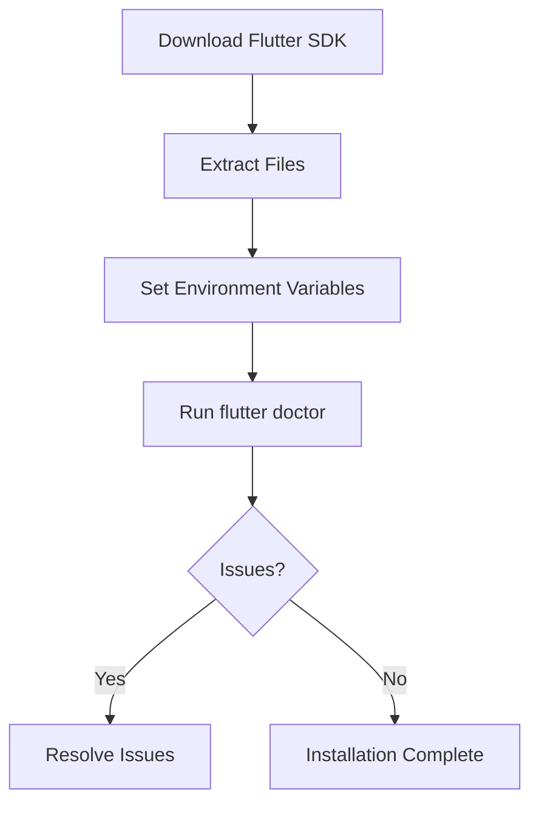

## 1.2.1 Installing Flutter and Dart SDK

Setting up your development environment is the first step towards building responsive and adaptive applications with Flutter. This section provides a comprehensive guide on installing the Flutter and Dart SDK, configuring your system, and troubleshooting common issues. By the end of this guide, you'll be ready to start developing Flutter applications.

### Prerequisites

Before you begin the installation process, ensure your system meets the following requirements:

- **Operating System:**
  - **Windows:** Windows 10 or later (64-bit)
  - **macOS:** macOS 10.14 or later
  - **Linux:** Any recent distribution with a 64-bit architecture

- **Disk Space:** At least 1.64 GB of free disk space (excluding space for IDE/tools).

- **Tools:**
  - **Git:** Flutter SDK is stored in a Git repository, so Git is required to clone the repository.
  - **Command Line Tools:** Terminal (macOS/Linux) or Command Prompt/PowerShell (Windows).

- **Additional Requirements for Specific Platforms:**
  - **Windows:** PowerShell 5.0 or newer (pre-installed with Windows 10).
  - **macOS:** Xcode for iOS development.
  - **Linux:** `libGLU` package (install via your package manager).

### Installation Steps

#### Step 1: Download the Flutter SDK

1. **Visit the Flutter Website:**
   - Navigate to the [Flutter official website](https://flutter.dev/docs/get-started/install) and select your operating system.

2. **Download the SDK:**
   - Click on the download link for the latest stable release of the Flutter SDK.

3. **Extract the Files:**
   - **Windows:** Extract the downloaded zip file to a suitable location, such as `C:\src\flutter`.
   - **macOS/Linux:** Use the terminal to extract the tar file:
     ```bash
     tar xf flutter_linux_<version>-stable.tar.xz
     ```

#### Step 2: Set Up Environment Variables

To use Flutter commands globally, you need to add Flutter to your system's PATH.

- **Windows:**
  1. Open the Start Search, type in "env", and select "Edit the system environment variables".
  2. Click on "Environment Variables" in the System Properties window.
  3. Under "System variables", find the PATH variable and click "Edit".
  4. Add the path to the Flutter bin directory (e.g., `C:\src\flutter\bin`).

- **macOS/Linux:**
  1. Open your terminal.
  2. Open the bash profile or zsh profile file:
     ```bash
     nano ~/.bashrc   # or ~/.zshrc for zsh users
     ```
  3. Add the following line at the end of the file:
     ```bash
     export PATH="$PATH:`pwd`/flutter/bin"
     ```
  4. Save the file and refresh the terminal:
     ```bash
     source ~/.bashrc   # or source ~/.zshrc
     ```

#### Step 3: Verify the Installation

1. **Run Flutter Doctor:**
   - Open a terminal or command prompt and run:
     ```bash
     flutter doctor
     ```
   - This command checks your environment and displays a report of the status of your Flutter installation.

2. **Resolve Any Issues:**
   - Follow the instructions provided by `flutter doctor` to resolve any issues. This may include installing additional software or accepting licenses.



### Troubleshooting

Here are some common issues you might encounter during installation and their solutions:

- **Issue:** `flutter` command not found.
  - **Solution:** Ensure that the Flutter bin directory is correctly added to your PATH environment variable.

- **Issue:** `flutter doctor` reports missing dependencies.
  - **Solution:** Follow the instructions provided by `flutter doctor` to install missing dependencies. For example, on macOS, you might need to install Xcode or accept its license agreement.

- **Issue:** Git not installed.
  - **Solution:** Install Git from [git-scm.com](https://git-scm.com/) and ensure it is added to your PATH.

### Code Examples

Here are some terminal commands used during the installation process:

```bash
git clone https://github.com/flutter/flutter.git -b stable

export PATH="$PATH:`pwd`/flutter/bin"

flutter doctor
```

### Best Practices and Tips

- **Keep Flutter Updated:** Regularly update your Flutter SDK to benefit from the latest features and fixes. Use the command `flutter upgrade` to update your installation.
  
- **Use Stable Channel:** For production apps, use the stable channel to ensure maximum stability. Switch channels using `flutter channel stable`.

- **Check Compatibility:** Before upgrading, ensure that your dependencies are compatible with the new Flutter version.

### Additional Resources

- [Flutter Installation Guide](https://flutter.dev/docs/get-started/install)
- [Flutter GitHub Repository](https://github.com/flutter/flutter)
- [Dart SDK Documentation](https://dart.dev/guides)

By following these steps, you'll have a fully functional Flutter development environment ready to create responsive and adaptive applications. Remember to keep your tools updated and consult the Flutter community for support and best practices.

## Quiz Time!



### What is the minimum macOS version required to install Flutter?

- [ ] macOS 10.12
- [ ] macOS 10.13
- [x] macOS 10.14
- [ ] macOS 10.15

> **Explanation:** Flutter requires macOS 10.14 or later for installation.

### Which command is used to verify the Flutter installation?

- [ ] flutter verify
- [x] flutter doctor
- [ ] flutter check
- [ ] flutter install

> **Explanation:** The `flutter doctor` command checks the environment and verifies the installation.

### What is the purpose of setting environment variables for Flutter?

- [x] To use Flutter commands globally
- [ ] To install additional plugins
- [ ] To configure the IDE
- [ ] To update the Flutter SDK

> **Explanation:** Setting environment variables allows Flutter commands to be accessible globally from the terminal.

### What should you do if `flutter doctor` reports missing dependencies?

- [x] Follow the instructions provided by `flutter doctor`
- [ ] Reinstall Flutter
- [ ] Ignore the warnings
- [ ] Uninstall Git

> **Explanation:** `flutter doctor` provides guidance on resolving missing dependencies, which should be followed.

### Which tool is necessary for cloning the Flutter SDK repository?

- [ ] Node.js
- [x] Git
- [ ] Docker
- [ ] Python

> **Explanation:** Git is required to clone the Flutter SDK repository from GitHub.

### How do you add Flutter to the PATH on macOS/Linux?

- [ ] Edit the ~/.bash_profile file
- [ ] Edit the ~/.zshrc file
- [x] Edit the ~/.bashrc or ~/.zshrc file
- [ ] Edit the ~/.profile file

> **Explanation:** You add Flutter to the PATH by editing the ~/.bashrc or ~/.zshrc file and adding the export command.

### What is the command to update the Flutter SDK?

- [ ] flutter update
- [x] flutter upgrade
- [ ] flutter refresh
- [ ] flutter install

> **Explanation:** The `flutter upgrade` command updates the Flutter SDK to the latest version.

### Which operating system requires PowerShell 5.0 or newer for Flutter installation?

- [x] Windows
- [ ] macOS
- [ ] Linux
- [ ] Android

> **Explanation:** Windows requires PowerShell 5.0 or newer for Flutter installation.

### What should you do if the `flutter` command is not found?

- [x] Ensure Flutter bin directory is in the PATH
- [ ] Reinstall the operating system
- [ ] Install Node.js
- [ ] Disable antivirus software

> **Explanation:** If the `flutter` command is not found, ensure the Flutter bin directory is correctly added to the PATH.

### True or False: You should always use the latest Flutter version for production apps.

- [ ] True
- [x] False

> **Explanation:** For production apps, it is recommended to use the stable channel to ensure maximum stability.


