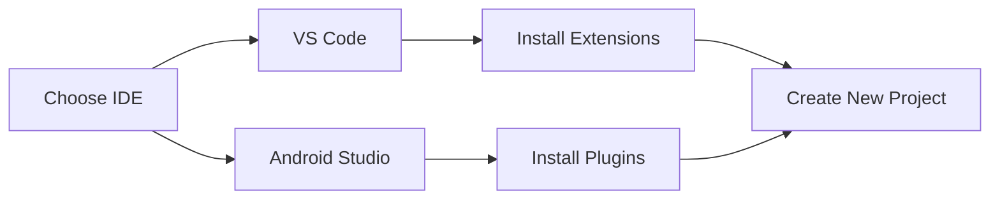

## 1.2.2 Configuring IDEs: VS Code and Android Studio

When embarking on your Flutter development journey, choosing the right Integrated Development Environment (IDE) can significantly impact your productivity and workflow. Two of the most popular IDEs for Flutter development are Visual Studio Code (VS Code) and Android Studio. Each offers unique features and capabilities that cater to different developer preferences and needs. This section will guide you through configuring both IDEs for Flutter development, helping you create a seamless and efficient development environment.

### Choosing an IDE: VS Code vs. Android Studio

Before diving into the configuration process, it's essential to understand the benefits and trade-offs of each IDE:

- **VS Code:**
  - **Lightweight and Fast:** VS Code is known for its speed and low resource consumption, making it ideal for developers who prefer a lightweight setup.
  - **Extensibility:** With a vast library of extensions, VS Code allows for extensive customization to suit your development needs.
  - **Cross-Platform:** Available on Windows, macOS, and Linux, VS Code provides a consistent experience across different operating systems.
  - **Integrated Terminal:** The built-in terminal in VS Code allows you to run Flutter commands without leaving the IDE.

- **Android Studio:**
  - **Comprehensive Features:** As an official IDE for Android development, Android Studio offers robust tools for building and debugging Android apps.
  - **Integrated Emulator:** Android Studio includes an Android emulator, making it convenient for testing your Flutter apps on virtual devices.
  - **Advanced Debugging:** With powerful debugging tools, Android Studio is well-suited for developers who require detailed insights into their app's performance.
  - **UI Design Tools:** The layout editor in Android Studio provides a visual interface for designing app layouts, which can be beneficial for developers who prefer a graphical approach.

### Installation Guides

#### Installing Flutter and Dart Plugins in VS Code

1. **Install VS Code:**
   - Download and install VS Code from the [official website](https://code.visualstudio.com/).

2. **Install Flutter and Dart Extensions:**
   - Open VS Code and navigate to the Extensions view by clicking on the Extensions icon in the Activity Bar on the side of the window or by pressing `Ctrl+Shift+X`.
   - Search for "Flutter" and click "Install" to add the Flutter extension.
   - The Dart extension will be installed automatically as a dependency of the Flutter extension.

3. **Verify Installation:**
   - Open the Command Palette (`Ctrl+Shift+P`) and type `Flutter: New Project` to verify that the extensions are installed correctly.

#### Installing Flutter and Dart Plugins in Android Studio

1. **Install Android Studio:**
   - Download and install Android Studio from the [official website](https://developer.android.com/studio).

2. **Install Flutter and Dart Plugins:**
   - Open Android Studio and go to `File > Settings` (or `Android Studio > Preferences` on macOS).
   - Navigate to the `Plugins` section and search for "Flutter."
   - Click "Install" to add the Flutter plugin. The Dart plugin will be installed automatically as a dependency.

3. **Verify Installation:**
   - Restart Android Studio and go to `File > New > New Flutter Project` to ensure the plugins are installed correctly.

### IDE Configuration

#### Customizing VS Code for Flutter Development

- **Themes and Keybindings:**
  - Customize the appearance of VS Code by installing themes from the Extensions view. Popular themes include "One Dark Pro" and "Dracula."
  - Adjust keybindings to match your workflow by navigating to `File > Preferences > Keyboard Shortcuts`.

- **Settings Configuration:**
  - Open the settings file (`settings.json`) by navigating to `File > Preferences > Settings` and clicking on the `{}` icon in the top-right corner.
  - Add the following configuration to optimize your Flutter development experience:

    ```json
    {
      "dart.flutterSdkPath": "/path/to/flutter",
      "editor.formatOnSave": true,
      "files.autoSave": "afterDelay",
      "dart.lineLength": 80,
      "editor.tabSize": 2
    }
    ```

#### Customizing Android Studio for Flutter Development

- **Themes and Keybindings:**
  - Change the theme by navigating to `File > Settings > Appearance & Behavior > Appearance` and selecting a theme from the dropdown menu.
  - Customize keybindings by going to `File > Settings > Keymap`.

- **Flutter-Specific Settings:**
  - Configure Flutter-specific settings by navigating to `File > Settings > Languages & Frameworks > Flutter`.
  - Ensure the Flutter SDK path is correctly set to your Flutter installation directory.

### Project Setup

#### Creating and Running a New Flutter Project in VS Code

1. **Create a New Project:**
   - Open the Command Palette (`Ctrl+Shift+P`) and type `Flutter: New Project`.
   - Select a project type (e.g., Application) and specify the project name and location.

2. **Run the Project:**
   - Open the terminal in VS Code (`Ctrl+``) and navigate to the project directory.
   - Run `flutter run` to start the project on a connected device or emulator.

#### Creating and Running a New Flutter Project in Android Studio

1. **Create a New Project:**
   - Go to `File > New > New Flutter Project`.
   - Choose a project type and configure the project name, location, and other settings.

2. **Run the Project:**
   - Click the "Run" button in the toolbar or press `Shift+F10` to build and run the project on a connected device or emulator.

### Mermaid.js Diagrams

To visually represent the IDE setup process, consider the following diagram:



This diagram illustrates the decision-making process and steps involved in setting up your development environment for Flutter using either VS Code or Android Studio.

### Code Examples

Below is an example configuration for VS Code's `settings.json` to enhance your Flutter development experience:

```json
{
  "dart.flutterSdkPath": "/path/to/flutter",
  "editor.formatOnSave": true,
  "files.autoSave": "afterDelay",
  "dart.lineLength": 80,
  "editor.tabSize": 2
}
```

### Best Practices and Tips

- **Stay Updated:** Regularly update your IDE and plugins to benefit from the latest features and improvements.
- **Explore Extensions:** Take advantage of the vast ecosystem of extensions available for VS Code and Android Studio to enhance your productivity.
- **Utilize Shortcuts:** Familiarize yourself with keyboard shortcuts to streamline your workflow and reduce development time.

### References and Further Reading

- [Flutter Documentation](https://flutter.dev/docs)
- [VS Code Extensions for Flutter](https://marketplace.visualstudio.com/items?itemName=Dart-Code.flutter)
- [Android Studio Plugins for Flutter](https://plugins.jetbrains.com/plugin/9212-flutter)
- [Dart Language Guide](https://dart.dev/guides)

By configuring your IDE effectively, you can create a more productive and enjoyable Flutter development experience. Whether you choose VS Code for its lightweight nature or Android Studio for its comprehensive toolset, both IDEs provide powerful features to support your Flutter projects.

## Quiz Time!



### Which IDE is known for its lightweight and fast performance, making it ideal for developers who prefer a minimal setup?

- [x] VS Code
- [ ] Android Studio
- [ ] IntelliJ IDEA
- [ ] Eclipse

> **Explanation:** VS Code is renowned for being lightweight and fast, which makes it a popular choice for developers who prefer a minimal and efficient setup.

### What is a key advantage of using Android Studio for Flutter development?

- [ ] Lightweight and fast
- [ ] Integrated terminal
- [x] Advanced debugging tools
- [ ] Extensive library of extensions

> **Explanation:** Android Studio offers advanced debugging tools, which are beneficial for developers who need detailed insights into their app's performance.

### How can you verify the installation of Flutter and Dart extensions in VS Code?

- [ ] By checking the terminal output
- [x] By using the Command Palette and typing `Flutter: New Project`
- [ ] By opening the settings file
- [ ] By restarting VS Code

> **Explanation:** You can verify the installation by opening the Command Palette and typing `Flutter: New Project`, which confirms that the extensions are installed correctly.

### In Android Studio, where do you navigate to install the Flutter and Dart plugins?

- [ ] File > New Project
- [ ] View > Tool Windows
- [x] File > Settings > Plugins
- [ ] Help > About

> **Explanation:** In Android Studio, you install plugins by navigating to `File > Settings > Plugins` and searching for the Flutter plugin.

### What is a common feature of both VS Code and Android Studio that enhances Flutter development?

- [x] Support for Flutter and Dart plugins
- [ ] Built-in emulator
- [ ] Lightweight nature
- [ ] Extensive library of extensions

> **Explanation:** Both VS Code and Android Studio support Flutter and Dart plugins, which are essential for Flutter development.

### Which configuration setting in VS Code's `settings.json` ensures that your code is automatically formatted on save?

- [ ] "files.autoSave": "afterDelay"
- [x] "editor.formatOnSave": true
- [ ] "dart.lineLength": 80
- [ ] "editor.tabSize": 2

> **Explanation:** The setting `"editor.formatOnSave": true` ensures that your code is automatically formatted each time you save a file.

### What is the purpose of the `dart.flutterSdkPath` setting in VS Code?

- [ ] To specify the Dart SDK path
- [x] To specify the Flutter SDK path
- [ ] To enable auto-save
- [ ] To set the line length

> **Explanation:** The `dart.flutterSdkPath` setting specifies the path to the Flutter SDK, which is necessary for Flutter development in VS Code.

### Which IDE includes an integrated emulator for testing Flutter apps?

- [ ] VS Code
- [x] Android Studio
- [ ] Sublime Text
- [ ] Atom

> **Explanation:** Android Studio includes an integrated emulator, which allows developers to test their Flutter apps on virtual devices.

### What is a benefit of using themes in your IDE?

- [ ] Increases code execution speed
- [x] Enhances the visual appearance and reduces eye strain
- [ ] Automatically formats code
- [ ] Provides additional debugging tools

> **Explanation:** Using themes can enhance the visual appearance of your IDE and reduce eye strain, making it more comfortable to work for extended periods.

### True or False: Both VS Code and Android Studio are cross-platform IDEs available on Windows, macOS, and Linux.

- [x] True
- [ ] False

> **Explanation:** Both VS Code and Android Studio are cross-platform IDEs, meaning they are available on Windows, macOS, and Linux, providing a consistent development experience across different operating systems.


