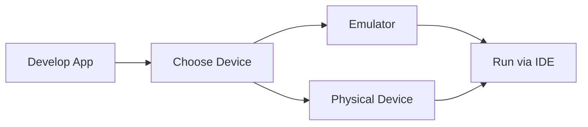

## 1.2.3 Using Emulators and Physical Devices

In the world of mobile app development, testing your application on various devices is crucial to ensure a seamless user experience across different screen sizes, resolutions, and operating systems. Flutter, with its cross-platform capabilities, allows developers to build applications for both Android and iOS from a single codebase. This section will guide you through setting up emulators and connecting physical devices to test your Flutter applications effectively.

### Setting Up Emulators

Emulators are virtual devices that mimic the behavior of physical devices. They are essential tools for developers to test applications without needing access to multiple physical devices.

#### Creating and Configuring Android Emulators

To set up an Android emulator, you need to have Android Studio installed, as it includes the Android Virtual Device (AVD) Manager.

1. **Open Android Studio**: Launch Android Studio and navigate to the AVD Manager. You can find it under `Tools > AVD Manager`.

2. **Create a New Virtual Device**: Click on "Create Virtual Device" to open the device configuration wizard.

3. **Select a Device Profile**: Choose a device profile that matches the screen size and resolution you wish to test. Popular choices include Pixel 4, Nexus 5X, etc.

4. **Choose a System Image**: Select a system image that corresponds to the Android version you want to test. It's recommended to choose the latest stable version.

5. **Configure Emulator Settings**: Adjust settings such as RAM, internal storage, and graphics acceleration based on your system capabilities.

6. **Finish and Launch**: Once configured, click "Finish" to create the emulator. You can launch it by clicking the "Play" button next to the emulator name in the AVD Manager.

#### Creating and Configuring iOS Emulators

For iOS, emulators are known as simulators, and they are managed through Xcode.

1. **Open Xcode**: Launch Xcode and go to `Xcode > Preferences > Components`.

2. **Install Simulators**: Ensure that you have the necessary simulators installed. You can download additional simulators for different iOS versions from this menu.

3. **Launch Simulator**: Use the `Simulator` app, which is bundled with Xcode, to launch a specific simulator. You can also run simulators directly from Xcode when you build your app.

#### Managing Multiple Emulator Profiles

Managing multiple emulator profiles allows you to test your app on different configurations without needing multiple physical devices.

- **Naming Conventions**: Use descriptive names for your emulators, such as `Pixel_4_API_30`, to easily identify them.

- **Snapshot Feature**: Use the snapshot feature to save the state of an emulator, allowing you to quickly return to a specific configuration.

- **Performance Optimization**: Allocate sufficient RAM and enable hardware acceleration to ensure smooth operation of emulators.

### Connecting Physical Devices

Testing on physical devices provides the most accurate representation of how your app will perform in the real world.

#### Enabling Developer Mode and USB Debugging on Android

1. **Enable Developer Options**: Go to `Settings > About Phone` and tap on "Build Number" seven times to unlock developer options.

2. **Enable USB Debugging**: Navigate to `Settings > Developer Options` and enable "USB Debugging".

3. **Connect Your Device**: Use a USB cable to connect your Android device to your computer. Ensure that you have the necessary drivers installed.

#### Setting Up iOS Devices for Development

1. **Register Your Device**: Connect your iOS device to your Mac. Open Xcode and navigate to `Window > Devices and Simulators`.

2. **Trust the Computer**: On your iOS device, you may need to trust the computer when prompted.

3. **Provisioning Profiles**: Ensure that your device is registered in your Apple Developer account and that you have the correct provisioning profiles.

### Running Flutter Apps

Once your emulators and physical devices are set up, you can run your Flutter applications on them.

#### Launching Apps on Emulators and Physical Devices

You can run your Flutter app using either the command line or your IDE.

- **Using the Command Line**:
  ```bash
  flutter devices
  flutter run -d emulator-5554
  ```
  The `flutter devices` command lists all connected devices and emulators. The `-d` flag specifies the device ID.

- **Using an IDE**: In Android Studio or VS Code, you can select the target device from the device dropdown and click the "Run" button.

#### Workflow Diagram

The following Mermaid.js diagram illustrates the process of running apps on different devices:



### Tips for Effective Testing

- **Diverse Testing**: Test your app on both emulators and physical devices to cover a wide range of scenarios.

- **Multiple Configurations**: Use emulators with different screen sizes and Android/iOS versions to ensure compatibility.

- **Resource Management**: Close unused emulators to free up system resources.

- **Network Conditions**: Test your app under different network conditions using emulators' network throttling features.

### Best Practices

- **Regular Updates**: Keep your emulators and physical devices updated to the latest OS versions to test new features and APIs.

- **Debugging Tools**: Utilize Flutter's DevTools for debugging and performance profiling on both emulators and physical devices.

- **Battery and Performance Testing**: Test how your app affects battery life and performance on physical devices.

### Conclusion

Setting up emulators and physical devices is a fundamental step in Flutter development, enabling you to test and refine your applications across various environments. By following the guidelines and best practices outlined in this section, you'll be well-equipped to ensure your app delivers a consistent and high-quality user experience.

### Further Resources

- [Flutter Documentation](https://flutter.dev/docs)
- [Android Developer Guide](https://developer.android.com/studio/run/emulator)
- [Apple Developer Documentation](https://developer.apple.com/documentation/xcode/running_your_app_in_the_simulator_or_on_a_device)

## Quiz Time!



### What is the primary tool for managing Android emulators?

- [x] Android Virtual Device (AVD) Manager
- [ ] Xcode
- [ ] Flutter DevTools
- [ ] Android SDK Manager

> **Explanation:** The Android Virtual Device (AVD) Manager is used to create and manage Android emulators.

### How can you enable USB debugging on an Android device?

- [x] By enabling Developer Options and turning on USB Debugging
- [ ] By installing a special app from the Play Store
- [ ] By connecting the device to a computer and running a command
- [ ] By updating the device's firmware

> **Explanation:** USB Debugging is enabled through the Developer Options, which can be accessed by tapping the Build Number seven times.

### Which command lists all connected devices and emulators in Flutter?

- [x] flutter devices
- [ ] flutter list
- [ ] flutter emulators
- [ ] flutter connect

> **Explanation:** The `flutter devices` command lists all connected devices and emulators.

### What is a key benefit of using physical devices for testing?

- [x] Accurate representation of real-world performance
- [ ] Faster app launch times
- [ ] Unlimited storage space
- [ ] Built-in debugging tools

> **Explanation:** Physical devices provide the most accurate representation of how an app will perform in the real world.

### Which tool is used to run iOS simulators?

- [x] Xcode
- [ ] Android Studio
- [ ] Visual Studio Code
- [ ] Flutter DevTools

> **Explanation:** Xcode is used to run iOS simulators.

### What is the purpose of the `flutter run -d` command?

- [x] To run a Flutter app on a specified device
- [ ] To deploy the app to the app store
- [ ] To compile the app for release
- [ ] To list available emulators

> **Explanation:** The `flutter run -d` command is used to run a Flutter app on a specified device.

### How can you optimize emulator performance?

- [x] By enabling hardware acceleration and allocating sufficient RAM
- [ ] By reducing the screen resolution
- [ ] By disabling network access
- [ ] By using older Android versions

> **Explanation:** Enabling hardware acceleration and allocating sufficient RAM can optimize emulator performance.

### What is a snapshot in the context of emulators?

- [x] A saved state of an emulator
- [ ] A screenshot of the emulator screen
- [ ] A backup of the emulator's data
- [ ] A log of emulator activities

> **Explanation:** A snapshot is a saved state of an emulator, allowing you to return to a specific configuration quickly.

### Why is it important to test apps under different network conditions?

- [x] To ensure app functionality and performance in various scenarios
- [ ] To reduce data usage
- [ ] To improve battery life
- [ ] To increase app speed

> **Explanation:** Testing under different network conditions ensures that the app functions and performs well in various scenarios.

### True or False: Emulators can perfectly replicate the performance of physical devices.

- [ ] True
- [x] False

> **Explanation:** Emulators cannot perfectly replicate the performance of physical devices due to differences in hardware and other factors.


