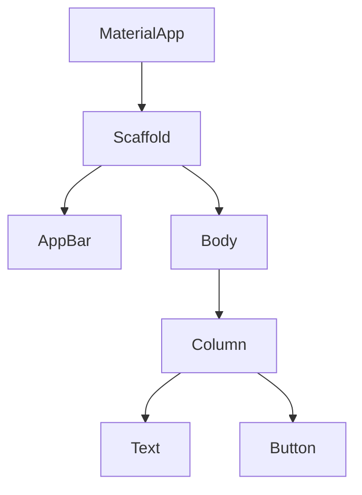

## 1.3.1 The Widget Tree Explained

In the world of Flutter, understanding the widget tree is fundamental to mastering the art of building responsive and adaptive user interfaces. This section delves into the concept of the widget tree, its hierarchical nature, and how it forms the backbone of Flutter's declarative UI approach. We will explore how widgets are composed to create complex interfaces, provide practical code examples, and share best practices for organizing your widget tree for readability and maintainability.

### Concept of Widget Tree

Flutter employs a declarative UI approach, meaning that the UI is described in terms of widgets. A widget in Flutter is an immutable description of part of the user interface. Every element in a Flutter app is a widget, from the simplest text to complex layouts. The widget tree is a hierarchical representation of these widgets, where each widget is a node in the tree.

- **Declarative UI Approach:** In a declarative UI framework like Flutter, you describe what the UI should look like for a given state, and Flutter takes care of updating the UI when the state changes. This is in contrast to imperative UI frameworks, where you manually update the UI in response to state changes.
- **Widget Tree Structure:** The widget tree is a nested structure where each widget can have one or more child widgets. This hierarchy allows you to build complex UIs by composing simpler widgets.

### Hierarchy and Composition

The power of Flutter lies in its ability to compose widgets to create complex interfaces. This composition is achieved by nesting widgets within each other, forming a tree-like structure.

- **Nesting Widgets:** Widgets are nested to form a hierarchy. For example, a `Scaffold` widget might contain an `AppBar` and a `Body`, where the `Body` could be a `Column` containing `Text` and `Button` widgets.
- **Building Complex Interfaces:** By combining simple widgets, you can create complex layouts. This modular approach promotes reusability and maintainability.

#### Mermaid.js Diagram of a Simple Widget Tree

To visualize this concept, let's look at a simple widget tree using a Mermaid.js diagram:



This diagram represents a basic Flutter app structure where a `MaterialApp` contains a `Scaffold`, which in turn contains an `AppBar` and a `Body`. The `Body` is a `Column` with a `Text` and a `Button`.

### Code Examples

Let's translate this diagram into a practical Flutter application. Below is a simple Flutter app that demonstrates the widget tree structure:

```dart
import 'package:flutter/material.dart';

void main() => runApp(MyApp());

class MyApp extends StatelessWidget {
  @override
  Widget build(BuildContext context) {
    return MaterialApp(
      home: Scaffold(
        appBar: AppBar(title: Text('Widget Tree Example')),
        body: Column(
          children: [
            Text('Hello, Flutter!'),
            ElevatedButton(
              onPressed: () {},
              child: Text('Press Me'),
            ),
          ],
        ),
      ),
    );
  }
}
```

#### Code Explanation

- **MaterialApp:** This is the root widget of the application, providing material design visual structure.
- **Scaffold:** Provides a basic structure for the app, including an `AppBar` and a `Body`.
- **AppBar:** A material design app bar that displays at the top of the app.
- **Column:** A widget that arranges its children vertically.
- **Text and ElevatedButton:** Simple widgets that display text and a button, respectively.

### Best Practices

Building a well-structured widget tree is crucial for maintaining readability and scalability in your Flutter applications. Here are some best practices to consider:

- **Organize Your Widgets:** Keep your widget tree organized by breaking down complex UIs into smaller, reusable widget classes. This not only improves readability but also makes your codebase easier to maintain.
- **Use Separate Widget Classes:** For complex components, create separate widget classes. This encapsulation allows you to manage each component independently and promotes reusability.
- **Maintain Consistency:** Follow consistent naming conventions and structure throughout your widget tree to make it easier for others (and yourself) to understand your code.
- **Optimize for Performance:** Be mindful of the depth of your widget tree. While Flutter is efficient, deeply nested trees can impact performance. Use widgets like `ListView.builder` for large lists to improve efficiency.

### Conclusion

The widget tree is a foundational concept in Flutter that enables developers to build complex, responsive, and adaptive UIs through a declarative approach. By understanding how to compose widgets and organize your widget tree effectively, you can create scalable and maintainable applications. Remember to apply best practices and consider performance implications as you build your Flutter applications.

### Further Reading and Resources

- [Flutter Documentation on Widgets](https://flutter.dev/docs/development/ui/widgets)
- [Flutter Widget of the Week](https://www.youtube.com/playlist?list=PLjxrf2q8roU2v3AibJWXs7P3b0cFDtSSh) - A YouTube series showcasing different Flutter widgets.
- [Flutter Layout Cheat Sheet](https://medium.com/flutter-community/flutter-layout-cheat-sheet-5363348d037e) - A comprehensive guide to Flutter layouts.

By mastering the widget tree, you lay a strong foundation for building sophisticated Flutter applications. Keep exploring and experimenting with different widget combinations to enhance your skills.

---

## Quiz Time!



### What is the widget tree in Flutter?

- [x] A hierarchical representation of widgets in a Flutter app.
- [ ] A list of all available widgets in Flutter.
- [ ] A tool for debugging Flutter applications.
- [ ] A method for optimizing app performance.

> **Explanation:** The widget tree is a hierarchical representation of widgets that make up the UI of a Flutter application.

### What is the primary benefit of Flutter's declarative UI approach?

- [x] It allows developers to describe the UI in terms of the current state.
- [ ] It automatically optimizes the app for performance.
- [ ] It simplifies the installation of Flutter.
- [ ] It provides a list of all available widgets.

> **Explanation:** Flutter's declarative UI approach allows developers to describe what the UI should look like for a given state, and Flutter handles the updates when the state changes.

### Which widget is typically the root of a Flutter application?

- [x] MaterialApp
- [ ] Scaffold
- [ ] Column
- [ ] AppBar

> **Explanation:** The `MaterialApp` widget is typically the root of a Flutter application, providing the material design structure.

### What is the purpose of the Scaffold widget in Flutter?

- [x] It provides a basic structure for the app, including an AppBar and a Body.
- [ ] It is used to display text.
- [ ] It handles network requests.
- [ ] It manages app state.

> **Explanation:** The `Scaffold` widget provides a basic structure for the app, including an `AppBar`, `Body`, and other elements.

### Why is it important to organize widgets into separate classes?

- [x] For readability and maintainability.
- [ ] To reduce the number of files in the project.
- [ ] To improve app performance.
- [ ] To ensure compatibility with older devices.

> **Explanation:** Organizing widgets into separate classes improves readability and maintainability by encapsulating functionality and promoting reusability.

### What is a common practice to improve performance in large lists?

- [x] Use ListView.builder
- [ ] Use a single Column widget
- [ ] Avoid using Scaffold
- [ ] Use only StatelessWidgets

> **Explanation:** Using `ListView.builder` is a common practice to efficiently render large lists by building items on demand.

### How does the Column widget arrange its children?

- [x] Vertically
- [ ] Horizontally
- [ ] In a grid
- [ ] In a circle

> **Explanation:** The `Column` widget arranges its children vertically.

### What is a benefit of using the const keyword in Flutter?

- [x] It can improve performance by reducing rebuilds.
- [ ] It allows for dynamic UI updates.
- [ ] It simplifies network requests.
- [ ] It enhances security.

> **Explanation:** Using the `const` keyword can improve performance by reducing unnecessary rebuilds of widgets.

### What is the role of the AppBar widget?

- [x] It displays a material design app bar at the top of the app.
- [ ] It handles user input.
- [ ] It manages network connections.
- [ ] It provides a list of available themes.

> **Explanation:** The `AppBar` widget displays a material design app bar at the top of the app.

### True or False: The widget tree in Flutter is mutable.

- [ ] True
- [x] False

> **Explanation:** The widget tree in Flutter is immutable. Widgets themselves do not change; instead, the framework rebuilds the widget tree when the app's state changes.


