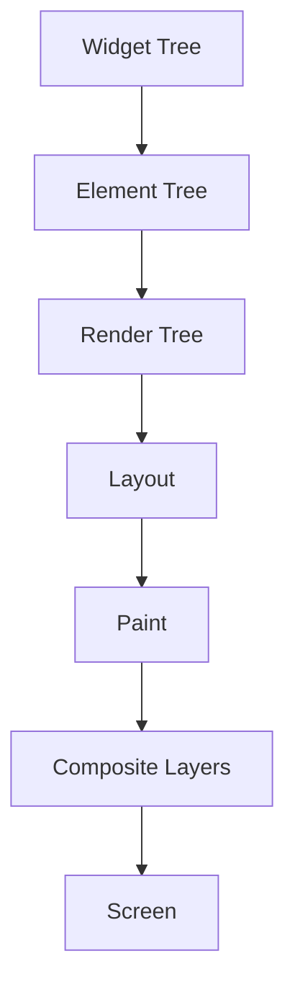

## 1.3.3 The Rendering Process in Flutter

Flutter, a powerful UI toolkit for building natively compiled applications for mobile, web, and desktop from a single codebase, is renowned for its fast and expressive rendering capabilities. Understanding the rendering process in Flutter is crucial for developers aiming to build efficient and responsive applications. This section delves into the rendering pipeline, detailing each stage from widget creation to the final display on the screen, and offers insights into optimizing performance.

### The Rendering Pipeline

Flutter's rendering pipeline is a sophisticated process that transforms a developer's code into the visual elements users interact with. This pipeline consists of several stages, each responsible for a specific part of the rendering process. Here's an overview of these stages:

- **Widget Tree Construction:** The initial stage where widgets are created and organized into a tree structure.
- **Element Tree Creation:** Widgets are instantiated into elements, which maintain the widget's state.
- **Render Tree Formation:** Elements are transformed into render objects that handle layout and painting.
- **Layout:** The render objects are measured and positioned on the screen.
- **Paint:** The visual representation of each render object is drawn.
- **Composite:** The painted layers are combined and sent to the GPU for display.

#### Stages of the Rendering Process

Let's explore each stage in detail:

##### 1. Build

During the build phase, Flutter constructs the **Widget Tree**. This tree is a hierarchical representation of the UI components defined in the code. Widgets are immutable descriptions of the interface, and they can be either **Stateless** or **Stateful**. The build method of a widget is called whenever the widget needs to be rendered.

- **Stateless Widgets:** These widgets do not maintain any state and are rebuilt only when their parent widget changes.
- **Stateful Widgets:** These widgets maintain state, and their build method can be triggered by calling `setState()`.

Example of a `StatefulWidget` triggering a rebuild:

```dart
class CounterWidget extends StatefulWidget {
  @override
  _CounterWidgetState createState() => _CounterWidgetState();
}

class _CounterWidgetState extends State<CounterWidget> {
  int _count = 0;

  void _incrementCounter() {
    setState(() {
      _count++;
    });
  }

  @override
  Widget build(BuildContext context) {
    return Column(
      children: [
        Text('Count: $_count'),
        ElevatedButton(
          onPressed: _incrementCounter,
          child: Text('Increment'),
        ),
      ],
    );
  }
}
```

In this example, calling `_incrementCounter` triggers a call to `setState`, which marks the widget for rebuild, updating the UI with the new count value.

##### 2. Layout

Once the widget tree is built, Flutter proceeds to create the **Element Tree**. Elements are instances of widgets that hold the widget's configuration and state. The element tree is then used to construct the **Render Tree**, which consists of render objects responsible for layout and painting.

During the layout phase, each render object is measured and positioned according to the constraints provided by its parent. This phase ensures that each widget knows its size and position on the screen.

- **Constraints:** Flutter's layout system is based on a constraint-based model, where parent widgets dictate the constraints for their children.

##### 3. Paint

After the layout is complete, the paint phase begins. In this stage, each render object creates a list of **Painting Commands** that describe how to draw the widget on the screen. These commands are executed to produce the visual representation of the UI.

- **Painting Order:** The order in which widgets are painted is determined by their position in the render tree. Widgets higher in the tree are painted first.

##### 4. Composite

The final stage is compositing, where the painted layers are combined into a single image that is sent to the GPU for rendering on the screen. This stage involves optimizing the rendering process by minimizing the number of layers and reducing overdraw.

### Visualizing the Rendering Process

To better understand the rendering process, let's visualize it using a Mermaid.js flowchart:



This diagram illustrates the transformation from the widget tree to the final display on the screen, highlighting the sequential nature of the rendering pipeline.

### Performance Considerations

Efficient rendering is crucial for maintaining a smooth user experience. Here are some best practices to optimize the rendering process in Flutter:

- **Minimize Rebuilds:** Excessive widget rebuilds can degrade performance. Use `const` constructors for widgets that do not change, as they are not rebuilt unnecessarily.
  
  ```dart
  const Text('Hello, World!');
  ```

- **Use Keys Wisely:** Keys help Flutter identify widgets that should be preserved during rebuilds, reducing unnecessary work.

  ```dart
  ListView.builder(
    itemBuilder: (context, index) {
      return ListTile(
        key: ValueKey(index),
        title: Text('Item $index'),
      );
    },
  );
  ```

- **Avoid Deep Widget Trees:** Flatten widget hierarchies where possible to reduce the complexity of the build process.

- **Profile and Optimize:** Use Flutter's performance tools to identify bottlenecks and optimize them.

### Conclusion

Understanding Flutter's rendering process is essential for building efficient and responsive applications. By mastering the stages of the rendering pipeline and applying best practices, developers can create high-performance UIs that provide a seamless user experience. As you continue to explore Flutter, keep these insights in mind to optimize your applications effectively.

## Quiz Time!



### What is the first stage in Flutter's rendering pipeline?

- [x] Widget Tree Construction
- [ ] Element Tree Creation
- [ ] Render Tree Formation
- [ ] Layout

> **Explanation:** The rendering process begins with the construction of the Widget Tree, where widgets are organized hierarchically.

### What is the role of the Element Tree in Flutter's rendering process?

- [x] It maintains the state of widgets.
- [ ] It handles the painting of widgets.
- [ ] It is responsible for compositing layers.
- [ ] It manages the layout of widgets.

> **Explanation:** The Element Tree maintains the state and configuration of widgets, serving as the bridge between the Widget Tree and the Render Tree.

### Which phase involves measuring and positioning render objects?

- [ ] Build
- [x] Layout
- [ ] Paint
- [ ] Composite

> **Explanation:** The Layout phase is responsible for measuring and positioning render objects according to constraints.

### What is the purpose of the Paint phase in Flutter's rendering process?

- [ ] To construct the Widget Tree
- [ ] To measure and position widgets
- [x] To create painting commands for rendering
- [ ] To combine layers for the GPU

> **Explanation:** The Paint phase generates painting commands that describe how to draw each widget on the screen.

### How can excessive widget rebuilds impact performance?

- [x] They can degrade performance by increasing computational load.
- [ ] They improve performance by refreshing the UI.
- [ ] They have no impact on performance.
- [ ] They reduce memory usage.

> **Explanation:** Excessive rebuilds increase computational load, potentially leading to performance issues.

### What is a best practice to minimize unnecessary widget rebuilds?

- [x] Use const constructors for immutable widgets.
- [ ] Avoid using keys in widgets.
- [ ] Increase the depth of widget trees.
- [ ] Use StatefulWidgets for all UI components.

> **Explanation:** Using const constructors for immutable widgets prevents unnecessary rebuilds, optimizing performance.

### How do keys help in the rendering process?

- [x] They help Flutter identify widgets to preserve during rebuilds.
- [ ] They are used to measure widget size.
- [ ] They determine the painting order of widgets.
- [ ] They are used for compositing layers.

> **Explanation:** Keys help Flutter recognize widgets that should be preserved during rebuilds, reducing unnecessary work.

### What is the final stage in Flutter's rendering pipeline?

- [ ] Layout
- [ ] Paint
- [x] Composite
- [ ] Build

> **Explanation:** The Composite stage is the final step, where painted layers are combined and sent to the GPU.

### Which tool can be used to identify performance bottlenecks in Flutter?

- [x] Flutter's performance tools
- [ ] The Element Tree
- [ ] The Render Tree
- [ ] The Widget Tree

> **Explanation:** Flutter's performance tools are designed to help developers identify and optimize performance bottlenecks.

### True or False: The Render Tree is responsible for maintaining widget state.

- [ ] True
- [x] False

> **Explanation:** The Render Tree is responsible for layout and painting, while the Element Tree maintains widget state.


