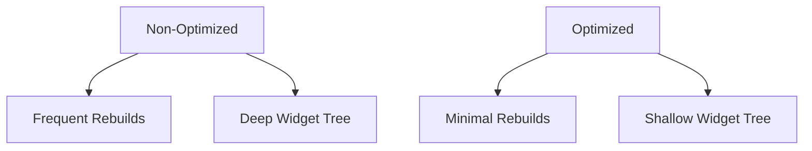

## 1.3.4 Performance Considerations

In the world of mobile app development, performance is a critical factor that can make or break the user experience. Flutter, known for its expressive and flexible UI, offers a powerful toolkit for building beautiful applications. However, to ensure that these applications run smoothly across a range of devices, developers must pay close attention to performance optimization. This section delves into key strategies for optimizing widget builds, creating efficient layouts, and employing memoization techniques to enhance the performance of your Flutter applications.

### Optimizing Widget Builds

#### Minimizing Unnecessary Widget Rebuilds

In Flutter, the widget tree is the backbone of your application’s UI. Each time the state of your application changes, Flutter rebuilds the affected parts of the widget tree. While this mechanism is efficient, unnecessary rebuilds can lead to performance bottlenecks. Here are some strategies to minimize these rebuilds:

- **Use `const` Constructors:** One of the simplest yet most effective ways to reduce rebuilds is by using `const` constructors. When a widget is declared as `const`, Flutter knows that it will never change, allowing it to skip rebuilding that widget. This is particularly useful for static widgets that do not depend on dynamic data.

  ```dart
  // Example of using a const constructor
  const Text('Optimized Text');
  ```

- **Avoid Rebuilding the Entire Widget Tree:** Instead of rebuilding the entire widget tree, aim to rebuild only the parts that have changed. This can be achieved by structuring your widget tree in a way that isolates stateful widgets and minimizes their scope.

- **Leverage the `shouldRebuild` Method:** For custom widgets, you can override the `shouldRebuild` method to determine whether a widget should be rebuilt. This method can be used to implement fine-grained control over rebuilds.

#### Code Example: Using `const` Constructors

Consider the following example where we optimize a simple widget tree by using `const` constructors:

```dart
import 'package:flutter/material.dart';

class OptimizedWidget extends StatelessWidget {
  @override
  Widget build(BuildContext context) {
    return Column(
      children: [
        const Text('This is a constant text widget'),
        const Icon(Icons.star, color: Colors.yellow),
        ElevatedButton(
          onPressed: () {
            // Perform some action
          },
          child: const Text('Press Me'),
        ),
      ],
    );
  }
}
```

In this example, the `Text` and `Icon` widgets are declared as `const`, ensuring that they are not rebuilt unnecessarily.

### Efficient Layouts

#### Creating Lightweight Layouts

Efficient layouts are crucial for maintaining smooth performance in Flutter applications. Here are some tips for creating lightweight layouts:

- **Avoid Deep Widget Trees:** Deep widget trees can lead to increased complexity and reduced performance. Aim to keep your widget hierarchy as shallow as possible. This can be achieved by breaking down complex layouts into smaller, reusable components.

- **Use Lightweight Widgets:** Prefer using lightweight widgets such as `Container`, `Padding`, and `Align` over heavier widgets like `Stack` and `ListView` when possible.

- **Optimize Layouts with `LayoutBuilder`:** Use `LayoutBuilder` to adapt your layout based on the available space. This can help in creating responsive designs that adjust to different screen sizes without unnecessary rebuilds.

#### Memoization

Memoization is a technique used to cache the results of expensive function calls and return the cached result when the same inputs occur again. In Flutter, memoization can be applied to widget builds to avoid redundant calculations.

- **Implementing Memoization:** You can implement memoization by storing the results of expensive operations in a variable and reusing them across builds. This is particularly useful for widgets that perform complex calculations or fetch data.

### Diagram: Optimized vs. Non-Optimized Widget Trees

To visualize the impact of optimization, consider the following diagram that compares non-optimized and optimized widget trees:



In the non-optimized scenario, frequent rebuilds and a deep widget tree can lead to performance issues. In contrast, the optimized scenario minimizes rebuilds and maintains a shallow widget tree, enhancing performance.

### Best Practices

#### Profiling and Performance Tools

- **Use Flutter’s Performance Tools:** Flutter provides a suite of performance tools, including the Flutter DevTools, which can help you identify and address performance bottlenecks. These tools allow you to inspect widget rebuilds, analyze frame rendering times, and monitor memory usage.

- **Profile Your Application:** Regularly profile your application to identify areas that require optimization. This can be done using the performance overlay, which provides real-time insights into frame rendering and build times.

#### Breaking Down Complex Widgets

- **Decompose Complex Widgets:** Break down complex widgets into smaller, reusable components. This not only improves performance but also enhances code readability and maintainability.

- **Use Stateless Widgets Where Possible:** Prefer using stateless widgets over stateful widgets when the widget does not depend on dynamic data. Stateless widgets are inherently more efficient as they do not require state management.

### Conclusion

Optimizing performance in Flutter applications is a multifaceted process that involves minimizing unnecessary widget rebuilds, creating efficient layouts, and employing memoization techniques. By following the strategies outlined in this section, you can enhance the performance of your Flutter applications, ensuring a smooth and responsive user experience. Remember to leverage Flutter’s performance tools to continuously monitor and improve your application’s performance.

### Further Reading and Resources

- [Flutter Performance Best Practices](https://flutter.dev/docs/perf/rendering)
- [Using the Flutter DevTools](https://flutter.dev/docs/development/tools/devtools/overview)
- [Effective Dart: Performance](https://dart.dev/guides/language/effective-dart/performance)

By applying these techniques and continuously refining your approach, you can build high-performance Flutter applications that delight users with their responsiveness and fluidity.

## Quiz Time!



### Which of the following is a strategy to minimize unnecessary widget rebuilds in Flutter?

- [x] Use `const` constructors
- [ ] Use deep widget trees
- [ ] Avoid using stateless widgets
- [ ] Rebuild the entire widget tree frequently

> **Explanation:** Using `const` constructors helps Flutter identify widgets that do not need to be rebuilt, thus minimizing unnecessary rebuilds.


### What is a benefit of using `const` constructors in Flutter?

- [x] They prevent unnecessary widget rebuilds
- [ ] They increase the complexity of the widget tree
- [ ] They make widgets stateful
- [ ] They are only used for debugging purposes

> **Explanation:** `const` constructors allow Flutter to optimize performance by skipping rebuilds for widgets that do not change.


### How can you create efficient layouts in Flutter?

- [x] Avoid deep widget trees
- [ ] Use heavy widgets like `Stack` unnecessarily
- [ ] Rebuild the entire widget tree frequently
- [ ] Avoid using `LayoutBuilder`

> **Explanation:** Avoiding deep widget trees helps in maintaining performance by reducing complexity.


### What is memoization used for in Flutter?

- [x] Caching results of expensive operations
- [ ] Increasing widget rebuilds
- [ ] Making widgets stateful
- [ ] Avoiding the use of `const` constructors

> **Explanation:** Memoization caches the results of expensive operations to avoid redundant calculations.


### Which tool can help identify performance bottlenecks in Flutter applications?

- [x] Flutter DevTools
- [ ] Dart Analyzer
- [ ] Android Studio
- [ ] Visual Studio Code

> **Explanation:** Flutter DevTools provide insights into widget rebuilds, frame rendering times, and memory usage.


### What is a recommended practice for handling complex widgets?

- [x] Break them down into smaller, reusable components
- [ ] Use stateful widgets for all components
- [ ] Avoid using stateless widgets
- [ ] Rebuild the entire widget tree frequently

> **Explanation:** Breaking down complex widgets into smaller components improves performance and maintainability.


### Why should you prefer stateless widgets over stateful widgets when possible?

- [x] Stateless widgets are more efficient as they do not require state management
- [ ] Stateless widgets are more complex to implement
- [ ] Stateful widgets are always faster
- [ ] Stateless widgets cannot be reused

> **Explanation:** Stateless widgets are inherently more efficient because they do not manage state.


### What is the role of the `shouldRebuild` method in custom widgets?

- [x] It determines whether a widget should be rebuilt
- [ ] It increases the frequency of widget rebuilds
- [ ] It makes widgets stateful
- [ ] It is used only for debugging purposes

> **Explanation:** The `shouldRebuild` method provides fine-grained control over whether a widget should be rebuilt.


### How can `LayoutBuilder` be used to optimize layouts?

- [x] By adapting the layout based on available space
- [ ] By forcing deep widget trees
- [ ] By increasing widget rebuilds
- [ ] By avoiding the use of `const` constructors

> **Explanation:** `LayoutBuilder` helps in creating responsive designs that adjust to different screen sizes efficiently.


### True or False: Using `const` constructors can help reduce unnecessary widget rebuilds in Flutter.

- [x] True
- [ ] False

> **Explanation:** `const` constructors allow Flutter to optimize performance by skipping rebuilds for widgets that do not change.


