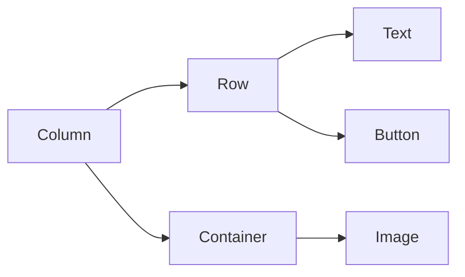

## 1.4.1 Common Layout Widgets

In the world of Flutter, layout widgets are the building blocks that allow developers to create complex and responsive user interfaces. Understanding these widgets is crucial for anyone looking to master Flutter's UI design capabilities. This section will delve into the most commonly used layout widgets: `Container`, `Row`, `Column`, `Stack`, `Expanded`, and `Flexible`. We will explore their purposes, usage, and how they can be combined to create sophisticated layouts.

### Overview of Key Widgets

#### Container

The `Container` widget is one of the most versatile and commonly used widgets in Flutter. It acts as a box that can contain other widgets and allows you to apply padding, margins, borders, and background color. It is often used as a building block for more complex layouts.

**Usage:**

- **Styling:** Apply background colors, borders, and shadows.
- **Positioning:** Use padding and margin to position child widgets.
- **Sizing:** Set fixed or flexible sizes using width and height properties.

**Example:**

```dart
Container(
  color: Colors.blue,
  padding: EdgeInsets.all(16.0),
  margin: EdgeInsets.symmetric(vertical: 10.0),
  child: Text('Hello, Flutter!'),
)
```

#### Row and Column

`Row` and `Column` are fundamental layout widgets that arrange their children in a horizontal or vertical direction, respectively. They are essential for creating linear layouts.

**Row:**

- **Purpose:** Arrange widgets horizontally.
- **Properties:** `mainAxisAlignment`, `crossAxisAlignment`, `children`.

**Column:**

- **Purpose:** Arrange widgets vertically.
- **Properties:** Similar to `Row`, with `mainAxisAlignment`, `crossAxisAlignment`, `children`.

**Example:**

```dart
Column(
  mainAxisAlignment: MainAxisAlignment.center,
  children: <Widget>[
    Row(
      mainAxisAlignment: MainAxisAlignment.spaceEvenly,
      children: <Widget>[
        Text('Item 1'),
        Text('Item 2'),
      ],
    ),
    Container(
      color: Colors.blue,
      height: 50,
      width: 100,
    ),
  ],
)
```

#### Stack

The `Stack` widget allows you to place widgets on top of each other. It is useful for overlaying widgets, such as placing text over an image.

**Usage:**

- **Positioning:** Use `Positioned` widget to precisely position children within the stack.
- **Layering:** Widgets are drawn in the order they appear in the children list.

**Example:**

```dart
Stack(
  children: <Widget>[
    Container(
      color: Colors.blue,
      width: 200,
      height: 200,
    ),
    Positioned(
      top: 50,
      left: 50,
      child: Text('Overlay Text'),
    ),
  ],
)
```

#### Expanded and Flexible

`Expanded` and `Flexible` widgets are used within `Row`, `Column`, or `Flex` widgets to control how much space a child should take relative to its siblings.

**Expanded:**

- **Purpose:** Make a child widget take up the remaining space in a `Row` or `Column`.

**Flexible:**

- **Purpose:** Allow a child widget to take up a flexible amount of space, sharing it with other `Flexible` widgets.

**Example:**

```dart
Row(
  children: <Widget>[
    Expanded(
      child: Container(
        color: Colors.red,
        height: 100,
      ),
    ),
    Flexible(
      child: Container(
        color: Colors.green,
        height: 100,
      ),
    ),
  ],
)
```

### Combining Layout Widgets

Combining different layout widgets allows you to create complex and responsive UIs. For example, you can nest `Row` and `Column` widgets within a `Stack` to achieve intricate designs.



### Best Practices

- **Choose the Right Widget:** Use `Row` and `Column` for linear layouts, `Stack` for overlays, and `Container` for styling and positioning.
- **Use `const` Where Possible:** Declaring widgets as `const` can improve performance by reducing rebuilds.
- **Avoid Deep Nesting:** Excessive nesting can lead to complex and hard-to-maintain code. Consider using custom widgets to encapsulate and reuse layout logic.
- **Leverage Expanded and Flexible:** Use these widgets to create responsive layouts that adapt to different screen sizes.

### Practical Code Examples

Let's explore a practical example that combines these widgets to create a simple user interface.

```dart
import 'package:flutter/material.dart';

void main() => runApp(MyApp());

class MyApp extends StatelessWidget {
  @override
  Widget build(BuildContext context) {
    return MaterialApp(
      home: Scaffold(
        appBar: AppBar(
          title: Text('Common Layout Widgets'),
        ),
        body: Column(
          children: <Widget>[
            Row(
              mainAxisAlignment: MainAxisAlignment.spaceAround,
              children: <Widget>[
                Text('Home'),
                Text('Profile'),
                Text('Settings'),
              ],
            ),
            Expanded(
              child: Container(
                color: Colors.blueAccent,
                child: Center(
                  child: Text(
                    'Welcome to Flutter!',
                    style: TextStyle(color: Colors.white, fontSize: 24),
                  ),
                ),
              ),
            ),
            Stack(
              children: <Widget>[
                Container(
                  color: Colors.green,
                  height: 100,
                ),
                Positioned(
                  top: 10,
                  left: 10,
                  child: Icon(Icons.star, color: Colors.white),
                ),
              ],
            ),
          ],
        ),
      ),
    );
  }
}
```

### Conclusion

Understanding and effectively utilizing common layout widgets is essential for building responsive and adaptive UIs in Flutter. By mastering `Container`, `Row`, `Column`, `Stack`, `Expanded`, and `Flexible`, you can create complex layouts that are both efficient and visually appealing. Remember to follow best practices, such as using `const` where possible and avoiding deep nesting, to maintain performance and code readability.

## Quiz Time!



### What is the primary purpose of the `Container` widget in Flutter?

- [x] To provide a box model for styling and positioning child widgets.
- [ ] To arrange child widgets in a horizontal line.
- [ ] To overlay widgets on top of each other.
- [ ] To make child widgets take up the remaining space.

> **Explanation:** The `Container` widget is used for styling and positioning child widgets, allowing you to apply padding, margins, borders, and background colors.

### Which widget would you use to arrange children in a vertical layout?

- [ ] Row
- [x] Column
- [ ] Stack
- [ ] Container

> **Explanation:** The `Column` widget is used to arrange its children in a vertical layout.

### How does the `Stack` widget arrange its children?

- [ ] Horizontally
- [ ] Vertically
- [x] On top of each other
- [ ] In a grid

> **Explanation:** The `Stack` widget arranges its children on top of each other, allowing for overlaying.

### What is the role of the `Expanded` widget in a `Row` or `Column`?

- [ ] To provide padding around child widgets.
- [x] To make a child widget take up the remaining space.
- [ ] To arrange children in a grid.
- [ ] To overlay widgets.

> **Explanation:** The `Expanded` widget makes a child widget take up the remaining space in a `Row` or `Column`.

### Which property of `Row` and `Column` widgets controls the alignment of children along the main axis?

- [x] mainAxisAlignment
- [ ] crossAxisAlignment
- [ ] children
- [ ] padding

> **Explanation:** The `mainAxisAlignment` property controls the alignment of children along the main axis of `Row` and `Column` widgets.

### What is a common use case for the `Flexible` widget?

- [ ] To apply a background color.
- [ ] To overlay text on an image.
- [x] To allow a child widget to take up a flexible amount of space.
- [ ] To arrange children in a vertical layout.

> **Explanation:** The `Flexible` widget allows a child widget to take up a flexible amount of space, sharing it with other `Flexible` widgets.

### Which widget would you use to precisely position a child within a `Stack`?

- [ ] Container
- [ ] Row
- [ ] Column
- [x] Positioned

> **Explanation:** The `Positioned` widget is used to precisely position a child within a `Stack`.

### What is the benefit of using `const` with widgets?

- [x] It improves performance by reducing rebuilds.
- [ ] It allows widgets to be styled.
- [ ] It arranges children in a grid.
- [ ] It overlays widgets on top of each other.

> **Explanation:** Using `const` with widgets improves performance by reducing rebuilds, as the widget tree can be reused without changes.

### Which widget is best for creating overlays?

- [ ] Row
- [ ] Column
- [x] Stack
- [ ] Container

> **Explanation:** The `Stack` widget is best for creating overlays, as it allows you to place widgets on top of each other.

### True or False: The `Row` widget can be used to arrange children vertically.

- [ ] True
- [x] False

> **Explanation:** False. The `Row` widget arranges its children horizontally, not vertically.


