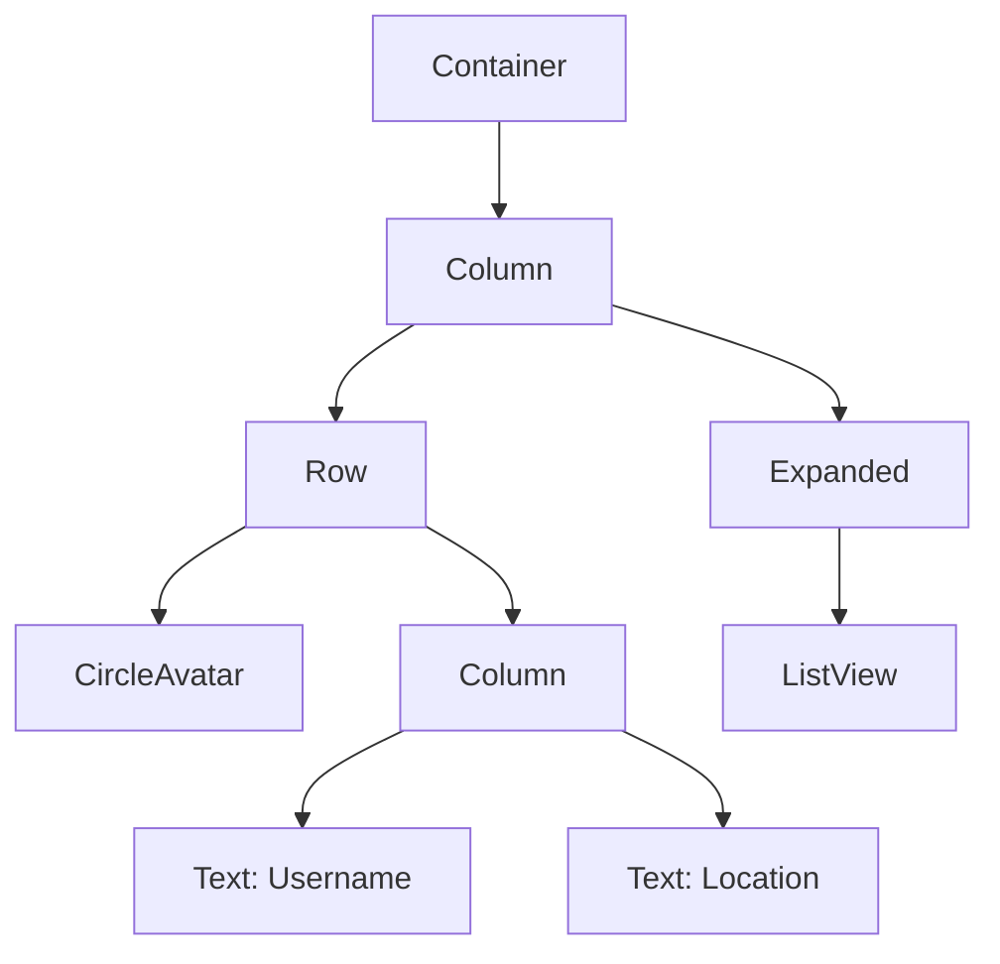

## 1.4.2 Nesting and Combining Widgets

In the world of Flutter, widgets are the building blocks of your application's user interface. Understanding how to effectively nest and combine these widgets is crucial for creating complex, responsive, and adaptive layouts. This section will guide you through the process of building intricate UIs by nesting widgets, provide practical examples, and highlight best practices to keep your code clean and maintainable.

### Building Complex UIs

Flutter's widget system is hierarchical, meaning that widgets are organized in a tree structure. This hierarchy allows developers to build complex UIs by nesting widgets within one another. By combining different types of widgets, you can create intricate layouts that are both functional and visually appealing.

#### The Power of Nesting

Nesting widgets involves placing one widget inside another. This approach allows you to build sophisticated UIs by leveraging the properties and behaviors of different widgets. For example, you can nest `Row` and `Column` widgets to create flexible layouts that adapt to different screen sizes and orientations.

- **Organized Layouts:** Nesting helps in organizing the UI into logical sections, making it easier to manage and understand.
- **Reusability:** By breaking down complex UIs into smaller, reusable widgets, you can maintain consistency across your app and reduce code duplication.
- **Responsiveness:** Nested widgets can respond to changes in the layout, such as screen size or orientation, ensuring a seamless user experience.

### Examples of Nesting

Let's explore how nesting works in practice with some examples. We'll start with a simple layout and gradually build up to more complex structures.

#### Simple Nesting with Row and Column

Consider a basic layout where you want to display a user's profile picture alongside their name and location. This can be achieved by nesting `Row` and `Column` widgets.

```dart
Container(
  padding: EdgeInsets.all(16),
  child: Column(
    children: [
      Row(
        children: [
          CircleAvatar(backgroundImage: NetworkImage('url')),
          SizedBox(width: 10),
          Column(
            crossAxisAlignment: CrossAxisAlignment.start,
            children: [
              Text('Username', style: TextStyle(fontSize: 18)),
              Text('Location', style: TextStyle(color: Colors.grey)),
            ],
          ),
        ],
      ),
    ],
  ),
);
```

In this example, the `Row` widget is used to place the profile picture and text side by side, while the `Column` widget inside the `Row` arranges the text vertically.

#### Complex Layout with Nested Widgets

Let's take it a step further by creating a more complex layout, such as a profile page with a list of posts or activities.

```dart
Container(
  padding: EdgeInsets.all(16),
  child: Column(
    children: [
      Row(
        children: [
          CircleAvatar(backgroundImage: NetworkImage('url')),
          SizedBox(width: 10),
          Column(
            crossAxisAlignment: CrossAxisAlignment.start,
            children: [
              Text('Username', style: TextStyle(fontSize: 18)),
              Text('Location', style: TextStyle(color: Colors.grey)),
            ],
          ),
        ],
      ),
      SizedBox(height: 20),
      Expanded(
        child: ListView(
          children: [
            // List items representing user posts or activities
          ],
        ),
      ),
    ],
  ),
);
```

Here, the `Expanded` widget is used to make the `ListView` take up the remaining space in the `Column`, allowing it to scroll if the content exceeds the available height.

### Hierarchical Diagram of Nested Widgets

To better understand the structure of nested widgets, let's visualize it using a Mermaid.js diagram:



This diagram illustrates the hierarchical relationship between the widgets in our complex layout example. The `Container` is the root, containing a `Column` that further nests a `Row` and an `Expanded` widget.

### Best Practices for Nesting and Combining Widgets

When working with nested widgets, it's important to follow best practices to ensure your code remains clean, efficient, and maintainable.

- **Break Down Complex Layouts:** Divide complex UIs into smaller, manageable widgets. This not only makes your code easier to read but also promotes reusability.
- **Use Descriptive Widget Names:** Naming your widgets descriptively helps in understanding their purpose and role within the layout.
- **Avoid Deep Nesting:** While nesting is powerful, excessive nesting can lead to performance issues and make your code harder to maintain. Aim for a balance between complexity and simplicity.
- **Leverage Flutter's Layout Widgets:** Utilize Flutter's built-in layout widgets like `Expanded`, `Flexible`, and `Spacer` to create responsive designs without excessive nesting.

### Practical Code Example: A Profile Page Layout

Let's put everything together in a practical example—a profile page layout that combines various widgets to create a cohesive design.

```dart
class ProfilePage extends StatelessWidget {
  @override
  Widget build(BuildContext context) {
    return Scaffold(
      appBar: AppBar(
        title: Text('Profile'),
      ),
      body: Container(
        padding: EdgeInsets.all(16),
        child: Column(
          children: [
            Row(
              children: [
                CircleAvatar(
                  backgroundImage: NetworkImage('https://example.com/profile.jpg'),
                  radius: 40,
                ),
                SizedBox(width: 10),
                Column(
                  crossAxisAlignment: CrossAxisAlignment.start,
                  children: [
                    Text('John Doe', style: TextStyle(fontSize: 18, fontWeight: FontWeight.bold)),
                    Text('San Francisco, CA', style: TextStyle(color: Colors.grey)),
                  ],
                ),
              ],
            ),
            SizedBox(height: 20),
            Expanded(
              child: ListView(
                children: [
                  Card(
                    child: ListTile(
                      leading: Icon(Icons.event),
                      title: Text('Event 1'),
                      subtitle: Text('Details about event 1'),
                    ),
                  ),
                  Card(
                    child: ListTile(
                      leading: Icon(Icons.event),
                      title: Text('Event 2'),
                      subtitle: Text('Details about event 2'),
                    ),
                  ),
                  // Additional list items
                ],
              ),
            ),
          ],
        ),
      ),
    );
  }
}
```

In this example, the `ProfilePage` widget uses a `Scaffold` to provide a basic app structure with an `AppBar`. The `Container` holds a `Column` that organizes the profile information and a list of events. The `ListView` is wrapped in an `Expanded` widget to ensure it takes up the available space.

### Conclusion

Nesting and combining widgets in Flutter is a fundamental skill for building complex, responsive UIs. By understanding how to effectively use Flutter's widget hierarchy, you can create organized and maintainable layouts that adapt to various screen sizes and orientations. Remember to follow best practices, such as breaking down complex layouts and using descriptive names, to keep your code clean and efficient.

As you continue your journey in Flutter development, experiment with different widget combinations and explore how they can be used to create dynamic and engaging user interfaces.

## Quiz Time!



### What is the primary benefit of nesting widgets in Flutter?

- [x] To create complex and organized user interfaces
- [ ] To increase the performance of the application
- [ ] To reduce the number of widgets used in the application
- [ ] To make the application more colorful

> **Explanation:** Nesting widgets allows developers to create complex and organized user interfaces by leveraging the hierarchical nature of Flutter's widget system.

### Which widget is commonly used to make a `ListView` take up the remaining space in a `Column`?

- [ ] Flexible
- [x] Expanded
- [ ] SizedBox
- [ ] Spacer

> **Explanation:** The `Expanded` widget is used to make a `ListView` take up the remaining space in a `Column`, allowing it to scroll if necessary.

### What is a potential downside of excessive widget nesting?

- [x] It can lead to performance issues and make the code harder to maintain.
- [ ] It makes the application run faster.
- [ ] It simplifies the code structure.
- [ ] It reduces the number of lines of code.

> **Explanation:** Excessive widget nesting can lead to performance issues and make the code harder to maintain, as it becomes more complex and difficult to read.

### In the provided profile page example, what is the purpose of the `SizedBox` widget?

- [ ] To add a border around the widgets
- [ ] To change the color of the widgets
- [x] To add spacing between widgets
- [ ] To make the widgets draggable

> **Explanation:** The `SizedBox` widget is used to add spacing between widgets, such as between the profile picture and the text, and between the `Row` and the `ListView`.

### Why is it important to use descriptive widget names?

- [x] It helps in understanding the purpose and role of each widget within the layout.
- [ ] It makes the application run faster.
- [ ] It reduces the size of the application.
- [ ] It automatically generates documentation.

> **Explanation:** Using descriptive widget names helps in understanding the purpose and role of each widget within the layout, making the code more readable and maintainable.

### Which of the following is a best practice when working with nested widgets?

- [x] Break down complex layouts into smaller, manageable widgets.
- [ ] Avoid using any built-in Flutter widgets.
- [ ] Use deep nesting to achieve complex layouts.
- [ ] Always use custom widgets instead of built-in ones.

> **Explanation:** Breaking down complex layouts into smaller, manageable widgets is a best practice as it promotes reusability and makes the code easier to read and maintain.

### How can you visualize the hierarchical relationship between nested widgets?

- [ ] By using a debugger
- [x] By creating a diagram, such as a Mermaid.js diagram
- [ ] By writing more code comments
- [ ] By using a different programming language

> **Explanation:** Creating a diagram, such as a Mermaid.js diagram, helps visualize the hierarchical relationship between nested widgets, making it easier to understand the structure of the UI.

### What is the role of the `Column` widget in the provided profile page example?

- [ ] To display a horizontal list of items
- [x] To organize widgets vertically
- [ ] To apply a background color
- [ ] To make the widgets draggable

> **Explanation:** The `Column` widget is used to organize widgets vertically, stacking them on top of each other in the provided profile page example.

### Which widget would you use to place a profile picture and text side by side?

- [x] Row
- [ ] Column
- [ ] Stack
- [ ] ListView

> **Explanation:** The `Row` widget is used to place widgets side by side, such as a profile picture and text, in a horizontal arrangement.

### True or False: The `Expanded` widget can be used to make a widget take up all available space in a parent widget.

- [x] True
- [ ] False

> **Explanation:** True. The `Expanded` widget can be used to make a widget take up all available space in a parent widget, allowing for flexible and responsive layouts.


