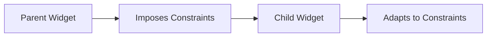

## 1.4.3 Understanding Constraints

In the world of Flutter, understanding how constraints work is crucial for building responsive and adaptive user interfaces. Constraints are the rules that govern how widgets are sized and positioned within their parent containers. This section will delve into Flutter's layout system, focusing on how constraints are applied, the relationship between parent and child widgets, and practical applications for creating dynamic and responsive designs.

### Flutter’s Layout System

Flutter's layout system is based on a constraint-based model, which means that every widget receives constraints from its parent and must decide its size based on those constraints. This system allows for a flexible and efficient way to build UIs that can adapt to different screen sizes and orientations.

#### How Constraints Work

Constraints in Flutter are essentially a set of rules that determine how a widget can be sized. These rules are passed down from parent widgets to their children, creating a hierarchical structure where each widget knows its limitations and can adjust accordingly.

- **Minimum and Maximum Constraints:** Each widget receives a minimum and maximum width and height, which it must adhere to when determining its size.
- **Flexibility:** Widgets can choose to be as small as the minimum constraint or as large as the maximum constraint, allowing for flexibility in layout design.

Here's a simple analogy: think of constraints as the walls of a room. A piece of furniture (widget) must fit within the room's dimensions (constraints), but it can be arranged in various ways as long as it doesn't exceed the room's boundaries.

### Parent-Child Relationships

In Flutter, the relationship between parent and child widgets is fundamental to understanding constraints. Parent widgets impose constraints on their children, and children must adapt to these constraints to determine their size and position.

#### Imposing Constraints

When a parent widget lays out its children, it sends them a set of constraints. These constraints dictate the minimum and maximum size that the child can occupy. The child widget then decides its size based on these constraints and reports its size back to the parent.

- **Parent Widget:** The entity that provides constraints.
- **Child Widget:** The entity that receives constraints and determines its size.



In the diagram above, the flow of constraints is illustrated from the parent widget to the child widget, showing how the child adapts to the imposed constraints.

### Code Examples

Let's explore some code examples to see how constraints work in practice. These examples will demonstrate how widgets respond to different constraints and how you can use them to create flexible layouts.

#### Example: Using `SizedBox` to Impose Fixed Dimensions

The `SizedBox` widget is a simple way to impose fixed dimensions on a child widget. It allows you to specify a width and height, which the child must adhere to.

```dart
Container(
  width: 200,
  height: 100,
  child: SizedBox(
    width: 150,
    height: 50,
    child: Text('Constrained Text'),
  ),
);
```

In this example, the `SizedBox` imposes a width of 150 and a height of 50 on the `Text` widget. The `Container` further constrains the `SizedBox` with a width of 200 and a height of 100. The `Text` widget must fit within these constraints.

#### Example: Flexible and Expanded Widgets

The `Flexible` and `Expanded` widgets are used to create flexible layouts that can adjust to available space. They allow child widgets to expand and fill the available space within a parent widget.

```dart
Row(
  children: <Widget>[
    Flexible(
      child: Container(
        color: Colors.red,
        child: Text('Flexible'),
      ),
    ),
    Expanded(
      child: Container(
        color: Colors.blue,
        child: Text('Expanded'),
      ),
    ),
  ],
);
```

In this example, the `Row` widget contains two children: one wrapped in a `Flexible` widget and the other in an `Expanded` widget. The `Flexible` widget allows the child to take up as much space as it needs, while the `Expanded` widget forces the child to fill the remaining space.

### Practical Applications

Understanding constraints is crucial for creating responsive designs and handling dynamic content sizing. Here are some practical scenarios where constraints play a vital role:

- **Responsive Design:** Constraints allow you to create layouts that adapt to different screen sizes and orientations. By using widgets like `Flexible` and `Expanded`, you can ensure that your UI looks good on both small and large screens.
- **Dynamic Content Sizing:** When dealing with dynamic content, such as text or images that can change size, constraints help ensure that your layout remains consistent and visually appealing.

### Best Practices

When working with constraints in Flutter, consider the following best practices:

- **Test Across Screen Sizes:** Always test your layouts on different screen sizes and orientations to ensure that constraints are handled appropriately. This will help you identify any layout issues early on.
- **Avoid Over-Constraining:** Be cautious not to over-constrain your widgets, as this can lead to layout issues such as overflow or clipping. Use flexible widgets and allow for some adaptability in your design.
- **Use Constraints Wisely:** Leverage constraints to create flexible and adaptive layouts. Use widgets like `SizedBox`, `Flexible`, and `Expanded` to manage space effectively.

### Conclusion

Constraints are a fundamental aspect of Flutter's layout system, providing the rules that govern how widgets are sized and positioned. By understanding how constraints work and how they are applied in parent-child relationships, you can create responsive and adaptive UIs that look great on any device. Remember to test your layouts across different screen sizes and avoid over-constraining your widgets to ensure a smooth and flexible user experience.

## Quiz Time!



### What is the primary role of constraints in Flutter's layout system?

- [x] To determine the size and position of widgets
- [ ] To manage the color scheme of widgets
- [ ] To handle user input events
- [ ] To define the animation speed of widgets

> **Explanation:** Constraints in Flutter are used to determine the size and position of widgets within their parent containers.

### How do parent widgets interact with child widgets in terms of constraints?

- [x] Parent widgets impose constraints on their children
- [ ] Child widgets impose constraints on their parents
- [ ] Parent widgets and child widgets share constraints equally
- [ ] Constraints are not related to parent-child relationships

> **Explanation:** Parent widgets impose constraints on their children, dictating the minimum and maximum size the child can occupy.

### What is a common use case for using the `SizedBox` widget?

- [x] To impose fixed dimensions on a child widget
- [ ] To animate a widget
- [ ] To handle user input
- [ ] To manage state

> **Explanation:** The `SizedBox` widget is used to impose fixed dimensions on a child widget, specifying a width and height.

### Which widget allows a child to take up as much space as it needs within a parent?

- [ ] SizedBox
- [ ] Expanded
- [x] Flexible
- [ ] Container

> **Explanation:** The `Flexible` widget allows a child to take up as much space as it needs within a parent, providing flexibility in layout design.

### What is the purpose of the `Expanded` widget in a layout?

- [x] To force a child to fill the remaining space
- [ ] To animate a widget
- [ ] To handle user input
- [ ] To impose fixed dimensions

> **Explanation:** The `Expanded` widget forces a child to fill the remaining space within a parent, ensuring that the layout adapts to available space.

### Why is it important to test layouts across various screen sizes?

- [x] To ensure constraints are handled appropriately
- [ ] To check for color consistency
- [ ] To verify animation speed
- [ ] To manage user input

> **Explanation:** Testing layouts across various screen sizes ensures that constraints are handled appropriately and the UI looks good on different devices.

### What can happen if widgets are over-constrained?

- [x] Layout issues such as overflow or clipping
- [ ] Faster animation speeds
- [ ] Improved color accuracy
- [ ] Enhanced user input handling

> **Explanation:** Over-constraining widgets can lead to layout issues such as overflow or clipping, affecting the visual appearance of the UI.

### Which widget is used to manage space effectively in a `Row` or `Column`?

- [ ] SizedBox
- [x] Flexible
- [ ] Container
- [ ] Text

> **Explanation:** The `Flexible` widget is used to manage space effectively in a `Row` or `Column`, allowing children to adjust to available space.

### What is a key benefit of using constraints in responsive design?

- [x] Creating layouts that adapt to different screen sizes
- [ ] Managing user input events
- [ ] Defining animation sequences
- [ ] Handling state changes

> **Explanation:** Constraints allow for creating layouts that adapt to different screen sizes, making them essential for responsive design.

### True or False: Constraints are unrelated to the rendering process in Flutter.

- [ ] True
- [x] False

> **Explanation:** False. Constraints are directly related to the rendering process in Flutter, as they determine how widgets are sized and positioned.


