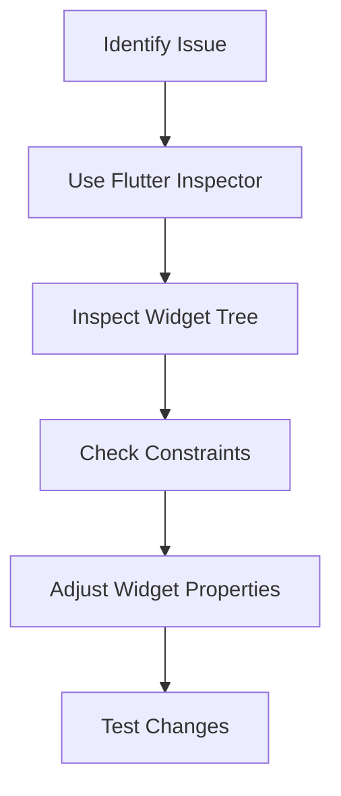

## 1.4.4 Debugging Layout Issues

Debugging layout issues in Flutter can be a challenging yet rewarding task. Understanding how to identify and resolve common problems is crucial for building responsive and adaptive user interfaces. This section will guide you through typical layout issues, introduce you to Flutter's powerful debugging tools, and provide practical tips and best practices to streamline your debugging process.

### Common Layout Problems

When developing Flutter applications, you might encounter several common layout issues that can affect the user experience. Here are a few typical problems:

- **Overflow Errors:** These occur when a widget's content exceeds the available space, leading to clipped content or runtime errors.
- **Misaligned Widgets:** Widgets that do not align as expected can disrupt the visual harmony of your UI.
- **Unexpected Sizing:** Widgets may not size themselves as intended, leading to inconsistent layouts across different devices.

Understanding these issues is the first step toward effective debugging. Let's explore how Flutter's tools can help you diagnose and fix these problems.

### Flutter’s Debugging Tools

Flutter provides a suite of tools designed to help developers debug layout issues efficiently. Here are some of the most useful tools:

- **Flutter Inspector:** This tool allows you to visualize the widget tree and inspect properties of widgets in real-time. It's an essential tool for understanding how widgets are laid out and interact with each other.
- **`debugPaintSizeEnabled`:** This boolean flag, when set to true, enables visual debugging aids that highlight widget boundaries, padding, and constraints. It helps you see how widgets are sized and positioned.
- **Visual Debugging Aids:** These include various flags and settings that can be toggled to provide additional visual information about the layout.

#### Using Flutter Inspector

The Flutter Inspector is integrated into both Android Studio and Visual Studio Code. It provides a visual representation of the widget tree, allowing you to inspect individual widgets, view their properties, and understand their layout constraints.

To use the Flutter Inspector:

1. **Run your Flutter application** in debug mode.
2. **Open the Flutter Inspector** from the IDE's toolbar.
3. **Select widgets** in the widget tree to view their properties and constraints.

This tool is invaluable for identifying misaligned widgets and understanding how constraints affect your layout.

#### Enabling `debugPaintSizeEnabled`

The `debugPaintSizeEnabled` flag is a simple yet powerful tool for visualizing widget boundaries. Here's how you can use it:

```dart
void main() {
  debugPaintSizeEnabled = true; // Enables visual debugging aids
  runApp(MyApp());
}
```

When this flag is enabled, Flutter draws visual guides around widgets, showing their boundaries, padding, and constraints. This can help you quickly identify overflow issues and misalignments.

### Practical Tips for Debugging Layouts

Debugging layout issues requires a systematic approach. Here are some practical tips to help you diagnose and resolve problems effectively:

- **Break Down Complex Layouts:** If you're dealing with a complex layout, try breaking it down into simpler components. This can help you isolate the problem and understand how individual widgets contribute to the issue.
- **Use Debugging Tools Regularly:** Make a habit of using Flutter's debugging tools during development to catch issues early. This proactive approach can save you time and effort in the long run.
- **Check Widget Constraints:** Many layout issues stem from incorrect constraints. Use the Flutter Inspector to check the constraints applied to your widgets and adjust them as needed.

### Best Practices for Debugging Layouts

To maintain a clean and organized widget hierarchy, consider the following best practices:

- **Organize Your Widget Tree:** A well-organized widget tree can simplify debugging efforts. Group related widgets together and use descriptive names for custom widgets.
- **Document Your Code:** Clear documentation can help you and your team understand the layout logic, making it easier to identify and fix issues.
- **Test on Multiple Devices:** Ensure your layout works across different screen sizes and orientations by testing on various devices and emulators.

### Debugging Process Flowchart

To visualize the debugging process, here's a flowchart that outlines the steps involved in diagnosing and resolving layout issues:



This flowchart represents a systematic approach to debugging, starting with identifying the issue and ending with testing the changes to ensure the problem is resolved.

### Conclusion

Debugging layout issues in Flutter is an essential skill for any developer aiming to create responsive and adaptive UIs. By understanding common problems, utilizing Flutter's debugging tools, and following best practices, you can streamline your debugging process and build better applications. Remember to experiment with the tools and techniques discussed here, and don't hesitate to explore further resources to deepen your understanding.

### Additional Resources

- [Flutter Official Documentation](https://flutter.dev/docs)
- [Debugging Layouts in Flutter](https://flutter.dev/docs/testing/debugging)
- [Flutter Inspector Guide](https://flutter.dev/docs/development/tools/devtools/inspector)

By leveraging these resources, you can enhance your debugging skills and apply them effectively in your Flutter projects.

## Quiz Time!



### What is a common cause of overflow errors in Flutter layouts?

- [x] Widgets exceeding their available space
- [ ] Incorrect data types
- [ ] Missing import statements
- [ ] Using deprecated widgets

> **Explanation:** Overflow errors occur when a widget's content exceeds the available space, leading to clipped content or runtime errors.

### Which tool helps visualize the widget tree in Flutter?

- [x] Flutter Inspector
- [ ] Dart Analyzer
- [ ] Android Studio Profiler
- [ ] Visual Studio Code Terminal

> **Explanation:** The Flutter Inspector provides a visual representation of the widget tree, allowing developers to inspect properties and understand layout constraints.

### How can you enable visual debugging aids in Flutter?

- [x] By setting `debugPaintSizeEnabled` to true
- [ ] By running the app in release mode
- [ ] By using the Dart DevTools
- [ ] By disabling hot reload

> **Explanation:** Setting `debugPaintSizeEnabled` to true enables visual debugging aids that highlight widget boundaries, padding, and constraints.

### What is a practical tip for diagnosing complex layout issues?

- [x] Break down complex layouts into simpler components
- [ ] Use only stateless widgets
- [ ] Avoid using the Flutter Inspector
- [ ] Write all widgets in a single file

> **Explanation:** Breaking down complex layouts into simpler components helps isolate problems and understand how individual widgets contribute to the issue.

### Which of the following is a best practice for maintaining a clean widget hierarchy?

- [x] Organize the widget tree and use descriptive names
- [ ] Use as few widgets as possible
- [ ] Avoid using custom widgets
- [ ] Keep all widgets in a single file

> **Explanation:** Organizing the widget tree and using descriptive names for custom widgets simplifies debugging efforts and improves code readability.

### What is the purpose of the Flutter Inspector?

- [x] To visualize the widget tree and inspect widget properties
- [ ] To compile Dart code to native code
- [ ] To manage app dependencies
- [ ] To deploy apps to the app store

> **Explanation:** The Flutter Inspector is used to visualize the widget tree and inspect properties of widgets in real-time, aiding in debugging layout issues.

### How can you test your layout across different devices?

- [x] By using emulators and physical devices
- [ ] By writing unit tests
- [ ] By using only the Android emulator
- [ ] By deploying directly to the app store

> **Explanation:** Testing on various emulators and physical devices ensures that your layout works across different screen sizes and orientations.

### What should you check if a widget is not aligning as expected?

- [x] The constraints applied to the widget
- [ ] The widget's color property
- [ ] The widget's text content
- [ ] The widget's animation duration

> **Explanation:** Misaligned widgets often result from incorrect constraints, so checking and adjusting these constraints can resolve alignment issues.

### Which of the following is NOT a common layout problem in Flutter?

- [ ] Overflow errors
- [ ] Misaligned widgets
- [ ] Unexpected sizing
- [x] Incorrect data types

> **Explanation:** Incorrect data types are not typically a layout problem; they are more related to logic or runtime errors.

### True or False: The `debugPaintSizeEnabled` flag should be used in production apps.

- [ ] True
- [x] False

> **Explanation:** The `debugPaintSizeEnabled` flag is intended for development and debugging purposes only and should not be used in production apps.


