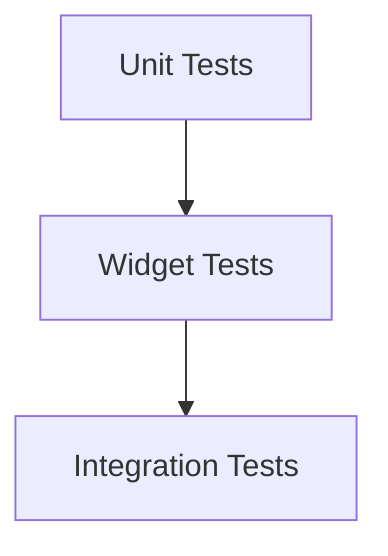

## 10.1.1 The Importance of Testing

In the world of software development, testing is a cornerstone practice that ensures the reliability, quality, and performance of applications. In this section, we delve into the significance of testing within the context of Flutter development, exploring its various facets and how it contributes to building robust, responsive, and adaptive user interfaces.

### Definition of Testing

Testing is the systematic process of evaluating a software application to ensure it behaves as expected under specified conditions. It involves executing the software with the intent of identifying errors, gaps, or missing requirements in contrast to the actual requirements. Testing can be broadly categorized into two types:

- **Manual Testing:** This involves human testers manually interacting with the application to identify defects. While it can be effective for exploratory testing and understanding user experience, it is often time-consuming and prone to human error.

- **Automated Testing:** This involves using software tools to execute pre-scripted tests on the application automatically. Automated testing is efficient for repetitive tasks, regression testing, and scenarios where precision and speed are crucial.

### Why Testing Matters in Flutter

Testing is particularly vital in Flutter development due to the framework's emphasis on building high-performance, cross-platform applications. Here are some key reasons why testing is indispensable:

- **Reliability:** Testing ensures that the app functions correctly across different devices and platforms, providing a consistent user experience.

- **Bug Detection:** By identifying and fixing bugs early in the development cycle, testing reduces the likelihood of post-deployment issues that can affect user satisfaction and app ratings.

- **Code Quality:** Testing encourages developers to write clean, maintainable, and modular code. It promotes best practices such as separation of concerns and single responsibility, which are crucial for long-term project sustainability.

- **Confidence in Code Changes:** With a robust suite of tests, developers can refactor code or add new features with the assurance that existing functionality will not be inadvertently broken.

### Benefits of Testing

The benefits of integrating testing into the development process are manifold:

- **Early Bug Detection:** Catching issues during development is far less costly than addressing them after release. Tests help identify problems before they reach the end user.

- **Improved User Experience:** A well-tested application is more stable and predictable, leading to higher user satisfaction and retention.

- **Documentation:** Tests serve as a form of documentation, clearly outlining the expected behaviors and functionalities of the application. This is invaluable for onboarding new team members and maintaining the codebase.

- **Facilitates Collaboration:** Testing provides a safety net for teams, enabling multiple developers to work on the same codebase without fear of introducing errors. It fosters a collaborative environment where changes can be made confidently.

### Types of Testing

In Flutter, testing is typically divided into three main categories, each serving a distinct purpose:

- **Unit Testing:** Focuses on testing individual functions or classes in isolation. Unit tests are fast, reliable, and form the foundation of the testing pyramid. They ensure that each component of the application behaves as intended.

  ```dart
  // Example of a simple unit test in Flutter
  import 'package:test/test.dart';

  int add(int a, int b) => a + b;

  void main() {
    test('adds two numbers', () {
      expect(add(2, 3), equals(5));
    });
  }
  ```

- **Widget Testing:** Involves testing UI components in isolation. Widget tests verify that widgets render correctly and interact with user inputs as expected. They are crucial for ensuring the visual and interactive aspects of the app are functioning properly.

  ```dart
  // Example of a widget test in Flutter
  import 'package:flutter_test/flutter_test.dart';
  import 'package:my_app/my_widget.dart';

  void main() {
    testWidgets('MyWidget has a title and message', (WidgetTester tester) async {
      await tester.pumpWidget(MyWidget());

      final titleFinder = find.text('Title');
      final messageFinder = find.text('Message');

      expect(titleFinder, findsOneWidget);
      expect(messageFinder, findsOneWidget);
    });
  }
  ```

- **Integration Testing:** Tests the complete application or large parts of it in a realistic environment. Integration tests ensure that different modules work together as expected and are often used to simulate user interactions across the app.

  ```dart
  // Example of an integration test in Flutter
  import 'package:flutter_test/flutter_test.dart';
  import 'package:my_app/main.dart';

  void main() {
    testWidgets('Full app test', (WidgetTester tester) async {
      await tester.pumpWidget(MyApp());

      // Simulate user interactions and verify app behavior
      await tester.tap(find.byIcon(Icons.add));
      await tester.pump();

      expect(find.text('1'), findsOneWidget);
    });
  }
  ```

### Testing Pyramid Overview

The testing pyramid is a conceptual framework that illustrates the ideal distribution of different types of tests within a software project. It emphasizes having a strong foundation of unit tests, a moderate number of widget tests, and a few comprehensive integration tests.



- **Unit Tests (Base):** These are the most numerous, fast, and low-level tests. They focus on individual components and are the first line of defense against bugs.

- **Widget Tests (Middle):** These tests are moderate in number and focus on the UI components. They ensure that the user interface behaves as expected in isolation.

- **Integration Tests (Top):** These are the fewest in number but cover the most ground, testing the application as a whole. They simulate real-world user interactions and workflows.

### Encouragement to Adopt Testing Early

Integrating testing into the development process from the outset is crucial for achieving better long-term outcomes. Early adoption of testing practices helps avoid the accumulation of technical debt and reduces the cost of fixing bugs later in the development cycle. It also instills a culture of quality and accountability within the development team.

By making testing an integral part of your Flutter development workflow, you not only enhance the reliability and quality of your applications but also gain the confidence to innovate and iterate rapidly. Testing is not just a safety net; it's a catalyst for delivering exceptional user experiences.

### Conclusion

Testing is an essential practice in Flutter development that ensures your applications are reliable, maintainable, and of high quality. By understanding the different types of testing and their roles within the testing pyramid, you can build a robust testing strategy that supports your development goals. Embrace testing early and make it a fundamental part of your development process to reap the long-term benefits of a stable and successful application.

## Quiz Time!



### What is the primary purpose of testing in software development?

- [x] To verify that software behaves as expected
- [ ] To increase the complexity of the code
- [ ] To delay the release of software
- [ ] To replace the need for documentation

> **Explanation:** Testing is primarily about verifying that software behaves as expected under specified conditions.

### Which type of testing involves human testers manually interacting with the application?

- [ ] Automated Testing
- [x] Manual Testing
- [ ] Unit Testing
- [ ] Integration Testing

> **Explanation:** Manual testing involves human testers manually interacting with the application to identify defects.

### What is a key benefit of automated testing?

- [x] Efficiency for repetitive tasks
- [ ] It requires no initial setup
- [ ] It is always more accurate than manual testing
- [ ] It eliminates the need for human testers

> **Explanation:** Automated testing is efficient for repetitive tasks, regression testing, and scenarios where precision and speed are crucial.

### Why is testing particularly important in Flutter development?

- [x] It ensures the app functions correctly across different devices and platforms
- [ ] It makes the app more visually appealing
- [ ] It reduces the need for user feedback
- [ ] It simplifies the codebase

> **Explanation:** Testing ensures that the app functions correctly across different devices and platforms, providing a consistent user experience.

### What is the role of unit tests in the testing pyramid?

- [x] They form the base and are the most numerous
- [ ] They are moderate in number and test UI components
- [ ] They are the fewest and test the complete application
- [ ] They are used only for manual testing

> **Explanation:** Unit tests form the base of the testing pyramid and are the most numerous, focusing on individual components.

### Which type of testing is used to verify that widgets render correctly and interact with user inputs as expected?

- [ ] Unit Testing
- [x] Widget Testing
- [ ] Integration Testing
- [ ] Manual Testing

> **Explanation:** Widget testing involves testing UI components in isolation to verify that they render correctly and interact with user inputs as expected.

### What is a key advantage of integrating testing early in the development process?

- [x] It helps avoid the accumulation of technical debt
- [ ] It increases the cost of development
- [ ] It delays the release of the application
- [ ] It reduces the need for code reviews

> **Explanation:** Integrating testing early helps avoid the accumulation of technical debt and reduces the cost of fixing bugs later.

### In the testing pyramid, which tests are the fewest in number but cover the most ground?

- [ ] Unit Tests
- [ ] Widget Tests
- [x] Integration Tests
- [ ] Manual Tests

> **Explanation:** Integration tests are the fewest in number but cover the most ground, testing the application as a whole.

### What is a benefit of testing in terms of team collaboration?

- [x] It provides a safety net for changes
- [ ] It eliminates the need for communication
- [ ] It increases the complexity of the codebase
- [ ] It reduces the need for documentation

> **Explanation:** Testing provides a safety net for changes, enabling multiple developers to work on the same codebase without fear of introducing errors.

### True or False: Automated testing can replace the need for manual testing entirely.

- [ ] True
- [x] False

> **Explanation:** While automated testing is efficient for many tasks, it cannot entirely replace the need for manual testing, especially for exploratory testing and understanding user experience.


