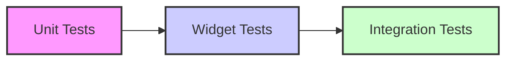

## 10.1.2 Types of Tests

In the realm of software development, testing is a critical component that ensures the reliability, functionality, and performance of applications. Flutter, being a robust framework for building cross-platform applications, provides a comprehensive suite of testing tools that cater to different testing needs. This section delves into the various types of tests available in Flutter, offering insights into their purposes, characteristics, and practical implementations.

### Unit Tests

**Definition:**  
Unit tests are designed to test individual units of code, such as functions, methods, or classes, in isolation from the rest of the application. They are the foundation of a solid testing strategy, focusing on the smallest testable parts of an application.

**Purpose:**  
The primary goal of unit tests is to ensure that each unit of code performs as intended independently. By isolating each unit, developers can pinpoint issues more effectively and ensure that changes in one part of the code do not adversely affect others.

**Characteristics:**  
- **Fast:** Unit tests are quick to execute because they do not involve UI rendering or external dependencies.
- **Isolated:** They focus on a single unit of code, ensuring no interference from other parts of the application.
- **Repeatable:** Unit tests can be run multiple times with consistent results, providing a reliable measure of code correctness.

**Code Example:**

```dart
import 'package:flutter_test/flutter_test.dart';
import 'package:your_app/utils/counter.dart';

void main() {
  group('Counter', () {
    test('Initial value should be 0', () {
      final counter = Counter();
      expect(counter.value, 0);
    });

    test('Value should increment', () {
      final counter = Counter();
      counter.increment();
      expect(counter.value, 1);
    });

    test('Value should decrement', () {
      final counter = Counter();
      counter.decrement();
      expect(counter.value, -1);
    });
  });
}
```

**Explanation:**  
This example demonstrates a series of unit tests for a simple `Counter` class. The tests verify the initial value of the counter, its increment functionality, and its decrement functionality. Each test is isolated, focusing solely on the behavior of the `Counter` class without any external dependencies.

### Widget Tests

**Definition:**  
Widget tests, also known as component tests, focus on testing individual widgets to ensure they render correctly and respond to user interactions as expected.

**Purpose:**  
The goal of widget tests is to validate that UI components meet design and functionality requirements in isolation. They help ensure that widgets behave correctly when integrated into the larger application.

**Characteristics:**  
- **Slightly Slower:** Widget tests may involve rendering the UI, making them slower than unit tests.
- **UI Interaction:** They can simulate user interactions, such as taps and gestures, to test the widget's response.
- **Isolated:** Although they involve UI elements, widget tests still focus on individual components rather than the entire application.

**Code Example:**

```dart
import 'package:flutter_test/flutter_test.dart';
import 'package:flutter/material.dart';
import 'package:your_app/widgets/counter_widget.dart';

void main() {
  testWidgets('Counter increments smoke test', (WidgetTester tester) async {
    await tester.pumpWidget(
      MaterialApp(
        home: CounterWidget(),
      ),
    );

    // Verify the initial counter value is 0
    expect(find.text('0'), findsOneWidget);
    expect(find.text('1'), findsNothing);

    // Tap the '+' icon and trigger a frame
    await tester.tap(find.byIcon(Icons.add));
    await tester.pump();

    // Verify the counter increments to 1
    expect(find.text('0'), findsNothing);
    expect(find.text('1'), findsOneWidget);
  });
}
```

**Explanation:**  
This widget test checks the functionality of a `CounterWidget`. It verifies the initial counter value, simulates a tap on the increment button, and checks the updated value. The test ensures that the widget behaves correctly in response to user interactions.

### Integration Tests

**Definition:**  
Integration tests evaluate the complete application or significant parts of it in a real or near-real environment. They cover end-to-end pathways to ensure that different parts of the application work together as expected.

**Purpose:**  
The primary aim of integration tests is to validate the interactions between various components of the application, ensuring that they function correctly when integrated.

**Characteristics:**  
- **Slowest:** Integration tests are the slowest among the three types, as they may involve network calls, database interactions, and full UI rendering.
- **Comprehensive:** They provide a broad view of the application's functionality, covering multiple components and their interactions.
- **Realistic Environment:** Integration tests simulate real-world usage scenarios, providing a high level of confidence in the application's overall behavior.

**Code Example:**

```dart
import 'package:flutter_test/flutter_test.dart';
import 'package:integration_test/integration_test.dart';
import 'package:your_app/main.dart' as app;

void main() {
  IntegrationTestWidgetsFlutterBinding.ensureInitialized();

  testWidgets("Counter increments and decrements correctly", (WidgetTester tester) async {
    app.main();
    await tester.pumpAndSettle();

    // Verify initial counter value is 0
    expect(find.text('0'), findsOneWidget);

    // Tap the '+' icon and verify counter increment
    await tester.tap(find.byIcon(Icons.add));
    await tester.pumpAndSettle();
    expect(find.text('1'), findsOneWidget);

    // Tap the '-' icon and verify counter decrement
    await tester.tap(find.byIcon(Icons.remove));
    await tester.pumpAndSettle();
    expect(find.text('0'), findsOneWidget);
  });
}
```

**Explanation:**  
This integration test launches the entire application, performs user interactions, and verifies the resulting UI state. It checks the increment and decrement functionalities of the counter, ensuring that the application behaves correctly in a real-world scenario.

### Mermaid.js Diagrams

To better understand the relationship and hierarchy among the different types of tests, we can visualize them using a testing pyramid diagram. This diagram illustrates the relative proportions and focus areas for unit, widget, and integration tests.



### Best Practices

- **Balanced Test Suite:** Maintain a healthy balance of unit, widget, and integration tests to cover different aspects of the application. This approach ensures comprehensive coverage while optimizing test execution time.
- **Focus on Behavior:** Write tests that focus on the expected behavior rather than the implementation details. This practice leads to more robust and maintainable tests.
- **Maintain Test Independence:** Ensure that tests are independent of each other to prevent cascading failures. Each test should be able to run in isolation without relying on the results of others.

### Common Pitfalls

- **Overlooking Unit Tests:** Relying solely on widget and integration tests can lead to a lack of coverage for individual components. Unit tests are crucial for catching issues early in the development process.
- **Slow Integration Tests:** Extensive integration tests can slow down the development cycle. It's essential to optimize and limit their number, focusing on critical pathways and interactions.

### Implementation Guidance

- **Start with Unit Tests:** Begin by writing unit tests for core functionalities before expanding to widget and integration tests. This approach helps build a strong foundation for your test suite.
- **Adopt TDD:** Consider adopting a test-driven development (TDD) approach, where tests are written alongside the development of new features. TDD encourages better design and leads to higher-quality code.

By understanding and implementing these types of tests, developers can build robust, reliable, and high-performing Flutter applications. Testing is not just a step in the development process but an integral part of creating software that meets user expectations and withstands the test of time.

## Quiz Time!



### What is the primary purpose of unit tests in Flutter?

- [x] To ensure individual units of code perform as intended independently.
- [ ] To test the entire application in a real environment.
- [ ] To validate UI components in isolation.
- [ ] To simulate user interactions.

> **Explanation:** Unit tests focus on testing individual units of code, such as functions or classes, to ensure they perform as intended independently of other parts of the application.

### Which type of test is typically the fastest to execute?

- [x] Unit Tests
- [ ] Widget Tests
- [ ] Integration Tests
- [ ] End-to-End Tests

> **Explanation:** Unit tests are the fastest to execute because they do not involve UI rendering or external dependencies.

### What is a key characteristic of widget tests?

- [ ] They are the slowest among test types.
- [x] They involve UI rendering and interactions.
- [ ] They test the entire application.
- [ ] They focus solely on backend logic.

> **Explanation:** Widget tests involve rendering UI components and simulating user interactions to validate their behavior.

### What is the main focus of integration tests?

- [ ] Testing individual functions or methods.
- [ ] Validating UI components in isolation.
- [x] Ensuring different parts of the application work together.
- [ ] Testing the application's performance.

> **Explanation:** Integration tests focus on ensuring that different parts of the application work together as expected, covering end-to-end pathways.

### Which of the following is a common pitfall when writing tests?

- [x] Overlooking unit tests.
- [ ] Writing tests for every line of code.
- [ ] Using test-driven development.
- [ ] Maintaining test independence.

> **Explanation:** Overlooking unit tests can lead to a lack of coverage for individual components, which are crucial for catching issues early.

### What does the testing pyramid diagram illustrate?

- [ ] The order in which tests should be written.
- [x] The relative proportions and hierarchy of unit, widget, and integration tests.
- [ ] The speed of different test types.
- [ ] The importance of test-driven development.

> **Explanation:** The testing pyramid diagram illustrates the relative proportions and hierarchy of unit, widget, and integration tests.

### Why is it important to maintain test independence?

- [ ] To ensure tests are faster to execute.
- [x] To prevent cascading failures.
- [ ] To reduce the number of tests needed.
- [ ] To focus on implementation details.

> **Explanation:** Maintaining test independence prevents cascading failures, ensuring that each test can run in isolation without relying on others.

### What is a recommended approach to writing tests?

- [ ] Start with integration tests.
- [x] Begin with unit tests for core functionalities.
- [ ] Focus solely on widget tests.
- [ ] Write tests after completing the application.

> **Explanation:** Starting with unit tests for core functionalities helps build a strong foundation for the test suite.

### What is a benefit of adopting test-driven development (TDD)?

- [ ] It reduces the number of tests needed.
- [ ] It focuses on implementation details.
- [x] It encourages better design and higher-quality code.
- [ ] It speeds up the development process.

> **Explanation:** Test-driven development (TDD) encourages better design and leads to higher-quality code by writing tests alongside the development of new features.

### True or False: Integration tests are typically the fastest type of tests to execute.

- [ ] True
- [x] False

> **Explanation:** Integration tests are the slowest among test types because they may involve network calls, database interactions, and full UI rendering.


