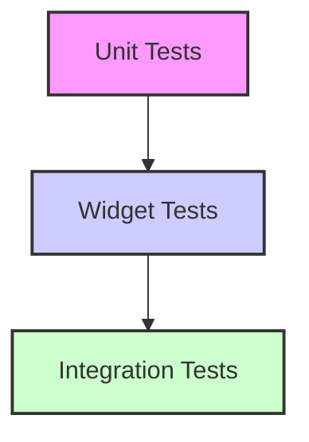

## 10.1.3 Setting Up Test Environments

Setting up a robust test environment is crucial for ensuring the reliability and quality of your Flutter applications. This section will guide you through configuring your Flutter project for testing, covering everything from directory structures to adding necessary dependencies and writing your first tests. By the end of this article, you'll have a comprehensive understanding of how to set up and manage test environments effectively.

### Configuring the Flutter Project for Testing

#### Directory Structure

A well-organized directory structure is the foundation of an efficient testing environment. In Flutter, it's recommended to separate your tests into distinct categories: unit tests, widget tests, and integration tests. This separation helps maintain clarity and focus, making it easier to manage and scale your test suite as your application grows.

Here's the recommended directory structure for tests in a Flutter project:

```
your_app/
├── lib/
├── test/
│   ├── unit_tests/
│   ├── widget_tests/
│   └── integration_tests/
├── test_driver/
└── ...
```

- **`lib/`**: Contains the main application code.
- **`test/`**: Houses all test files, organized into subdirectories for different test types.
  - **`unit_tests/`**: Contains unit tests that focus on individual functions or classes.
  - **`widget_tests/`**: Contains tests for individual widgets, ensuring they render and behave correctly.
  - **`integration_tests/`**: Contains tests that verify the application as a whole, often simulating user interactions.
- **`test_driver/`**: Used for integration test drivers, particularly when testing on physical devices or emulators.

#### Adding Dependencies

To enable testing in your Flutter project, you'll need to add several dependencies to your `pubspec.yaml` file. These dependencies provide the necessary tools and libraries for writing and running tests.

Here's how you can configure your `pubspec.yaml`:

```yaml
dev_dependencies:
  flutter_test:
    sdk: flutter
  integration_test:
    sdk: flutter
  mockito: ^5.2.0
  bloc_test: ^9.1.0
```

- **`flutter_test`**: Provides the core testing framework for Flutter, including utilities for writing unit and widget tests.
- **`integration_test`**: Facilitates writing integration tests that run on real devices or emulators.
- **`mockito`**: A popular library for creating mock objects, useful for isolating the unit under test.
- **`bloc_test`**: Useful for testing applications that use the BLoC pattern, providing utilities to test BLoC states and events.

After adding these dependencies, run the following command to install them:

```bash
flutter pub get
```

This command fetches the specified packages and makes them available in your project.

### Configuring Testing Files

With your project structure and dependencies in place, it's time to create the test files themselves. Each type of test has its own directory and naming conventions to follow.

#### Unit Tests

Unit tests focus on testing individual functions or classes in isolation. They are typically the fastest to run and provide the most granular level of feedback.

Create your unit test files within the `test/unit_tests/` directory, using the naming convention `widget_name_test.dart`. Here's an example:

```
test/
└── unit_tests/
    └── counter_test.dart
```

**Example Unit Test:**

```dart
// test/unit_tests/counter_test.dart
import 'package:flutter_test/flutter_test.dart';
import 'package:your_app/utils/counter.dart';

void main() {
  group('Counter', () {
    test('Initial value should be 0', () {
      final counter = Counter();
      expect(counter.value, 0);
    });

    test('Value should increment', () {
      final counter = Counter();
      counter.increment();
      expect(counter.value, 1);
    });
  });
}
```

This example tests a simple `Counter` class, verifying its initial state and behavior when incremented.

#### Widget Tests

Widget tests verify the behavior and appearance of individual widgets. They ensure that widgets render correctly and respond to user interactions as expected.

Place your widget test files in the `test/widget_tests/` directory, following the naming convention `widget_name_test.dart`. Here's an example:

```
test/
└── widget_tests/
    └── counter_widget_test.dart
```

**Example Widget Test:**

```dart
// test/widget_tests/counter_widget_test.dart
import 'package:flutter_test/flutter_test.dart';
import 'package:flutter/material.dart';
import 'package:your_app/widgets/counter_widget.dart';

void main() {
  testWidgets('Counter increments smoke test', (WidgetTester tester) async {
    await tester.pumpWidget(
      MaterialApp(
        home: CounterWidget(),
      ),
    );

    // Verify the initial counter value is 0
    expect(find.text('0'), findsOneWidget);
    expect(find.text('1'), findsNothing);

    // Tap the '+' icon and trigger a frame
    await tester.tap(find.byIcon(Icons.add));
    await tester.pump();

    // Verify the counter increments to 1
    expect(find.text('0'), findsNothing);
    expect(find.text('1'), findsOneWidget);
  });
}
```

This test checks that the `CounterWidget` displays the correct initial value and updates correctly when interacted with.

#### Integration Tests

Integration tests evaluate the application as a whole, often simulating real user interactions. They are typically slower to run but provide valuable insights into the overall functionality and user experience.

Store your integration test files in the `test/integration_tests/` directory, using the naming convention `app_test.dart`. Here's an example:

```
test/
└── integration_tests/
    └── app_test.dart
```

**Example Integration Test:**

```dart
// test/integration_tests/app_test.dart
import 'package:flutter_test/flutter_test.dart';
import 'package:integration_test/integration_test.dart';
import 'package:your_app/main.dart' as app;

void main() {
  IntegrationTestWidgetsFlutterBinding.ensureInitialized();

  testWidgets("Counter increments and decrements correctly", (WidgetTester tester) async {
    app.main();
    await tester.pumpAndSettle();

    // Verify initial counter value is 0
    expect(find.text('0'), findsOneWidget);

    // Tap the '+' icon and verify counter increment
    await tester.tap(find.byIcon(Icons.add));
    await tester.pumpAndSettle();
    expect(find.text('1'), findsOneWidget);

    // Tap the '-' icon and verify counter decrement
    await tester.tap(find.byIcon(Icons.remove));
    await tester.pumpAndSettle();
    expect(find.text('0'), findsOneWidget);
  });
}
```

This integration test simulates a user interacting with the app, verifying that the counter increments and decrements as expected.

#### Test Configuration Files

For integration tests, you may need additional configuration files, especially when testing on different platforms. Create a `test_driver/` directory to house these files, including `integration_test.dart` and any platform-specific launch files.

**Example:**

```
test_driver/
└── integration_test.dart
```

### Best Practices

To ensure your tests are effective and maintainable, follow these best practices:

- **Organize Tests Logically:** Structure test files and directories to mirror the structure of the application code. This makes it easier to locate and manage tests.
- **Write Clear and Descriptive Test Names:** Use names that clearly indicate what each test is verifying. This helps others understand the purpose of each test at a glance.
- **Maintain Test Independence:** Ensure that tests do not depend on each other, allowing them to run in any order without failures. This independence is crucial for reliable test results.
- **Use Mocks and Stubs:** Isolate components by mocking dependencies to focus tests on specific functionalities. This reduces the complexity of tests and makes them more reliable.

### Common Pitfalls

Avoid these common pitfalls when setting up and writing tests:

- **Neglecting Tests:** Failing to write tests can lead to undetected bugs and unstable applications. Make testing an integral part of your development process.
- **Writing Fragile Tests:** Tests that rely on specific implementations rather than behaviors can break with minor code changes. Focus on testing behaviors and outcomes.
- **Ignoring Test Coverage:** Not striving for adequate test coverage can leave critical parts of the application untested. Aim for comprehensive coverage to catch potential issues early.

### Implementation Guidance

Integrate testing into your development workflow by running tests regularly during development. This practice helps catch issues early and ensures that new code doesn't break existing functionality. Additionally, consider using continuous integration (CI) tools to automate test execution and enforce test coverage standards. CI tools can automatically run your tests whenever code is pushed to a repository, providing immediate feedback on the health of your codebase.

### Mermaid.js Diagrams

To visualize the hierarchy and proportion of different test types, consider using a testing pyramid diagram. This diagram illustrates the recommended distribution of test types, emphasizing the importance of unit tests as the foundation of your test suite.



### Conclusion

Setting up a comprehensive test environment in Flutter involves organizing your project structure, adding necessary dependencies, and writing tests that cover unit, widget, and integration levels. By following best practices and avoiding common pitfalls, you can ensure that your tests are effective and maintainable, leading to more reliable and robust applications. Remember to integrate testing into your development workflow and leverage CI tools to automate and streamline the process.

## Quiz Time!



### What is the recommended directory structure for organizing tests in a Flutter project?

- [x] Separate directories for unit, widget, and integration tests within the `test/` directory.
- [ ] A single directory for all tests within the `lib/` directory.
- [ ] Placing all test files in the root directory of the project.
- [ ] Using a `tests/` directory outside the main project folder.

> **Explanation:** The recommended structure is to have separate directories for unit, widget, and integration tests within the `test/` directory to maintain clarity and organization.

### Which dependency is essential for writing unit and widget tests in Flutter?

- [x] flutter_test
- [ ] integration_test
- [ ] mockito
- [ ] bloc_test

> **Explanation:** `flutter_test` is the core testing framework for Flutter, providing utilities for writing unit and widget tests.

### What is the purpose of the `test_driver/` directory in a Flutter project?

- [x] To house integration test drivers and platform-specific launch files.
- [ ] To store configuration files for unit tests.
- [ ] To contain mock objects for testing.
- [ ] To keep backup copies of test files.

> **Explanation:** The `test_driver/` directory is used for integration test drivers, particularly when testing on physical devices or emulators.

### How can you install the necessary testing packages in a Flutter project?

- [x] By adding them to `pubspec.yaml` and running `flutter pub get`.
- [ ] By downloading them manually from the internet.
- [ ] By using a package manager like npm.
- [ ] By including them in the `lib/` directory.

> **Explanation:** You add the necessary testing packages to `pubspec.yaml` and install them using the `flutter pub get` command.

### What is a common pitfall when writing tests?

- [x] Writing fragile tests that rely on specific implementations.
- [ ] Using descriptive test names.
- [ ] Organizing tests logically.
- [ ] Maintaining test independence.

> **Explanation:** Writing fragile tests that rely on specific implementations can lead to tests breaking with minor code changes.

### Which of the following is a best practice for writing tests?

- [x] Use mocks and stubs to isolate components.
- [ ] Write tests that depend on each other.
- [ ] Avoid using descriptive test names.
- [ ] Ignore test coverage.

> **Explanation:** Using mocks and stubs helps isolate components, making tests more focused and reliable.

### What is the role of the `integration_test` package in Flutter?

- [x] It facilitates writing integration tests that run on real devices or emulators.
- [ ] It provides utilities for unit testing.
- [ ] It is used for mocking dependencies.
- [ ] It helps in organizing test files.

> **Explanation:** The `integration_test` package is used for writing integration tests that can run on real devices or emulators.

### Which type of test is typically the fastest to run?

- [x] Unit tests
- [ ] Widget tests
- [ ] Integration tests
- [ ] End-to-end tests

> **Explanation:** Unit tests are typically the fastest to run as they focus on individual functions or classes in isolation.

### What should you aim for to ensure comprehensive test coverage?

- [x] Strive for adequate test coverage to catch potential issues early.
- [ ] Focus only on unit tests.
- [ ] Write tests only for critical parts of the application.
- [ ] Avoid writing tests for simple functions.

> **Explanation:** Striving for adequate test coverage ensures that potential issues are caught early, leading to more reliable applications.

### True or False: Continuous integration (CI) tools can automate test execution and enforce test coverage standards.

- [x] True
- [ ] False

> **Explanation:** CI tools can automate test execution and enforce test coverage standards, providing immediate feedback on the health of your codebase.


