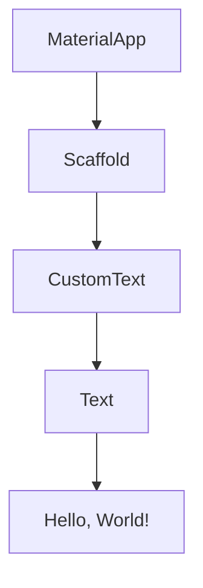

## 10.2.1 Testing Stateless Widgets

In the world of Flutter development, widgets are the building blocks of your user interface. Among these, stateless widgets play a crucial role, especially when it comes to rendering static content that does not change over time. Testing these widgets is essential to ensure that your UI behaves as expected and provides a seamless user experience. This section delves into the intricacies of testing stateless widgets, offering insights, practical examples, and best practices to guide you through the process.

### Understanding Stateless Widgets

Stateless widgets are a fundamental concept in Flutter. They are immutable, meaning once they are built, they do not change. Instead, they rely entirely on the inputs provided to them. This immutability makes them predictable and easier to test compared to stateful widgets, which can change over time.

#### Key Characteristics of Stateless Widgets

- **Immutability:** Stateless widgets do not maintain any internal state. Their appearance and behavior are solely determined by their constructor parameters.
- **Predictability:** Since they do not change after being built, their output is consistent given the same inputs.
- **Simplicity:** Stateless widgets are typically simpler than stateful widgets, making them easier to reason about and test.

### Testing Approach

Testing stateless widgets involves verifying that they render correctly based on their inputs. This can be broken down into two main strategies: render verification and snapshot testing.

#### Render Verification

Render verification involves checking that a widget appears as expected when given specific inputs. This ensures that the widget's visual representation aligns with the design and functional requirements.

- **Example:** Verify that a `CustomText` widget displays the correct text string.

#### Snapshot Testing

Snapshot testing compares the widget's rendered output against a previously saved snapshot. This method is useful for detecting unintended changes in the widget's appearance over time.

- **Example:** Capture a snapshot of the `CustomText` widget and compare it with future renders to ensure consistency.

### Code Example

Let's explore a practical example of testing a stateless widget using Flutter's testing framework. We'll test a simple `CustomText` widget to ensure it displays the correct text.

```dart
import 'package:flutter_test/flutter_test.dart';
import 'package:flutter/material.dart';
import 'package:your_app/widgets/custom_text.dart';

void main() {
  testWidgets('CustomText displays the correct string', (WidgetTester tester) async {
    await tester.pumpWidget(
      MaterialApp(
        home: Scaffold(
          body: CustomText(text: 'Hello, World!'),
        ),
      ),
    );

    // Verify that the text 'Hello, World!' is displayed
    expect(find.text('Hello, World!'), findsOneWidget);
    // Verify that a Text widget is used internally
    expect(find.byType(Text), findsOneWidget);
  });
}
```

#### Explanation

In this test, we use the `testWidgets` function provided by the Flutter testing framework. The `WidgetTester` allows us to interact with the widget tree. We pump a `MaterialApp` containing our `CustomText` widget into the widget tree and then verify that the text "Hello, World!" is displayed using the `find.text` method. Additionally, we check that a `Text` widget is present, ensuring that our `CustomText` widget uses it internally.

### Mermaid.js Diagrams

Visualizing the widget hierarchy can help understand the relationships between different components in your UI. Here's a diagram illustrating the hierarchy of our test setup:



This diagram shows the flow from the `MaterialApp` down to the `Text` widget displaying "Hello, World!".

### Best Practices

- **Use Descriptive Test Names:** Clearly describe what each test is verifying. This improves readability and maintainability.
- **Keep Tests Focused:** Ensure each test focuses on a single aspect of the widget's behavior. This makes it easier to identify issues when tests fail.
- **Leverage Helper Functions:** Use helper functions to create common widget tree setups, reducing code duplication and improving test clarity.

### Common Pitfalls

- **Ignoring Default States:** Always test widget behaviors with default or edge-case inputs to ensure robustness.
- **Overcomplicating Tests:** Avoid adding unnecessary complexity to tests. Use simple assertions to verify expected behaviors.

### Implementation Guidance

To facilitate testing of complex UI components, leverage Flutter's widget abstraction. This allows you to isolate and test individual widgets without needing to build the entire app.

- **Encourage Modularity:** Break down complex UIs into smaller, testable widgets.
- **Use Mock Data:** When testing, use mock data to simulate different input scenarios.

### References and Further Reading

- [Flutter Testing Documentation](https://flutter.dev/docs/testing)
- [Effective Dart: Testing](https://dart.dev/guides/language/effective-dart/testing)
- [Widget Testing in Flutter](https://flutter.dev/docs/cookbook/testing/widget/introduction)

By following these guidelines and practices, you can ensure that your stateless widgets are thoroughly tested and reliable, contributing to a robust and maintainable Flutter application.

## Quiz Time!



### What is a key characteristic of stateless widgets?

- [x] They do not maintain any internal state.
- [ ] They can change over time.
- [ ] They rely on internal variables for rendering.
- [ ] They are mutable.

> **Explanation:** Stateless widgets are immutable and do not maintain any internal state. Their rendering is based solely on external inputs.

### What is render verification in the context of testing stateless widgets?

- [x] Ensuring that the widget renders correctly with given inputs.
- [ ] Comparing the widget's output against a saved snapshot.
- [ ] Testing the widget's internal state changes.
- [ ] Verifying the widget's performance metrics.

> **Explanation:** Render verification involves checking that a widget appears as expected when given specific inputs.

### What is the purpose of snapshot testing?

- [x] To compare the widget's rendered output against a saved snapshot.
- [ ] To test the widget's internal state changes.
- [ ] To verify the widget's performance metrics.
- [ ] To ensure the widget renders correctly with given inputs.

> **Explanation:** Snapshot testing is used to detect unintended changes in the widget's appearance over time by comparing it against a previously saved snapshot.

### In the provided code example, what does the `find.text('Hello, World!')` assertion verify?

- [x] That the text 'Hello, World!' is displayed in the widget tree.
- [ ] That a `Text` widget is used internally.
- [ ] That the widget is rendered within a `Scaffold`.
- [ ] That the widget tree contains a `MaterialApp`.

> **Explanation:** The `find.text('Hello, World!')` assertion verifies that the text 'Hello, World!' is displayed in the widget tree.

### What is a common pitfall when testing stateless widgets?

- [x] Ignoring default states.
- [ ] Overcomplicating tests.
- [ ] Using descriptive test names.
- [ ] Keeping tests focused.

> **Explanation:** Ignoring default states is a common pitfall, as it can lead to untested edge cases and unexpected behaviors.

### Why is it important to use descriptive test names?

- [x] To clearly describe what each test is verifying.
- [ ] To make the test code more complex.
- [ ] To ensure the tests run faster.
- [ ] To reduce the number of tests needed.

> **Explanation:** Descriptive test names improve readability and maintainability by clearly indicating what each test is verifying.

### What is the benefit of using helper functions in widget testing?

- [x] To create common widget tree setups and reduce code duplication.
- [ ] To increase the complexity of tests.
- [ ] To make tests run slower.
- [ ] To decrease test coverage.

> **Explanation:** Helper functions help create common widget tree setups, reducing code duplication and improving test clarity.

### What does the `expect(find.byType(Text), findsOneWidget)` assertion verify in the code example?

- [x] That a `Text` widget is used internally by the `CustomText` widget.
- [ ] That the `CustomText` widget is rendered within a `Scaffold`.
- [ ] That the widget tree contains a `MaterialApp`.
- [ ] That the text 'Hello, World!' is displayed in the widget tree.

> **Explanation:** The `expect(find.byType(Text), findsOneWidget)` assertion verifies that a `Text` widget is used internally by the `CustomText` widget.

### What is a benefit of snapshot testing?

- [x] Detecting unintended changes in the widget's appearance over time.
- [ ] Ensuring the widget renders correctly with given inputs.
- [ ] Testing the widget's internal state changes.
- [ ] Verifying the widget's performance metrics.

> **Explanation:** Snapshot testing helps detect unintended changes in the widget's appearance over time by comparing it against a previously saved snapshot.

### Stateless widgets are mutable.

- [ ] True
- [x] False

> **Explanation:** Stateless widgets are immutable, meaning they do not change after being built. Their appearance and behavior are determined solely by their constructor parameters.


