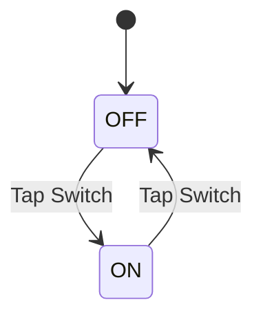

## 10.2.2 Testing Stateful Widgets

In the realm of Flutter development, stateful widgets play a crucial role in creating dynamic and interactive user interfaces. Testing these widgets is essential to ensure that your app behaves correctly under various conditions and user interactions. This section delves into the nuances of testing stateful widgets, providing you with the tools and knowledge to write effective and reliable tests.

### Understanding Stateful Widgets

Stateful widgets in Flutter are those that maintain internal state, which can change over time in response to user interactions or other factors. Unlike stateless widgets, which are immutable and only depend on their configuration and the BuildContext, stateful widgets can rebuild themselves based on changes in their internal state.

#### Key Characteristics of Stateful Widgets:

- **Mutable State:** Stateful widgets have a mutable state that can be modified over time.
- **Lifecycle Methods:** They include lifecycle methods such as `initState()`, `setState()`, and `dispose()` to manage state transitions.
- **Reactivity:** Changes in state trigger a rebuild of the widget, allowing the UI to reflect the current state.

### Testing Approach

Testing stateful widgets involves verifying that the widget responds correctly to state changes and user interactions. Here are the primary testing approaches:

#### State Transition Testing

State transition testing ensures that the widget behaves as expected when its state changes. This involves:

- **Initial State Verification:** Confirming that the widget initializes with the correct state.
- **State Change Simulation:** Triggering state changes and verifying the resulting UI updates.
- **Boundary Conditions:** Testing edge cases and boundary conditions to ensure robustness.

#### User Interaction Simulation

Simulating user interactions is crucial to test how the widget responds to actions such as taps, swipes, and input. This involves:

- **Action Simulation:** Using the `WidgetTester` to simulate user actions.
- **Outcome Verification:** Checking that the widget's state and UI update correctly in response to interactions.

### Code Example

Let's consider a simple `ToggleSwitch` widget that toggles between "ON" and "OFF" states when tapped. Here's how you can test it:

```dart
import 'package:flutter_test/flutter_test.dart';
import 'package:flutter/material.dart';
import 'package:your_app/widgets/toggle_switch.dart';

void main() {
  testWidgets('ToggleSwitch changes state on tap', (WidgetTester tester) async {
    await tester.pumpWidget(
      MaterialApp(
        home: Scaffold(
          body: ToggleSwitch(),
        ),
      ),
    );

    // Initial state should be OFF
    expect(find.text('OFF'), findsOneWidget);
    expect(find.text('ON'), findsNothing);

    // Tap the switch
    await tester.tap(find.byType(Switch));
    await tester.pump();

    // State should now be ON
    expect(find.text('OFF'), findsNothing);
    expect(find.text('ON'), findsOneWidget);
  });
}
```

#### Explanation

- **Initial State Verification:** The test starts by verifying that the `ToggleSwitch` widget displays "OFF" initially.
- **Simulating User Interaction:** It then simulates a tap on the switch using `tester.tap()`.
- **State Change Verification:** After the tap, the test checks that the widget now displays "ON", confirming the state change.

### Mermaid.js Diagrams

To better understand the state transitions within a stateful widget, let's use a state transition diagram:



This diagram illustrates the state changes that occur in the `ToggleSwitch` widget in response to user interactions.

### Best Practices

- **Isolate State Logic:** Separate state management logic from UI logic to simplify testing and improve maintainability.
- **Use `setUp` and `tearDown`:** Utilize these functions to initialize and dispose of resources required for tests, ensuring a clean test environment.
- **Focus on Behavior:** Write tests that focus on the widget's behavior rather than its internal state representation, making tests more resilient to implementation changes.

### Common Pitfalls

- **Ignoring Asynchronous State Changes:** Failing to account for asynchronous state updates can lead to flaky tests. Use `tester.pumpAndSettle()` to handle delayed or animated state changes.
- **Overly Rigid Tests:** Avoid designing tests that are too tightly coupled to specific implementation details, as this can make them brittle against changes.

### Implementation Guidance

- **Asynchronous Testing Utilities:** Use utilities like `tester.pumpAndSettle()` to manage asynchronous state changes and animations.
- **Behavior-Driven Testing:** Focus on testing the widget's behavior and user interactions rather than its internal state, ensuring that tests remain valid even if the implementation changes.

### Conclusion

Testing stateful widgets is a critical aspect of Flutter development, ensuring that your app responds correctly to state changes and user interactions. By following best practices and avoiding common pitfalls, you can write effective and reliable tests that enhance the quality and robustness of your application.

### Further Reading and Resources

- [Flutter Testing Documentation](https://flutter.dev/docs/testing)
- [Effective Dart: Testing](https://dart.dev/guides/language/effective-dart/testing)
- [Flutter Widget Testing with Examples](https://flutter.dev/docs/cookbook/testing/widget/introduction)

## Quiz Time!



### What is a key characteristic of stateful widgets in Flutter?

- [x] They maintain mutable state that can change over time.
- [ ] They are immutable and do not change once built.
- [ ] They do not have lifecycle methods.
- [ ] They cannot respond to user interactions.

> **Explanation:** Stateful widgets maintain mutable state that can change over time, allowing them to respond to user interactions and other events.

### What is the purpose of state transition testing for stateful widgets?

- [x] To verify that the widget behaves correctly when its state changes.
- [ ] To ensure the widget's initial state is always "ON".
- [ ] To test the widget's performance under load.
- [ ] To check the widget's compatibility with different devices.

> **Explanation:** State transition testing verifies that the widget behaves correctly when its state changes, ensuring that the UI updates appropriately.

### How can you simulate a user interaction in a widget test?

- [x] By using the `WidgetTester` to simulate actions like taps and swipes.
- [ ] By manually interacting with the app during the test.
- [ ] By writing separate scripts to perform user actions.
- [ ] By using a third-party testing library.

> **Explanation:** The `WidgetTester` allows you to simulate user interactions like taps and swipes within a widget test.

### What is a common pitfall when testing stateful widgets?

- [x] Ignoring asynchronous state changes, leading to flaky tests.
- [ ] Testing the widget's behavior instead of its internal state.
- [ ] Using `setUp` and `tearDown` functions.
- [ ] Writing tests that focus on the widget's behavior.

> **Explanation:** Ignoring asynchronous state changes can lead to flaky tests. It's important to account for these changes using utilities like `tester.pumpAndSettle()`.

### Which function is used to handle asynchronous state changes in widget tests?

- [x] `tester.pumpAndSettle()`
- [ ] `tester.tap()`
- [ ] `tester.pumpWidget()`
- [ ] `tester.find()`

> **Explanation:** `tester.pumpAndSettle()` is used to handle asynchronous state changes, ensuring that the widget settles into its final state before assertions are made.

### What is the benefit of isolating state logic from UI logic in stateful widgets?

- [x] It simplifies testing and improves maintainability.
- [ ] It makes the widget more visually appealing.
- [ ] It reduces the number of tests needed.
- [ ] It increases the performance of the widget.

> **Explanation:** Isolating state logic from UI logic simplifies testing and improves maintainability by making the code easier to understand and test.

### Why should tests focus on a widget's behavior rather than its internal state?

- [x] To ensure tests remain valid even if the implementation changes.
- [ ] To reduce the complexity of the test cases.
- [ ] To increase the speed of test execution.
- [ ] To make the tests easier to write.

> **Explanation:** Focusing on a widget's behavior ensures that tests remain valid even if the internal implementation changes, making them more robust.

### What is the role of `setUp` and `tearDown` functions in widget testing?

- [x] To initialize and dispose of resources required for tests.
- [ ] To simulate user interactions.
- [ ] To verify the initial state of the widget.
- [ ] To handle asynchronous state changes.

> **Explanation:** `setUp` and `tearDown` functions are used to initialize and dispose of resources required for tests, ensuring a clean test environment.

### What does the `tester.tap()` function do in a widget test?

- [x] Simulates a tap on a widget.
- [ ] Verifies the initial state of a widget.
- [ ] Handles asynchronous state changes.
- [ ] Initializes resources for the test.

> **Explanation:** The `tester.tap()` function simulates a tap on a widget, allowing you to test how the widget responds to user interactions.

### True or False: Stateful widgets in Flutter are immutable.

- [ ] True
- [x] False

> **Explanation:** False. Stateful widgets in Flutter are not immutable; they maintain mutable state that can change over time.


