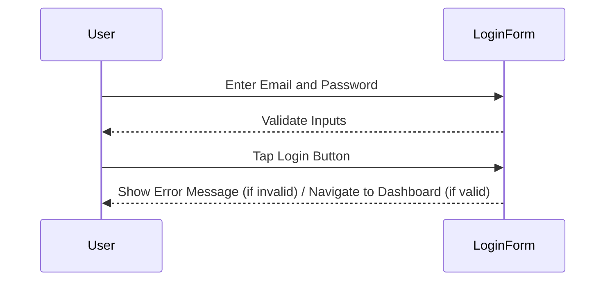

## 10.2.3 Testing UI Interactions

In the world of mobile application development, ensuring that your app responds correctly to user interactions is paramount. Testing UI interactions is a critical step in the development process, as it verifies that the application behaves as expected when users engage with it. This section delves into the importance of testing UI interactions in Flutter, the tools and methods available, and best practices to ensure robust and reliable applications.

### Importance of Testing UI Interactions

Testing UI interactions is crucial for several reasons:

- **Enhancing Usability:** By verifying that each interaction behaves as expected, you ensure a smooth and intuitive user experience.
- **Ensuring Functionality:** Interaction tests help catch bugs and issues early in the development cycle, reducing the risk of defects in production.
- **Improving User Satisfaction:** A well-tested application that responds correctly to user inputs can significantly enhance user satisfaction and engagement.
- **Facilitating Maintenance:** Comprehensive tests make it easier to refactor and update code without introducing new bugs.

### Simulating User Actions

To effectively test UI interactions, you need to simulate various user actions. Here are some common interactions to simulate:

- **Taps:** Simulate button presses, switch toggles, and other tap-based interactions.
- **Swipes and Drags:** Test gestures for scrolling, dragging items, and other swipe-based actions.
- **Text Input:** Simulate user input in text fields to verify form validations and data handling.
- **Long Presses:** Test prolonged touch interactions, often used for context menus or additional options.

### Tools and Methods

Flutter provides powerful tools for testing UI interactions, with `WidgetTester` being one of the most essential. Here's how you can utilize it:

- **WidgetTester:** This tool allows you to interact with widgets programmatically. It provides methods like `tap()`, `drag()`, `enterText()`, and more to simulate user actions.
- **Actions:** Use methods such as `tap()`, `drag()`, `enterText()`, and `longPress()` to simulate user interactions.

### Code Example

Below is a practical example demonstrating how to test a `LoginForm` widget using Flutter's testing framework:

```dart
import 'package:flutter_test/flutter_test.dart';
import 'package:flutter/material.dart';
import 'package:your_app/widgets/login_form.dart';

void main() {
  testWidgets('LoginForm validates input and submits', (WidgetTester tester) async {
    await tester.pumpWidget(
      MaterialApp(
        home: Scaffold(
          body: LoginForm(),
        ),
      ),
    );

    // Enter invalid email
    await tester.enterText(find.byKey(Key('emailField')), 'invalidemail');
    await tester.enterText(find.byKey(Key('passwordField')), 'password123');

    // Tap the login button
    await tester.tap(find.byKey(Key('loginButton')));
    await tester.pump();

    // Expect to find an error message
    expect(find.text('Please enter a valid email'), findsOneWidget);

    // Enter valid email
    await tester.enterText(find.byKey(Key('emailField')), 'user@example.com');
    await tester.tap(find.byKey(Key('loginButton')));
    await tester.pump();

    // Expect success action, e.g., navigation or success message
    expect(find.text('Login Successful'), findsOneWidget);
  });
}
```

#### Explanation

This test simulates user interactions with a `LoginForm` widget. It enters invalid and valid inputs, simulates tap actions, and verifies the resulting UI changes, such as error messages or success indicators. This ensures that the form behaves correctly under different input scenarios.

### Mermaid.js Diagrams

To better understand the flow of interactions, let's visualize the sequence of user interactions and the corresponding UI responses within a widget using a Mermaid.js sequence diagram:



### Best Practices

- **Use Keys for Widgets:** Assign unique keys to widgets to facilitate targeting during tests. This makes it easier to find and interact with specific widgets.
- **Test Both Positive and Negative Scenarios:** Ensure that interactions behave correctly under all expected conditions, including edge cases.
- **Assert Final States:** After interactions, verify that the UI reflects the expected outcomes, such as displaying error messages or navigating to a new screen.

### Common Pitfalls

- **Flaky Tests:** Tests that intermittently pass or fail due to timing issues or unexpected UI states. Use `pumpAndSettle()` to wait for animations and asynchronous operations to complete.
- **Ignoring Edge Cases:** Failing to test scenarios like empty inputs, maximum input lengths, or special character handling can lead to unexpected behavior in production.

### Implementation Guidance

- **Comprehensive Test Cases:** Write tests that cover a wide range of user interactions and input scenarios. This ensures that your application is robust and reliable.
- **Helper Functions:** Use helper functions to abstract repetitive interaction patterns. This improves test readability and maintainability, making it easier to update tests as the application evolves.

### Conclusion

Testing UI interactions in Flutter is a vital part of ensuring that your application is both functional and user-friendly. By simulating user actions and verifying the resulting UI changes, you can catch bugs early and provide a seamless experience for your users. Remember to follow best practices, avoid common pitfalls, and write comprehensive test cases to cover all possible interaction scenarios.

## Quiz Time!



### Why is testing UI interactions important?

- [x] It enhances usability and functionality.
- [ ] It only helps in debugging.
- [ ] It is not necessary for small applications.
- [ ] It is only useful for performance testing.

> **Explanation:** Testing UI interactions ensures that the application responds correctly to user inputs, enhancing usability and functionality.

### Which tool is primarily used for testing UI interactions in Flutter?

- [x] WidgetTester
- [ ] DartAnalyzer
- [ ] FlutterDoctor
- [ ] Visual Studio Code

> **Explanation:** WidgetTester is used in Flutter to interact with widgets programmatically during tests.

### What method would you use to simulate a tap action in a Flutter test?

- [x] tap()
- [ ] swipe()
- [ ] enterText()
- [ ] longPress()

> **Explanation:** The `tap()` method is used to simulate tap actions on widgets.

### What is a common pitfall when testing UI interactions?

- [x] Flaky tests due to timing issues
- [ ] Using too many keys
- [ ] Over-testing positive scenarios
- [ ] Ignoring widget hierarchies

> **Explanation:** Flaky tests often occur due to timing issues or unexpected UI states, making them unreliable.

### How can you improve test readability and maintainability?

- [x] Use helper functions to abstract repetitive patterns.
- [ ] Write longer test cases.
- [ ] Avoid using comments.
- [ ] Use complex logic in tests.

> **Explanation:** Helper functions abstract repetitive patterns, improving readability and maintainability of tests.

### What should you do after simulating user interactions in a test?

- [x] Assert the final state of the UI.
- [ ] Immediately run the next test.
- [ ] Ignore the test results.
- [ ] Only check for errors.

> **Explanation:** After interactions, it's important to assert that the UI reflects the expected outcomes.

### Which method is used to simulate text input in a Flutter test?

- [x] enterText()
- [ ] tap()
- [ ] swipe()
- [ ] longPress()

> **Explanation:** The `enterText()` method is used to simulate user input in text fields.

### What is the purpose of using keys in widget testing?

- [x] To facilitate targeting widgets during tests.
- [ ] To improve widget performance.
- [ ] To style widgets.
- [ ] To enhance widget animations.

> **Explanation:** Keys help in uniquely identifying and targeting widgets during tests.

### What is a benefit of testing both positive and negative scenarios?

- [x] Ensures interactions behave correctly under all conditions.
- [ ] It reduces the number of tests needed.
- [ ] It simplifies the testing process.
- [ ] It only checks for positive outcomes.

> **Explanation:** Testing both scenarios ensures that interactions behave correctly under all expected conditions.

### True or False: Ignoring edge cases in UI testing can lead to unexpected behavior in production.

- [x] True
- [ ] False

> **Explanation:** Ignoring edge cases can result in unexpected behavior, as these scenarios might not be handled correctly.


