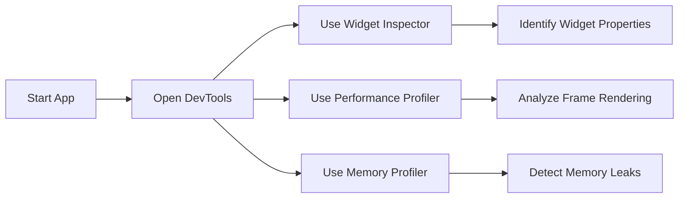

## 10.3.1 Flutter DevTools

In the world of Flutter development, ensuring your application runs smoothly and efficiently is paramount. Flutter DevTools is a powerful suite of tools designed to help developers inspect, debug, and profile their applications. This section will guide you through the features and usage of Flutter DevTools, providing insights into how you can leverage these tools to enhance your app's performance and user experience.

### Introduction to Flutter DevTools

Flutter DevTools is an integrated suite of performance and profiling tools that provide developers with the ability to inspect and debug their Flutter applications. It offers a range of features that help you understand the inner workings of your app, identify performance bottlenecks, and resolve issues effectively. Whether you're a seasoned developer or new to Flutter, DevTools is an essential part of your toolkit.

### Features of Flutter DevTools

Flutter DevTools offers several key features that cater to different aspects of app development and debugging:

- **Widget Inspector:** This tool allows you to visually explore the widget tree, inspect properties, and understand widget layouts. It provides a visual representation of your app's UI hierarchy, making it easier to identify and resolve layout issues.

- **Performance Profiler:** The performance profiler helps you monitor app performance, identify frame rendering issues, and analyze CPU and GPU usage. It provides insights into how your app utilizes system resources, helping you optimize performance.

- **Memory Profiler:** With the memory profiler, you can track memory allocations, detect memory leaks, and analyze memory usage patterns. This is crucial for ensuring your app runs efficiently without consuming excessive resources.

- **Network Tab:** The network tab allows you to monitor network requests and responses, making it useful for debugging API interactions. You can see the details of each request, including headers, payloads, and response times.

- **Timeline Tab:** The timeline tab visualizes event timelines, helping you understand the sequence and duration of operations. This is particularly useful for identifying performance bottlenecks and optimizing app responsiveness.

### Launching Flutter DevTools

Flutter DevTools can be launched in several ways, depending on your development environment:

#### Via IDE

- **Android Studio/IntelliJ:** Click on the Flutter DevTools icon in the toolbar to open the suite directly from your IDE.
  
- **VS Code:** Use the command palette (`Ctrl+Shift+P`), type "Flutter: Open DevTools," and select the desired option to launch DevTools.

#### Via Command Line

You can also launch Flutter DevTools from the command line using the following commands:

```bash
flutter pub global activate devtools
flutter pub global run devtools
```

#### Accessing via Browser

Once launched, Flutter DevTools can be accessed through a browser at the provided URL (e.g., `http://127.0.0.1:9100`). This allows you to use DevTools in a familiar web-based interface.

### Using Widget Inspector

The Widget Inspector is one of the most powerful features of Flutter DevTools. It allows you to interactively explore the widget tree and inspect widget properties and relationships.

#### Functionality

- **Select Widgets:** You can select widgets on the screen to inspect their properties and see how they fit into the widget tree.
  
- **Highlight Widgets:** The inspector highlights widgets, showing their layout constraints and performance metrics.

- **Analyze Widget Performance:** By inspecting widgets, you can identify performance issues related to layout and rendering.

#### Interactive Features

The Widget Inspector provides several interactive features that enhance your debugging experience:

- **Layout Constraints:** View and analyze the layout constraints applied to each widget, helping you understand how widgets are sized and positioned.
  
- **Performance Metrics:** Access performance metrics for each widget, allowing you to identify and resolve rendering issues.

### Code Example

While Flutter DevTools itself doesn't require code changes, you can integrate debugging statements to enhance your debugging process. One useful technique is using debug-related annotations like `debugPaintSizeEnabled` for visual debugging:

```dart
import 'package:flutter/rendering.dart';

void main() {
  debugPaintSizeEnabled = true;
  runApp(MyApp());
}
```

#### Explanation

Enabling `debugPaintSizeEnabled` adds visual overlays to your app, showing widget boundaries and layout constraints. This can help you identify layout issues and understand how widgets are rendered on the screen.

### Mermaid.js Diagrams

To visualize the usage of Flutter DevTools, consider the following Mermaid.js flowchart that illustrates how to access and utilize different features of DevTools to identify and resolve issues:

```markdown

```

### Best Practices

To make the most of Flutter DevTools, consider the following best practices:

- **Regular Profiling:** Continuously monitor app performance during development to catch issues early and ensure optimal performance.

- **Deep Dive into Problems:** Use multiple features of DevTools to gain comprehensive insights into complex issues, leveraging the full suite of tools available.

- **Interactive Debugging:** Utilize the interactive capabilities of DevTools to step through widget trees and performance metrics, gaining a deeper understanding of your app's behavior.

### Common Pitfalls

While Flutter DevTools is a powerful tool, it's important to be aware of common pitfalls:

- **Overreliance on DevTools:** While DevTools is invaluable, it should complement other debugging techniques, not replace them. Use it in conjunction with other tools and practices.

- **Ignoring Performance Metrics:** Failing to act on the insights provided by performance profiling can lead to suboptimal app performance. Always address identified issues promptly.

### Implementation Guidance

To integrate Flutter DevTools into your development workflow effectively:

- **Regular Usage:** Make using DevTools a regular part of your development process, not just a tool for troubleshooting.

- **Document Workflows:** Document common DevTools workflows and tips within your development team to ensure consistency and efficiency.

By following these guidelines and leveraging the full capabilities of Flutter DevTools, you can enhance your app's performance, resolve issues more efficiently, and deliver a superior user experience.

## Quiz Time!



### What is Flutter DevTools primarily used for?

- [x] Inspecting, debugging, and profiling Flutter applications
- [ ] Designing user interfaces
- [ ] Writing Dart code
- [ ] Compiling Flutter apps

> **Explanation:** Flutter DevTools is a suite of tools for inspecting, debugging, and profiling Flutter applications, helping developers optimize performance and resolve issues.

### Which feature of Flutter DevTools allows you to visually explore the widget tree?

- [x] Widget Inspector
- [ ] Performance Profiler
- [ ] Memory Profiler
- [ ] Network Tab

> **Explanation:** The Widget Inspector allows developers to visually explore the widget tree, inspect properties, and understand widget layouts.

### How can you launch Flutter DevTools from the command line?

- [x] `flutter pub global activate devtools` followed by `flutter pub global run devtools`
- [ ] `flutter run devtools`
- [ ] `flutter start devtools`
- [ ] `flutter debug devtools`

> **Explanation:** You can launch Flutter DevTools from the command line using `flutter pub global activate devtools` followed by `flutter pub global run devtools`.

### What does the Memory Profiler in Flutter DevTools help you with?

- [x] Tracking memory allocations and detecting memory leaks
- [ ] Designing UI layouts
- [ ] Writing Dart code
- [ ] Compiling Flutter apps

> **Explanation:** The Memory Profiler helps track memory allocations, detect memory leaks, and analyze memory usage patterns.

### Which tab in Flutter DevTools is useful for monitoring network requests and responses?

- [x] Network Tab
- [ ] Widget Inspector
- [ ] Performance Profiler
- [ ] Timeline Tab

> **Explanation:** The Network Tab allows developers to monitor network requests and responses, useful for debugging API interactions.

### What is the purpose of the Timeline Tab in Flutter DevTools?

- [x] Visualizing event timelines to understand the sequence and duration of operations
- [ ] Designing UI layouts
- [ ] Writing Dart code
- [ ] Compiling Flutter apps

> **Explanation:** The Timeline Tab visualizes event timelines, helping developers understand the sequence and duration of operations.

### What is a common pitfall when using Flutter DevTools?

- [x] Overreliance on DevTools
- [ ] Using it for debugging
- [ ] Profiling app performance
- [ ] Inspecting widget properties

> **Explanation:** A common pitfall is overreliance on DevTools, which should complement other debugging techniques, not replace them.

### How can you enable visual overlays to show widget boundaries in Flutter?

- [x] Set `debugPaintSizeEnabled` to `true`
- [ ] Use the Network Tab
- [ ] Use the Memory Profiler
- [ ] Use the Timeline Tab

> **Explanation:** Setting `debugPaintSizeEnabled` to `true` enables visual overlays that show widget boundaries and layout constraints.

### What is the best practice for using Flutter DevTools?

- [x] Regularly monitor app performance during development
- [ ] Only use it when issues arise
- [ ] Ignore performance metrics
- [ ] Use it for writing code

> **Explanation:** Regularly monitoring app performance during development is a best practice to catch issues early and ensure optimal performance.

### True or False: The Widget Inspector in Flutter DevTools can be used to analyze CPU and GPU usage.

- [ ] True
- [x] False

> **Explanation:** The Widget Inspector is used to explore the widget tree and inspect properties, not for analyzing CPU and GPU usage.


