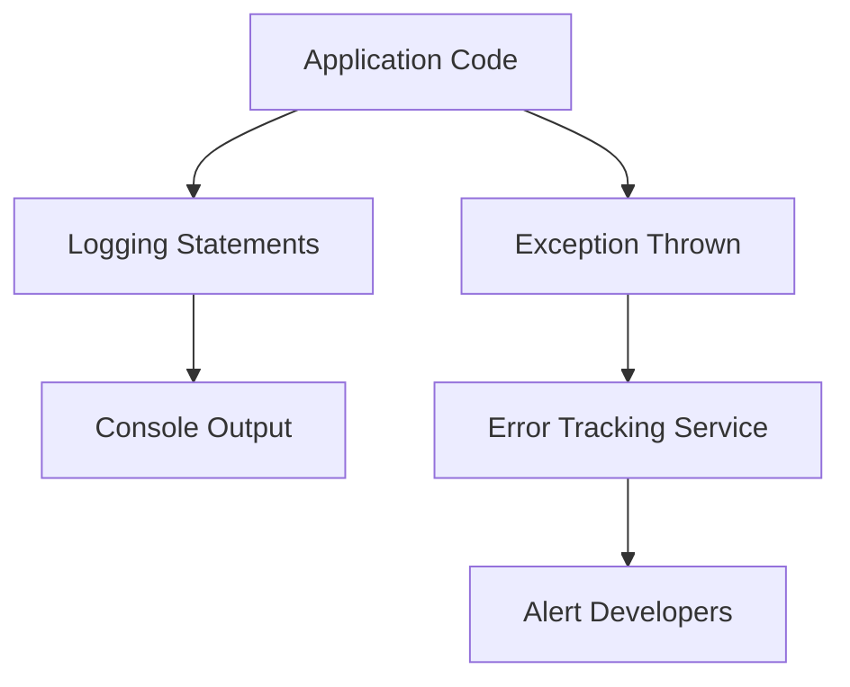

## 10.3.2 Logging and Error Tracking

In the realm of software development, particularly in mobile applications, logging and error tracking are indispensable tools. They provide insights into the application's behavior, help diagnose issues, and ensure a smooth user experience. This section delves into the importance of logging, explores various logging techniques in Flutter, and discusses integrating error tracking services to capture and report exceptions effectively.

### Importance of Logging

Logging serves as a window into your application's inner workings. It allows developers to:

- **Track Execution Flow:** Understand the sequence of operations and identify where things might be going wrong.
- **Monitor Application State:** Capture the state of the application at various points to aid in debugging.
- **Diagnose Issues:** Quickly pinpoint the source of errors or unexpected behavior.
- **Audit and Compliance:** Maintain records of application activity for auditing purposes.

Effective logging can significantly reduce the time spent on debugging and improve the overall quality of the application.

### Using `print` and `debugPrint`

In Flutter, the simplest way to log messages is by using the `print` function. However, for more controlled output, especially when dealing with a large volume of logs, `debugPrint` is preferred.

#### `print`

The `print` function outputs messages to the console. It's straightforward and useful for quick debugging.

```dart
void fetchData() {
  print('Fetching data...');
  // Fetch data logic
  print('Data fetched successfully.');
}
```

#### `debugPrint`

`debugPrint` is an enhanced version of `print` that throttles output to prevent overwhelming the console, making it ideal for logging in production environments.

```dart
void fetchData() {
  debugPrint('Fetching data...');
  // Fetch data logic
  debugPrint('Data fetched successfully.');
}
```

**Explanation:** These examples demonstrate how `print` and `debugPrint` can be used to log informational messages, helping track the flow of execution and the success of operations.

### Integrating Logging Packages

For structured logging, the `logger` package offers a more robust solution. It allows categorizing log messages by severity levels and formatting them for better readability.

#### Logger Package

The `logger` package provides a flexible and structured approach to logging in Flutter applications.

**Installation:**

Add the package to your `pubspec.yaml`:

```yaml
dependencies:
  logger: ^1.2.0
```

**Usage Example:**

```dart
import 'package:logger/logger.dart';

final logger = Logger();

void fetchData() {
  logger.d('Fetching data...');
  try {
    // Fetch data logic
    logger.i('Data fetched successfully.');
  } catch (e) {
    logger.e('Error fetching data: $e');
  }
}
```

**Explanation:** This example shows how to initialize the `Logger`, log messages at different levels (debug, info, error), and handle exceptions effectively. The `logger` package allows you to format logs, filter them by severity, and even output them to different destinations such as files or remote servers.

### Error Tracking Services

While logging is essential for tracking application behavior, error tracking services provide real-time insights into exceptions and crashes. They help prioritize and fix stability issues by capturing detailed error reports.

#### Sentry

Sentry is a popular error tracking service that captures and reports exceptions in real-time.

**Installation and Setup:**

Add Sentry to your `pubspec.yaml`:

```yaml
dependencies:
  sentry_flutter: ^7.0.0
```

**Usage Example:**

```dart
import 'package:flutter/material.dart';
import 'package:sentry_flutter/sentry_flutter.dart';

void main() async {
  await SentryFlutter.init(
    (options) {
      options.dsn = 'YOUR_SENTRY_DSN';
    },
    appRunner: () => runApp(MyApp()),
  );
}

class MyApp extends StatelessWidget {
  @override
  Widget build(BuildContext context) {
    return MaterialApp(
      home: Scaffold(
        appBar: AppBar(title: Text('Sentry Example')),
        body: Center(
          child: ElevatedButton(
            onPressed: () {
              throw Exception('Test Sentry Exception');
            },
            child: Text('Trigger Exception'),
          ),
        ),
      ),
    );
  }
}
```

**Explanation:** This example demonstrates how to initialize Sentry within a Flutter app and capture exceptions. By integrating Sentry, developers can receive alerts and detailed reports whenever an exception occurs, facilitating quicker resolutions.

#### Firebase Crashlytics

Firebase Crashlytics is another powerful tool for real-time crash reporting, offering insights into app stability and user experience.

**Installation and Setup:**

Add Firebase Crashlytics to your `pubspec.yaml`:

```yaml
dependencies:
  firebase_crashlytics: ^3.3.3
  firebase_core: ^2.10.0
```

**Usage Example:**

```dart
import 'package:flutter/material.dart';
import 'package:firebase_core/firebase_core.dart';
import 'package:firebase_crashlytics/firebase_crashlytics.dart';

void main() async {
  WidgetsFlutterBinding.ensureInitialized();
  await Firebase.initializeApp();

  // Pass all uncaught errors to Crashlytics
  FlutterError.onError = FirebaseCrashlytics.instance.recordFlutterError;

  runApp(MyApp());
}

class MyApp extends StatelessWidget {
  @override
  Widget build(BuildContext context) {
    return MaterialApp(
      home: Scaffold(
        appBar: AppBar(title: Text('Crashlytics Example')),
        body: Center(
          child: ElevatedButton(
            onPressed: () {
              throw Exception('Test Crashlytics Exception');
            },
            child: Text('Trigger Exception'),
          ),
        ),
      ),
    );
  }
}
```

**Explanation:** This setup shows how to initialize Firebase Crashlytics and capture uncaught exceptions by redirecting Flutter's error handler. Crashlytics provides detailed crash reports and analytics, helping developers prioritize and address issues effectively.

### Mermaid.js Diagrams

To visualize the flow of logging events and error tracking, consider the following diagram:

```markdown

```

**Description:** This flowchart illustrates how logging statements output to the console and how exceptions are captured by error tracking services, which then alert developers to take action.

### Best Practices

- **Use Structured Logging:** Implement structured logging to categorize and filter log messages effectively.
- **Avoid Logging Sensitive Information:** Ensure that logs do not contain sensitive user data or credentials.
- **Set Appropriate Log Levels:** Use different log levels (debug, info, warning, error) to categorize the importance and severity of log messages.
- **Monitor Logs Regularly:** Continuously monitor logs and error reports to identify and address issues promptly.

### Common Pitfalls

- **Excessive Logging:** Overlogging can clutter the console and make it difficult to identify relevant information.
- **Ignoring Log Output:** Failing to review and act upon log messages can lead to undetected issues.

### Implementation Guidance

- **Environment-Specific Configurations:** Set up environments (development, staging, production) with appropriate logging configurations to manage log verbosity.
- **Early Integration:** Integrate logging and error tracking setups early in the development process to maximize their effectiveness.

By following these guidelines and leveraging the tools discussed, developers can enhance their debugging processes, improve application stability, and deliver a superior user experience.

## Quiz Time!



### What is the primary purpose of logging in application development?

- [x] To track the flow of execution and state of the application.
- [ ] To increase the application's performance.
- [ ] To reduce the size of the application.
- [ ] To enhance the application's UI.

> **Explanation:** Logging helps track the flow of execution and the state of the application, which is crucial for debugging and monitoring.

### Which function is used in Flutter to output messages to the console with throttling?

- [ ] print
- [x] debugPrint
- [ ] log
- [ ] consolePrint

> **Explanation:** `debugPrint` is used to output messages to the console with throttling to prevent overwhelming the console.

### What is a key advantage of using the `logger` package in Flutter?

- [x] It provides structured logging with different severity levels.
- [ ] It automatically fixes errors in the code.
- [ ] It reduces the application size.
- [ ] It enhances the application's UI.

> **Explanation:** The `logger` package provides structured logging with different severity levels, making it easier to categorize and filter log messages.

### Which service is known for real-time error tracking and capturing exceptions in Flutter?

- [x] Sentry
- [ ] Firebase Analytics
- [ ] Google Maps
- [ ] Cloud Firestore

> **Explanation:** Sentry is a real-time error tracking service that captures and reports exceptions in Flutter applications.

### What should be avoided when logging information in an application?

- [x] Logging sensitive user data or credentials.
- [ ] Logging the flow of execution.
- [ ] Logging errors and warnings.
- [ ] Logging informational messages.

> **Explanation:** Logging sensitive user data or credentials should be avoided to protect user privacy and security.

### How can Firebase Crashlytics be integrated into a Flutter application?

- [x] By initializing Firebase and setting up Crashlytics to capture uncaught exceptions.
- [ ] By adding it to the app's UI components.
- [ ] By using it to replace the main function.
- [ ] By directly modifying the app's database.

> **Explanation:** Firebase Crashlytics is integrated by initializing Firebase and setting up Crashlytics to capture uncaught exceptions.

### What is a common pitfall when implementing logging in applications?

- [x] Excessive logging that clutters the console.
- [ ] Logging only errors and warnings.
- [ ] Using structured logging.
- [ ] Monitoring logs regularly.

> **Explanation:** Excessive logging can clutter the console and make it difficult to identify relevant information.

### Which of the following is a best practice for logging?

- [x] Use different log levels to categorize messages.
- [ ] Log all user interactions.
- [ ] Ignore log outputs in production.
- [ ] Log sensitive user data for debugging.

> **Explanation:** Using different log levels to categorize messages helps manage the importance and severity of log messages effectively.

### What is the role of error tracking services like Sentry and Firebase Crashlytics?

- [x] To capture and report exceptions and crashes in real-time.
- [ ] To enhance the application's UI.
- [ ] To reduce the application's size.
- [ ] To automatically fix application errors.

> **Explanation:** Error tracking services like Sentry and Firebase Crashlytics capture and report exceptions and crashes in real-time, helping developers address issues promptly.

### True or False: Logging should be integrated early in the development process.

- [x] True
- [ ] False

> **Explanation:** Integrating logging early in the development process maximizes its effectiveness in debugging and monitoring the application.


