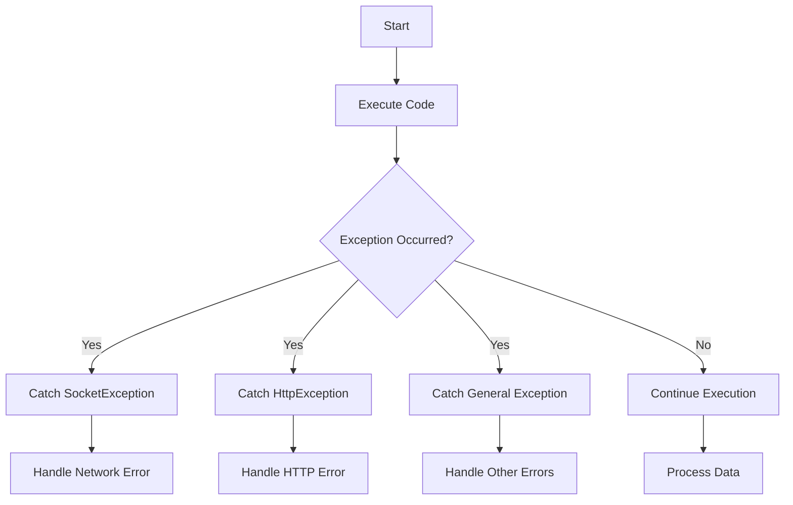

## 10.3.3 Handling Exceptions

In the world of software development, exceptions are inevitable. They represent runtime errors that occur during the execution of a program, disrupting the normal flow of operations. In Flutter, as in many other programming environments, handling exceptions effectively is crucial for building robust, user-friendly applications. This section delves into the intricacies of exception handling in Flutter, offering insights, best practices, and practical examples to equip you with the tools needed to manage errors gracefully.

### Understanding Exceptions in Flutter

Exceptions in Flutter, as in other programming languages, are events that occur during the execution of a program that disrupt the normal flow of instructions. They can arise from a variety of issues, such as network failures, invalid user inputs, or unexpected conditions in the code.

- **Synchronous Exceptions:** These occur during the execution of synchronous code. For example, trying to access an element in a list by an index that is out of bounds will throw a synchronous exception.
  
- **Asynchronous Exceptions:** These occur in asynchronous code, such as when awaiting the result of a network call. Handling asynchronous exceptions requires a different approach, often involving the use of `Future` and `async`/`await` constructs.

Understanding the nature of exceptions is the first step in managing them effectively. By distinguishing between synchronous and asynchronous exceptions, developers can apply appropriate handling strategies.

### Best Practices for Exception Handling

Effective exception handling is not just about catching errors; it's about managing them in a way that maintains the integrity of the application and provides a seamless user experience. Here are some best practices to consider:

- **Use Specific Exception Types:** Catch specific exceptions instead of general ones to handle different error conditions appropriately. This allows for more precise error handling and makes the code easier to maintain.

- **Avoid Overcatching:** Do not catch exceptions unless you can handle them meaningfully. Allowing exceptions to propagate can sometimes be the best approach, especially if there's a higher-level handler that can manage them more effectively.

- **Provide Meaningful Error Messages:** Offer clear and actionable error messages to assist in debugging and user communication. This helps developers understand the issue and provides users with guidance on what went wrong.

- **Log Exceptions:** Always log exceptions for further analysis and debugging purposes. Logging provides a record of what went wrong and can be invaluable for diagnosing and fixing issues.

### Using `try-catch` Blocks

The `try-catch` block is a fundamental construct for handling exceptions in Dart and Flutter. It allows you to catch exceptions and handle them gracefully, preventing the application from crashing.

#### Code Example

Here's an example of using `try-catch` to handle exceptions in a network request:

```dart
import 'dart:io';
import 'package:http/http.dart' as http;

Future<void> fetchData() async {
  try {
    final response = await http.get(Uri.parse('https://api.example.com/data'));

    if (response.statusCode == 200) {
      // Process data
    } else {
      throw HttpException('Failed to load data', uri: Uri.parse('https://api.example.com/data'));
    }
  } on SocketException {
    // Handle network-related errors
    print('No Internet connection');
  } on HttpException catch (e) {
    // Handle HTTP errors
    print('HTTP Error: ${e.message}');
  } catch (e) {
    // Handle any other exceptions
    print('Unexpected Error: $e');
  }
}
```

#### Explanation

- **SocketException:** This is caught when there is a network-related error, such as no internet connection.
- **HttpException:** This is caught when the HTTP request fails, allowing you to handle specific HTTP errors.
- **General Exception:** Any other exceptions are caught by the general `catch` block, ensuring that unexpected errors are also managed.

### Using `assert` for Debugging

The `assert` statement is a powerful tool for debugging in Flutter. It allows you to enforce conditions during development, helping to catch logical errors early.

#### Code Example

```dart
void processData(String data) {
  assert(data.isNotEmpty, 'Data cannot be empty');
  // Process data
}
```

#### Explanation

The `assert` statement checks that the `data` string is not empty before proceeding with processing. If the condition is false, the program will terminate with an error message, helping you identify issues during development.

### Displaying Error Messages to Users

Handling exceptions is not just about managing errors internally; it's also about communicating them to users in a way that is informative and non-intrusive.

#### UI Integration

One effective way to display error messages in Flutter is by using the `SnackBar` widget, which provides a brief message at the bottom of the screen.

#### Code Example

```dart
import 'package:flutter/material.dart';
import 'package:http/http.dart' as http;

void fetchData(BuildContext context) async {
  try {
    final response = await http.get(Uri.parse('https://api.example.com/data'));
    // Process data
  } catch (e) {
    ScaffoldMessenger.of(context).showSnackBar(
      SnackBar(content: Text('Error fetching data: $e')),
    );
  }
}
```

#### Explanation

In this example, any exceptions that occur during the data fetch are caught and displayed to the user using a `SnackBar`. This approach keeps users informed without disrupting their experience.

### Exception Handling Flowchart

To better understand the flow of exception handling, consider the following Mermaid.js diagram, which illustrates how different exceptions are caught and handled:



### Best Practices

- **Centralized Error Handling:** Implement centralized mechanisms to handle uncaught exceptions globally using Flutter’s `FlutterError.onError`. This ensures that all exceptions are managed consistently across the application.

- **Graceful Degradation:** Design the app to recover gracefully from errors, maintaining functionality where possible. This enhances the user experience by minimizing disruption.

- **User-Friendly Messages:** Ensure that error messages are understandable and provide guidance on potential next steps. This helps users know what to do when something goes wrong.

### Common Pitfalls

- **Silent Failures:** Catching exceptions without handling them can obscure underlying issues, making debugging difficult. Always ensure that exceptions are logged or otherwise managed.

- **Overcatching Exceptions:** Catching too broad exception types can lead to improper error management and hinder debugging efforts. Be specific in the exceptions you catch.

### Implementation Guidance

- **Review Exception Handling Code:** Regularly review all exception handling code to ensure exceptions are managed appropriately. This helps maintain code quality and reliability.

- **Log All Exceptions:** Even those handled gracefully, to facilitate comprehensive error analysis. Logging provides valuable insights into the application's behavior and potential issues.

By following these guidelines and best practices, you can build Flutter applications that are resilient, user-friendly, and easy to maintain. Exception handling is a critical aspect of software development, and mastering it will significantly enhance the quality of your applications.

## Quiz Time!



### What are exceptions in Flutter?

- [x] Runtime errors that occur during code execution
- [ ] Compile-time errors that occur before code execution
- [ ] Logical errors that occur in the code logic
- [ ] Syntax errors that occur due to incorrect syntax

> **Explanation:** Exceptions are runtime errors that occur during the execution of a program, disrupting the normal flow of operations.

### Which type of exception occurs during asynchronous code execution?

- [ ] Synchronous exceptions
- [x] Asynchronous exceptions
- [ ] Logical exceptions
- [ ] Compile-time exceptions

> **Explanation:** Asynchronous exceptions occur in asynchronous code, such as when awaiting the result of a network call.

### What is a best practice for exception handling in Flutter?

- [x] Use specific exception types
- [ ] Catch all exceptions with a general catch block
- [ ] Ignore exceptions to avoid crashes
- [ ] Use print statements instead of logging

> **Explanation:** Using specific exception types allows for more precise error handling and makes the code easier to maintain.

### What is the purpose of the `assert` statement in Flutter?

- [ ] To catch exceptions during runtime
- [x] To enforce conditions during development
- [ ] To log errors for debugging
- [ ] To display error messages to users

> **Explanation:** The `assert` statement is used to enforce conditions during development, helping to catch logical errors early.

### How can you display error messages to users in Flutter?

- [x] Using a `SnackBar`
- [ ] Using a `print` statement
- [ ] Using a `Text` widget
- [ ] Using a `Dialog`

> **Explanation:** A `SnackBar` provides a brief message at the bottom of the screen, keeping users informed without disrupting their experience.

### What is a common pitfall in exception handling?

- [x] Silent failures
- [ ] Logging all exceptions
- [ ] Using specific exception types
- [ ] Displaying error messages

> **Explanation:** Silent failures occur when exceptions are caught without being handled, obscuring underlying issues.

### Why is centralized error handling important?

- [x] To manage all exceptions consistently across the application
- [ ] To catch exceptions only in specific parts of the code
- [ ] To avoid logging errors
- [ ] To ensure exceptions are ignored

> **Explanation:** Centralized error handling ensures that all exceptions are managed consistently across the application.

### What should you do with exceptions that are handled gracefully?

- [x] Log them for further analysis
- [ ] Ignore them to avoid clutter
- [ ] Display them to users
- [ ] Use `assert` statements

> **Explanation:** Logging exceptions, even those handled gracefully, facilitates comprehensive error analysis.

### What is the role of `FlutterError.onError` in Flutter?

- [x] To handle uncaught exceptions globally
- [ ] To catch specific exceptions
- [ ] To display error messages to users
- [ ] To enforce conditions during development

> **Explanation:** `FlutterError.onError` is used to implement centralized mechanisms to handle uncaught exceptions globally.

### True or False: Overcatching exceptions can lead to improper error management.

- [x] True
- [ ] False

> **Explanation:** Overcatching exceptions can lead to improper error management and hinder debugging efforts.


