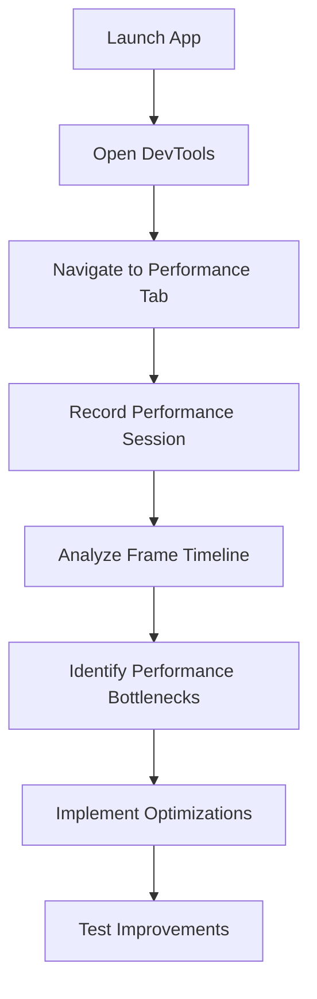

## 10.3.4 Profiling Performance

In the world of mobile app development, performance is paramount. Users expect smooth, responsive interfaces that operate seamlessly across a range of devices. Profiling performance in Flutter applications is a critical step in ensuring that your app meets these expectations. This section will delve into the intricacies of performance profiling, leveraging Flutter's DevTools to identify and address performance bottlenecks, and implementing optimizations to enhance app efficiency.

### Understanding App Performance Profiling

Performance profiling is the process of analyzing an application's runtime behavior to identify bottlenecks and optimize performance. It involves monitoring various metrics that can impact user experience, such as:

- **Frame Rendering Times:** The time it takes to render each frame. For smooth animations and transitions, frames should be rendered within 16 milliseconds to maintain a 60 frames per second (fps) rate.
- **CPU Usage:** The amount of processing power consumed by the app. High CPU usage can lead to battery drain and overheating.
- **Memory Consumption:** The amount of RAM used by the app. Excessive memory usage can cause the app to crash or slow down.
- **Network Latency:** The time taken for data to travel from the app to a server and back. High latency can affect the responsiveness of network-dependent features.

By understanding these metrics, developers can pinpoint inefficiencies and implement targeted optimizations.

### Using Flutter DevTools for Profiling

Flutter DevTools is a powerful suite of tools designed to help developers profile and debug their applications. It provides real-time insights into app performance, enabling you to monitor and analyze various aspects of your app's behavior.

#### Performance Tab

The Performance tab in DevTools is your go-to resource for profiling app performance. It offers several features to help you understand and optimize your app's runtime behavior:

- **Timeline Viewer:** Visualizes the sequence of events during app execution, helping you identify long-running frames and performance bottlenecks.
- **CPU Profiler:** Analyzes CPU usage to detect tasks that consume excessive processing power.

##### Steps to Profile Performance

1. **Launch DevTools:** You can access DevTools via your Integrated Development Environment (IDE) or the command line.
2. **Navigate to the Performance Tab:** Focus on monitoring CPU and frame rendering metrics.
3. **Record a Performance Session:** Interact with your app to capture performance data. This involves using your app as a user would, triggering animations, navigating between screens, and performing other actions.
4. **Analyze the Timeline:** Look for spikes in CPU usage, dropped frames, and unnecessary widget rebuilds. This analysis will help you identify areas that need optimization.

##### Code Example

While profiling itself doesn't require code changes, you can enable certain flags to gather more detailed insights. For instance, the `debugProfileBuildsEnabled` flag logs widget build times, which can be helpful for identifying widgets that rebuild excessively.

```dart
import 'package:flutter/rendering.dart';

void main() {
  debugProfileBuildsEnabled = true;
  runApp(MyApp());
}
```

**Explanation:**

- This code snippet enables profiling of widget build times. By setting `debugProfileBuildsEnabled` to `true`, you can log the time taken to build each widget, helping you identify and optimize widgets that rebuild more often than necessary.

### Optimizing Identified Issues

Once you've identified performance bottlenecks, the next step is to implement optimizations. Here are some common strategies:

#### Reducing Widget Rebuilds

- **Use `const` Constructors:** Widgets that don't change can be marked as `const`, preventing unnecessary rebuilds.
- **Optimize `setState` Calls:** Minimize the scope of `setState` to affect only the parts of the UI that need updating.

#### Improving Frame Rendering

- **Optimize Animations:** Ensure animations are smooth by reducing complexity and avoiding heavy computations during frame rendering.
- **Simplify UI Computations:** Break down complex UI operations into smaller, more manageable tasks to fit within the frame budget.

#### Memory Leak Detection

- **Monitor Memory Usage:** Use the Memory tab in DevTools to track memory allocations over time and identify leaks.
- **Dispose of Resources Properly:** Ensure that resources such as controllers and streams are disposed of when no longer needed.

### Mermaid.js Diagrams

To visualize the process of profiling and optimizing app performance, we can use a flowchart:

```markdown

```

### Best Practices

- **Regular Profiling:** Integrate performance profiling into your development cycle to catch issues early and ensure consistent performance.
- **Focus on Hotspots:** Prioritize optimizing areas with the highest impact on performance based on profiling data.
- **Benchmarking:** Establish performance benchmarks to measure the effectiveness of optimizations over time.

### Common Pitfalls

- **Ignoring Profiling Data:** Failing to act on profiling insights can lead to subpar app performance and user dissatisfaction.
- **Over-Optimization:** Avoid spending time optimizing non-critical paths that don't significantly impact overall performance.

### Implementation Guidance

- **Use DevTools Extensively:** Regularly monitor both the entire app performance and the performance of individual widgets.
- **Document Performance Issues:** Keep a record of identified performance issues and their resolutions to build a knowledge base for future development.

By following these guidelines and leveraging the power of Flutter DevTools, you can ensure that your app delivers a smooth, responsive experience to users across all devices.

## Quiz Time!



### What is performance profiling in the context of Flutter app development?

- [x] Analyzing an application's runtime behavior to identify bottlenecks and optimize performance.
- [ ] Designing the UI layout of an application.
- [ ] Writing unit tests for application logic.
- [ ] Deploying the application to app stores.

> **Explanation:** Performance profiling involves analyzing the runtime behavior of an application to identify and optimize performance bottlenecks.

### Which of the following is NOT a key performance metric in app profiling?

- [ ] Frame rendering times
- [ ] CPU usage
- [x] Code readability
- [ ] Memory consumption

> **Explanation:** Code readability is important for maintainability but is not a performance metric.

### What does the Timeline Viewer in Flutter DevTools help you visualize?

- [x] The sequence of events during app execution.
- [ ] The color scheme of the app.
- [ ] The number of lines of code in the app.
- [ ] The app's network requests.

> **Explanation:** The Timeline Viewer visualizes the sequence of events during app execution, helping identify performance bottlenecks.

### How can you enable logging of widget build times in Flutter?

- [x] Set `debugProfileBuildsEnabled` to `true`.
- [ ] Use the `print` function in every widget.
- [ ] Set `debugPaintSizeEnabled` to `true`.
- [ ] Use the `debugPrint` function in the main method.

> **Explanation:** Setting `debugProfileBuildsEnabled` to `true` logs widget build times, helping identify rebuild issues.

### What is the purpose of using `const` constructors in Flutter widgets?

- [x] To prevent unnecessary widget rebuilds.
- [ ] To increase the app's startup time.
- [ ] To make the app compatible with older devices.
- [ ] To enable dark mode in the app.

> **Explanation:** `const` constructors prevent unnecessary widget rebuilds, optimizing performance.

### Which tool in DevTools helps you monitor memory usage and detect leaks?

- [ ] CPU Profiler
- [x] Memory tab
- [ ] Network tab
- [ ] Widget Inspector

> **Explanation:** The Memory tab in DevTools helps monitor memory usage and detect leaks.

### What is the recommended frame rendering time for smooth 60fps performance?

- [x] 16 milliseconds
- [ ] 30 milliseconds
- [ ] 60 milliseconds
- [ ] 120 milliseconds

> **Explanation:** Frames should be rendered within 16 milliseconds to maintain smooth 60fps performance.

### Why is it important to integrate performance profiling into the development cycle?

- [x] To catch issues early and ensure consistent performance.
- [ ] To reduce the number of lines of code.
- [ ] To increase the app's file size.
- [ ] To make the app more colorful.

> **Explanation:** Integrating performance profiling helps catch issues early and maintain consistent app performance.

### What is a common pitfall when optimizing app performance?

- [x] Over-optimization
- [ ] Using too many colors
- [ ] Writing too many comments
- [ ] Using too few widgets

> **Explanation:** Over-optimization can waste development time without meaningful performance gains.

### True or False: Profiling data should be ignored if the app seems to work fine.

- [ ] True
- [x] False

> **Explanation:** Ignoring profiling data can lead to subpar app performance and missed optimization opportunities.


