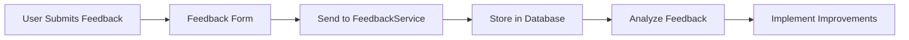

## 10.4.1 Collecting User Feedback

In the dynamic world of mobile app development, user feedback is a cornerstone for creating applications that not only meet but exceed user expectations. Collecting feedback effectively can guide development decisions, enhance user satisfaction, and ensure that your app evolves in alignment with user needs. This section delves into the significance of user feedback, various methods for collecting it, and how to implement these strategies in your Flutter applications.

### Importance of User Feedback

User feedback provides invaluable insights into how your app is perceived and used by real users. It highlights areas of strength and identifies aspects that require improvement. Here are some key reasons why collecting user feedback is essential:

- **Usability Insights:** Feedback reveals how intuitive and user-friendly your app is, helping you identify usability issues that may not be apparent during development.
- **Feature Effectiveness:** Users can provide direct feedback on which features they find useful and which they do not, guiding future feature development.
- **User Satisfaction:** Engaging with users through feedback mechanisms shows that you value their opinions, fostering a sense of community and loyalty.
- **Development Guidance:** Feedback can prioritize bug fixes and feature enhancements, ensuring that development resources are allocated effectively.

### Methods of Collecting Feedback

There are several methods to collect user feedback, each with its own advantages. Here, we explore some of the most effective techniques:

#### In-App Feedback Forms

Embedding feedback forms directly within your app allows users to submit suggestions, bug reports, or ratings seamlessly. This method is convenient for users and can be tailored to gather specific information.

**Code Example:**

```dart
import 'package:flutter/material.dart';
import 'package:your_app/services/feedback_service.dart';

class FeedbackForm extends StatefulWidget {
  @override
  _FeedbackFormState createState() => _FeedbackFormState();
}

class _FeedbackFormState extends State<FeedbackForm> {
  final _formKey = GlobalKey<FormState>();
  String _feedback = '';

  void _submitFeedback() {
    if (_formKey.currentState!.validate()) {
      _formKey.currentState!.save();
      FeedbackService.sendFeedback(_feedback);
      ScaffoldMessenger.of(context).showSnackBar(
        SnackBar(content: Text('Feedback submitted!')),
      );
    }
  }

  @override
  Widget build(BuildContext context) {
    return Scaffold(
      appBar: AppBar(title: Text('Feedback')),
      body: Padding(
        padding: const EdgeInsets.all(16.0),
        child: Form(
          key: _formKey,
          child: Column(
            children: [
              TextFormField(
                decoration: InputDecoration(labelText: 'Your Feedback'),
                maxLines: 5,
                validator: (value) {
                  if (value == null || value.isEmpty) {
                    return 'Please enter your feedback';
                  }
                  return null;
                },
                onSaved: (value) {
                  _feedback = value!;
                },
              ),
              SizedBox(height: 20),
              ElevatedButton(
                onPressed: _submitFeedback,
                child: Text('Submit'),
              ),
            ],
          ),
        ),
      ),
    );
  }
}
```

**Explanation:**

- This example demonstrates creating a simple in-app feedback form using Flutter's `Form` and `TextFormField` widgets.
- The `FeedbackService` handles the submission logic, such as sending the feedback to a backend or logging service.

#### Surveys and Polls

Surveys and polls can be used to gather structured feedback on specific topics. These can be implemented using third-party services or custom solutions.

**Tools:**

- **Google Forms:** Easy to set up and integrate, ideal for simple surveys.
- **SurveyMonkey:** Offers advanced survey features and analytics.
- **Typeform:** Provides interactive and engaging survey experiences.

#### Analytics and Behavioral Tracking

Implementing analytics allows you to monitor user behavior, helping identify common pain points and areas for improvement.

**Tools:**

- **Firebase Analytics:** Provides detailed insights into user interactions and app performance.
- **Mixpanel:** Offers advanced analytics for tracking user behavior and engagement.
- **Amplitude:** Focuses on product analytics to understand user journeys.

#### Direct Communication Channels

Encouraging users to reach out via email support, forums, or social media channels can provide more detailed feedback and foster community engagement.

### Implementing Feedback Collection in Flutter

Integrating feedback collection with backend services or databases is crucial for storing and analyzing user input effectively.

**Integration with Services:**

**Code Example:**

```dart
// feedback_service.dart
import 'package:cloud_firestore/cloud_firestore.dart';

class FeedbackService {
  static Future<void> sendFeedback(String feedback) async {
    // Example: Send feedback to Firestore
    await FirebaseFirestore.instance.collection('feedback').add({
      'feedback': feedback,
      'timestamp': FieldValue.serverTimestamp(),
    });
  }
}
```

**Explanation:**

- This code snippet shows how to send feedback data to a Firestore database, allowing for centralized storage and analysis.
- The `sendFeedback` method asynchronously adds feedback to a Firestore collection, including a timestamp for tracking.

### Mermaid.js Diagrams

Visualizing the feedback collection process can help in understanding the workflow from user submission to implementation of improvements.

**Diagram Type:** Feedback Collection Workflow

**Example:**

```markdown

```

**Description:**

- This flowchart outlines the process of collecting feedback, storing it in a database, analyzing the data, and implementing improvements based on insights gained.

### Best Practices

- **Ease of Access:** Ensure feedback forms are easily accessible within the app without disrupting the user experience.
- **Anonymity Options:** Allow users to submit feedback anonymously if they prefer, encouraging more honest and open responses.
- **Respond to Feedback:** Acknowledge user input and provide updates on resolutions to build trust and engagement.

### Common Pitfalls

- **Neglecting Feedback:** Failing to review and act on user feedback can lead to diminished user trust and satisfaction.
- **Overcomplicating Feedback Submission:** Creating overly complex feedback mechanisms can deter users from providing input.

### Implementation Guidance

- Regularly review collected feedback to prioritize feature development and bug fixes.
- Use visualization tools to analyze feedback trends and identify common issues.

By effectively collecting and analyzing user feedback, you can ensure that your Flutter app continues to evolve in a way that meets user needs and expectations. This not only enhances the user experience but also contributes to the long-term success of your application.

## Quiz Time!



### Why is user feedback important in app development?

- [x] It provides insights into app usability and areas needing improvement.
- [ ] It is only useful for marketing purposes.
- [ ] It is not necessary if the app is well-designed.
- [ ] It should only be collected after the app is fully developed.

> **Explanation:** User feedback is crucial as it provides insights into app usability, feature effectiveness, and areas needing improvement, guiding development decisions and enhancing user satisfaction.

### What is a common method for collecting user feedback directly within an app?

- [x] In-app feedback forms
- [ ] Social media polls
- [ ] Email newsletters
- [ ] Offline surveys

> **Explanation:** In-app feedback forms are a common method for collecting user feedback directly within an app, allowing users to submit suggestions, bug reports, or ratings seamlessly.

### Which tool is NOT typically used for analytics and behavioral tracking?

- [ ] Firebase Analytics
- [ ] Mixpanel
- [ ] Amplitude
- [x] Typeform

> **Explanation:** Typeform is primarily used for creating surveys and polls, not for analytics and behavioral tracking.

### What is a benefit of allowing users to submit feedback anonymously?

- [x] Encourages more honest and open responses
- [ ] Reduces the amount of feedback received
- [ ] Makes it easier to track user identities
- [ ] Ensures only positive feedback is submitted

> **Explanation:** Allowing users to submit feedback anonymously encourages more honest and open responses, as users may feel more comfortable sharing their true opinions.

### What should be done after collecting user feedback?

- [x] Analyze the feedback and implement improvements
- [ ] Ignore the feedback if the app is performing well
- [ ] Only consider feedback from paying users
- [ ] Use feedback solely for marketing purposes

> **Explanation:** After collecting user feedback, it should be analyzed to implement improvements, ensuring the app evolves in alignment with user needs.

### Which of the following is a common pitfall in collecting user feedback?

- [x] Neglecting feedback
- [ ] Responding to all feedback immediately
- [ ] Collecting feedback from multiple sources
- [ ] Using simple feedback forms

> **Explanation:** Neglecting feedback is a common pitfall, as failing to review and act on user feedback can lead to diminished user trust and satisfaction.

### How can feedback collection be integrated with backend services in Flutter?

- [x] By using a service to send feedback data to a database
- [ ] By storing feedback locally on the device
- [ ] By sending feedback directly to the app store
- [ ] By using only third-party survey tools

> **Explanation:** Feedback collection can be integrated with backend services in Flutter by using a service to send feedback data to a database, allowing for centralized storage and analysis.

### What is a best practice for making feedback forms accessible?

- [x] Ensure they are easily accessible within the app
- [ ] Hide them in the app settings
- [ ] Require users to complete a survey before accessing the form
- [ ] Only provide forms to premium users

> **Explanation:** A best practice is to ensure feedback forms are easily accessible within the app without disrupting the user experience, encouraging more users to provide feedback.

### What is the role of visualization tools in feedback analysis?

- [x] To analyze feedback trends and identify common issues
- [ ] To create marketing materials
- [ ] To replace the need for direct user feedback
- [ ] To automate the feedback collection process

> **Explanation:** Visualization tools help analyze feedback trends and identify common issues, providing insights that guide development decisions.

### True or False: Feedback should only be collected after the app is fully developed.

- [ ] True
- [x] False

> **Explanation:** False. Feedback should be collected throughout the development process to continuously improve the app and ensure it meets user needs.


