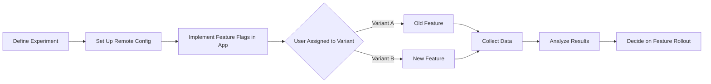

## 10.4.2 A/B Testing in Flutter

In the competitive world of mobile applications, understanding user preferences and optimizing features for better engagement is crucial. A/B testing is a powerful method that allows developers to compare two versions of a feature or interface to determine which one performs better. In this section, we will delve into the concept of A/B testing within the context of Flutter applications, utilizing Firebase Remote Config and Firebase Analytics to facilitate data-driven decisions that enhance user experience and app performance.

### Introduction to A/B Testing

A/B testing, also known as split testing, is a method of comparing two versions of a web page or app feature to see which one performs better. By randomly assigning users to different versions, developers can gather data on user interactions and preferences, allowing for informed decisions about which version to implement permanently.

- **Role in Enhancing User Experience:** A/B testing enables developers to make data-driven decisions, ensuring that changes lead to improved user satisfaction and app performance.
- **Data-Driven Decisions:** By analyzing user behavior and engagement metrics, developers can refine features, optimize user interfaces, and ultimately increase conversion rates.

### Setting Up A/B Tests

To implement A/B testing in Flutter, Firebase Remote Config is an invaluable tool. It allows developers to manage feature flags and parameter values remotely, enabling dynamic changes to app behavior without requiring a new app release.

#### Using Firebase Remote Config

**Overview:** Firebase Remote Config provides a way to change the behavior and appearance of your app without publishing an update. It allows you to define parameters in the Firebase console and fetch them in your app, making it ideal for A/B testing.

**Installation and Setup:**

To get started with Firebase Remote Config, add the following dependency to your `pubspec.yaml` file:

```yaml
dependencies:
  firebase_remote_config: ^3.3.11
```

**Usage Example:**

Below is a simple example demonstrating how to use Firebase Remote Config to toggle a feature flag in a Flutter app:

```dart
import 'package:firebase_remote_config/firebase_remote_config.dart';
import 'package:flutter/material.dart';

class ABTestingWidget extends StatefulWidget {
  @override
  _ABTestingWidgetState createState() => _ABTestingWidgetState();
}

class _ABTestingWidgetState extends State<ABTestingWidget> {
  bool showNewFeature = false;

  @override
  void initState() {
    super.initState();
    initializeRemoteConfig();
  }

  Future<void> initializeRemoteConfig() async {
    final RemoteConfig remoteConfig = RemoteConfig.instance;
    await remoteConfig.setDefaults({'new_feature_enabled': false});
    await remoteConfig.fetchAndActivate();
    setState(() {
      showNewFeature = remoteConfig.getBool('new_feature_enabled');
    });
  }

  @override
  Widget build(BuildContext context) {
    return Scaffold(
      appBar: AppBar(title: Text('A/B Testing Example')),
      body: Center(
        child: showNewFeature
            ? Text('New Feature Enabled!')
            : Text('Old Feature'),
      ),
    );
  }
}
```

**Explanation:**

- **Feature Flag:** The code demonstrates fetching a feature flag (`new_feature_enabled`) from Firebase Remote Config.
- **Conditional UI Rendering:** Based on the flag's value, the app conditionally displays either the new or old feature.

#### Using Firebase Analytics with A/B Testing

**Overview:** Firebase Analytics can be integrated with Remote Config to track user interactions and measure the effectiveness of different test variants. This integration provides insights into user behavior, helping to determine which variant leads to better engagement or conversion.

**Steps:**

1. **Define Experiments in Firebase Console:** Set up A/B test parameters and variant groups in the Firebase console.
2. **Implement Variants in App Code:** Use Remote Config to toggle between variants in your app.
3. **Analyze Results:** Utilize Firebase Analytics to interpret experiment outcomes and make informed decisions.

**Code Example:**

- **Defining Feature Flags:**

  ```dart
  Future<void> initializeRemoteConfig() async {
    final RemoteConfig remoteConfig = RemoteConfig.instance;
    await remoteConfig.setDefaults({'new_feature_enabled': false});
    await remoteConfig.fetchAndActivate();
    setState(() {
      showNewFeature = remoteConfig.getBool('new_feature_enabled');
    });
  }
  ```

- **Switching Between Variants:**

  ```dart
  @override
  Widget build(BuildContext context) {
    return Scaffold(
      appBar: AppBar(title: Text('A/B Testing Example')),
      body: Center(
        child: showNewFeature
            ? ElevatedButton(
                onPressed: () {
                  // New feature behavior
                },
                child: Text('New Feature'),
              )
            : ElevatedButton(
                onPressed: () {
                  // Old feature behavior
                },
                child: Text('Old Feature'),
              ),
      ),
    );
  }
  ```

**Explanation:**

- **Conditional Rendering:** The example shows how to conditionally render different feature variants based on Remote Config parameters, allowing for effective A/B testing.

### Mermaid.js Diagrams

To better understand the A/B testing process, let's visualize it with a flowchart:



**Description:** This flowchart outlines the process of setting up and executing an A/B test, including user segmentation and result analysis.

### Best Practices

- **Define Clear Objectives:** Establish what you aim to achieve with the A/B test, such as increasing engagement or improving conversion rates.
- **Randomize User Assignment:** Ensure that users are randomly assigned to different variants to eliminate bias.
- **Analyze Sufficient Data:** Run tests until statistically significant results are obtained to make informed decisions.
- **Isolate Variables:** Change only one variable at a time in each test to accurately determine its impact.

### Common Pitfalls

- **Insufficient Sample Size:** Running tests with too few users can lead to inconclusive or misleading results.
- **Multiple Concurrent Tests:** Conducting multiple tests simultaneously on the same user cohort can confound results.
- **Ignoring External Factors:** External events or changes in user behavior unrelated to the test can skew results.

### Implementation Guidance

- **Early Integration:** Encourage integrating A/B testing frameworks early in the development process to facilitate iterative improvements.
- **Documentation:** Recommend documenting test parameters, hypotheses, and results to build a repository of insights for future reference.

### Conclusion

A/B testing is a vital tool for Flutter developers aiming to enhance user experience and app performance through data-driven decisions. By leveraging Firebase Remote Config and Analytics, developers can efficiently manage feature flags, track user interactions, and analyze test outcomes. Implementing A/B testing with best practices in mind ensures that changes lead to meaningful improvements, ultimately resulting in a more engaging and successful application.

## Quiz Time!



### What is the primary purpose of A/B testing in app development?

- [x] To compare two versions of a feature to determine which performs better
- [ ] To test app performance under load
- [ ] To debug code issues
- [ ] To optimize app launch speed

> **Explanation:** A/B testing is used to compare two versions of a feature to determine which one performs better in terms of user engagement and satisfaction.

### Which Firebase service is primarily used for managing feature flags in A/B testing?

- [x] Firebase Remote Config
- [ ] Firebase Firestore
- [ ] Firebase Authentication
- [ ] Firebase Cloud Messaging

> **Explanation:** Firebase Remote Config is used to manage feature flags and parameter values for A/B testing.

### What is a key benefit of using Firebase Analytics with A/B testing?

- [x] It tracks user interactions and measures the effectiveness of different test variants.
- [ ] It provides real-time database access.
- [ ] It enhances app security.
- [ ] It reduces app size.

> **Explanation:** Firebase Analytics tracks user interactions and helps measure the effectiveness of different test variants, providing insights into user behavior.

### In the provided code example, what does the `showNewFeature` variable represent?

- [x] A feature flag indicating whether the new feature is enabled
- [ ] The user's current location
- [ ] The app's version number
- [ ] The user's authentication status

> **Explanation:** The `showNewFeature` variable is a feature flag that indicates whether the new feature is enabled based on the value fetched from Firebase Remote Config.

### What is a common pitfall of A/B testing?

- [x] Insufficient sample size
- [ ] Too many feature flags
- [ ] Overuse of animations
- [ ] Lack of user feedback

> **Explanation:** Insufficient sample size can lead to inconclusive or misleading results in A/B testing.

### Why is it important to randomize user assignment in A/B testing?

- [x] To eliminate bias and ensure fair comparison between variants
- [ ] To increase app performance
- [ ] To reduce code complexity
- [ ] To improve app security

> **Explanation:** Randomizing user assignment helps eliminate bias and ensures a fair comparison between different test variants.

### What should be done if multiple tests are conducted simultaneously on the same user cohort?

- [x] Avoid it, as it can confound results
- [ ] Encourage it for faster results
- [ ] Use it to test unrelated features
- [ ] Implement it to save resources

> **Explanation:** Conducting multiple tests simultaneously on the same user cohort can confound results and should be avoided.

### What is the role of Firebase Remote Config in A/B testing?

- [x] To manage feature flags and parameter values remotely
- [ ] To store user data
- [ ] To authenticate users
- [ ] To send push notifications

> **Explanation:** Firebase Remote Config is used to manage feature flags and parameter values remotely, allowing dynamic changes to app behavior.

### How can developers ensure statistically significant results in A/B testing?

- [x] By analyzing sufficient data
- [ ] By running tests for a short period
- [ ] By using complex algorithms
- [ ] By limiting user participation

> **Explanation:** Analyzing sufficient data ensures that results are statistically significant and reliable.

### True or False: A/B testing can help improve app performance by identifying the best-performing features.

- [x] True
- [ ] False

> **Explanation:** True. A/B testing helps identify the best-performing features, leading to improved app performance and user satisfaction.


