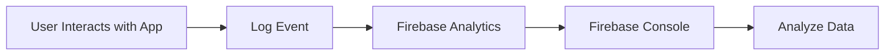

## 10.4 Analytics Integration

In today's competitive app market, understanding user behavior and app performance is crucial for success. Analytics provide the quantitative data necessary to make informed decisions about feature enhancements, bug fixes, and overall app improvements. This section will guide you through integrating analytics into your Flutter application, focusing on Firebase Analytics, tracking custom events, and analyzing data to drive your app's success.

### Importance of Analytics

Analytics play a pivotal role in app development by providing insights into how users interact with your app. This data helps you:

- **Understand User Behavior:** Gain insights into how users navigate your app, which features they use most, and where they encounter issues.
- **Improve User Experience:** Use data to identify pain points and areas for enhancement, leading to a more intuitive and satisfying user experience.
- **Drive Business Decisions:** Make informed decisions about which features to prioritize, which bugs to fix, and how to allocate resources effectively.
- **Measure App Performance:** Track key performance metrics such as user retention, engagement, and conversion rates to assess the app's success.

### Integrating Firebase Analytics

Firebase Analytics is a powerful tool that provides comprehensive insights into user behavior and app performance. Let's explore how to integrate Firebase Analytics into your Flutter app.

#### Installation and Setup

To get started with Firebase Analytics, you need to add the necessary dependencies to your `pubspec.yaml` file:

```yaml
dependencies:
  firebase_analytics: ^10.3.4
  firebase_core: ^2.10.0
```

Next, initialize Firebase in your Flutter application:

```dart
import 'package:flutter/material.dart';
import 'package:firebase_core/firebase_core.dart';
import 'package:firebase_analytics/firebase_analytics.dart';
import 'package:firebase_analytics/observer.dart';

void main() async {
  WidgetsFlutterBinding.ensureInitialized();
  await Firebase.initializeApp();
  runApp(MyApp());
}

class MyApp extends StatelessWidget {
  static FirebaseAnalytics analytics = FirebaseAnalytics.instance;
  static FirebaseAnalyticsObserver observer =
      FirebaseAnalyticsObserver(analytics: analytics);

  @override
  Widget build(BuildContext context) {
    return MaterialApp(
      title: 'Analytics Example',
      navigatorObservers: [observer],
      home: HomePage(),
    );
  }
}

class HomePage extends StatelessWidget {
  @override
  Widget build(BuildContext context) {
    return Scaffold(
      appBar: AppBar(title: Text('Home Page')),
      body: Center(
        child: ElevatedButton(
          onPressed: () {
            MyApp.analytics.logEvent(
              name: 'button_pressed',
              parameters: {'button_name': 'start_button'},
            );
          },
          child: Text('Start'),
        ),
      ),
    );
  }
}
```

**Explanation:**

- **Firebase Initialization:** The `Firebase.initializeApp()` method initializes Firebase services in your app.
- **FirebaseAnalyticsObserver:** This observer tracks navigation events automatically, providing insights into user navigation patterns.
- **Custom Event Logging:** The `logEvent` method logs custom events, such as button presses, with specific parameters.

### Tracking Custom Events

Custom events allow you to track specific user interactions and app engagements. Here are some common types of custom events:

- **User Interactions:** Track button taps, form submissions, and navigation events to understand user actions.
- **App Engagement:** Monitor screen views and feature usage frequencies to gauge user engagement.
- **E-commerce:** Track purchases, item views, and cart additions to analyze shopping behavior.

**Code Example:**

```dart
void trackPurchase(double amount, String itemId) {
  FirebaseAnalytics.instance.logEvent(
    name: 'purchase',
    parameters: {
      'value': amount,
      'item_id': itemId,
    },
  );
}
```

**Explanation:**

- **Custom Event Logging:** This example logs a "purchase" event with parameters such as the purchase amount and item ID, providing detailed insights into user transactions.

### Analyzing Analytics Data

Once you've integrated Firebase Analytics and started tracking events, it's time to analyze the data.

#### Firebase Console

The Firebase Console provides a comprehensive view of your app's analytics data:

- **Dashboards:** Access pre-built dashboards that display key metrics such as user demographics, retention rates, and funnel analysis.
- **Real-Time Data:** Monitor real-time data to understand current user activity and app performance.
- **Event Logs:** Review detailed event logs to analyze specific user interactions and behaviors.

#### Exporting Data for Advanced Analysis

For more in-depth analysis, you can export your analytics data to BigQuery:

- **BigQuery Integration:** Export data to BigQuery for advanced analysis using SQL queries, enabling you to uncover deeper insights and trends.
- **Custom Reports:** Create custom reports tailored to your specific business needs and objectives.

### Mermaid.js Diagrams

To visualize the flow of analytics data, consider using a Mermaid.js diagram:

```markdown

```

**Description:** This diagram illustrates the flow of user interactions from the app to Firebase Analytics and how data is visualized in the Firebase Console.

### Best Practices

To maximize the effectiveness of your analytics integration, follow these best practices:

- **Define Clear Metrics:** Establish key performance indicators (KPIs) that align with your business objectives.
- **Avoid Overtracking:** Focus on tracking meaningful events to prevent data overload and maintain clarity.
- **Segment Data:** Use user properties and audience segmentation to gain targeted insights.
- **Regularly Review Analytics:** Continuously monitor analytics data to identify trends, anomalies, and opportunities for improvement.

### Common Pitfalls

Be aware of common pitfalls when integrating analytics:

- **Ignoring Privacy Concerns:** Ensure compliance with data protection regulations like GDPR by obtaining user consent and anonymizing data where necessary.
- **Misinterpreting Data:** Avoid drawing conclusions without considering the broader context and potential external influences on user behavior.

### Implementation Guidance

To ensure a successful analytics integration, consider the following guidance:

- **Document Tracked Events:** Clearly document the purpose of each tracked event and its expected outcomes.
- **Consistent Naming Conventions:** Use consistent naming conventions for events and parameters to facilitate easier data management and analysis.

By integrating analytics into your Flutter application, you can gain valuable insights into user behavior and app performance, driving informed decisions that enhance the user experience and boost your app's success.

## Quiz Time!



### What is the primary purpose of integrating analytics into a Flutter app?

- [x] To gain insights into user behavior and app performance
- [ ] To increase the app's download size
- [ ] To make the app more visually appealing
- [ ] To reduce the app's loading time

> **Explanation:** Integrating analytics helps developers understand user behavior and app performance, enabling data-driven decisions for improvements.

### Which Firebase package is essential for integrating analytics in a Flutter app?

- [x] firebase_analytics
- [ ] firebase_messaging
- [ ] firebase_auth
- [ ] firebase_storage

> **Explanation:** The `firebase_analytics` package is specifically designed for integrating analytics into Flutter applications.

### What is the role of FirebaseAnalyticsObserver in a Flutter app?

- [x] To track navigation events automatically
- [ ] To manage user authentication
- [ ] To store user data
- [ ] To send push notifications

> **Explanation:** FirebaseAnalyticsObserver automatically tracks navigation events, providing insights into user navigation patterns.

### Why is it important to avoid overtracking in analytics?

- [x] To prevent data overload and maintain clarity
- [ ] To increase the app's complexity
- [ ] To reduce the app's performance
- [ ] To make the app more secure

> **Explanation:** Overtracking can lead to data overload, making it difficult to extract meaningful insights. Focusing on key events helps maintain clarity.

### How can you export Firebase Analytics data for advanced analysis?

- [x] By integrating with BigQuery
- [ ] By exporting to a CSV file
- [ ] By using Google Sheets
- [ ] By printing data to the console

> **Explanation:** Firebase Analytics data can be exported to BigQuery for advanced analysis using SQL queries.

### What is a common pitfall when interpreting analytics data?

- [x] Misinterpreting data without considering context
- [ ] Using too many colors in charts
- [ ] Tracking user location
- [ ] Sending data to multiple servers

> **Explanation:** Misinterpreting data without considering the broader context can lead to incorrect conclusions about user behavior.

### Which of the following is a best practice for analytics integration?

- [x] Define clear metrics that align with business objectives
- [ ] Track every possible event in the app
- [ ] Use random names for events
- [ ] Ignore user privacy concerns

> **Explanation:** Defining clear metrics ensures that the analytics data collected is meaningful and aligned with business goals.

### What should you do to ensure compliance with data protection regulations?

- [x] Obtain user consent and anonymize data
- [ ] Track user location without consent
- [ ] Share data with third parties
- [ ] Ignore privacy policies

> **Explanation:** Compliance with data protection regulations like GDPR requires obtaining user consent and anonymizing data where necessary.

### What type of events can you track with Firebase Analytics?

- [x] User interactions, app engagement, and e-commerce events
- [ ] Only user interactions
- [ ] Only app crashes
- [ ] Only network requests

> **Explanation:** Firebase Analytics allows tracking a wide range of events, including user interactions, app engagement, and e-commerce activities.

### True or False: Firebase Analytics can provide real-time data insights.

- [x] True
- [ ] False

> **Explanation:** Firebase Analytics offers real-time data insights, allowing developers to monitor current user activity and app performance.


