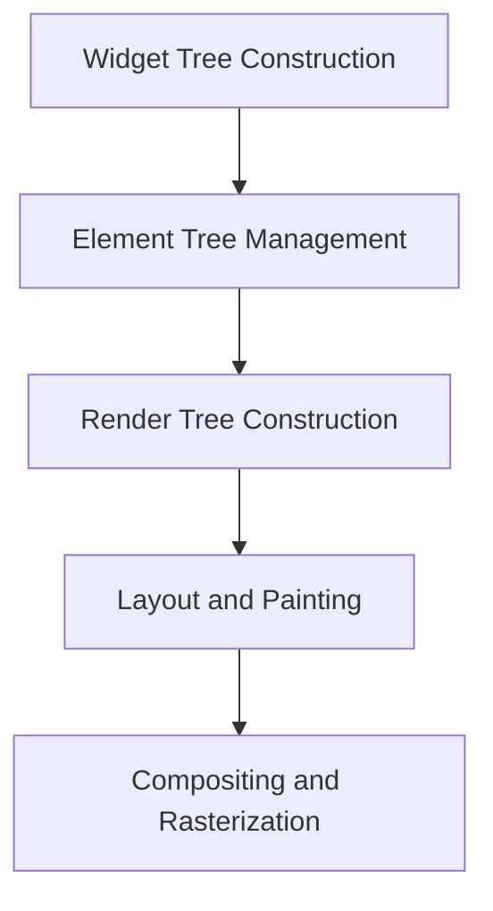

## Optimizing Performance in Flutter Apps: Ensuring Smooth and Efficient User Experiences

In the world of mobile application development, performance optimization is paramount. Flutter, with its rich set of tools and capabilities, allows developers to create visually appealing and responsive applications. However, to ensure these applications run smoothly across a wide range of devices, from low-end smartphones to high-end tablets, understanding and optimizing performance is crucial. This chapter explores the intricacies of Flutter's performance characteristics, strategies for identifying and addressing performance bottlenecks, effective resource and memory management, and tailoring optimizations to suit different device capabilities.

### Understanding Flutter Performance

Flutter's performance is often lauded for its ability to deliver high frame rates and smooth animations. This is largely due to its unique rendering engine, which bypasses traditional platform widgets and instead draws directly to the screen using Skia, a 2D graphics library. To fully leverage Flutter's performance potential, it's essential to understand the rendering pipeline and how it affects application performance.

#### The Rendering Pipeline

The rendering pipeline in Flutter consists of several stages, each responsible for different aspects of rendering the UI. Understanding these stages helps in diagnosing and optimizing performance issues.

- **Widget Tree Construction:** This is the initial stage where the widget tree is built. Widgets describe the configuration of the UI and are immutable. The widget tree is rebuilt whenever there is a change in the application's state.
  
- **Element Tree Management:** Flutter maintains an element tree that mirrors the widget tree. Elements are mutable and manage the lifecycle of widgets, including their creation, updates, and disposal.

- **Render Tree Construction:** The render tree is responsible for the actual layout and painting of widgets. It is constructed from the element tree and is where the layout constraints are applied.

- **Layout and Painting:** This stage involves calculating the size and position of each widget and painting them on the screen. This is where most performance issues can occur if not managed properly.

- **Compositing and Rasterization:** The final stage involves compositing the painted layers and rasterizing them into pixels that are displayed on the screen.



#### Identifying Performance Issues

Performance issues in Flutter apps can manifest as janky animations, slow UI updates, or excessive memory usage. Identifying these issues early in the development process is crucial for maintaining a smooth user experience.

- **Jank and Frame Drops:** Jank occurs when the UI fails to render at 60 frames per second (fps), resulting in noticeable stutters. This can be caused by heavy computations on the main thread or inefficient widget builds.

- **Slow UI Updates:** If the UI takes too long to respond to user interactions, it can lead to a poor user experience. This is often due to blocking operations on the main thread.

- **Excessive Memory Usage:** High memory consumption can lead to application crashes, especially on devices with limited resources. This is often caused by retaining unnecessary objects or failing to dispose of resources properly.

### Measuring Performance with Tools

Flutter provides a suite of tools to help developers measure and optimize performance. These tools offer insights into various aspects of the application's performance, allowing developers to pinpoint and address issues effectively.

- **Flutter DevTools:** An essential tool for inspecting the widget tree, analyzing layout performance, and profiling application performance. It provides a visual representation of the widget hierarchy and highlights potential performance bottlenecks.

- **Performance Overlay:** A built-in tool that displays real-time performance metrics, such as frame rendering times and GPU usage. It helps in identifying jank and frame drops.

- **Dart Observatory:** A powerful tool for debugging and profiling Dart applications. It provides insights into memory usage, garbage collection, and CPU profiling.

- **Flutter Inspector:** Part of the Flutter DevTools suite, the Inspector allows developers to visualize the widget tree, inspect widget properties, and debug layout issues.

### Efficient Widget Builds

Efficient widget builds are crucial for maintaining high performance in Flutter applications. By minimizing unnecessary rebuilds and optimizing widget hierarchies, developers can ensure smooth UI updates and animations.

#### Avoiding Unnecessary Rebuilds

Unnecessary rebuilds can lead to performance degradation, especially in complex UIs. To avoid this, developers should:

- **Use `const` Constructors:** Marking widgets as `const` ensures they are not rebuilt unnecessarily. This is particularly useful for static widgets that do not change over time.

- **Leverage Keys:** Keys help Flutter identify and preserve the state of widgets during rebuilds. They are essential for maintaining the identity of widgets in lists or when the order of widgets changes.

- **Optimize State Management:** Efficient state management can significantly reduce rebuilds. Using state management solutions like Provider, Riverpod, or Bloc can help manage state changes more effectively.

```dart
// Example of using const constructor
const Text('Hello, World!', style: TextStyle(fontSize: 20));
```

#### Immutability and Stateless Widgets

Leveraging immutability and stateless widgets can improve performance by reducing the need for widget rebuilds. Stateless widgets are ideal for static content that does not change in response to user interactions or state changes.

```dart
class MyStatelessWidget extends StatelessWidget {
  @override
  Widget build(BuildContext context) {
    return const Text('I am immutable');
  }
}
```

### Resource and Memory Management

Effective resource and memory management is crucial for maintaining application stability and performance, especially on devices with limited resources.

#### Managing Images and Assets

Images and assets can consume significant memory if not managed properly. To optimize their usage:

- **Use `Image.network` with Caching:** Flutter's `Image.network` widget supports caching, which reduces network requests and improves performance.

- **Dispose of Resources:** Ensure that resources such as controllers and streams are disposed of when no longer needed to free up memory.

```dart
// Example of using Image.network with caching
Image.network(
  'https://example.com/image.png',
  cacheWidth: 100, // Specify cache dimensions to optimize memory usage
);
```

#### Memory Leak Detection

Memory leaks can lead to increased memory usage and application crashes. Detecting and addressing memory leaks is essential for maintaining performance.

- **Use Dart DevTools Memory Tab:** The memory tab in Dart DevTools provides insights into memory usage and helps identify potential leaks.

- **Avoid Retaining Unnecessary References:** Ensure that objects are not retained longer than necessary, especially in closures or callbacks.

### Optimizing for Different Devices

Flutter applications run on a wide range of devices, each with different capabilities and constraints. Tailoring optimizations to suit these devices can enhance performance and user experience.

#### Handling Low-End Devices

Low-end devices often have limited processing power and memory. To optimize performance on these devices:

- **Reduce Animation Complexity:** Simplify animations and transitions to reduce CPU and GPU load.

- **Optimize Asset Loading:** Use lower resolution images and assets to reduce memory usage.

#### Responsiveness on High-Resolution Screens

High-resolution screens require careful optimization to ensure smooth performance and crisp visuals.

- **Use Vector Graphics:** Vector graphics, such as SVGs, scale well across different resolutions and reduce the need for multiple image assets.

- **Optimize Layouts for Large Screens:** Ensure that layouts are responsive and adapt to larger screen sizes without compromising performance.

### Network Optimization

Network performance can significantly impact user experience, especially in applications that rely heavily on data fetching and synchronization.

- **Reduce Data Usage:** Minimize data usage by compressing data and using efficient data formats.

- **Implement Caching Strategies:** Use caching to reduce network requests and improve load times.

- **Optimize API Calls:** Batch API calls and use pagination to reduce the number of requests and improve performance.

### Battery and Resource Consumption

Applications that consume excessive battery or resources can lead to poor user experiences and reduced device performance. To optimize battery and resource consumption:

- **Minimize Background Processing:** Limit background tasks and use efficient algorithms to reduce CPU usage.

- **Optimize Power-Intensive Features:** Features like GPS and Bluetooth should be used judiciously to conserve battery life.

### Conclusion

Optimizing performance in Flutter applications is a multifaceted process that involves understanding the rendering pipeline, identifying and addressing performance issues, managing resources and memory effectively, and tailoring optimizations to different device capabilities. By mastering these concepts, developers can create high-performing, user-friendly apps that provide seamless experiences on both low-end and high-end devices. As you continue to develop and optimize your Flutter applications, remember to leverage the tools and techniques discussed in this chapter to ensure your apps run smoothly and efficiently.

## Quiz Time!



### What is the primary purpose of the rendering pipeline in Flutter?

- [x] To manage the process of building, laying out, and painting widgets on the screen.
- [ ] To handle network requests and data caching.
- [ ] To manage user authentication and security.
- [ ] To optimize battery consumption.

> **Explanation:** The rendering pipeline in Flutter is responsible for managing the process of building, laying out, and painting widgets on the screen.

### Which tool is part of Flutter DevTools and helps in visualizing the widget tree?

- [x] Flutter Inspector
- [ ] Dart Observatory
- [ ] Performance Overlay
- [ ] Memory Tab

> **Explanation:** Flutter Inspector is part of Flutter DevTools and helps in visualizing the widget tree, inspecting widget properties, and debugging layout issues.

### What is a common cause of jank in Flutter applications?

- [x] Heavy computations on the main thread.
- [ ] Using const constructors.
- [ ] Efficient state management.
- [ ] Using vector graphics.

> **Explanation:** Jank in Flutter applications is often caused by heavy computations on the main thread, which can lead to frame drops and stutters.

### How can unnecessary widget rebuilds be minimized?

- [x] By using const constructors and leveraging keys.
- [ ] By increasing the frame rate.
- [ ] By using more animations.
- [ ] By avoiding the use of stateless widgets.

> **Explanation:** Unnecessary widget rebuilds can be minimized by using const constructors and leveraging keys to maintain widget identity.

### What is a recommended strategy for optimizing performance on low-end devices?

- [x] Reduce animation complexity and optimize asset loading.
- [ ] Increase the resolution of images and assets.
- [ ] Use more complex animations.
- [ ] Avoid using caching strategies.

> **Explanation:** Reducing animation complexity and optimizing asset loading are recommended strategies for optimizing performance on low-end devices.

### Which of the following helps in detecting memory leaks in Flutter applications?

- [x] Dart DevTools Memory Tab
- [ ] Performance Overlay
- [ ] Flutter Inspector
- [ ] Network Profiler

> **Explanation:** The Dart DevTools Memory Tab provides insights into memory usage and helps identify potential memory leaks.

### What is a benefit of using vector graphics in Flutter applications?

- [x] They scale well across different resolutions.
- [ ] They increase memory usage.
- [ ] They require more network bandwidth.
- [ ] They are not suitable for high-resolution screens.

> **Explanation:** Vector graphics scale well across different resolutions, making them ideal for high-resolution screens without increasing memory usage.

### How can network performance be optimized in Flutter applications?

- [x] By implementing caching strategies and optimizing API calls.
- [ ] By increasing the number of network requests.
- [ ] By avoiding data compression.
- [ ] By using larger data formats.

> **Explanation:** Network performance can be optimized by implementing caching strategies and optimizing API calls to reduce the number of requests and improve load times.

### What is a key consideration for optimizing battery consumption in Flutter apps?

- [x] Minimizing background processing and optimizing power-intensive features.
- [ ] Increasing the use of GPS and Bluetooth.
- [ ] Using more animations and transitions.
- [ ] Avoiding the use of const constructors.

> **Explanation:** Minimizing background processing and optimizing power-intensive features like GPS and Bluetooth are key considerations for optimizing battery consumption.

### True or False: Efficient state management can reduce unnecessary widget rebuilds.

- [x] True
- [ ] False

> **Explanation:** Efficient state management can reduce unnecessary widget rebuilds by managing state changes more effectively, leading to improved performance.


