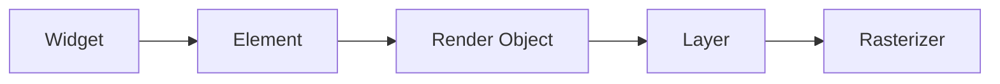

## 11.1.1 The Rendering Pipeline

In the world of mobile app development, performance is paramount. Flutter, known for its high-performance capabilities, achieves this through a sophisticated rendering pipeline. Understanding this pipeline is crucial for developers aiming to build responsive and adaptive UIs. This section delves into the rendering pipeline, breaking down each stage and offering insights into optimizing your Flutter applications.

### Overview of the Flutter Rendering Pipeline

The Flutter rendering pipeline is a multi-stage process that transforms your code into the visual elements users interact with on their screens. This journey begins with the creation of widgets and culminates in the painting of pixels. Let's explore each stage in detail:

- **Widget Tree:** The starting point of the rendering pipeline. Widgets are immutable configuration objects that describe the UI elements. They define the structure and appearance of the app but do not hold any state.

- **Element Tree:** As widgets are instantiated, they create elements. Elements are mutable objects that represent the current state of widgets in the widget tree. They manage the lifecycle of the widget and hold the state for stateful widgets.

- **Render Tree:** Render objects are created from elements. These objects are responsible for layout, painting, and interactions of UI elements. They form the render tree, which is crucial for determining how widgets are displayed on the screen.

- **Layer Tree:** Render objects are organized into layers, which manage the compositing of various render objects for efficient rendering. Layers allow Flutter to optimize rendering by only redrawing parts of the screen that have changed.

- **Rasterizer:** The final stage where the layered rendering instructions are converted into pixels on the screen. The rasterizer takes the layer tree and paints it onto the device's screen.

### Key Components of the Rendering Pipeline

#### Widgets

Widgets are the building blocks of a Flutter application. They are immutable and describe the configuration of the UI. Widgets can be either stateless or stateful, depending on whether they hold any state.

#### Elements

Elements are created from widgets and are mutable. They represent the current state of a widget and manage its lifecycle. Elements form the element tree, which mirrors the widget tree but adds the ability to hold state and manage updates.

#### Render Objects

Render objects are responsible for the layout, painting, and handling of interactions. They form the render tree, which is used to calculate the size and position of each widget on the screen.

#### Layers

Layers are used to manage the compositing of render objects. They allow Flutter to optimize rendering by only redrawing parts of the screen that have changed. Layers are crucial for achieving high performance in complex UIs.

#### Rasterizer

The rasterizer is responsible for converting the layer tree into pixels on the screen. It takes the composited layers and paints them onto the device's display, ensuring smooth and efficient rendering.

### Code Example

While the rendering pipeline is abstracted away in Flutter, understanding the widget hierarchy is essential. Here's a simple widget example to illustrate the hierarchy:

```dart
import 'package:flutter/material.dart';

void main() => runApp(MyApp());

class MyApp extends StatelessWidget {
  @override
  Widget build(BuildContext context) {
    return MaterialApp(
      home: Scaffold(
        appBar: AppBar(title: Text('Rendering Pipeline Example')),
        body: Center(
          child: ElevatedButton(
            onPressed: () {},
            child: Text('Press Me'),
          ),
        ),
      ),
    );
  }
}
```

**Explanation:**

In this example, the `MyApp` widget is the root of the widget tree. It contains a `MaterialApp`, which in turn contains a `Scaffold`. The `Scaffold` has an `AppBar` and a `Center` widget, which contains an `ElevatedButton`. This hierarchy forms the widget tree, which Flutter uses to build the UI.

### Visualizing the Rendering Pipeline

To better understand the flow from widget creation to pixel rendering, let's visualize the process using a Mermaid.js diagram:

```markdown

```

### Best Practices

- **Understand Widget Hierarchies:** Deep widget trees can lead to unnecessary complexity and performance overhead. Aim to keep your widget tree as shallow as possible.

- **Use Efficient Widgets:** Prefer lightweight widgets and avoid overbuilding the widget tree. Utilize widgets like `Container`, `Row`, and `Column` judiciously to maintain performance.

### Common Pitfalls

- **Over-Nesting Widgets:** Excessive nesting can complicate the widget tree, making it harder to manage and potentially impacting performance. Strive for simplicity in your widget hierarchy.

- **Ignoring Render Object Constraints:** Mismanagement of layout constraints can lead to inefficient rendering. Ensure that your render objects are properly constrained to avoid unnecessary calculations.

### Implementation Guidance

Familiarizing yourself with the rendering pipeline is essential for making informed decisions about widget usage and layout structuring. By understanding how Flutter transforms widgets into pixels, you can optimize your applications for better performance and responsiveness.

### Conclusion

The rendering pipeline is at the heart of Flutter's performance capabilities. By understanding each stage of the pipeline, from widget creation to pixel painting, developers can build more efficient and responsive applications. Keep these insights and best practices in mind as you design and optimize your Flutter apps.

## Quiz Time!



### What is the first stage of the Flutter rendering pipeline?

- [x] Widget Tree
- [ ] Element Tree
- [ ] Render Tree
- [ ] Layer Tree

> **Explanation:** The Widget Tree is the first stage where widgets are created as immutable configuration objects.

### What role do elements play in the rendering pipeline?

- [x] They represent the current state of widgets.
- [ ] They are responsible for painting pixels.
- [ ] They manage compositing layers.
- [ ] They convert rendering instructions into pixels.

> **Explanation:** Elements are mutable objects that represent the current state of widgets and manage their lifecycle.

### Which component is responsible for layout and painting in the rendering pipeline?

- [ ] Widgets
- [ ] Elements
- [x] Render Objects
- [ ] Layers

> **Explanation:** Render Objects are responsible for layout, painting, and interactions of UI elements.

### What is the purpose of layers in the rendering pipeline?

- [ ] To create widgets
- [ ] To manage the current state of widgets
- [x] To manage compositing of render objects
- [ ] To convert rendering instructions into pixels

> **Explanation:** Layers manage the compositing of render objects for efficient rendering.

### What does the rasterizer do in the rendering pipeline?

- [ ] It creates widgets.
- [ ] It manages the current state of widgets.
- [ ] It handles layout and painting.
- [x] It converts layered rendering instructions into pixels.

> **Explanation:** The rasterizer takes the layer tree and paints it onto the device's screen.

### Why is it important to understand widget hierarchies?

- [x] To avoid unnecessary complexity and performance overhead.
- [ ] To manage compositing layers.
- [ ] To convert rendering instructions into pixels.
- [ ] To handle layout and painting.

> **Explanation:** Understanding widget hierarchies helps avoid deep widget trees that can lead to complexity and performance issues.

### What is a common pitfall in the rendering pipeline?

- [ ] Using efficient widgets
- [x] Over-nesting widgets
- [ ] Managing compositing layers
- [ ] Converting rendering instructions into pixels

> **Explanation:** Over-nesting widgets can complicate the widget tree and impact performance.

### How can render object constraints affect rendering?

- [ ] They simplify the widget tree.
- [ ] They manage compositing layers.
- [x] They can lead to inefficient rendering if mismanaged.
- [ ] They convert rendering instructions into pixels.

> **Explanation:** Mismanagement of render object constraints can lead to inefficient rendering.

### What should developers focus on to optimize performance?

- [x] Understanding the rendering pipeline
- [ ] Creating deep widget trees
- [ ] Ignoring render object constraints
- [ ] Over-nesting widgets

> **Explanation:** Understanding the rendering pipeline helps developers make informed decisions about widget usage and layout structuring.

### True or False: The rasterizer is responsible for creating widgets.

- [ ] True
- [x] False

> **Explanation:** False. The rasterizer converts layered rendering instructions into pixels, not creating widgets.


