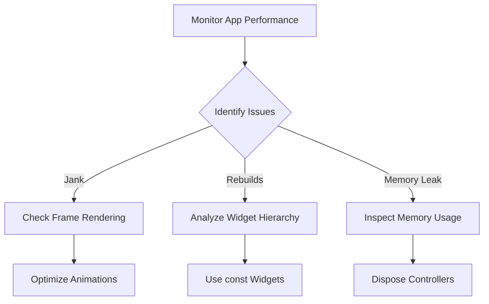

## 11.1.2 Identifying Performance Issues

In the realm of mobile app development, performance is a critical factor that can significantly affect user experience and satisfaction. Flutter, with its rich set of tools and widgets, allows developers to create beautiful and responsive applications. However, like any other framework, it is not immune to performance pitfalls. This section will guide you through identifying common performance issues in Flutter applications, using the available tools to diagnose them, and applying best practices to ensure your app runs smoothly.

### Common Performance Issues in Flutter

Understanding the typical performance issues that can arise in Flutter applications is the first step towards effective optimization. Here are some of the most prevalent problems:

- **Jank:** This occurs when frames are dropped because the app cannot render them within the 16ms frame budget required for smooth animations. Jank can lead to a noticeable stutter in animations and scrolling.
  
- **Excessive Widget Rebuilds:** Flutter's declarative UI framework can lead to unnecessary widget rebuilds, which increase CPU usage and can degrade performance if not managed properly.

- **Inefficient Layouts:** Complex or deeply nested layouts can take longer to compute, leading to slower rendering times and potential jank.

- **Memory Leaks:** These occur when objects are not properly disposed of, leading to unnecessary memory consumption and potential app crashes.

- **Heavy Animations:** Resource-intensive animations can strain device capabilities, especially on lower-end devices, leading to reduced performance.

### Tools for Identifying Performance Issues

Flutter provides several powerful tools to help developers identify and diagnose performance issues:

- **Flutter DevTools:** This comprehensive suite includes a variety of profiling tools such as the Timeline, Memory, and CPU Profiler. These tools allow you to analyze frame rendering, memory usage, and CPU activity in detail.

- **Performance Overlay:** This tool provides visual indicators that help monitor frame rendering performance in real-time. It can be enabled to display the rendering performance of your app directly on the screen.

- **Diagnostic Tools:** Widgets like `Container` with debugging borders can be used to visualize widget boundaries and help identify layout issues.

#### Code Example: Enabling Performance Overlay

To illustrate how you can use the performance overlay to identify jank, consider the following code example:

```dart
import 'package:flutter/material.dart';
import 'package:flutter/rendering.dart';

void main() {
  // Enable performance overlay
  debugPaintLayerBordersEnabled = true;
  runApp(MyApp());
}

class MyApp extends StatelessWidget {
  @override
  Widget build(BuildContext context) {
    return MaterialApp(
      showPerformanceOverlay: true, // Show performance overlay
      home: Scaffold(
        appBar: AppBar(title: Text('Performance Overlay Example')),
        body: ListView.builder(
          itemCount: 1000,
          itemBuilder: (context, index) {
            return ListTile(title: Text('Item $index'));
          },
        ),
      ),
    );
  }
}
```

**Explanation:**

- The `showPerformanceOverlay` property of `MaterialApp` is set to `true`, which enables the performance overlay. This overlay provides real-time feedback on the rendering performance of your app.
- The `debugPaintLayerBordersEnabled` flag is set to `true` to visualize the boundaries of layers, which can help identify rendering issues.

### Visualizing Performance Issues with Mermaid.js

To better understand the process of identifying and resolving performance issues, let's use a flowchart:



**Diagram Explanation:**

- **Monitor App Performance:** Start by continuously monitoring your app's performance using tools like Flutter DevTools and the performance overlay.
- **Identify Issues:** Determine the specific performance issues affecting your app, such as jank, excessive rebuilds, or memory leaks.
- **Check Frame Rendering:** For jank, focus on optimizing animations and ensuring that frames are rendered within the 16ms budget.
- **Analyze Widget Hierarchy:** For excessive rebuilds, examine the widget hierarchy and use `const` widgets where possible to reduce unnecessary rebuilds.
- **Inspect Memory Usage:** For memory leaks, ensure that resources such as controllers and streams are properly disposed of when no longer needed.

### Best Practices for Performance Optimization

- **Profiling Regularly:** Make performance profiling a regular part of your development process. This helps catch issues early and ensures that your app remains performant as it evolves.

- **Optimize Hotspots:** Focus your optimization efforts on areas identified as performance bottlenecks. Use profiling tools to pinpoint these hotspots.

### Common Pitfalls to Avoid

- **Ignoring Profiling Results:** It's crucial to act on the insights provided by profiling tools. Ignoring these results can lead to a degraded user experience.

- **Over-Optimization:** Avoid prematurely optimizing parts of the app that do not significantly impact performance. Focus on areas that offer the most significant performance gains.

### Implementation Guidance

Encourage the use of profiling tools at various stages of development to maintain app performance standards. By integrating these tools into your workflow, you can ensure that your app remains responsive and efficient.

### Conclusion

Identifying and resolving performance issues in Flutter is an ongoing process that requires vigilance and the right tools. By understanding common performance pitfalls and leveraging tools like Flutter DevTools, you can ensure that your app delivers a smooth and responsive user experience. Remember to profile regularly, focus on optimizing hotspots, and avoid common pitfalls to maintain high performance standards.

## Quiz Time!



### What is "jank" in the context of Flutter performance?

- [x] Frame drops caused by operations exceeding the 16ms frame budget.
- [ ] Unnecessary widget rebuilds.
- [ ] Memory leaks due to unused objects.
- [ ] Inefficient layout computations.

> **Explanation:** Jank refers to frame drops that occur when operations exceed the 16ms frame budget, leading to stutter in animations and scrolling.

### Which tool provides visual indicators to monitor frame rendering performance in real-time?

- [x] Performance Overlay
- [ ] Flutter DevTools
- [ ] Diagnostic Tools
- [ ] CPU Profiler

> **Explanation:** The Performance Overlay provides real-time visual indicators to monitor frame rendering performance directly on the screen.

### What is a common cause of excessive widget rebuilds in Flutter?

- [x] Unnecessary rebuilding of widgets leading to increased CPU usage.
- [ ] Memory leaks due to unused objects.
- [ ] Heavy animations that strain device capabilities.
- [ ] Inefficient layout computations.

> **Explanation:** Excessive widget rebuilds occur when widgets are unnecessarily rebuilt, leading to increased CPU usage and potential performance degradation.

### How can memory leaks be identified in a Flutter application?

- [x] Inspect memory usage using profiling tools.
- [ ] Analyze widget hierarchy.
- [ ] Check frame rendering.
- [ ] Optimize animations.

> **Explanation:** Memory leaks can be identified by inspecting memory usage with profiling tools to ensure that resources are properly disposed of.

### What is the purpose of enabling the `showPerformanceOverlay` property in a Flutter app?

- [x] To visualize frame rendering performance in real-time.
- [ ] To analyze widget hierarchy.
- [ ] To inspect memory usage.
- [ ] To optimize animations.

> **Explanation:** Enabling the `showPerformanceOverlay` property visualizes frame rendering performance, helping developers identify jank.

### Which tool is part of the Flutter DevTools suite?

- [x] Timeline
- [ ] Performance Overlay
- [ ] Diagnostic Tools
- [ ] AnimatedBuilder

> **Explanation:** The Timeline is part of the Flutter DevTools suite, which provides detailed profiling capabilities for analyzing performance.

### What is a common pitfall when optimizing Flutter applications?

- [x] Ignoring profiling results.
- [ ] Using const widgets.
- [ ] Profiling regularly.
- [ ] Optimizing hotspots.

> **Explanation:** Ignoring profiling results is a common pitfall that can lead to unresolved performance issues and a degraded user experience.

### What should developers focus on when optimizing hotspots in a Flutter app?

- [x] Areas identified as performance bottlenecks.
- [ ] All parts of the app equally.
- [ ] Only animations.
- [ ] Only memory usage.

> **Explanation:** Developers should focus on optimizing areas identified as performance bottlenecks to achieve the most significant performance gains.

### What is the recommended approach to handle memory leaks in Flutter?

- [x] Dispose of resources such as controllers and streams when no longer needed.
- [ ] Use const widgets.
- [ ] Optimize animations.
- [ ] Analyze widget hierarchy.

> **Explanation:** To handle memory leaks, it's important to dispose of resources like controllers and streams when they are no longer needed.

### True or False: Over-optimization can lead to unnecessary complexity in a Flutter app.

- [x] True
- [ ] False

> **Explanation:** Over-optimization can lead to unnecessary complexity and may not significantly impact performance, making it a pitfall to avoid.


