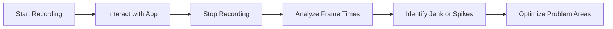

## 11.1.3 Measuring with Performance Tools

In the realm of mobile app development, performance is paramount. Users expect smooth, responsive applications, and any lag or jank can lead to a poor user experience, potentially driving users away. Flutter, with its rich set of tools, provides developers with the means to measure and optimize performance effectively. This section delves into using Flutter DevTools to analyze and enhance your app's performance.

### Overview of Flutter DevTools

Flutter DevTools is a suite of performance and debugging tools designed to help developers understand and improve their Flutter applications. It offers several tabs, each focusing on different aspects of performance:

- **Performance Tab:** This is where you can analyze frame rendering, CPU usage, and identify jank (i.e., frames that take too long to render).
- **Timeline Viewer:** Provides a visual representation of frames and their execution duration, helping you pinpoint performance bottlenecks.
- **Memory Tab:** Allows you to monitor memory allocations and detect potential memory leaks.
- **CPU Profiler:** Offers a detailed view of CPU usage over time, helping you understand which parts of your code are consuming the most resources.

### Using the Performance Tab

The Performance Tab in Flutter DevTools is a powerful tool for identifying and resolving performance issues. Here's how you can use it effectively:

#### Steps to Analyze Performance

1. **Open DevTools:** You can access Flutter DevTools via your Integrated Development Environment (IDE) or the command line. For example, in Visual Studio Code, you can launch DevTools directly from the Flutter extension.

2. **Navigate to Performance Tab:** Once DevTools is open, switch to the Performance Tab to access the timeline and profiling tools.

3. **Record Performance Session:** Click the record button to start capturing performance data. Interact with your app to simulate user behavior, then stop the recording to analyze the data.

4. **Analyze the Timeline:** Examine the recorded data to identify long frames, spikes in CPU usage, and potential bottlenecks. Look for frames that exceed the 16ms threshold, as these can cause visible jank.

#### Code Example: Adding Debug Labels

While DevTools doesn’t require code changes to function, adding debug labels can help you measure specific sections of your code more effectively. Here's an example:

```dart
import 'dart:developer' as developer;

void performHeavyTask() {
  developer.log('Heavy Task Start', name: 'Performance');
  // Simulate heavy computation
  for (int i = 0; i < 1000000; i++) {}
  developer.log('Heavy Task End', name: 'Performance');
}
```

**Explanation:**

- The `developer.log` function is used to add custom log points. These logs will appear in the timeline, allowing you to measure the duration of specific tasks.
- By marking the start and end of a heavy task, you can easily identify its impact on performance.

### Timeline Analysis Flowchart

To better understand the process of recording and analyzing a performance session using Flutter DevTools, consider the following flowchart:



This flowchart illustrates the steps involved in using the Performance Tab to identify and address performance issues.

### Best Practices

- **Isolate Performance Issues:** Use profiling to pinpoint the exact locations of performance bottlenecks. Focus on the sections of code that contribute most to rendering delays.
- **Use Labels and Logging:** Implement custom labels and logging to measure the duration of specific operations. This helps in correlating code execution with performance metrics.

### Common Pitfalls

- **Misinterpreting Data:** It's easy to misread profiling data, leading to incorrect optimizations. Ensure you understand the metrics and what they represent.
- **Ignoring Non-Visible Performance Metrics:** Focusing solely on visible performance without considering background processes can overlook key issues. Always consider the overall impact on the app's performance.

### Implementation Guidance

- **Regular Use of DevTools:** Make it a habit to use DevTools’ performance tools regularly, especially after adding new features or making significant changes to the app. This proactive approach helps maintain optimal performance.

### Conclusion

Measuring and optimizing performance is an ongoing process that requires attention to detail and a deep understanding of your app's behavior. By leveraging Flutter DevTools, you can gain valuable insights into your app's performance, identify bottlenecks, and make informed decisions to enhance user experience. Remember, a smooth and responsive app not only delights users but also sets your application apart in a competitive market.

## Quiz Time!



### What is the primary purpose of the Performance Tab in Flutter DevTools?

- [x] To analyze frame rendering and CPU usage
- [ ] To manage app dependencies
- [ ] To design UI layouts
- [ ] To compile Dart code

> **Explanation:** The Performance Tab is used to analyze frame rendering, CPU usage, and identify performance bottlenecks in Flutter applications.

### How can you access Flutter DevTools?

- [x] Via IDE or command line
- [ ] Only through a web browser
- [ ] By installing a separate application
- [ ] Through a mobile app

> **Explanation:** Flutter DevTools can be accessed via an IDE or the command line, making it easily accessible for developers.

### What does the Timeline Viewer in DevTools help you with?

- [x] Visual representation of frames and their execution duration
- [ ] Editing code directly
- [ ] Managing app resources
- [ ] Debugging network requests

> **Explanation:** The Timeline Viewer provides a visual representation of frames and their execution duration, helping identify performance issues.

### What is a common sign of performance issues in Flutter apps?

- [x] Frames exceeding the 16ms threshold
- [ ] Slow compilation times
- [ ] Large APK size
- [ ] High memory usage

> **Explanation:** Frames that take longer than 16ms to render can cause jank, indicating performance issues.

### How can you measure the duration of specific tasks in the timeline?

- [x] By adding custom log points using `developer.log`
- [ ] By using print statements
- [ ] By modifying the app's main function
- [ ] By changing the app's theme

> **Explanation:** Custom log points using `developer.log` help measure the duration of specific tasks in the timeline.

### What is a potential pitfall when analyzing performance data?

- [x] Misinterpreting data
- [ ] Over-optimizing UI elements
- [ ] Using too many widgets
- [ ] Ignoring user feedback

> **Explanation:** Misinterpreting performance data can lead to incorrect optimizations and should be avoided.

### Why should you regularly use DevTools' performance tools?

- [x] To maintain optimal performance after changes
- [ ] To increase app size
- [ ] To reduce code readability
- [ ] To complicate the development process

> **Explanation:** Regular use of DevTools helps maintain optimal performance, especially after significant changes.

### What is the benefit of using labels and logging in performance analysis?

- [x] To correlate code execution with performance metrics
- [ ] To increase code complexity
- [ ] To reduce app size
- [ ] To simplify UI design

> **Explanation:** Labels and logging help correlate code execution with performance metrics, aiding in analysis.

### What should you focus on when isolating performance issues?

- [x] Sections of code contributing to rendering delays
- [ ] Simplifying UI design
- [ ] Increasing app size
- [ ] Reducing code comments

> **Explanation:** Focus on sections of code that contribute most to rendering delays to effectively isolate performance issues.

### True or False: The Memory Tab in DevTools is used to analyze network requests.

- [ ] True
- [x] False

> **Explanation:** The Memory Tab is used to monitor memory allocations and detect leaks, not for analyzing network requests.


